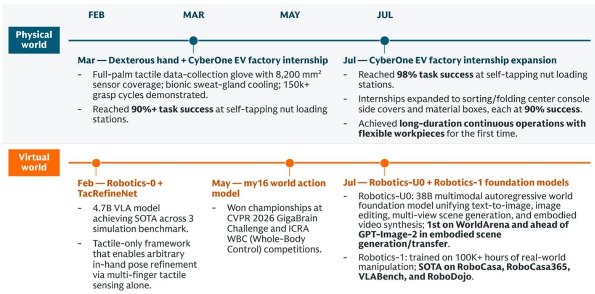
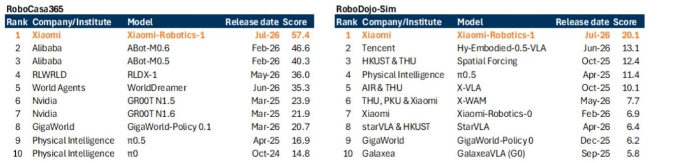

# Xiaomi Has Closed the Robotics Flywheel: Hardware, Synthetic Data, and a Foundation Model Now Form a Self-Reinforcing Loop

By July 2026, Xiaomi’s humanoid robots had reached a 98% task success rate at self-tapping nut loading stations in its own factories, a figure just one percentage point behind experienced human workers. This is not a laboratory demonstration. It is a production-line deployment that has improved from a 90% success rate in March, and it places Xiaomi alongside Figure AI as one of the few companies in the world operating humanoids on active automotive assembly lines. The speed and volume gap versus global leaders remains real, but the trajectory is what matters: Xiaomi has completed the initial integration of its robotics framework across hardware ontology, data generation, and model execution, creating a closed-loop system that accelerates improvement with every deployment cycle.

The significance extends far beyond a single factory task. Xiaomi simultaneously announced two foundational AI models—Robotics-U0, a 38-billion-parameter unified generative model for embodied data synthesis, and Robotics-1, a Vision-Language-Action (VLA) foundation model for end-to-end physical execution. Together, these three components—physical hardware, synthetic data engine, and cognitive control model—form a self-reinforcing loop. Real-world deployment failures are captured, fed into the generative model to synthesize similar edge-case scenarios, and that synthetic data retrains the core foundation model, which is then redeployed to the physical hardware. Each cycle improves success rates, expands task complexity, and reduces the marginal cost of the next improvement.

This matters now because the robotics industry has been bottlenecked by a fundamental problem: real-world data is too scarce, too expensive, and too dangerous to collect at scale. Xiaomi’s approach directly attacks that bottleneck. By using its own manufacturing factories as a deployment laboratory and synthesizing high-fidelity training data from those deployments, Xiaomi has created a data flywheel that few competitors can replicate without comparable hardware assets. The company is not waiting for a general-purpose robotics breakthrough. It is building a vertical integration from factory floor to foundation model, and the early results suggest this strategy may compress the timeline to commercially viable general-purpose automation.

## Xiaomi’s Robotics-U0 Generative Model Breaks the Data Scarcity Bottleneck by Synthesizing High-Fidelity Physical Interaction Scenarios at Scale

The single most important structural barrier to humanoid robotics has been the inability to collect enough real-world training data. Physical robot operations are slow, expensive, and dangerous to scale. Each hour of real-world operation requires a physical robot, a controlled environment, supervision, and risk management. Xiaomi’s Robotics-U0 model directly addresses this constraint. With 38 billion parameters, it is a unified generative model that can synthesize high-fidelity robot trajectories and physical interaction scenarios, effectively creating infinite training data from a finite set of real-world examples.

What makes Robotics-U0 distinctive is not just its scale but its architectural unification. The model integrates text-to-image generation, any-to-image editing, multi-view embodied scene generation, embodied transfer, and embodied video generation into a single architecture. This allows autoregressive scaling across modalities while preserving geometric integrity and perspective consistency—a technical requirement that simpler generative models fail to meet. Xiaomi claims Robotics-U0 outperforms GPT-Image-2 in embodied scene generation and embodied transfer, and it ranks first on WorldArena, a unified benchmark for embodied world model evaluation.

The strategic implication is clear: Xiaomi is not dependent on third-party datasets or public benchmarks for training. Its generative model can create task-specific, factory-specific, and even failure-specific training scenarios on demand. When a humanoid drops a workpiece on the production line, that failure is analyzed, and Robotics-U0 synthesizes hundreds of similar scenarios—different lighting, different angles, different workpiece orientations—to train the control model on how to recover. This capability turns every failure into an asset, and it accelerates the improvement cycle from weeks to days.

## The Robotics-1 Foundation Model Achieves State-of-the-Art Performance Across Multiple Benchmarks, Demonstrating Clean Scaling Behavior in Vision-Language-Action Architectures

Robotics-1 is the cognitive and physical control layer of Xiaomi’s robotics stack. It is a VLA foundation model trained on 100,000 hours of real-world robot operation trajectories and 10,000 hours of cross-ontology post-training. The model achieves state-of-the-art scores on the RoboCasa365 and RoboDojo-Sim benchmarks, outperforming open-source baselines such as Pi-0.5 and rivaling closed-source models from leading global players.

The technical achievement is the clean scaling behavior demonstrated in VLM (Vision-Language Model) training. This means that as Xiaomi feeds more data into the model, performance improves predictably and reliably—a property that is not guaranteed in complex embodied AI systems. The cross-ontology post-training is equally important: Robotics-1 can adapt to bipedal, quadrupedal, dual-arm, and wheeled systems from a single foundation model. This reduces the need to train separate models for different hardware configurations, which is a significant cost and time advantage.

However, the report explicitly notes that Xiaomi has not disclosed detailed architecture parameters such as cost structure or performance specifications. This opacity is common at this stage of development, but it means observers cannot independently verify the efficiency or scalability claims. What is verifiable is the benchmark performance: Robotics-1 scores 57.4 on RoboCasa365 versus 46.6 for Alibaba’s ABot-M0.6, and 20.1 on RoboDojo-Sim versus 13.1 for Tencent’s Hy-Embodied-0.5-VLA. These are not marginal improvements. They represent a meaningful lead over Chinese competitors and a credible position relative to global leaders.

## Xiaomi’s Proprietary Manufacturing Infrastructure Provides a Deployment Advantage That Few Competitors Can Match, Creating a Real-World Testing Ground for Continuous Model Improvement

The factory is the laboratory. Xiaomi operates manufacturing plants for smartphones, home appliances, and electric vehicles, each with hundreds of repetitive, physically demanding tasks that are ideal for humanoid deployment. The self-tapping nut loading station is one example. From July 2026, humanoids have started taking on new logistics tasks such as sorting flexible center console side covers and folding returnable boxes, achieving a 90% success rate and demonstrating long-duration continuous operations with flexible workpieces for the first time.

This is not a coincidence. Xiaomi’s strategy mirrors Tesla’s approach with Optimus: deploy humanoids in your own factories first, where you control the environment, the task definition, and the data collection pipeline. The difference is that Xiaomi has a broader manufacturing base. Tesla’s factory deployment is primarily automotive. Xiaomi’s spans consumer electronics, home appliances, and automotive, which means a wider variety of tasks, a larger volume of training data, and more opportunities for cross-domain transfer learning.

The strategic advantage is structural. A competitor without manufacturing assets must either partner with a factory operator—losing control over data and deployment schedules—or build a factory solely for robotics testing, which is capital-intensive and slow. Xiaomi’s factories are already running. The marginal cost of deploying a humanoid in an existing production line is the robot itself and the integration effort. The data generated is proprietary and immediately actionable. This is a moat that widens with every deployment.

## A Decision Framework for Observers: Evaluate Xiaomi’s Robotics Progress Along Three Dimensions—Task Complexity Scaling, Cost Trajectory, and Model Improvement Velocity

For those assessing Xiaomi’s robotics thesis, three metrics provide a structured evaluation framework. First, task complexity scaling. The progression from self-tapping nut loading (98% success) to sorting flexible side covers (90% success) to folding returnable boxes represents increasing dexterity and variability. The next milestones to watch are tasks involving non-rigid materials, multi-step assembly sequences, and collaborative operations with human workers. Each step up the complexity ladder validates the foundation model’s generalization capability.

Second, cost trajectory. The report does not disclose per-unit costs, but the economics of humanoid deployment depend on total cost of ownership relative to human labor. Key inputs to track are hardware cost (sensors, actuators, compute), energy consumption, maintenance frequency, and operational uptime. If Xiaomi can demonstrate that its humanoids achieve cost parity with human workers for specific tasks within the next 12-18 months, the addressable market expands from pilot projects to mass deployment.

Third, model improvement velocity. The improvement from 90% to 98% success rate in four months (March to July 2026) is a data point, not a trend. Observers should monitor the slope of the improvement curve as more data is fed into the loop. If the rate of improvement accelerates—meaning each additional hour of deployment data yields a larger performance gain than the previous hour—the flywheel is working. If the rate decelerates, the model may be approaching a performance ceiling that requires architectural innovation rather than more data.

The report’s valuation analysis provides context. Xiaomi’s current market capitalization implies approximately 15x 2026E P/E for the core business excluding smart EV, AI, and robotics, and 1.3x 2026E price-to-sales for the EV division. The report assigns zero value to AI, robotics, and other new initiatives. This means that any upside from robotics is pure optionality in the current valuation. The third quarter of 2026 may provide a catalyst from both narrative and financial perspectives, as the SkyNomad EV launch improves visibility into 2027 sales and the robotics milestones accumulate.

The gap to global leaders remains. Figure AI’s models deployed at BMW Group Plant Spartanburg demonstrate faster speed for similar tasks. Closed-source models from Physical Intelligence, Figure, Tesla, and Google DeepMind may have superior capabilities that are not reflected in public benchmarks. Xiaomi’s lack of disclosed architecture details makes direct comparison difficult. But the direction of travel is clear. Xiaomi has built the integrated stack—hardware, data, model—that the robotics industry has been trying to assemble for years. The factory floor is now the training ground, and every shift adds data to the loop.

*For informational purposes only. Portions may be generated, translated, summarized, or edited with AI assistance based on source materials and may contain omissions or errors. Please verify independently. This is not professional advice.*

For informational purposes only. Portions may be generated, translated, summarized, or edited with AI assistance based on source materials and may contain omissions or errors. Please verify independently. This is not professional advice.

