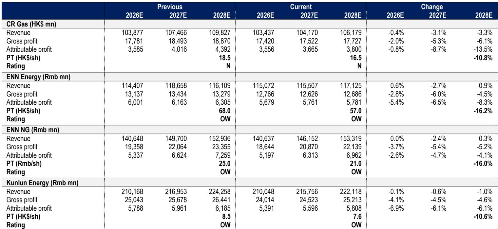
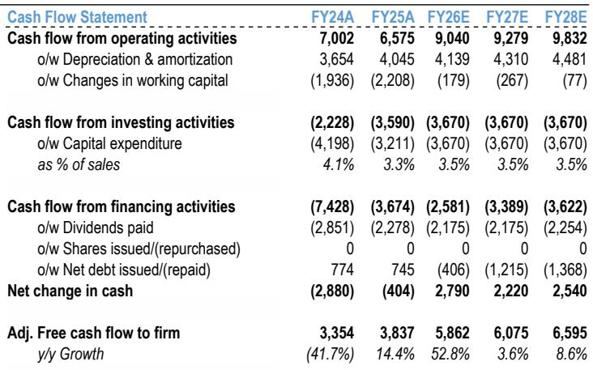
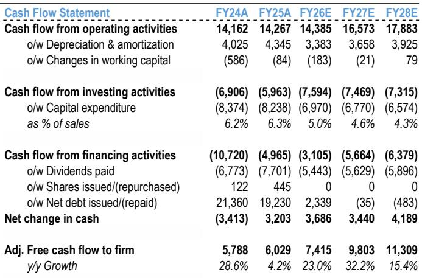

# JPM：中国燃气公用事业1H26预览，业绩表现与盈利调整，市场关注后续变化

这份JPM研报的核心判断值得认真对待：中国燃气公用事业板块的半年报大概率低于预期，且行业拐点尚未出现。报告覆盖的五家公司中，四家预计利润同比下滑，平均降幅约4%。相对少见例外是香港中华煤气，受益于生物燃料业务在油价高位下的强劲表现。

更关键的是，报告认为市场期待的“触底反弹”可能还要等一等。冬季天然气价格可能同比弹性较高，这给冬季燃气价差带来不确定性。板块年初至今跑输恒生国企指数约13个百分点，但估值便宜不等于催化剂已到。

## 1. 半年报不确定性来自三个方向，不是单一变量

报告对1H26业绩的预测指向一个共同问题：燃气公司的利润调整是结构性的，而非偶发。零售气量增长几乎停滞，覆盖公司平均增速不到1%；新增接驳持续下滑；气价差也在收窄。这三股力量叠加，导致多数公司利润同比下降。

新奥能源1H26核心利润预计下降约7%，华润燃气下降约1%，昆仑能源下降约6%。新奥天然气核心经营利润预计下降约9%。报告认为，业绩公布后市场共识盈利预测大概率会被下调，而JPM自己的FY26-27盈利预测已比市场共识低约7%。

> **KC评论：** 这里容易被忽略的是“新增接驳持续下滑”这个变量。过去几年燃气公司的增长故事很大程度上依赖房地产新盘接驳，这个逻辑正在消退。报告没有展开，但读者可以思考：如果接驳收入不再是增长引擎，燃气公司的估值框架是否需要重置。

## 2. 冬季气价弹性较高不确定性，是市场尚未定价的变量

报告最值得关注的判断来自对冬季天然气市场的分析。JPM全球能源分析师预测，4Q26欧洲TTF天然气价格将同比几乎弹性较高，原因是全球LNG供需偏紧，加上欧洲储气库库存偏低。截至7月12日，西北欧及英国储气设施填充率仅41%，远低于去年同期的56%和2022-25年平均的70%。

这对中国燃气公司意味着什么？去年冬季偏暖，居民采暖用气量基数较低。如果今年冬季气温正常甚至偏冷，燃气公司可能需要采购现货LNG来满足采暖需求，这将直接压缩冬季气价差。报告明确表示，在气价前景明朗之前，板块不太可能出现正向重估。

## 3. 选股逻辑从“行业贝塔”转向“公司阿尔法”

尽管板块整体承压，报告并非全面看空。其选股逻辑值得注意：优先选择拥有上游资源、能够更好应对气价波动的公司。新奥能源被列为首选，理由包括FY26预期股息率超过7%，且管理层可能考虑回购或提高派息。新奥天然气同样被看好，因其拥有超过30亿立方米的海外LNG长协销售。

报告还提供了一个观察框架：在气价波动加剧的环境下，燃气公司的价值不仅取决于下游分销能力，更取决于上游资源获取和LNG贸易能力。那些拥有海外长协、能够通过LNG交易在冬季获得额外利润的公司，可能比纯分销商更有韧性。

这个框架对读者理解行业分化有帮助。当行业整体增速节奏变化，公司的差异化能力——无论是上游资源、LNG贸易还是资本配置纪律——将成为估值分化的核心驱动力。

For informational purposes only. Portions may be generated,translated,summarized,or edited with AI assistance based on source materials and may contain omissions or errors. Please verify independently. This is not investment,legal,tax,accounting,or other professional advice.

For informational purposes only. Portions may be generated,translated,summarized,or edited with AI assistance based on source materials and may contain omissions or errors. Please verify independently. This is not investment,legal,tax,accounting,or other professional advice.

