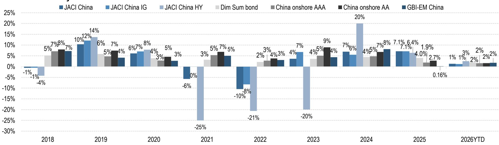

# JPM：JPM中国境内债季度分析，截至2026年6月30日

这份截至2026年6月30日的JPM中国境内债季度分析，揭示了一个正在发生的结构性变化：债券供给的节奏和结构，正在重塑信用定价的底层逻辑。报告的核心判断并非关于利率方向，而是关于“谁在发债、发什么债、谁在买债”这三件事的同步重置。

过去几个季度，市场注意力多集中在回报表现曲线的形态和外资流入的节奏上。但这份报告通过详尽的发行、持有和到期数据，指向一个更根本的问题——境内债市场正在从“需求驱动”转向“供给驱动”，而供给端的结构性差异，正在成为信用利差分化的主要来源。

## 1. 政府债券净供给放量，正在挤压信用债的定价空间

报告数据显示，2026年第二季度，政府债券的净供给同比和环比均有明显增长。这一趋势并非短期现象。从年度净供给的拆解来看，国债和地方债的发行节奏在2025年下半年已开始加速，并在2026年上半年维持高位。

这一变化对信用债市场的影响是直接的。当政府债券的净供给放量，且其回报表现在流动性宽松环境下仍具吸引力时，银行、保险等配置型机构会优先消化这些低不确定性、高流动性的资产。报告中的持有结构数据也印证了这一点：商业银行在政府债券上的持有比例持续上升，而在信用债上的观点偏积极力度相对有限。

这意味着，信用债发行人面临的不仅是融资成本的问题，更是“能否被买走”的问题。在政府债券供给充裕的背景下，资质偏弱的信用债必须提供更高的利差才能吸引边际买家。

## 2. 城投与地产的净供给调整，但到期不确定性并未同步减轻

报告对城投和地产两个关键板块的发行与到期数据做了详细拆解。城投债的净供给在2026年上半年延续了调整态势，尤其是低评级城投的发行量明显下降。地产债的净供给同样为负，且违约事件仍在持续发生，报告列出的违约清单中，万科、时代控股、碧桂园等名字在2026年上半年多次出现。

但净供给调整并不意味着不确定性出清。报告中的到期分布图显示，城投和地产板块在未来12个月内仍有大量债务到期。尤其是城投板块，2026年下半年至2027年上半年将迎来一个到期高峰。在净融资无法覆盖到期量的情况下，这些板块的再融资不确定性会持续存在。

> **KC评论：** 净供给调整是监管和市场的共同选择，但到期不确定性是客观存在的。读者需要区分“主动调整”和“被动无法发行”。城投板块的到期高峰，将是对各地财政能力和化债方案执行力的真实检验。

## 3. 外资持有结构正在从“广度”转向“深度”

报告中的外资流入数据值得细看。月度债券通交易量在2026年上半年并未出现爆发式增长，但外资持有的债券总量仍在稳步上升。更关键的是持有结构的变化：外资在国债上的持有比例保持稳定，但在政策性银行债上的持有比例有所提升，而在信用债上的持有比例依然很低。

这一变化说明，外资对中国境内债的参与正在从“试水”转向“配置”，但配置的标的依然高度集中于利率债。报告没有给出外资增配信用债的明确信号。这意味着，信用债市场的定价权仍然掌握在内资机构手中，而内资机构在当前宏观环境下的不确定性偏好，决定了信用利差的走向。

## 4. 一个可复用的观察框架：盯住“净供给-到期-持有”三角

这份报告最有价值的地方，不是某个单一数据点，而是它提供了一个系统性的观察框架。读者可以围绕三个维度来跟踪市场变化：

第一，净供给的节奏和结构。政府债券净供给是否继续放量？城投和地产的净融资何时转正？这决定了信用债市场的整体供需格局。

第二，到期不确定性的分布。哪些板块、哪些评级、哪些省份的到期量最为集中？这决定了信用事件可能爆发的时点和区域。

第三，持有者的行为变化。商业银行、产品、外资等主要持有者的仓位调整，反映了市场不确定性偏好的真实变化。尤其是当银行开始减持某类信用债时，往往意味着系统性偏好的转变。

这三个维度交叉验证，比单纯看回报表现曲线更能捕捉市场的结构性变化。

---

For informational purposes only. Portions may be generated,translated,summarized,or edited with AI assistance based on source materials and may contain omissions or errors. Please verify independently. This is not investment,legal,tax,accounting,or other professional advice.

For informational purposes only. Portions may be generated,translated,summarized,or edited with AI assistance based on source materials and may contain omissions or errors. Please verify independently. This is not investment,legal,tax,accounting,or other professional advice.

