## 宏观环境与基础材料观察

### 6月宏观数据观察：需求韧性支撑金属价格，企业盈利预期改善

在6月活动数据所反映的国内需求保持审慎的背景下，我们观察到金属基本面韧性与企业估值预期之间存在一定分化（MSCI中国材料指数本月至今-14%，而恒生中国企业指数本月至今+1.4%）。同时，若利率预期持续温和，可能为行业估值修复提供支持。在我们关注的领域中，基本面整体健康：铜供应依然偏紧；铝的表现强于预期，出口强劲且印尼新增产能低于预期；锂方面，市场似乎已基本消化了某电池企业矿山在获得土地使用许可后重启的消息。相比之下，煤炭和钢铁板块表现相对偏弱，山西供应中断的影响低于预期，水电替代效应压制了煤价，而原材料成本上升继续挤压钢铁利润。近期铜、金、铝、锂企业发布的1H26盈利预喜增强了我们对行业盈利前景的信心（见图1），不过黄金企业在2Q26似乎面临了高于预期的成本压力。

**图1：1H26盈利预喜结果汇总**

| 公司 | 盈利预喜隐含2Q26盈利 | 环比 | 同比 | 盈利预喜1H26盈利 | 环比 | 同比 | 盈利预喜1H26占JPMe FY26E比例 | 盈利预喜1H26占BBGe FY26E比例 |
|------|----------------------|------|------|-------------------|------|------|---------------------------|---------------------------|
| **黄金** | | | | | | | | |
| 紫金黄金* | 593 | -27% | 67% | 1,400 | 29% | 169% | 42% | 41% |
| 山东黄金 | | | | | | | | |
| **铜** | | | | | | | | |
| 紫金矿业 | 19,021 | -5% | 45% | 39,100 | 37% | 68% | 49% | 48% |
| 洛阳钼业 | 8,240 | 6% | 74% | 15,500-16,500 | 37% | 85% | 49% | 50% |
| 江西铜业 | 5,207 | 85% | 134% | 7,550-8,500 | 172% | 92% | 64% | 67% |
| 五矿资源* | | | | | | | | |
| **铝** | | | | | | | | |
| 中国铝业 | 6,173 | 12% | 75% | 11,200-12,200 | 109% | 65% | 59% | 55% |
| 中国宏桥 | | | | 17,200 | 67% | 39% | 51% | 52% |
| **锂** | | | | | | | | |
| 天齐锂业 | 1,674 | -11% | n.m. | 2,850-4,250 | 4040% | n.m. | 53% | 52% |
| 赣锋锂业 | 2,288 | 25% | n.m. | 3,650-4,600 | 92% | n.m. | 56% | 53% |
| **钢铁** | | | | | | | | |
| 宝钢股份 | | | | | | | | |
| 鞍钢股份 | (590) | n.m. | n.m. | (2,047) | n.m. | n.m. | 31% | 42% |
| **煤炭** | | | | | | | | |
| 中国神华 | 15,883 | 49% | 25% | 26,300-29,800 | -1% | 8% | 39% | 44% |
| 兖矿能源 | 3,245 | -18% | 58% | 7,200 | 103% | 49% | 44% | 42% |

注：对区间盈利预喜指引采用中点值
来源：公司公告、彭博、JPM

- **6月房地产数据观察**：新开工面积同比下降26%（5月同比-25%，去年6月同比-9%），1H26累计同比下降23%。在连续3个月降幅收窄后，竣工面积6月同比进一步下降25%（3-5月同比-20%）；1H26竣工面积同比下降24%。房地产开发投资同比下降26%（5月同比-25%）。JPM房地产分析师Karl Chan预计，由于2H25和1Q26土地销售规模偏小，未来几个月新开工面积仍将偏弱，预测全年新开工面积同比下降22%（此前预测-18%），意味着2H26同比下降21%。对于竣工面积，Karl预计FY26同比下降20%（此前预测-19%），意味着2H26同比下降18%。

**图2：年初至今中国房地产建筑面积增长**
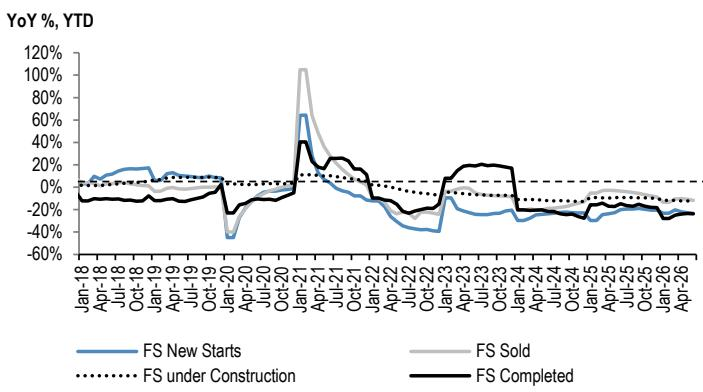
来源：国家统计局、JPM

**图3：竣工端与开工端商品表现对比**
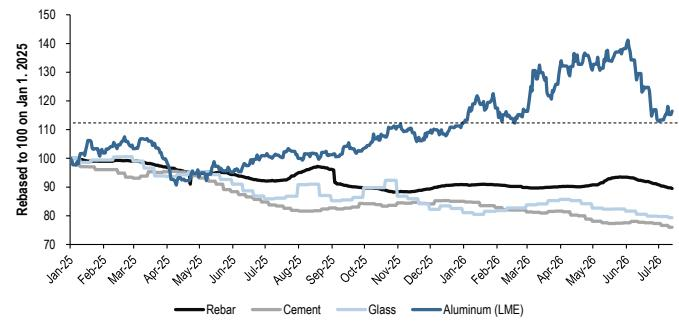
来源：彭博、JPM

- **6月固定资产投资进一步调整**：6月固定资产投资总额同比降幅扩大至-16%（5月同比-17%），1H26累计同比下降6%。制造业固定资产投资同比下降3%，但环比回升35%，1H26制造业固定资产投资累计下降1%，受能源冲击影响（1Q26同比+4%）。基础设施固定资产投资同比下降10%，但6月环比增长54%，1H26基础设施固定资产投资增速放缓至-2%（1Q26同比+9%）。

**图4：年初至今中国固定资产投资增长**
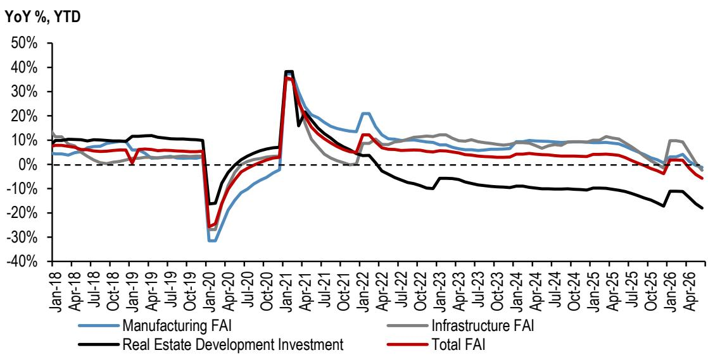
来源：国家统计局、JPM

- **2026年6月铝产量同比增长4.7%；LME-SHFE价差收窄**。国内铝基本面保持建设性，6月产量达400万吨，同比增长4.7%，6月出口同比增长45%至71.1万吨；1H26产量总计2300万吨，同比增长3.8%，出口达340万吨，同比增长16.3%。社会库存从4月底峰值147万吨下降至7月第二周的108万吨，表明尽管价格处于高位，库存环境依然有利。LME铝价在7月初因美伊初步协议及霍尔木兹海峡确认重新开放而回落至3100美元/吨以下，但随后因特朗普暂停停火协议，现货价格回升至3170美元/吨。截至7月14日，SHFE铝价也回升至23270元/吨，LME-SHFE溢价从近期峰值约4500元/吨收窄至约881元/吨。展望未来，我们预计3季度国内铝价将维持区间波动，因市场逐步进入下游需求的季节性偏弱期，可能减缓去库存节奏，而印尼新项目因电力基础设施延迟导致产能爬坡慢于预期，将为价格提供支撑。进入4季度，我们预计下游需求复苏以及国务院新ODI政策可能限制中国企业海外产能扩张节奏，将带来价格上行风险。

**图5：中国月度铝产量**
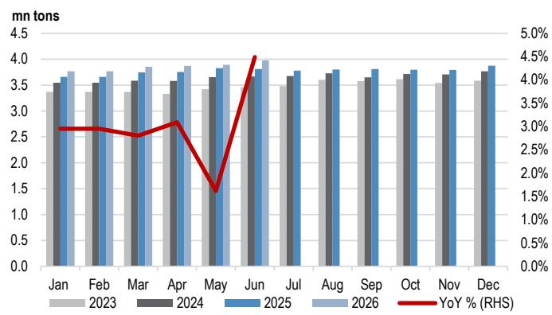
来源：国家统计局、JPM

**图6：中国铝社会库存**
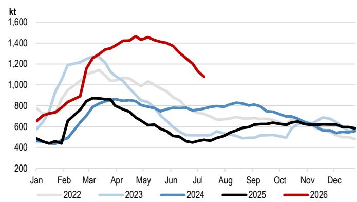
来源：SMM、JPM

- **6月原煤产量同比下降10%，进口同比增长29%**。6月原煤产量同比下降10%至3.81亿吨，1H26产量为23.65亿吨，同比下降2%；原煤进口同比增长29%至4280万吨，1H26累计增速转正至同比+2%。国内动力煤价格已从6月高点回落，7月中旬秦皇岛5500大卡煤价约800元/吨（较6月高点低约60元/吨）。价格回落主要由于国内动力煤需求弱于预期，雨季来临提升了水电发电量，减少了煤炭消耗。同时，山西事件后的生产影响似乎更集中在区域焦煤（据Mysteel，截至7月8日仍有9600万吨产能暂停），而对动力煤及山西以外地区生产的影响相对有限。展望未来，我们预计未来几个月煤价将保持偏弱，主要由于潜在供应增加（包括印尼进口量增加）以及暖冬风险可能抑制10月下旬后的积极补库。

**图7：中国原煤产量**
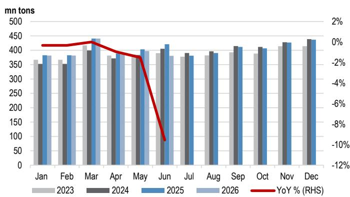
来源：国家统计局、彭博、JPM

**图8：中国火力发电量**
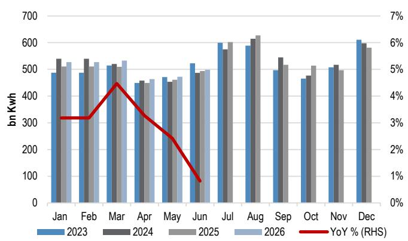
来源：中国海关、彭博、JPM

**图9：秦皇岛5500大卡动力煤现货价格**
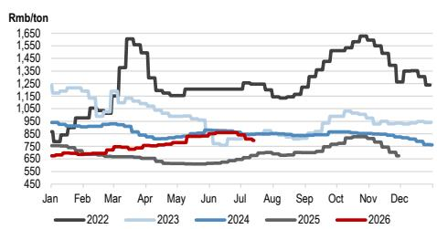
**图10：中国与海运6000大卡焦煤价格对比**
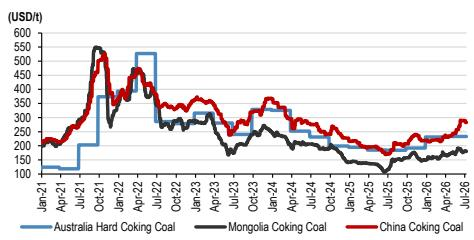
来源：彭博、JPM
来源：彭博、SXCoal、JPM

- **6月粗钢产量同比增长0.4%，成品钢材出口同比增长7%**。6月国内粗钢产量总计8400万吨，同比持平，环比+3%，1H26累计产量5亿吨，同比下降3%。进入6月，钢铁生产环比变化不大，中钢协会员企业日均粗钢产量202万吨（同比-4.9%，环比-3.6%），月初至今日均铁水产量持平于240万吨/天。6月成品钢材出口达1030万吨，同比增长7%，但环比持平，而1H26平均同比下降6%。然而，我们预计海外采购放缓及东南亚市场价格下调将在未来一个季度给出口带来压力。7月中旬，热轧、螺纹钢和冷轧的利润较6月有所收窄，主要由于国内焦煤和铁矿石价格上涨，盈利钢厂比例从6月中旬的56%下降至7月第二周的40%。我们认为，若无实质性的政策跟进、国内需求的持续改善以及投入成本的逐步缓解，钢铁企业的盈利能力不太可能出现实质性改善。

**图11：中国年初至今粗钢产量**
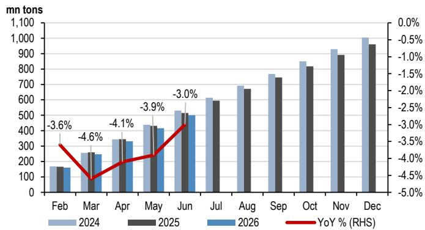
来源：国家统计局、JPM

**图12：中钢协会员企业日均粗钢产量**
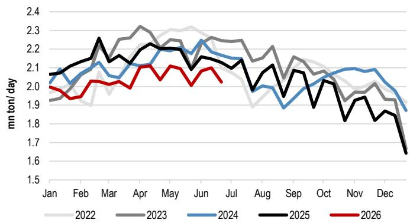
来源：中钢协、JPM

**图13：日均铁水产量（百万吨/天）**
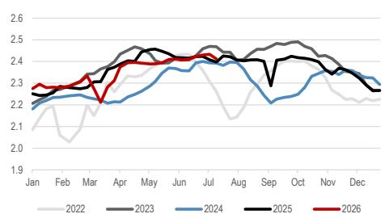
来源：Wind、JPM

**图14：中钢协会员企业日均生铁产量**
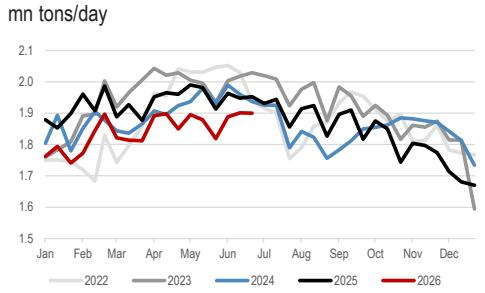
来源：中钢协、JPM

**图15：中国钢厂开工率与盈利比例**
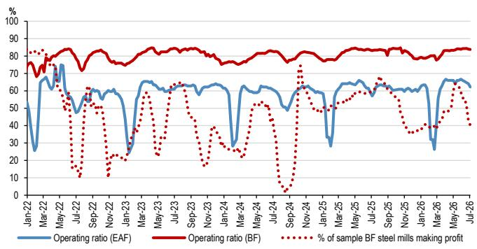
来源：中国海关、彭博、JPM

**图16：中国钢材产品出口量**
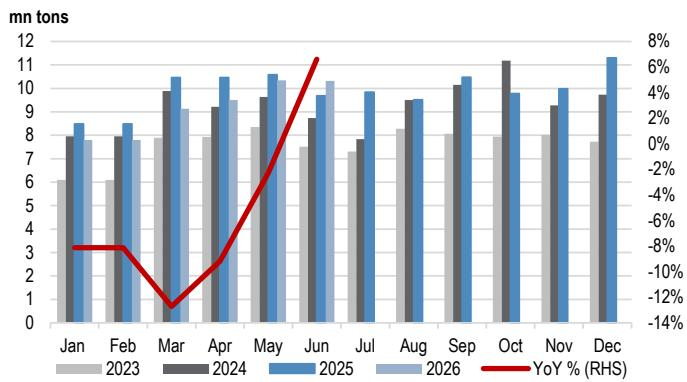
来源：中国海关、彭博、JPM

- **锂：15万元/吨附近有支撑；区间波动，受消息面驱动**。2026年6月国内汽车产量同比下降3.2%，而新能源汽车产量同比增长29.4%（5M26同比+0.9%），受油价利好支撑。截至7月9日，碳酸锂周度库存降至9.2万吨（SMM旧样本）和12.4万吨（SMM新样本）。近期价格走势主要受供应消息驱动：碳酸锂现货及期货价格从5月中旬的19万元+/吨回落至6月中旬的约16万元/吨，因全球矿山重启的增量超过了下调预期，同时市场对国内“隐形”库存的担忧持续。某电池企业矿山正式获得土地使用许可后，锂价向约15万元/吨靠拢；然而，预期的重启日期和产量贡献尚未确认。展望未来，我们预计价格将在当前水平附近波动，随着市场重新聚焦供需基本面，消息面驱动的波动性将较高。供应方面，6-7月津巴布韦精矿到港及该矿山重启进展是关键变量，而高企的汽车库存和季节性电动车需求偏弱可能限制短期上行空间，直至更强劲的季节性电池生产启动。

**表1：中国国家统计局数据汇总**

| | 单位 | 2026年6月 | 环比% | 2026年1-6月 | 同比% |
|--|------|----------|-------|------------|------|
| **主要产品产量：** | | | | | |
| 水泥 | 百万吨 | 144 | -3.8% | 735.9 | -8.0% |
| 成品钢材 | 百万吨 | 127 | 2.9% | 718.8 | -0.9% |
| 粗钢 | 百万吨 | 84 | -0.8% | 500.0 | -3.0% |
| 铝 | 百万吨 | 4 | 2.3% | 23.2 | 3.8% |
| 汽车 | 百万辆 | 3 | 9.4% | 15.1 | -3.9% |
| -- 其中：新能源汽车 | 百万辆 | 2 | 9.1% | 7.4 | 6.0% |
| 原煤 | 百万吨 | 381 | -4.1% | 2,365.1 | -1.7% |
| 发电量 | 十亿千瓦时 | 828 | 5.5% | 4,750.1 | 3.5% |
| -- 火力发电 | 十亿千瓦时 | 498 | 5.4% | 3,028.2 | 2.9% |
| -- 水力发电 | 十亿千瓦时 | 146 | 30.1% | 588.6 | 9.3% |
| **工业增加值同比：** | | | | | |
| 全国总计 | % | n.a. | 0.8ppt | n.a. | 5.4% |
| 采矿业 | % | n.a. | -4.5ppt | n.a. | 3.6% |
| 黑色金属 | % | n.a. | 1.7ppt | n.a. | 2.1% |
| 有色金属 | % | n.a. | 0.7ppt | n.a. | -0.3% |
| **房地产** | | | | | |
| 投资 | 十亿元 | 772 | 20.9% | 3,807 | -18.0% |
| 新开工面积 | 百万平方米 | 53 | 31.8% | 232 | -23.4% |
| 施工面积 | 百万平方米 | 5,540 | 1.0% | 5,540 | -12.5% |
| 竣工面积 | 百万平方米 | 31 | 42.4% | 172 | -23.7% |
| 销售面积 | 百万平方米 | 88 | 45.5% | 401 | -11.6% |
| **固定资产投资：** | | | | | |
| 固定资产投资总额 | 十亿元 | 4,786 | 28.6% | 22,637 | -5.7% |
| -- 第二产业固定资产投资 | 十亿元 | 1,813 | 30.2% | 8,312 | -1.1% |
| -- 第三产业固定资产投资 | 十亿元 | 2,901 | 28.6% | 13,865 | -8.4% |
| 铁路运输业固定资产投资 | 十亿元 | 124 | 31.7% | 455 | 0.0% |
| 道路运输业固定资产投资 | 十亿元 | 516 | 47.3% | 2,051 | -7.7% |

来源：国家统计局、Wind、JPM

**表2：中国海关数据汇总**

| | 单位 | 2026年6月 | 环比% | 2026年1-6月 | 同比% |
|--|------|----------|-------|------------|------|
| **进口** | | | | | |
| 原煤 | 百万吨 | 42.8 | 28.6% | 225.4 | 1.7% |
| 铁矿石 | 百万吨 | 112.7 | 15.3% | 628.9 | 6.3% |
| 钢材 | 百万吨 | 0.4 | -2.0% | 2.7 | -11.3% |
| 铜 | 千吨 | 478.3 | 6.3% | 2,491.0 | -5.3% |
| **出口** | | | | | |
| 钢材 | 百万吨 | 10.3 | -0.2% | 54.9 | -5.6% |
| 铝 | 千吨 | 710.9 | 12.8% | 3,396.4 | 16.3% |

来源：中国海关、JPM

## 估值

**表3：全球多元化矿业估值比较**

| | 代码 | JPM评级 | 目标价 | 上行/下行 | 股价 | 年初至今表现(%) | 本月至今表现(%) | 市值(百万美元) | PE (x) | | | P/BV (x) | | | EV/EBITDA (x) | | |
|--|------|---------|--------|-----------|------|----------------|----------------|---------------|---------|---------|---------|-----------|-----------|-----------|-------------|-------------|-------------|
| | | | | | | | | | 2026E | 2027E | 2028E | 2026E | 2027E | 2028E | 2026E | 2027E | 2028E |
| **中国** | | | | | | | | | | | | | | | | | | |
| 紫金矿业 - H | 2899 HK | OW | 50.00 | 66% | 30.20 | -15% | 10% | 105,103 | 8.6 | 7.5 | 6.5 | 2.7 | 2.1 | 1.7 | 6.3 | 5.6 | 5.0 |
| 紫金矿业 - A | 601899 CH | OW | 46.00 | 60% | 28.83 | -16% | 15% | 116,154 | 9.5 | 8.5 | 8.1 | 3.0 | 2.4 | 2.0 | 6.2 | 5.7 | 5.4 |
| 洛阳钼业 - H | 3993 HK | OW | 25.00 | 58% | 15.83 | -18% | 4% | 43,203 | 8.8 | 8.3 | 7.5 | 2.7 | 2.2 | 1.8 | 5.8 | 5.4 | 5.0 |
| 洛阳钼业 - A | 603993 CH | OW | 26.00 | 45% | 17.91 | -10% | 2% | 56,586 | 11.9 | 11.1 | 9.9 | 3.6 | 3.0 | 2.5 | 5.8 | 5.5 | 5.1 |
| 江西铜业 - H | 358 HK | OW | 44.00 | 38% | 31.86 | -26% | 3% | 14,031 | 7.9 | 8.0 | 8.2 | 1.0 | 0.9 | 0.9 | 8.8 | 8.9 | 9.1 |
| 江西铜业 - A | 600362 CH | OW | 55.00 | 30% | 42.28 | -23% | -2% | 21,555 | 12.1 | 12.9 | 13.6 | 1.6 | 1.5 | 1.4 | 8.8 | 8.8 | 9.1 |
| 五矿资源 | 1208 HK | OW | 13.00 | 71% | 7.59 | -13% | 9% | 11,755 | 7.4 | 7.1 | 6.6 | 2.1 | 1.6 | 1.3 | 3.6 | 3.6 | 3.5 |
| | 市值加权平均 | | | | | | | | 9.5 | 8.8 | 8.1 | 2.8 | 2.3 | 1.9 | 6.3 | 5.8 | 5.5 |

来源：彭博、JPM。注：价格数据为最新价格；NR = 未评级；NC = 未覆盖；所有股票使用彭博一致预期。

**表4：全球钢铁估值比较**

| | 代码 | JPM评级 | 目标价 | 上行/下行 | 股价 | 年初至今表现(%) | 本月至今表现(%) | 市值(百万美元) | 3月均成交额(百万美元) | PE (x) | | | P/BV (x) | | | RoE % | | |
|--|------|---------|--------|-----------|------|----------------|----------------|---------------|---------------------|---------|---------|---------|-----------|-----------|-----------|---------|---------|---------|
| | | | | | | | | | | 2026E | 2027E | 2028E | 2026E | 2027E | 2028E | 2026E | 2027E | 2028E |
| **中国** | | | | | | | | | | | | | | | | | | |
| 宝钢股份 | 600019 CH | N | 6.00 | 5% | 5.74 | -23% | 6% | 18,464 | 88 | 11.0 | 9.6 | 8.5 | 0.6 | 0.6 | 0.6 | 5.5 | 6.0 | 6.7 |
| 鞍钢股份 - H | 347 HK | UW | 0.80 | -31% | 1.16 | -39% | 5% | 1,386 | 1 | n.a. | n.a. | n.a. | 0.2 | 0.3 | 0.3 | -11.7 | -5.2 | -2.5 |
| 鞍钢股份 - A | 000898 CH | UW | 1.30 | -33% | 1.95 | -23% | 4% | 2,698 | 11 | n.a. | n.a. | n.a. | 0.5 | 0.5 | 0.5 | -11.7 | -5.2 | -2.5 |
| | 市值加权平均 | | | | | | | | | 8.7 | 7.6 | 6.7 | 0.5 | 0.5 | 0.5 | 1.8 | 3.7 | 4.7 |

来源：彭博、JPM。注：价格数据为最新价格；NR = 未评级；NC = 未覆盖；所有股票使用彭博一致预期。

**表5：全球铝业估值比较**

| | 代码 | JPM评级 | 目标价 | 上行/下行 | 股价 | 年初至今表现(%) | 本月至今表现(%) | 市值(百万美元) | PE (x) | | | P/BV (x) | | | EV/EBITDA (x) | | | 股息率 | | |
|--|------|---------|--------|-----------|------|----------------|----------------|---------------|---------|---------|---------|-----------|-----------|-----------|-------------|-------------|-------------|---------|---------|---------|
| | | | | | | | | | 2026E | 2027E | 2028E | 2026E | 2027E | 2028E | 2026E | 2027E | 2028E | 2026E | 2027E | 2028E |
| **中国** | | | | | | | | | | | | | | | | | | | | |
| 中国宏桥 | 1378 HK | OW | 30.00 | 30% | 23.16 | -29% | 15% | 28,313 | 5.9 | 6.0 | 5.7 | 1.3 | 1.2 | 1.0 | 3.7 | 3.8 | 3.7 | 11% | 10% | 10% |
| 中国铝业 - A | 601600 CH | OW | 13.00 | 45% | 8.98 | -27% | 9% | 22,764 | 7.4 | 7.5 | 8.1 | 1.6 | 1.4 | 1.2 | 3.9 | 4.1 | 4.4 | 5% | 5% | 5% |
| 中国铝业 - H | 2600 HK | OW | 12.00 | 48% | 8.09 | -34% | 8% | 17,715 | 5.6 | 6.1 | 6.5 | 1.3 | 1.1 | 1.0 | 3.9 | 4.3 | 4.4 | 7% | 6% | 6% |
| 云铝股份 | 000807 CH | NC | - | - | 26.10 | -21% | 18% | 13,367 | 7.4 | 6.6 | 6.2 | 2.1 | 1.7 | 1.4 | 4.6 | 4.4 | 4.2 | 5% | 5% | 5% |
| | 市值加权平均 | | | | | | | | 6.5 | 6.5 | 6.6 | 1.5 | 1.3 | 1.1 | 4.0 | 4.1 | 4.1 | 7% | 7% | 7% |

来源：彭博、JPM。注：价格数据为最新价格；NR = 未评级；NC = 未覆盖；所有股票使用彭博一致预期。

**表6：全球锂业估值比较**

| | 代码 | JPM评级 | 目标价 | 上行/下行 | 股价 | 年初至今表现(%) | 本月至今表现(%) | 市值(百万美元) | P/E (x) | | | P/B (x) | | | EV/EBITDA (x) | | |
|--|------|---------|--------|-----------|------|----------------|----------------|---------------|---------|---------|---------|---------|---------|---------|-------------|-------------|-------------|
| | | | | | | | | | 2026E | 2027E | 2028E | 2026E | 2027E | 2028E | 2026E | 2027E | 2028E |
| **中国** | | | | | | | | | | | | | | | | | | |
| 赣锋锂业 - A | 002460 CH | OW | 80.00 | 55% | 51.50 | -18% | -21% | 15,870 | 12.7 | 12.1 | 10.7 | 2.0 | 1.8 | 1.5 | 10.9 | 9.9 | 8.4 |
| 赣锋锂业 - H | 1772 HK | OW | 70.00 | 75% | 40.00 | -23% | -20% | 10,647 | 9.3 | 8.1 | 6.7 | 1.4 | 1.2 | 1.0 | 10.6 | 9.6 | 8.2 |
| 天齐锂业 - A | 002466 CH | N | 62.00 | 31% | 47.43 | -14% | -23% | 11,946 | 11.4 | 10.5 | 9.1 | 1.6 | 1.4 | 1.2 | 4.9 | 4.7 | 4.6 |
| 天齐锂业 - H | 9696 HK | N | 36.00 | 8% | 33.20 | -35% | -17% | 7,223 | 8.0 | 7.4 | 6.8 | 1.0 | 0.9 | 0.8 | 5.3 | 5.2 | 5.3 |
| 盐湖股份 | 000792 CH | NC | - | - | 25.27 | -10% | -16% | 19,747 | 11.1 | 10.1 | 9.4 | 2.4 | 2.0 | 1.6 | 6.8 | 7.1 | 5.9 |
| 永兴材料 | 002756 CH | NC | - | - | 44.90 | -17% | -21% | 3,513 | 12.4 | 9.8 | 7.1 | 1.7 | 1.5 | 1.3 | 6.8 | 5.6 | 4.1 |
| | 市值加权平均 | | | | | | | | 11.0 | 10.0 | 8.8 | 1.8 | 1.5 | 1.3 | 7.8 | 7.4 | 6.5 |

来源：彭博、JPM。注：价格数据为最新价格；NR = 未评级；NC = 未覆盖；所有股票使用彭博一致预期。

**分析师认证**：本报告封面标注“AC”的研究分析师（或当多位研究分析师主要负责本报告时，封面或文档内标注“AC”的研究分析师）就本研究中涵盖的每只证券或发行人分别证明：(1) 本报告中表达的所有观点准确反映了该研究分析师对任何及所有标的证券或发行人的个人观点；(2) 该研究分析师的任何部分薪酬过去、现在或将来均未直接或间接与本报告中研究分析师表达的具体建议或观点相关。

**重要披露**

**公司特定披露**：JPM与其研究报告中所覆盖的公司有业务往来或寻求业务往来。因此，读者应注意，该公司可能存在利益冲突，可能影响本报告的客观性。读者应将本报告仅视为其投资决策的单一因素。重要披露，包括价格图表和信用意见历史表格（如适用），可通过访问 https://www.jpmm.com/research/disclosures、致电 1-800-477-0406 或发送邮件至 research.disclosure.inquiries@JPM.com 获取。

**股权研究评级、名称及分析师覆盖范围说明**

JPM采用以下评级体系：**增持**（在本报告所示目标价期间内，我们预期该股票的表现将优于研究分析师或其团队覆盖范围内股票的平均总回报）；**中性**（在本报告所示目标价期间内，我们预期该股票的表现将与研究分析师或其团队覆盖范围内股票的平均总回报一致）；**减持**（在本报告所示目标价期间内，我们预期该股票的表现将逊于研究分析师或其团队覆盖范围内股票的平均总回报）。NR为未评级。在此情况下，JPM已移除该股票的评级及（如适用）目标价，原因可能是缺乏充分的基本面依据，或出于法律、监管或政策原因。先前的评级及（如适用）目标价不应再被依赖。NR名称并非推荐或评级。部分覆盖股票有评级但无目标价；在此情况下，我们预期该股票在相关区域内的表现将优于/一致/逊于研究分析师或其团队覆盖范围内股票的平均总回报。在我们的亚洲（除澳大利亚和印度）及英国中小盘股权研究中，每只股票的预期总回报是与基准国家市场指数的预期总回报进行比较，而非与研究分析师的覆盖范围进行比较。若本报告重要披露部分未显示，认证研究分析师的覆盖范围可在JPM研究网站 https://www.JPMmarkets.com 上找到。

**覆盖范围：Chan, Avery**：鞍钢股份 - A (000898.SZ)、鞍钢股份 - H (0347.HK)、宝钢股份 – A (600019.SS)、洛阳钼业 - A (603993.SS)、洛阳钼业 - H (3993.HK)、中国铝业 - A (601600.SS)、中国铝业 - H (2600.HK)、中国宏桥 - H (1378.HK)、中国巨石 - A (600176.SS)、赣锋锂业 – A (002460.SZ)、赣锋锂业 – H (1772.HK)、江西铜业 - A (600362.SS)、江西铜业 - H (0358.HK)、五矿资源 (1208.HK)、山东黄金 - A (600547.SS)、山东黄金 - H (1787.HK)、中国神华 - A (601088.SS)、中国神华 - H (1088.HK)、天齐锂业 – A (002466.SZ)、天齐锂业 – H (9696.HK)、兖矿能源 - A (600188.SS)、兖矿能源 - H (1171.HK)、紫金黄金国际 - H (2259.HK)、紫金矿业 - A (601899.SS)、紫金矿业 – H (2899.HK)

**JPM股权研究评级分布，截至2026年7月4日**

| | 增持（买入） | 中性（持有） | 减持（卖出） |
|--|------------|------------|------------|
| JPM全球股权研究覆盖* | 53% | 36% | 12% |
| 投行客户** | 83% | 80% | 73% |
| JPMS股权研究覆盖* | 51% | 37% | 12% |
| 投行客户** | 95% | 92% | 87% |

*请注意，由于四舍五入，百分比可能未加总至100%。
**在过去12个月内JPM曾提供投资银行服务的各“买入”、“持有”和“卖出”类别中标的公司的百分比。

就FINRA评级分布规则而言，我们的增持评级属于报告评级类别；中性评级属于持有评级类别；减持评级属于报告评级类别。请注意，标有NR的股票未包含在上述表格中。此信息截至最近一个日历季度末。

**股权估值与风险**：有关覆盖公司或目标价的估值方法和风险，请参阅最新的公司特定研究报告，访问 http://www
