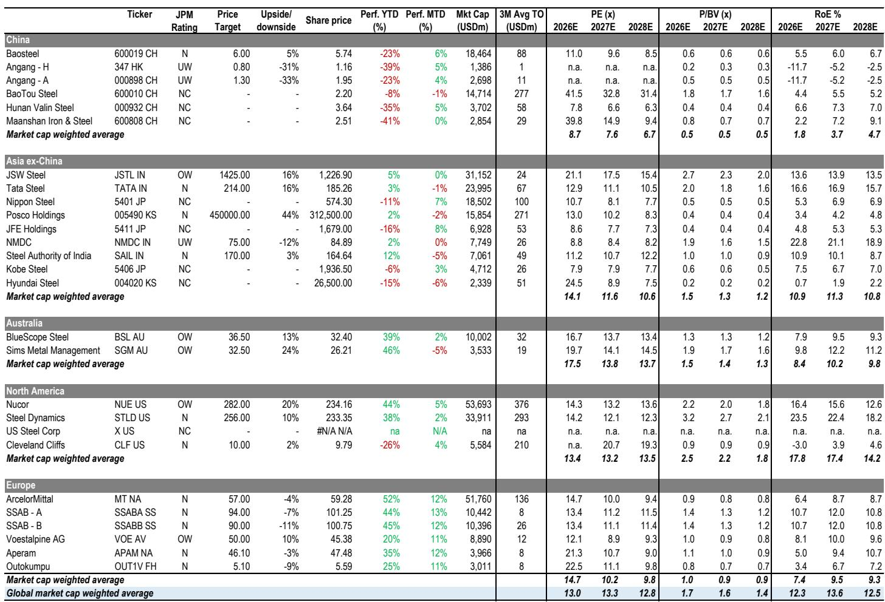
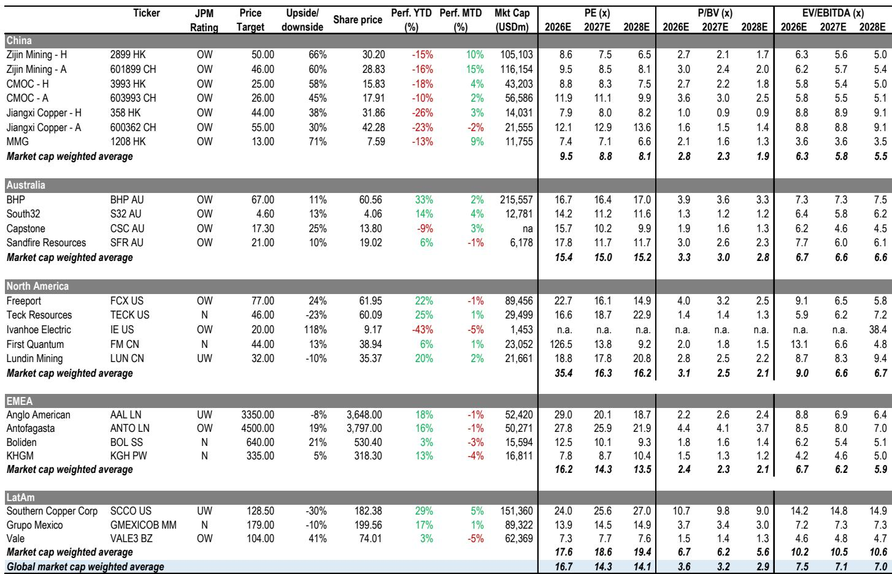
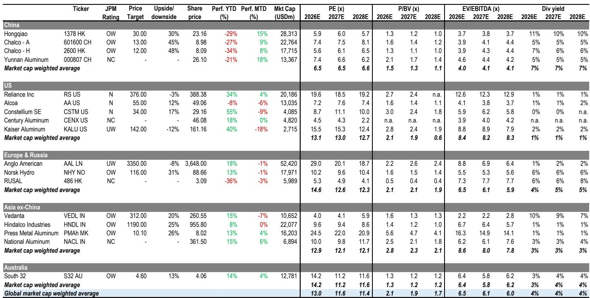

# JPM：中国基础材料，韧性需求支撑高金属价格与矿企盈利

六月宏观环境数据公布后，一个矛盾变得清晰：铜、铝、锂等工业金属的基本面依然健康，但市场对周期股的定价却显得过于谨慎。MSCI中国材料指数当月下跌14%，而同期恒生中国企业指数上涨1.4%。这份JPM研报的核心判断是，这种背离可能正在创造重新定价的机会，前提是宏观预期不再进一步走弱。

报告基于6月国家统计局数据，梳理了各子行业的分化格局。铜的供应依然偏紧，铝的出口和印尼产能投放节奏均超预期，锂价则在供给消息的反复拉扯中寻找支撑。相比之下，煤炭和钢铁是明显的弱势板块——山西供给扰动的影响低于预期，水电替代压制了煤价，而原料成本高企持续挤压钢企利润。

真正让分析师感到有信心的，是近期密集发布的半年度盈利预告。铜、金、铝、锂领域的多家公司，其上半年利润均实现了可观增长。例如紫金矿业上半年净利润同比增幅达68%，中国铝业增幅约65%，赣锋锂业扭亏为盈。这些数据不仅验证了金属价格高位的传导效果，也表明企业端的盈利韧性可能被市场低估。

> **KC评论：** 盈利预告与报价走势之间的背离，是这份报告最值得关注的信号。图表1显示，多数公司的上半年利润已占到JPM全年预测的40%-60%，但报价并未同步反映。这种脱节要么意味着市场在等待更差的下半年，要么说明悲观情绪已经过度。

## 1. 铝的供需格局正在从“宽松”转向“有支撑”

铝是这份报告中最具结构性看点的品种。6月国内产量同比增长4.7%至400万吨，出口同比大增45%至71.1万吨。社会库存从4月底的147万吨高点持续下降至7月中旬的108万吨，显示即便在高价格下，去库仍在进行。

报告特别指出，印尼新项目的产能爬坡因电力基础设施延迟而慢于预期，这为国内铝价提供了额外支撑。LME铝价在7月初因美伊协议预期回落至3100美元/吨以下，但随后因特朗普暂停停火协议而反弹至3170美元/吨。SHFE铝价同步回升至23270元/吨，两地价差从近期高点的约4500元/吨收窄至881元/吨。

展望三季度，分析师认为国内铝价将维持区间震荡，因为下游需求进入季节性淡季，去库节奏可能节奏变化。但进入四季度后，随着需求复苏以及国务院新 ODI 政策对海外产能扩张的潜在约束，价格上行不确定性正在积聚。

## 2. 锂价在150元/公斤附近获得支撑，但波动仍由消息驱动

锂市场的核心矛盾在于供给端的不确定性。6月国内新能源汽车产量同比增长29.4%，为需求端提供了基本支撑。但价格走势更多受供给消息左右：碳酸锂现货和期货价格从5月中旬的19万元/吨以上回落至6月中旬的约16万元/吨，原因是全球矿山复产的增量超过了其他地区的减产。

报告认为，宁德时代江西宜春锂矿获得土地使用许可的消息，将锂价推向约15万元/吨，但重启的具体时间和产量贡献尚未确认。未来几个月的关键变量，是6-7月津巴布韦精矿的到港量以及宁德时代项目的推进节奏。在供给端明朗之前，锂价预计将围绕当前水平波动，消息面的扰动仍会频繁出现。

## 3. 煤炭和钢铁的弱势短期内难以逆转

煤炭方面，6月原煤产量同比下降10%至3.81亿吨，但进口量同比大增29%。秦皇岛5500大卡动力煤价格从6月高点回落至7月中旬的约800元/吨，主要原因是雨季来临后水电出力增加，减少了火电的煤炭消耗。山西事故对产量的影响主要集中在区域焦煤，对动力煤和山西以外地区的影响相对有限。报告预计，未来几个月煤价仍将偏软，因为印尼进口供应可能增加，且暖冬不确定性可能抑制10月下旬后的补库需求。

钢铁方面，6月粗钢产量同比微增0.4%，但盈利状况在出现变化。截至7月中旬，盈利钢厂占比已从6月中旬的56%降至40%。热轧、螺纹钢和冷轧的利润均出现收窄，主要原因是国内焦煤和铁矿石价格上涨。报告认为，如果没有实质性的政策跟进、国内需求的持续改善以及原料成本的逐步缓解，钢企的盈利能力很难出现明显好转。

## 4. 一个可复用的观察框架：盈利预告与报价的背离

这份报告提供了一个简洁但有效的分析框架：当盈利预告显示企业利润正在兑现，而报价却持续下跌时，读者需要判断这种背离是暂时的定价错误，还是市场在提前反映更差的未来。

以铜和铝为例，紫金矿业、中国铝业等公司的上半年利润已占到全年预测的50%左右，但报价年内仍录得负回报。报告认为，这种估值折价相对于全球同业而言，为后续重新定价留下了空间。而对于煤炭和钢铁，盈利预告的表现本身就偏弱，报价的仍在调整更多是基本面而非情绪问题。

> **KC评论：** 这个框架的核心不在于“底部观察”，而在于区分哪些行业的盈利是可持续的，哪些只是价格周期的高点。铜和铝的供给约束更偏结构性，而煤炭和钢铁的需求改善仍需等待政策或宏观环境的明确信号。

For informational purposes only. Portions may be generated,translated,summarized,or edited with AI assistance based on source materials and may contain omissions or errors. Please verify independently. This is not investment,legal,tax,accounting,or other professional advice.

For informational purposes only. Portions may be generated,translated,summarized,or edited with AI assistance based on source materials and may contain omissions or errors. Please verify independently. This is not investment,legal,tax,accounting,or other professional advice.

