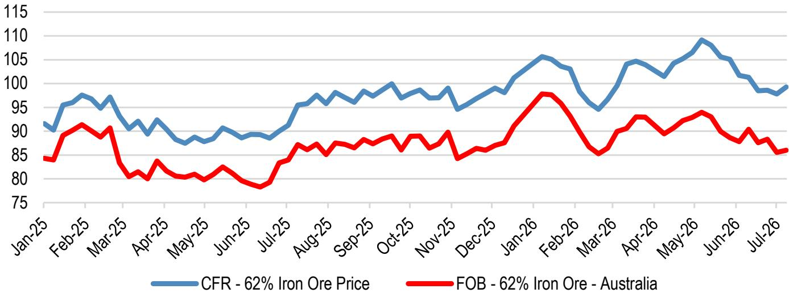
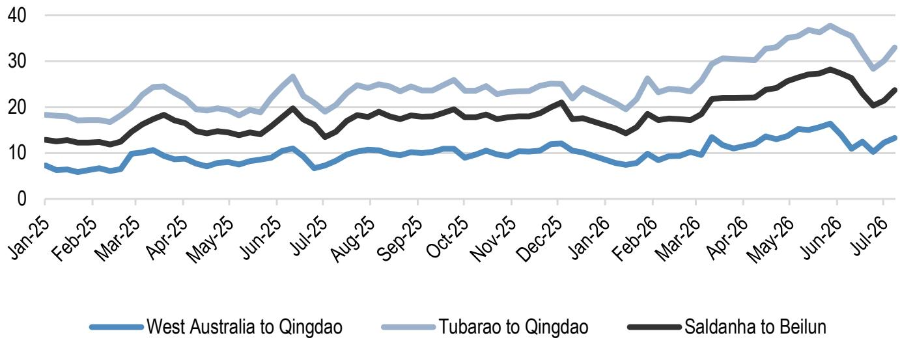
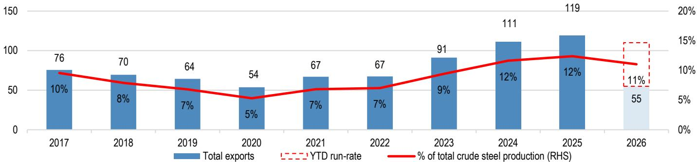

# JPM：中国钢铁产量见顶-铁矿石FOB价格弱于战前

中国钢铁产量在7月上旬出现小幅反弹，但JPM认为这并不改变一个更重要的判断：2026年的产量峰值可能已经过去。最新10天粗钢产量折年率为9.96亿吨，较前10天回升3%，同比微增1%，但这一水平仍处于历史季节性区间的下沿。真正值得关注的不是短期波动，而是背后需求的支撑力正在减弱。

JPM中国宏观环境学家已将2026年全年实际GDP增速预测从4.7%下调至4.6%，理由是内需走弱和外部环境趋紧。6月固定资产研究环比下降10%，前5个月累计下降5.7%。当宏观环境数据与钢铁产量读数放在一起看，报告认为5月10日录得的10.33亿吨年化产量可能就是本轮周期的顶点，下半年节奏变化趋势可能已经开始。

> **KC评论：** 产量见顶的判断并非来自供给端政策，而是需求端——固定研究数据已经连续走弱，而钢铁产量对固定资产研究有约两个月的滞后反应。5月峰值对应的是3-4月的研究活动，6月研究数据出现变化意味着后续产量很难再创新高。

## 1. 铁矿石FOB价格年内仍承压，运费上涨只是短期扰动

过去两周中东局势升级推高了散货运价。澳大利亚至中国的铁矿石运费周环比上涨9%，每吨增加约1美元。但运费调整后的FOB价格依然低于年初和伊朗冲突前水平。澳大利亚FOB铁矿石价格报每吨86美元，年内下跌6%，较2月底下跌1%；巴西FOB价格报每吨66美元，年内下跌14%，较2月底下跌9%。

运费上涨对FOB价格的侵蚀有限，因为CFR价格并未同步走强。报告指出，BHP和力拓本周披露的铁矿石实际售价均略低于JPM的预期，幅度约为每吨1美元。这意味着矿企的利润空间正在被压缩，而非单纯由运费波动解释。

## 2. 不同矿企对运费不确定性的暴露程度不同，安格鲁美洲和库博面临更大不确定性

散货运价上涨对不同矿企的影响并不均等。力拓和BHP的澳大利亚业务距离中国更近，运费波动相对可控。而安格鲁美洲和库博铁矿石的运输主要依赖巴西和南非航线，这两条航线的运费对中东局势更为敏感。报告认为，这两家公司更容易受到利润率的挤压。

JPM在Q2生产结果发布前已将安格鲁美洲列入谨慎催化剂观察名单，预期其铁矿石价格实现率将令人失望，同时钻石业务H1 EBITDA仍在调整，集团成本存在通胀不确定性。库博方面，该机构在报价自2月回调约30%后，已将其评级从低配上调至中性。

## 3. 中国钢铁出口维持高位，但无法对冲内需缺口

6月中国钢铁出口年化运行率为1.26亿吨，处于历史平均区间的上沿。上半年累计出口5500万吨，约占同期总产量的11%。出口量维持高位，说明国内钢厂在需求偏弱的情况下正在积极寻找海外市场。

但出口规模相对于国内产量而言仍属边际变量。当国内固定资产研究持续走弱，出口无法完全吸收过剩产能。报告数据显示，中国钢铁库存同比增加12%，港口铁矿石库存虽从3月峰值回落约700万吨，但仍处于历史高位。库存不确定性叠加钢厂利润因焦煤价格上涨而进一步收窄，意味着下半年减产不确定性可能从需求端传导至供给端。

这份报告提供的观察框架是：判断钢铁行业拐点，不应只看产量数据本身，而应关注固定资产研究、出口占比和库存水位三个先行指标的组合变化。当研究走弱、出口已在高位、库存累积时，产量见顶的信号就值得认真对待。

For informational purposes only. Portions may be generated,translated,summarized,or edited with AI assistance based on source materials and may contain omissions or errors. Please verify independently. This is not investment,legal,tax,accounting,or other professional advice.

