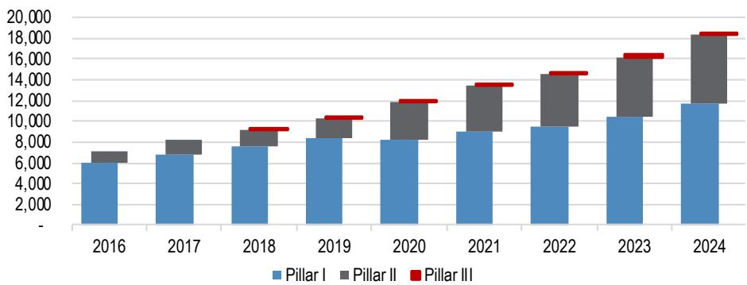
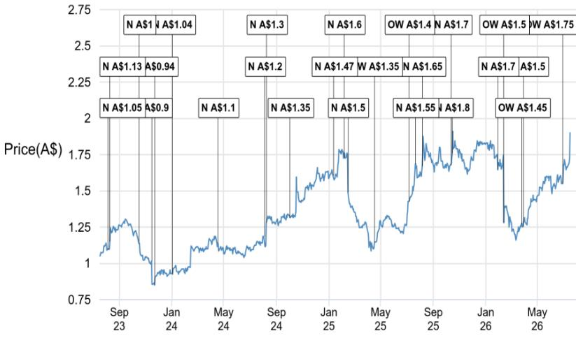

## 中国保险行业观察

## 人口结构变化为中国人寿与AMP带来养老金业务发展空间

中国人寿的盈利预告（链接）发布后，市场反应较为平淡（H股：-3% vs 恒生指数：+3%），这似乎与市场对中期分红提升的信心有所减弱有关，因为这是公司连续第二年提出中期分红方案。从估值角度看，中国人寿-H股当前报价对应FY27E预期市盈率约4倍，股息回报率约4%。随着8月上半年业绩披露季的到来，我们认为中期分红提升、寿险销售保持两位数增长以及稳健的资本状况，将为该公司的风险回报特征提供支撑。除了短期催化因素外，中国人寿在应对人口老龄化趋势和养老金市场增长方面具备长期发展潜力。中国人寿养老保险股份有限公司（CLPC）是中国人寿旗下的专属养老金管理平台，中国人寿持有其70.74%的控股权，而AMP自2014年以来一直持有19.99%的战略股份，为第二大股东。我们认为，中国人口老龄化趋势、政策对养老解决方案的支持，以及与其他老龄化经济体相比偏低的养老金资产渗透率，为CLPC提供了有利的长期发展背景，这也对AMP的盈利前景产生积极影响。我们对这两家公司均持积极看法。

- **三支柱体系向个人养老金方向演进**。中国的养老金体系由第一支柱政府基本养老保险、第二支柱企业年金和职业年金，以及第三支柱税收优惠型个人养老金构成。虽然该体系历史上以政府和企业计划为主导，但随着个人养老金产品税收优惠政策的推出，第三支柱发展有所加速。截至2024年12月，三大支柱的管理资产规模分别为11.6万亿元人民币（约1.7万亿美元）、6.8万亿元人民币（约1.0万亿美元）和1820亿元人民币（约260亿美元）。

- **CLPC在养老金价值链上处于领先地位**。CLPC是少数几家拥有中国三支柱体系全牌照的平台之一，也是领先的全国性养老金资产管理机构。截至2025年底，其管理的养老金资产接近2.4万亿元人民币，其中包括第一支柱780亿元、第二支柱2.2万亿元（排名第一）以及第三支柱760亿元。此外，它还提供团体保险和员工福利解决方案，使其能够同时覆盖机构和个人养老金需求。中国养老金资产仅占2024年GDP的13.8%，而OECD国家的平均水平为42.5%（链接），这表明长期增长潜力可观。截至2026年3月，CLPC的核心偿付能力充足率为1023%，2025年净利润为17亿元人民币，同比增长39%，总资产、总负债和股东权益分别为916亿元、821亿元和95亿元。2025年，CLPC贡献了中国人寿净利润约1.1%的份额。

- **AMP**。AMP近期公布了2026年上半年的最新盈利数据——其净利润表现较市场一致预期高出约25%——这在很大程度上似乎得益于其持有的CLPC 19.99%股权所带来的显著超预期表现。该业务在2026年上半年实现净利润5600万澳元，环比增长24%。我们注意到，该业务在2025年下半年环比增长66%，2025年全年较2024年增长53%。AMP此前也曾表示，2024年其管理资产规模已增长至2.05万亿元人民币（同比增长24%），这表明期末管理资产规模的增长和运营杠杆效应可能是2025年盈利的主要驱动因素。

## 保险行业

MW Kim AC
(852) 2800-8517
mw.kim@JPM.com
JPM Securities (Asia Pacific) Limited/
JPM Broking (Hong Kong) Limited

Siddharth Parameswaran AC
(61-2) 9003-8629
siddharth.x.parameswaran@JPM.com
JPM Securities Australia Limited

Dan Wang
(86-21) 6106-6349
dan.wang@JPM.com
SAC Registration Number: S1730524080001
JPM Securities (China) Company Limited

Tharan Jeyathasan
(61-2) 9003-6098
tharan.jeyathasan@JPM.com
JPM Securities Australia Limited

## 相关研究：

中国保险行业：中国养老金市场：我们能走多远？常见问题解答，2023年3月24日

中国保险行业：假设情景：模拟中国养老金全面开放后的增长空间，2022年11月25日

中国保险行业：重新思考退休：老龄化社会的解决方案，2022年6月22日

表1：中国保险行业：可比公司数据
本币，%，倍

<table><tr><td>公司</td><td>彭博代码</td><td>评级</td><td>价格（2026年7月16日）</td><td>目标价（2026年12月）</td><td>上行/下行空间</td><td>市盈率 26e</td><td>市盈率 27e</td><td>市净率 26e</td><td>市净率 27e</td></tr><tr><td>中国人寿-H</td><td>2628 HK Equity</td><td>OW</td><td>27.7</td><td>40.0</td><td>44%</td><td>5</td><td>4</td><td>1.1</td><td>1.0</td></tr><tr><td>中国人寿-A</td><td>601628 CH Equity</td><td>N</td><td>38.9</td><td>39.0</td><td>0%</td><td>19</td><td>17</td><td>1.7</td><td>1.6</td></tr><tr><td>中国平安-H</td><td>2318 HK Equity</td><td>OW</td><td>54.8</td><td>90.0</td><td>64%</td><td>6</td><td>6</td><td>0.8</td><td>0.7</td></tr><tr><td>中国平安-A</td><td>601318 CH Equity</td><td>OW</td><td>50.7</td><td>83.0</td><td>64%</td><td>7</td><td>6</td><td>0.8</td><td>0.7</td></tr><tr><td>中国太保-H</td><td>2601 HK Equity</td><td>OW</td><td>28.6</td><td>43.0</td><td>50%</td><td>6</td><td>6</td><td>0.7</td><td>0.6</td></tr><tr><td>中国太保-A</td><td>601601 CH Equity</td><td>OW</td><td>31.0</td><td>50.0</td><td>61%</td><td>7</td><td>7</td><td>0.8</td><td>0.8</td></tr><tr><td>新华保险-H</td><td>1336 HK Equity</td><td>N</td><td>46.8</td><td>45.0</td><td>-4%</td><td>5</td><td>5</td><td>1.0</td><td>0.9</td></tr><tr><td>新华保险-A</td><td>601336 CH Equity</td><td>N</td><td>64.4</td><td>59.0</td><td>-8%</td><td>9</td><td>8</td><td>1.6</td><td>1.5</td></tr><tr><td>中国人保集团-H</td><td>1339 HK Equity</td><td>N</td><td>5.1</td><td>5.8</td><td>13%</td><td>5</td><td>5</td><td>0.4</td><td>0.4</td></tr><tr><td>中国人保集团-A</td><td>601319 CH Equity</td><td>N</td><td>7.3</td><td>6.9</td><td>-5%</td><td>11</td><td>9</td><td>1.1</td><td>1.0</td></tr><tr><td>中国财险</td><td>2328 HK Equity</td><td>N</td><td>14.3</td><td>14.0</td><td>-2%</td><td>8</td><td>7</td><td>1.0</td><td>1.0</td></tr></table>

来源：彭博金融信息，JPM预测。

## 中国养老金市场概览

中国的养老金体系基于三大支柱——政府基础养老金（城乡基本养老保险）、企业年金（企业/职业年金）以及享受税收优惠的个人养老金。过去十年，养老金体系的结构主要依赖于政府主导和企业年金类别（截至2024年12月，三大支柱的管理资产规模分别为1.7万亿美元/1.0万亿美元/260亿美元）。中国政府于2021年3月在“十四五”规划（2021-2025年）中首次正式提及养老金领域，包括“构建兼顾商业价值与社会价值的养老服务业”。此后，中国政府推行了一系列养老金改革，包括推动个人养老金业务发展，允许保险公司、银行和财富管理公司提供个人退休产品。政策目标是尽早解决个人养老金支柱可能存在的缺口问题，并减轻对第一/第二支柱的高度依赖。2026年3月，中国政府新公布了“十五五”规划（2026-2030年），提出将优先完善多层次、多支柱养老保险体系，包括扩大企业年金覆盖范围、完善个人养老金支持政策，同时大力发展商业养老保险。到2030年，政府目标是全国企业年金和职业年金合计管理资产规模超过9万亿元人民币（约1.3万亿美元）。

- **第一支柱**（截至2024年12月管理资产规模：11.6万亿元人民币或1.7万亿美元）。第一支柱的构成包括政府管理的基本养老保险基金和全国社会保障基金。根据《2024年度人力资源和社会保障事业发展统计公报》（链接），截至2024年12月，基本养老保险基金累计结余为8.7万亿元人民币。该支柱的另一重要补充是全国社会保障基金（NSSF），作为基本养老金出现缺口时的储备基金。根据全国社会保障基金理事会年度报告（链接），截至2024年，全国社会保障基金净资产为2.9万亿元人民币。

- **第二支柱**（截至2024年12月管理资产规模：6.8万亿元人民币或1.0万亿美元）。企业年金和职业年金是第二支柱的基本组成部分。根据人力资源和社会保障部年度报告披露，截至2024年12月，企业年金总管理资产规模为6.8万亿元人民币（链接），其中企业年金约3.7万亿元人民币，职业年金约3.1万亿元人民币。

- **第三支柱**（截至2024年12月管理资产规模：1820亿元人民币或260亿美元）：在持续的政策支持下，中国第三支柱养老金管理资产规模从2020年到2024年实现了137%的年复合增长率，达到1820亿元人民币（数据来源：中国建设银行养老金金融白皮书2025）。过去十年，中国的养老金体系一直以政府主导类别为主。在个人养老金计划试点（包括税收递延型商业养老保险和养老目标基金）之后，国务院于2022年4月首次提出建立享受税收优惠的个人养老金制度。该计划鼓励个人设立个人养老金账户，截至2026年7月，当前年度缴款上限为12000元人民币（约合1717美元）。总体而言，中国政府正在逐步构建一个多层次、多支柱的养老金体系。

图1：中国养老金体系各支柱资产规模
单位：十亿元人民币  
  
来源：人力资源和社会保障部、全国社会保障基金理事会、中国建设银行养老金金融白皮书（2025年）。

表2：中国人寿养老保险股份有限公司：关键数据概览
单位：百万元人民币，%，百分点

<table><tr><td>股东结构</td><td>2024</td><td>2025</td><td>同比</td><td>2026年一季度</td><td>环比</td></tr><tr><td>中国人寿</td><td>78.68%</td><td>78.68%</td><td>0.0%</td><td>78.68%</td><td>0.0%</td></tr><tr><td>中国人寿保险股份有限公司</td><td>70.74%</td><td>70.74%</td><td>0.0%</td><td>70.74%</td><td>0.0%</td></tr><tr><td>中国人寿保险（集团）公司</td><td>4.41%</td><td>4.41%</td><td>0.0%</td><td>4.41%</td><td>0.0%</td></tr><tr><td>中国人寿资产管理有限公司</td><td>3.53%</td><td>3.53%</td><td>0.0%</td><td>3.53%</td><td>0.0%</td></tr><tr><td>中国诚通信托</td><td>1.33%</td><td>1.33%</td><td>0.0%</td><td>1.33%</td><td>0.0%</td></tr><tr><td>AMP澳大利亚</td><td>19.99%</td><td>19.99%</td><td>0.0%</td><td>19.99%</td><td>0.0%</td></tr><tr><td>运营指标</td><td>2024</td><td>2025</td><td>同比</td><td>2026年一季度</td><td>环比</td></tr><tr><td>核心偿付能力充足率</td><td>1057%</td><td>1033%</td><td>-24百分点</td><td>1023%</td><td>-11百分点</td></tr><tr><td>综合偿付能力充足率</td><td>1075%</td><td>1053%</td><td>-22百分点</td><td>1041%</td><td>-12百分点</td></tr><tr><td>净利润（百万元人民币）</td><td>1,246</td><td>1,736</td><td>39%</td><td>711</td><td>不适用</td></tr><tr><td>总资产（百万元人民币）</td><td>60,802</td><td>91,571</td><td>51%</td><td>100,683</td><td>10%</td></tr><tr><td>总负债（百万元人民币）</td><td>52,618</td><td>82,103</td><td>56%</td><td>90,588</td><td>10%</td></tr><tr><td>股东权益合计（百万元人民币）</td><td>8,184</td><td>9,468</td><td>16%</td><td>10,095</td><td>7%</td></tr></table>

来源：中国人寿养老保险股份有限公司（CLPC），2025/2024年度报告及2026年一季度偿付能力报告。

# 本报告讨论的公司（除非另有说明，本报告所有价格均为2026年7月16日收盘价）

AMP Limited(AMP.AX/A$1.90/OW), 中国人寿保险 - H(2628.HK/HK$27.70/OW)

分析师认证：本报告封面标注“AC”的研究分析师（或当多位研究分析师主要负责本报告时，封面或文件内标注“AC”的研究分析师分别就其在本研究中覆盖的每个证券或发行人认证）：(1) 本报告中表达的所有观点准确反映了研究分析师对任何及所有相关证券或发行人的个人观点；(2) 研究分析师的薪酬中没有任何部分过去、现在或将来直接或间接地与本研究报告中研究分析师提出的具体建议或观点相关。对于封面列出的所有韩国研究分析师（如适用），他们还根据KOFIA要求认证，研究分析师的分析是本着诚信原则进行的，观点反映了研究分析师自身的意见，没有受到不当影响或干预。

除非另有说明，本报告中列出的所有作者均为制作独立研究的研究分析师。在欧洲，行业专家（销售和交易）可能作为联系人出现在本报告中，但并非报告作者或研究部门成员。

## 重要披露

- 做市商/流动性提供者：JPM是AMP Limited、中国人寿保险 - H或相关实体金融工具的做市商和/或流动性提供者。

- 做市商/流动性提供者（香港）：JPM Securities (Asia Pacific) Limited和/或JPM Broking (Hong Kong) Limited和/或其关联公司是中国人寿保险 - H或相关实体及/或其权证或期权（在香港联合交易所有限公司上市或交易）的做市商和/或流动性提供者。

- 客户：JPM目前拥有，或在过去12个月内曾拥有以下实体作为客户：AMP Limited、中国人寿保险 - H或相关实体。

- 客户/非投行、证券相关：JPM目前拥有，或在过去12个月内曾拥有以下实体作为客户，且提供的服务为非投行、证券相关：AMP Limited、中国人寿保险 - H或相关实体。

- 客户/非证券相关：JPM目前拥有，或在过去12个月内曾拥有以下实体作为客户，且提供的服务为非证券相关：AMP Limited、中国人寿保险 - H或相关实体。

- 潜在投行报酬：JPM预计在未来三个月内将从AMP Limited、中国人寿保险 - H或相关实体收取或寻求投行服务报酬。

- 已收非投行报酬：JPM在过去12个月内已从AMP Limited、中国人寿保险 - H或相关实体收取了投行服务以外的产品或服务报酬。

- 债务头寸：JPM可能持有AMP Limited、中国人寿保险 - H或相关实体的债务证券头寸（如有）。

AMP Limited (AMP.AX, AMP AU) 价格走势图  
  
来源：彭博金融信息和JPM；价格数据已根据股票分割和股息进行调整。首次覆盖日期：1999年4月6日。所有股价均为前一交易日收盘价。

<table><tr><td>日期</td><td>评级</td><td>价格（澳元）</td><td>目标价（澳元）</td></tr><tr><td>2023年8月7日</td><td>N</td><td>1.10</td><td>1.05</td></tr><tr><td>2023年8月11日</td><td>N</td><td>1.15</td><td>1.13</td></tr><tr><td>2023年10月18日</td><td>N</td><td>1.14</td><td>1</td></tr><tr><td>2023年11月16日</td><td>N</td><td>1.02</td><td>0.9</td></tr><tr><td>2023年11月23日</td><td>N</td><td>0.85</td><td>0.94</td></tr><tr><td>2024年1月3日</td><td>N</td><td>0.93</td><td>1.04</td></tr><tr><td>2024年4月18日</td><td>N</td><td>1.14</td><td>1.1</td></tr><tr><td>2024年8月5日</td><td>N</td><td>1.18</td><td>1.2</td></tr><tr><td>2024年8月9日</td><td>N</td><td>1.28</td><td>1.3</td></tr><tr><td>2024年10月3日</td><td>N</td><td>1.32</td><td>1.35</td></tr><tr><td>2025年1月13日</td><td>N</td><td>1.60</td><td>1.47</td></tr><tr><td>2025年2月6日</td><td>N</td><td>1.73</td><td>1.6</td></tr><tr><td>2025年2月15日</td><td>N</td><td>1.49</td><td>1.5</td></tr><tr><td>2025年4月18日</td><td>OW</td><td>1.14</td><td>1.35</td></tr><tr><td>2025年7月7日</td><td>OW</td><td>1.42</td><td>1.4</td></tr><tr><td>2025年7月22日</td><td>N</td><td>1.68</td><td>1.55</td></tr><tr><td>2025年8月7日</td><td>N</td><td>1.67</td><td>1.65</td></tr><tr><td>2025年10月13日</td><td>N</td><td>1.67</td><td>1.7</td></tr><tr><td>2025年10月16日</td><td>N</td><td>1.76</td><td>1.8</td></tr><tr><td>2026年1月30日</td><td>N</td><td>1.64</td><td>1.7</td></tr><tr><td>2026年2月13日</td><td>OW</td><td>1.28</td><td>1.5</td></tr><tr><td>2026年3月27日</td><td>OW</td><td>1.27</td><td>1.45</td></tr><tr><td>2026年3月30日</td><td>OW</td><td>1.25</td><td>1.5</td></tr><tr><td>2026年6月30日</td><td>OW</td><td>1.55</td><td>1.75</td></tr></table>

中国人寿保险 - H (2628.HK, 2628 HK) 价格走势图  

<table><tr><td>日期</td><td>评级</td><td>价格（港元）</td><td>目标价（港元）</td></tr><tr><td>2023年8月22日</td><td>OW</td><td>11.12</td><td>18</td></tr><tr><td>2023年12月28日</td><td>OW</td><td>9.77</td><td>15</td></tr><tr><td>2024年9月10日</td><td>OW</td><td>11.22</td><td>17</td></tr><tr><td>2024年10月13日</td><td>OW</td><td>16.46</td><td>22</td></tr><tr><td>2025年1月9日</td><td>UW</td><td>13.84</td><td>10</td></tr><tr><td>2025年4月15日</td><td>UW</td><td>13.66</td><td>9</td></tr><tr><td>2025年7月25日</td><td>OW</td><td>22.35</td><td>31</td></tr><tr><td>2026年1月7日</td><td>OW</td><td>31.10</td><td>40</td></tr></table>

来源：彭博金融信息和JPM；价格数据已根据股票分割和股息进行调整。首次覆盖日期：2004年2月4日。所有股价均为前一交易日收盘价。

图表显示了JPM对这些股票的持续覆盖；当前分析师可能并未在整个期间内覆盖这些股票。

JPM评级或标识：OW = 增持，N = 中性，UW = 减持，NR = 未评级

## 股票研究评级、标识及分析师覆盖范围说明：

JPM使用以下评级体系：增持（在本报告所示目标价期间内，我们预期该股票的表现将优于研究分析师或其团队覆盖范围内股票的平均总回报）；中性（在本报告所示目标价期间内，我们预期该股票的表现将与研究分析师或其团队覆盖范围内股票的平均总回报一致）；减持（在本报告所示目标价期间内，我们预期该股票的表现将逊于研究分析师或其团队覆盖范围内股票的平均总回报）。NR为未评级。在此情况下，JPM已移除该股票的评级及（如适用）目标价，原因可能是缺乏充分的基本面依据，或出于法律、监管或政策原因。先前的评级及（如适用）目标价不应再被依赖。NR标识并非推荐或评级。部分被覆盖的股票有评级但无目标价；在此情况下，我们预期该股票的表现将优于/一致/逊于研究分析师或其团队在相关区域覆盖范围内股票的平均总回报。在我们的亚洲（除澳大利亚和印度外）及英国中小盘股票研究中，每只股票的预期总回报是与基准国家市场指数的预期总回报进行比较，而非与研究分析师的覆盖范围进行比较。如果本报告的重要披露部分未显示，认证研究分析师的覆盖范围可在JPM研究网站 https://www.JPMmarkets.com 上找到。

覆盖范围：Kim, MW：友邦保险集团（1299）（1299.HK）、曼谷人寿（BLA.BK）、中国人寿保险 - A（601628.SS）、中国人寿保险 - H（2628.HK）、中国太平洋保险集团 - A（601601.SS）、中国太平洋保险集团 - H（2601.HK）、DB Insurance Co Ltd（005830.KS）、富卫集团控股（1828.HK）、韩华人寿保险（088350.KS）、现代海上火灾保险（001450.KS）、韩国再保险公司（003690.KS）、LPI Capital（LOND.KL）、新华人寿保险 - A（601336.SS）、新华人寿保险 - H（1336.HK）、中国人保集团 - A（601319.SS）、中国人保集团 - H（1339.HK）、中国人民财产保险（2328）（2328.HK）、中国平安保险集团 - A（601318.SS）、中国平安保险集团 - H（2318.HK）、三星火灾海上保险（000810.KS）、三星生命保险（032830.KS）、首尔保证保险（031210.KS）、泰国人寿保险（TLI.BK）

Parameswaran, Siddharth：AMP Limited（AMP.AX）、ASX Ltd（ASX.AX）、AUB Group（AUB.AX）、Challenger Limited（CGF.AX）、Computershare Limited（CPU.AX）、GQG Partners（GQG.AX）、Insurance Australia Group（IAG.AX）、Magellan Financial Group Limited（MFG.AX）、Medibank Private Limited（MPL.AX）、NIB Holdings Limited（NHF.AX）、Perpetual Limited（PPT.AX）、QBE Insurance Group（QBE.AX）、Steadfast Group LTD（SDF.AX）、Suncorp Group Ltd（SUN.AX）

## JPM股票研究评级分布，截至2026年7月4日

<table><tr><td></td><td>增持（买入）</td><td>中性（持有）</td><td>减持（卖出）</td></tr><tr><td>JPM全球股票研究覆盖范围*</td><td>53%</td><td>36%</td><td>12%</td></tr><tr><td>投行客户**</td><td>83%</td><td>80%</td><td>73%</td></tr><tr><td>JPMS股票研究覆盖范围*</td><td>51%</td><td>37%</td><td>12%</td></tr><tr><td>投行客户**</td><td>95%</td><td>92%</td><td>87%</td></tr></table>

\*请注意，由于四舍五入，百分比可能不总和为100%。
\*\*在过去12个月内，JPM为其提供投行服务的每个“买入”、“持有”和“卖出”类别中的公司百分比。

仅就FINRA评级分布规则而言，我们的增持评级属于报告评级类别；中性评级属于持有评级类别；减持评级属于报告评级类别。请注意，标有NR的股票不包含在上表中。此信息截至最近一个日历季度末。

股票估值与风险：有关被覆盖公司或目标价的估值方法和风险，请参阅 http://www.JPMmarkets.com 上最新的公司特定研究报告，联系首席分析师或您的JPM代表，或发送电子邮件至 research.disclosure.inquiries@JPM.com。有关专有模型的实质性信息，请参阅公司特定研究报告中的财务摘要和公司概况表，这些文件可在我们的客户网站 http://www.JPMmarkets.com 的公司页面上下载。本报告还阐述了其中使用的重要基本假设。

## 研究交流历史：

过去12个月内JPM研究交流的历史可在 http://www.JPMmarkets.com 的研究与评论页面上获取，您也可以按分析师姓名、行业或金融工具进行搜索。

分析师薪酬：负责编写本报告的研究分析师的薪酬基于多种因素，包括研究的质量和准确性、客户反馈、竞争因素以及公司整体收入。

非美国分析师注册：除非另有说明，本报告封面列出的非美国分析师是非美国关联公司的员工，可能未根据FINRA规则注册为研究分析师，可能不是JPM Securities LLC的关联人士，并且可能不受FINRA规则2241或2242关于与被覆盖公司沟通、公开露面以及交易研究分析师账户持有证券的限制。

## 其他披露

英国MiFID FICC研究分拆豁免：英国客户应参考英国MiFID研究分拆豁免，了解JPM实施FICC研究豁免的详情以及相关FICC研究分类的指导。

除非相关法律特别允许，所有提供给客户的研究材料均同时在我们的客户网站JPM Markets上提供。并非所有研究内容都会重新分发、通过电子邮件发送或提供给第三方聚合商。如需获取特定股票的所有研究材料，请联系您的销售代表。

本研究材料中提及中国、香港、台湾和澳门的任何全称分别为中国大陆、中国香港特别行政区、中国台湾和中国澳门特别行政区。

JPM可能不时撰写关于受美国、欧盟、英国或其他相关司法管辖区政府当局实施或管理的经济或金融制裁所针对的发行人或证券（受制裁证券）的文章。本报告中的任何内容均无意被解读为鼓励、促进、推广或以其他方式批准对这类受制裁证券进行投资或交易。客户在做出投资决策时应了解自身的法律和合规义务。

本研究报告中讨论的任何数字或加密资产都处于快速变化的监管环境中。有关加密资产（包括比特币和以太坊）的相关监管建议，请参阅 https://www.JPM.com/disclosures/cryptoasset-disclosure。

本研究报告的作者可能未获许可在您的司法管辖区开展受监管活动，如果未获许可，则不会声称自己能够这样做。

交易所交易基金（ETF）：JPM Securities LLC（“JPMS”）作为几乎所有美国上市ETF的授权参与者。如果本报告中提及任何ETF，JPMS可能因分销这些ETF份额而赚取佣金和基于交易的报酬，并可能因执行其他交易相关服务（例如向ETF份额的卖空者提供证券借贷）而赚取费用。JPMS也可能为ETF本身提供服务，包括担任ETF的经纪商或交易商。此外，JPMS的关联公司可能为ETF提供服务，包括信托、托管、管理、借贷、指数计算和/或维护及其他服务。

期权和期货相关研究：如果本文所含信息涉及期权或期货相关研究，则该信息仅提供给已收到适当期权或期货风险披露文件的人士。请联系您的JPM代表或访问 https://www.theocc.com/components/docs/riskstoc.pdf 获取期权清算公司的《标准化期权的特征和风险》副本，或访问 https://www.finra.org/sites/default/files/2020-08/Security_Futures_Risk_Disclosure_Statement_2020.pdf 获取证券期货风险披露声明副本。

银行间同业拆借利率（IBOR）及其他基准利率的变更：某些利率基准正在或可能在未来受到持续的国际、国内及其他监管指导、改革和改革提案的影响。更多信息，请查阅：https://www.JPM.com/global/disclosures/interbank_offered_rates

私人银行客户：如果您作为JPM Chase & Co.及其子公司（“JPM私人银行”）提供的私人银行业务的客户接收研究，则研究由JPM私人银行提供给您，而非JPM的任何其他部门，包括但不限于JPM企业与投行及其全球研究部门。

负责制作和分发研究的法律实体：本材料作者署名下方的法律实体是负责制作本研究的法律实体。如果多位Reg AC研究分析师共同撰写了本材料，且其姓名下方标有不同的法律实体，则这些法律实体共同负责本研究的制作。如果分析师姓名下列出多个法律实体，则除非另有说明，第一个法律实体负责制作。来自不同JPM关联公司的研究分析师可能对本材料的制作做出了贡献，但可能未获许可在您的司法管辖区开展受监管活动（并且不会声称自己能够这样做）。除非下文法律实体披露中另有说明，本材料已由负责制作的法律实体分发，或者如果分析师姓名下列出多个法律实体，则第一个法律实体将负责分发。如果您有任何疑问，请联系您所在司法管辖区的相关研究分析师或您所在司法管辖区分发本研究材料的实体。

## 法律实体披露及国家/地区特定披露：

阿根廷：JPM Chase Bank N.A Sucursal Buenos Aires受阿根廷中央银行（BCRA）和阿根廷国家证券委员会（CNV - ALYC y AN Integral N°51）监管。

澳大利亚：JPM Securities Australia Limited（“JPMSAL”）（ABN 61 003 245 234/AFS牌照号：238066）受澳大利亚证券和投资委员会监管，是ASX Limited的市场参与者、ASX Clear Pty Limited的清算和结算参与者以及ASX Clear (Futures) Pty Limited的清算参与者。本材料在澳大利亚由JPMSAL或其代表仅向“批发客户”（定义见《2001年公司法》第761G条）发行和分发。所有涵盖的金融产品列表可在 https://www.jpmm.com/research/disclosures 上找到。JPM力求覆盖对国内外读者基础具有相关性的所有全球行业分类标准（GICS）行业以及各种市值规模的公司。如适用，在研究分析师团队对标的公司进行公开尽职调查的过程中，他们有时可能通过公司实地考察、与公司代表讨论、管理层演示等方式进行此类尽职调查。JPMSAL发布的研究已按照JPM澳大利亚的研究独立性政策编制，该政策可在以下链接找到：JPM Australia - Research Independence Policy。

巴西：Banco JPM S.A.受巴西证券交易委员会（CVM）和巴西中央银行监管。JPM监察员：0800-7700847 / 0800-7700810（听障人士专线）/ ouvidoria.jp.morgan@jpmchase.com。

加拿大：JPM Securities Canada Inc.是一家注册投资交易商，受加拿大投资监管组织和安大略省证券委员会监管，是加拿大交易所的参与会员。本材料在加拿大由JPM Securities Canada Inc.或其代表分发。

智利：Inversiones JPM Limitada是一家在智利注册的未受监管实体。

中国：JPM Securities (China) Company Limited已获中国证监会批准开展证券投资咨询业务。

哥伦比亚：Banco JPM Colombia S.A.受哥伦比亚金融监管局（SFC）监管。本材料中对哥伦比亚境外实体提供的产品或服务的任何引用仅用于描述目的。此类引用不构成也不应被解释为在哥伦比亚境内（根据适用的哥伦比亚法规定义）的促销活动或金融产品或服务的提供。

迪拜国际金融中心（DIFC）：JPM Chase Bank, N.A., Dubai Branch受迪拜金融服务局（DFSA）监管，其注册地址为迪拜国际金融中心 - The Gate, West Wing, Level 3 and 9 PO Box 506551, Dubai, UAE。本材料由JPM Chase Bank, N.A., Dubai Branch向根据DFSA规则被视为专业客户或市场对手方的人士分发。

欧洲经济区（EEA）：除非另有说明，研究在
