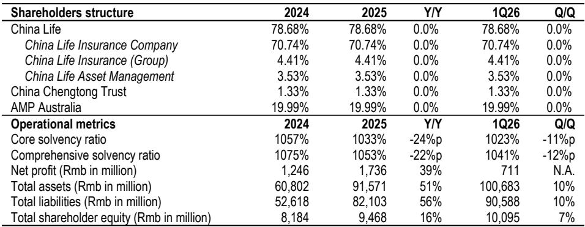
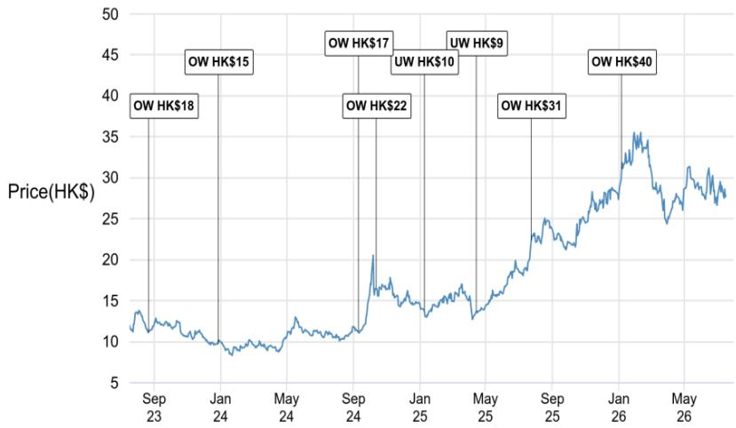

# 中国养老金市场：结构性增长的下一个前沿——两家公司占据独特位置

中国养老金资产仅占GDP的13.8%，而OECD国家的平均水平为42.5%。这一差距并非当前状况的滞后指标，而是对全球第二大经济体中最大可配置长期资本池的前瞻性衡量。对于能够超越季度性利润预警或短期报价波动的观察者而言，结构性趋势清晰可见：中国的人口结构变化，加上政策对私人养老金支柱的有意加速推进，正在为拥有牌照、分销渠道和资产管理基础设施的机构创造长达数十年的增长空间。中国人寿及其少数股东AMP正处在这一机遇的中心。

市场对中国人寿2026年中期的积极利润预警的反应具有启示性。H股下跌3%，而恒生指数上涨3%，原因是市场对连续两年中期派息后再度提高中期股息的信心减弱。这种反应反映了一种短期交易心态，忽略了更大的图景。中国人寿-H的远期市盈率约为4倍，股息率约为4%。估值并不苛刻。未来六个月的催化剂——中期股息增加、两位数的人寿销售增长以及稳健的资本状况——清晰可见。但真正的价值在于更远的未来。中国人寿旗下的专属养老金管理子公司——中国人寿养老保险股份有限公司（CLPC），是该公司将已在进行中的人口老龄化和养老金市场扩张转化为收益的机制。

AMP的2026年上半年业绩更新证实了这一机制的力量。AMP报告称，其持有的CLPC 19.99%股权贡献的税后净利润为5600万澳元，环比增长24%。此前，2025年下半年环比增长66%，2025年全年同比增长53%。增长轨迹并非线性，而是复利式的。截至2025年底，CLPC的管理资产规模（AUM）达到约2.4万亿元人民币，而资产管理费中蕴含的经营杠杆意味着，每增加一单位AUM，都会不成比例地转化为利润。对于评估中国人寿或AMP的观察者而言，养老金子公司已不再是次要的股权投资。它是盈利超预期的主要驱动力，也是两家公司结构中最被低估的资产。

## 中国三支柱养老金体系：从国家主导模式向私人驱动增长引擎转变

中国养老金体系历史上由第一支柱主导，即政府管理的基本养老保险基金和全国社会保障基金，截至2024年12月，两者合计AUM为11.6万亿元人民币。第二支柱，包括企业年金和职业年金，AUM为6.8万亿元人民币。第三支柱，即税收优惠的个人养老金账户，AUM仅为1820亿元人民币。这仅占养老金总AUM的1.6%，并非需求低迷的信号，而是市场刚刚开始开放的标志。

2021年3月发布的“十四五”规划，是第一份明确提出构建兼顾商业与社会价值的养老服务产业的官方文件。2026年3月公布的“十五五”规划更进一步，优先强调完善多层次体系、扩大企业年金覆盖面、完善个人养老金政策、大力发展商业养老保险。政府设定了具体目标：到2030年，第二支柱AUM合计超过9万亿元人民币，高于目前的6.8万亿元人民币。仅这一目标就意味着企业年金支柱的年复合增长率约为5-6%。但真正的加速在于第三支柱，其2020年至2024年的年复合增长率已达137%。基数虽小，但政策推动力明确，人口结构变化的必要性不可否认。

对观察者而言，关键在于中国政府并非仅仅将养老金储蓄视为社会福利措施。它正在积极建设私人资本市场的基础设施，以引导家庭储蓄进入长期资产。个人养老金账户，年缴存上限为1.2万元人民币，是这一载体。保险公司、银行和财富管理公司是分销渠道。而拥有多支柱牌照的资产管理公司是最终受益者。中国的养老金体系正被重新设计为资本形成机制，而不仅仅是退休安全网。

## 中国人寿养老保险公司：在多支柱牌照上拥有结构性优势，是最大支柱中的明确市场领导者

CLPC是中国少数几个拥有全部三支柱完整牌照的平台之一。截至2025年底，其管理的养老金资产近2.4万亿元人民币，包括第一支柱780亿元、第二支柱2.2万亿元和第三支柱760亿元。在第二支柱中，CLPC按AUM排名第一。这并非公司在多个领域竞争的组合，而是在中国最大且增长最快的机构养老金市场中占据的集中领导地位。

CLPC的财务表现强化了这一地位的质量。截至2026年3月，公司核心偿付能力充足率为1023%，表明资本充足率极高，有能力在不增资的情况下吸收增长。2025年净利润达到17亿元人民币，同比增长39%。总资产增长51%至916亿元，股东权益增长16%至95亿元。利润增长并非由财务工程或一次性收益驱动，而是AUM复利和经营杠杆的结果。随着CLPC增加管理资产，增量收入以最小的额外固定成本转化为利润。

CLPC对中国人寿的战略重要性，超越了其在2025年约1.1%的净利润贡献。这一比例即将大幅上升。随着第三支柱从小基数增长，以及CLPC继续获得大部分新增企业年金委托，该子公司的利润贡献将变得重要。对于自2014年起持有19.99%稳定战略股权的AMP而言，CLPC的收益流已是其盈利上调的主要驱动力。AMP的2026年上半年业绩超出市场预期约25%，而CLPC股权是最大的单一因素。复利效应可见：CLPC在2025年全年利润增长53%，而仅2025年下半年就增长了66%。这并非周期性反弹，而是结构性收益增长的早期阶段。

## 养老金资产渗透率差距：创造数十年复利机会，尚未在两家公司报价中体现

本分析中最重要的数字并非任何单一公司的市盈率或AUM，而是中国养老金资产占GDP的13.8%与OECD国家42.5%的平均水平之间的差距。假设GDP保持在当前水平不变，这28.7个百分点的差距代表着约40万亿元人民币的潜在增量养老金资产。实际上，GDP将增长，差距在缩小之前会先扩大。这意味着，CLPC目前2.4万亿元的AUM，即使不增加市场份额，仅通过维持其市场地位，也可能在未来十年内增长数倍。

结构性驱动因素已被政策制定者充分理解。中国人口正在快速老龄化。抚养比正在上升。国家主导的第一支柱体系面临长期资金压力。政府的应对措施是将退休储蓄的负担从国家转移到个人和雇主，这意味着第二支柱和第三支柱必须增长。“十五五”规划明确指出了这一点。保险公司，尤其是拥有养老金子公司的公司，是指定的中介机构。它们收取保费、管理资产，并在储蓄的整个生命周期中赚取费用。对于已经拥有牌照、分销网络和业绩记录的CLPC而言，未来十年是以高于GDP增长率进行复利的时期。

对于以约4倍远期市盈率评估中国人寿-H的观察者而言，风险并非养老金故事无法实现。风险在于市场继续基于短期寿险指标对股票进行估值，而忽略了养老金子公司的内在期权价值。这一风险正是机遇所在。随着CLPC的利润贡献在利润表中变得更加明显，估值倍数应会扩大，以反映更高质量、更高增长的收益流。AMP通过其19.99%的股权，实际上是CLPC增长的杠杆化投资，提供了类似的不对称性：市场为其澳大利亚财富管理业务定价，但养老金驱动的盈利超预期才是催化剂。

## 观察者的决策框架：三个问题决定配置方向

中国的养老金机遇并非单一股票的故事。它是一个结构性主题，有多个切入点，每个切入点具有不同的风险回报特征。观察者应通过回答三个问题来评估其配置。

第一，您希望直接配置养老金资产管理业务，还是通过母公司间接配置？中国人寿-H提供对CLPC 70.74%控股权的直接所有权，外加提供资本和分销支持的核心寿险业务。寿险业务市盈率约4倍，股息率约4%，这意味着养老金子公司实际上是嵌入股价中的免费期权。AMP通过19.99%的股权提供间接配置，其优势在于纯粹聚焦CLPC的盈利增长，而无需面对中国寿险监管环境的复杂性。但权衡之处在于，AMP的股价也反映了其澳大利亚财富管理业务的业绩，这可能会引入不相关的波动。

第二，您的时间跨度是多长？养老金故事是一个数十年的结构性转变。短期催化剂——中期股息增加、两位数的人寿销售增长以及2026年上半年业绩超预期——是真实的，并应在未来六至十二个月内支撑股价。但AUM的复利以及CLPC利润贡献的逐步确认，需要数年时间才能完全展现。时间跨度为一年的观察者应关注短期催化剂和估值底部。时间跨度为三至五年的观察者应建立头寸，并将CLPC的季度AUM和利润披露作为主要绩效指标进行监测。

第三，您如何权衡监管风险？中国政府正在积极支持养老金增长，这降低了相对于其他金融领域的监管风险。然而，政府也通过税收优惠、缴存上限和牌照发放来控制第三支柱的扩张速度。目前每年1.2万元的上限按国际标准较低，提高上限将是一个强有力的催化剂。“十五五”规划中第二支柱AUM的明确目标表明政府致力于增长，但具体政策变化的时间难以预测。观察者应假设长期方向有利，短期政策延迟是买入机会而非退出理由。

对于大多数机构观察者而言，捕捉养老金主题最有效的方式是通过中国人寿-H，它结合了低估值、清晰的短期催化剂路径以及尚未在盈利预测中体现的结构性增长引擎。AMP是更高贝塔值的投资，提供了对CLPC盈利超预期的杠杆，但承担了额外的公司特定风险。两家公司均获得覆盖分析师的观点评级，并都受益于相同的人口结构和政策推动力。两者之间的选择取决于观察者的风险偏好、时间跨度以及对直接与间接配置的偏好。

*仅供参考。部分内容可能基于源材料通过AI辅助生成、翻译、总结或编辑，可能存在遗漏或错误。请独立核实。本文不构成任何专业建议。*

仅供参考。部分内容可能基于源材料通过AI辅助生成、翻译、总结或编辑，可能存在遗漏或错误。请独立核实。本文不构成任何专业建议。

