Global Memory Tech

# Weekly theme: 3Q DRAM ASP rising well, memory upside with TSMC/ASML guidance

Industry Overview

## What we learned from our 3Q contract price check

Investors have increasingly asked about memory chipmakers' likely 3Q earnings miss, given limited ASP hike vs consensus. This prompted us to check newly negotiated 3Q DRAM contract prices more closely. What we learned: (1) stronger server DRAM pricing, up 20-30% QoQ, led by high-speed LPDDR5 vs consensus of 20% or less; (2) upbeat spot demand, led by commodity DDR5 and even legacy DDR4, with July prices up again MoM; (3) a near-term rise in orders for higher-priced HBM4 vs cheaper HBM3e; (4) LTA-based DRAM sales well below 50% of total, with non-LTA portion at 60-70%, and a solid QoQ price rise (e.g., 5-10%), often settled even under LTAs; and (5) some OEMs' rush orders confirming more than 20% QoQ price rise, not only for commodity DRAM but also for NAND. Overall, our global forecast for 3Q DRAM ASP, up 21% QoQ, is consistent with what we learned from channel check. This is more optimistic than TrendForce's current assumptions of a 13-18% QoQ rise in 3Q conventional DRAM, or only 8-13% including HBM. Of course, TrendForce's 2Q DRAM ASP assumptions, up 58-63% QoQ for conventional DRAM only or 53-58% on an overall blended basis, including HBM, seem to be 10ppt higher than Korea-specific average but in line with ex-Korea global assumption.

## Spot prices also rise, led by DRAM

DRAM spot prices have risen for eight consecutive weeks, though being at a abnormally high level. This is completely different vs 2-3 months ago sentiment (e.g., no further upside at US\$35-40 for 16Gb DDR5; already higher than HBM price). Many OEMs, which had previously purchased DRAM at only around US\$5 per unit, resisted the DRAM spot-price rally and consequently reduced PC/tablet/smartphone production volume. But, they are now buying more memory chips to prepare for higher sales in Sept. and the 4Q peak season. Since spot trading volume is very small, at a low-single-digit% of global supply, some OEMs are purchasing conventional DRAM on more of a rush-order basis. Current spot prices for both DDR5 and DDR4 point to a roughly 20% QoQ rise. NAND spot prices also recovered well this week, led by 1Tb, up 4% WoW. This is also a positive signal to expect 10%+ NAND ASP rise in 3Q. But, similar to Korea’s 2Q DRAM ASP miss vs global trend, Japan NAND ASP should not have been upbeat vs Street expectation; still, it is too early to expect a 3Q miss, given solid July data, with monthly spot/contract prices rising.

## Positive implications of TSMC's strong results/capex

TSMC's (Taiwan Semi Manufacturing Co.) strong 2Q results, with sales of US\$40bn (+34% YoY), and OPM of 60%; bullish guidance, including a 2nm node ramp-up and low-40% annual revenue growth; and record-high capex of US\$60-64bn for 2026, plus a separate additional US\$100bn investment in US fabs, have positive implications for memory, as TSMC's customers need more advanced HBM, SOCAMM, and eSSD. ASML's 2Q results/guidance were also favorable for memory due to muted China exports (local chipmakers' lower spending); more Taiwan/logic-centric sales growth (vs memory/Korea); and management's optimistic view on new AI chip and high NA EUV (memory order upside for new logic).

## 16 July 2026

Equity
Global
Technology

Simon Woo, CFA >>
Research Analyst
BofA (Seoul)
+82 2 3707 0554
simon.woo@bofa.com

Dai Shen >>
Research Analyst
BofA (Hong Kong)
dai.shen@bofa.com

Vivek Arya
Research Analyst
BofAS
vivek.arya@bofa.com

Mikio Hirakawa >>
Research Analyst
BofAS Japan
mikio.hirakawa@bofa.com

Matt Shin >>
Research Analyst
BofA (Seoul)
matt.shin2@bofa.com

## Exhibit 1: DDR5/DDR4 well rebounded

this week; even 1Tb NAND recovery seen
Spot-market prices among DRAM and NAND

<table><tr><td>US$</td><td>Current</td><td>WoW</td><td>QoQ</td><td>YoY</td></tr><tr><td colspan="5">DRAM spot</td></tr><tr><td>16Gb DDR5</td><td>49.2</td><td>3%</td><td>28%</td><td>712%</td></tr><tr><td>16Gb DDR4</td><td>80.1</td><td>3%</td><td>16%</td><td>829%</td></tr><tr><td>8Gb DDR4</td><td>39.9</td><td>6%</td><td>21%</td><td>685%</td></tr><tr><td>4Gb DDR4</td><td>12.9</td><td>4%</td><td>81%</td><td>426%</td></tr><tr><td colspan="5">NAND spot</td></tr><tr><td>1Tb wafer</td><td>25.1</td><td>4%</td><td>-3%</td><td>397%</td></tr><tr><td>512Gb wafer</td><td>19.2</td><td>-1%</td><td>-9%</td><td>617%</td></tr><tr><td>256Gb wafer</td><td>10.2</td><td>0%</td><td>-3%</td><td>578%</td></tr></table>

Source: DRAMeXchange

BofA GLOBAL RESEARCH

## AI: Artificial intelligence

ASP: Average selling price

DDR4/5: $4^{th}/5^{th}$ gen double-data rate DRAM

DRAM: Dynamic random-access memory

EUV: Extreme ultraviolet lithography

eSSD: Enterprise solid-state drive

Gb/Tb: Gigabit/Terabit

GM/OPM: Gross/OP margin

HBM: High bandwidth memory

HBM3e/4: 5 $^{th}$ /6 $^{th}$ gen of HBM

LPDDR5: Low-power DDR5

LTA: Long-term agreement

NAND: Not-AND memory

OEM: Original equipment manufacturer

SOCAMM: Small-outline compression

## TrendForce memory ASP forecast vs BofA estimates

Exhibit 2: TrendForce expects conventional DRAM price to moderate through 2H26, decelerating from \~93-98% QoQ growth in 1Q to \~58-63% in 2Q to \~13-18% in 3Q and just \~3-8% by 4Q
TrendForce DRAM ASP forecast updated as of 30 $^{th}$ June 2026

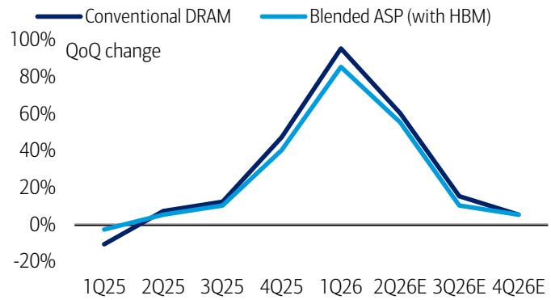  
\*Blended ASP refers to entire DRAM (conventional + HBM)
Source: TrendForce, BofA Global Research estimates

BofA GLOBAL RESEARCH

Exhibit 3: TrendForce forecasts NAND ASP to normalize to \~+10-15% QoQ in 3Q26 and \~+0-5% QoQ in 4Q26 after reaching peak levels of \~85-90% QoQ and \~55-60% QoQ in 1Q/2Q26
TrendForce NAND ASP forecast updated as of 30 $^{th}$ June 2026  
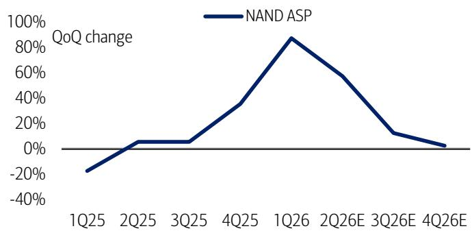  
Source: TrendForce  
BofA GLOBAL RESEARCH  
Exhibit 4: Following the exceptional +70-90% QoQ increase in 1Q26, we expect global DRAM and Samsung ASP growth to moderate to +45-50% in 2Q and \~+20% QoQ in 3Q26 and high-single-digit QoQ in 4Q26 BofA Global DRAM ASP and Samsung DRAM ASP estimates

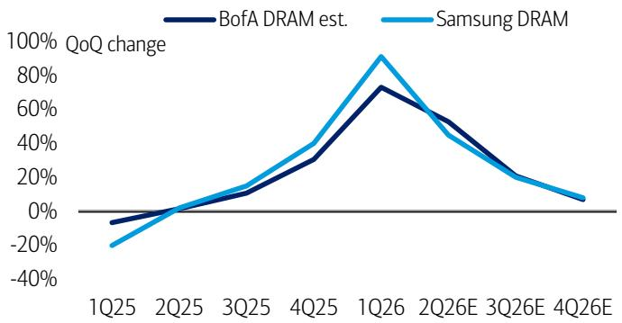  
Source: Companies, BofA Global Research estimates  
BofA GLOBAL RESEARCH  
Exhibit 5: Following the +75-88% QoQ spike in 1Q26, we expect global NAND and Samsung ASP growth to moderate to \~+65% QoQ in 2Q26, easing further to \~+15% QoQ in 3Q26 and near-flat levels by 4Q26
BofA Global NAND ASP and Samsung NAND ASP estimates

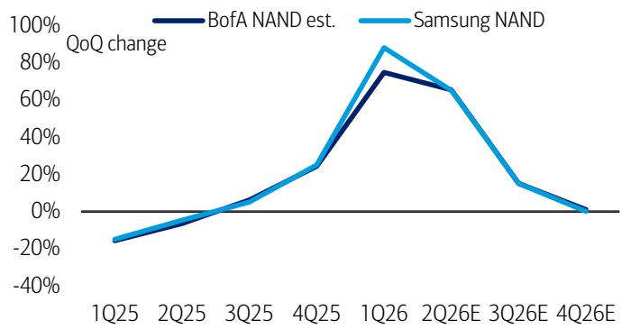  
Source: Companies, BofA Global Research estimates  
BofA GLOBAL RESEARCH

Exhibit 6: Both DRAM and NAND prices are at record highs, with DDR5 DRAM reaching approximately \$45 compared with NAND at \~\$25 16Gb DDR5 vs 512Gb wafer contract price trend  
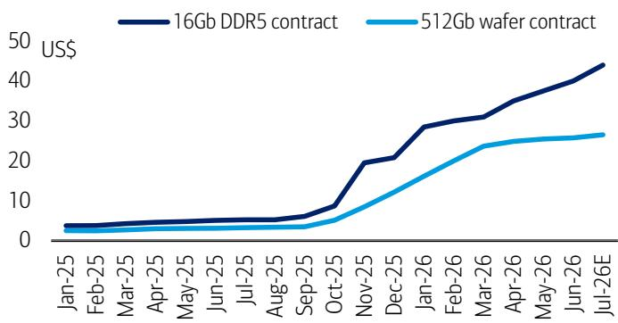  
Source: TrendForce  
BofA GLOBAL RESEARCH

Exhibit 7: NAND and DRAM price expected to rise 3-10% MoM in Jul-26
16Gb DDR5 vs 512Gb wafer contract price trend – MoM change  
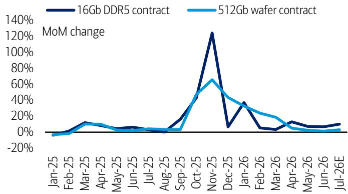  
Source: TrendForce  
BofA GLOBAL RESEARCH

BofA vs TrendForce NAND ASP assumptions (QoQ change)

Exhibit 8: TrendForce has revised up its 3Q26 DRAM ASP forecast to 13–18% QoQ vs previous estimate of 3–8% QoQ
TrendForce DRAM ASP forecast (QoQ change) – Jun-26 update vs Mar-26

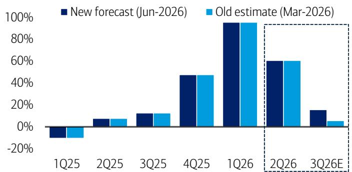  
TrendForce's latest update as of $30^{\text{th}}$ June-2026  
Source: TrendForce  
BofA GLOBAL RESEARCH  
Exhibit 9: TrendForce has revised down its 2Q26 NAND ASP forecast to 55–60% QoQ (from 70–75%), while raising its 4Q26 outlook to 10–15% QoQ from the earlier 8–13% range  
TrendForce NAND ASP forecast (QoQ change) – Jun-26 update vs Mar-26

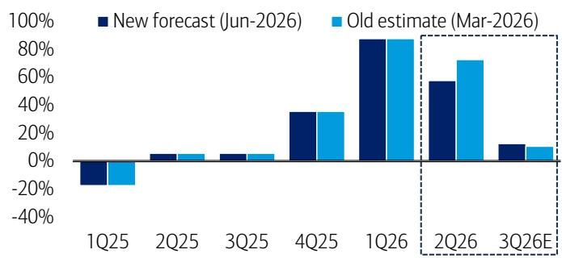  
TrendForce's latest update as of $30^{\text{th}}$ June-2026  
Source: TrendForce  
BofA GLOBAL RESEARCH  
Exhibit 10: Our estimates are largely in line for 3Q26 and 4Q26 and more conservative for 2Q26 relative to TrendForce, with DRAM ASPs projected to increase 53% / 21% / 7% QoQ across 2Q–4Q26 (BofA) BofA vs TrendForce DRAM ASP assumptions (QoQ change)

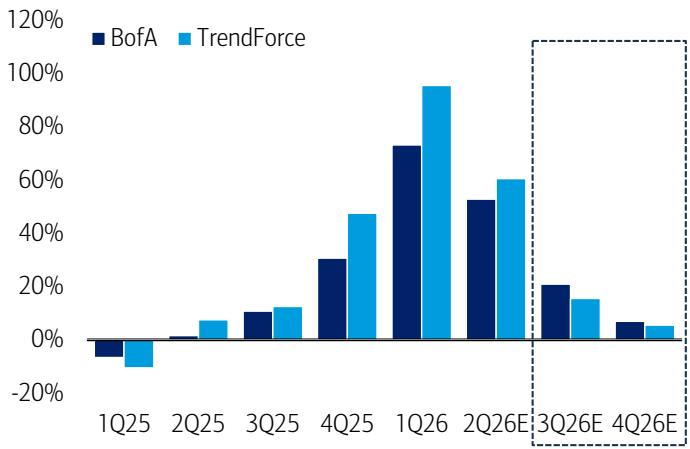  
TrendForce's latest update as of $30^{\text{th}}$ June-2026 vs BofA update as of $10^{\text{th}}$ July 2026  
Source: TrendForce, BofA Global Research estimates  
Exhibit 11: Similarly, our NAND assumptions are either conservative or broadly aligned with TrendForce, with ASPs expected to grow 65% / 15% / 1% QoQ across 2Q–4Q26

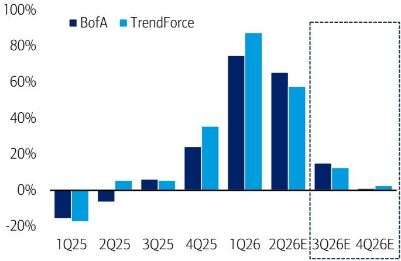  
TrendForce's latest update as of $30^{\text{th}}$ June-2026 vs BofA update as of $10^{\text{th}}$ July 2026  
Source: TrendForce, BofA Global Research estimates

## TSMC's strong 2Q results and higher capex guidance

Exhibit 12: 2Q26 sales (NT\$1,270bn; +36% YoY) came in at the high-end of its guidance; 3Q sales guidance (NT\$1,446bn) also indicates solid YoY growth (up 46%)

TSMC – Revenue and growth trend

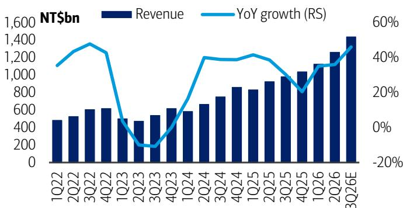  
Source: Company, BofA Global Research estimates  
BofA GLOBAL RESEARCH  
Exhibit 13: Margins further improved in 2Q (GM 68%, OPM 60%); high-margin profile well-expected to continue  
TSMC – Gross margin and OP margin trend

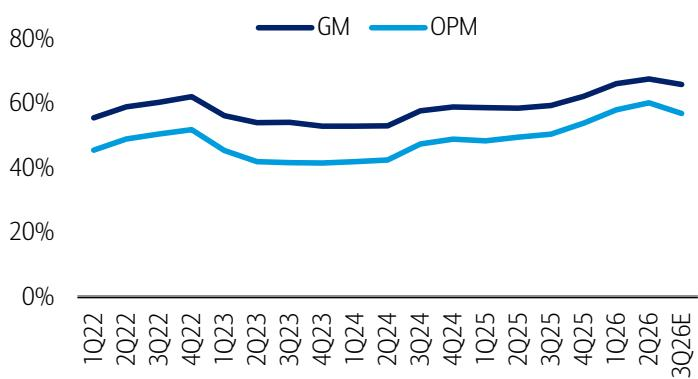  
Source: Company, BofA Global Research estimates  
BofA GLOBAL RESEARCH  
Exhibit 14: TSMC revised up its 2026 annual capex guidance from US\$60-64bn vs US\$56bn previously  
Capex comparison between TSMC and Samsung memory/foundry

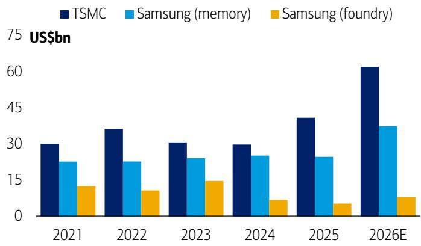  
Source: Companies, BofA Global Research estimates

Exhibit 15: Significant drop in capex-to-sales ratio seen for both TSMC and Samsung due to AI-driven exceptionally robust topline growth
Capex-to-sales comparison – TSMC and Samsung \*memory-only  
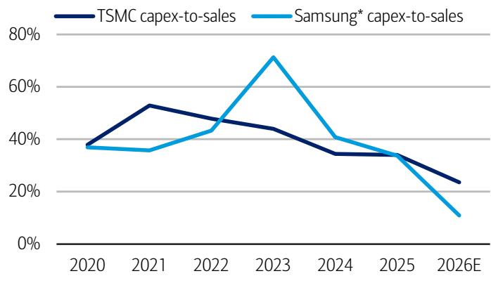  
Source: Companies, BofA Global Research estimates

## ASML's upbeat 2Q results and 2H guidance

Exhibit 16: Upbeat 2Q26 sales (€9.3bn; up 21% YoY) led by stronger-than-expected IBM (installed base management) sales; management's sales guidance indicates robust growth in 2H (3Q: €11.5bn, up 53% YoY / 4Q: €14.4bn, up 48% YoY)

ASML – Total sales and growth trend

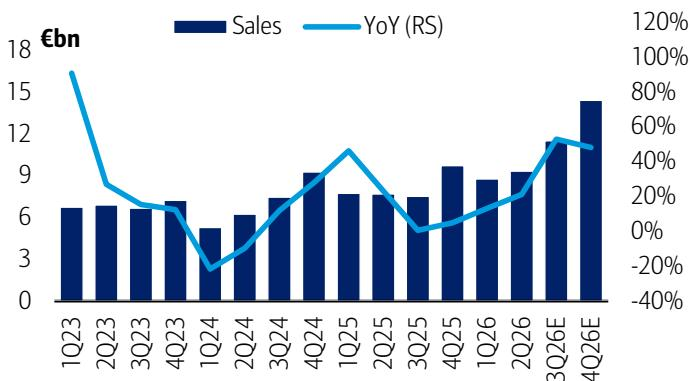  
Source: Company, BofA Global Research estimates  
BofA GLOBAL RESEARCH

Exhibit 17: Strong margins well-observed in 2Q26 (GM $54\%$ , OPM $37\%$ ) and management's guidance indicates robust margins in 2H (GM $55\%+$ , OPM $40\%+$ )  
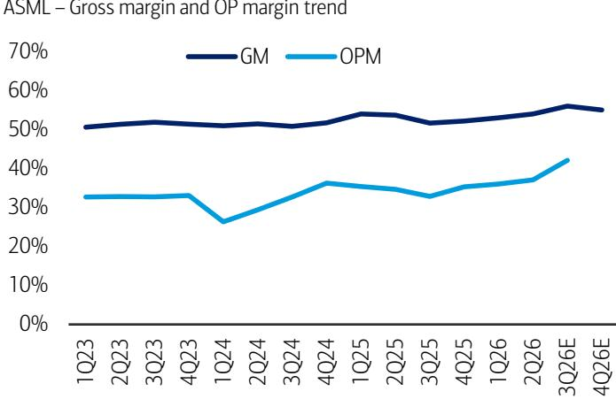  
Source: Company, BofA Global Research estimates  
BofA GLOBAL RESEARCH

Exhibit 18: Memory sales closely catching up to logic during the last three years on the back of DRAM super-cycle
ASML – Net system sales by application – memory vs logic (IDM+foundry)  
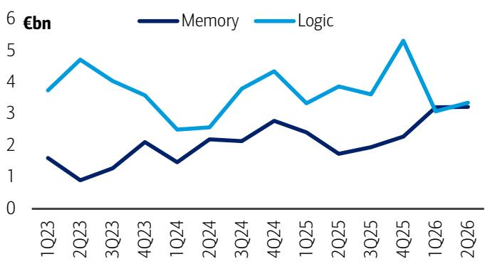

Exhibit 19: Korea accounted for 43% of ASML's net system sales in 2Q26, followed by Taiwan (30%), China (14%), and US (9%) ASML – Net system sales by region  
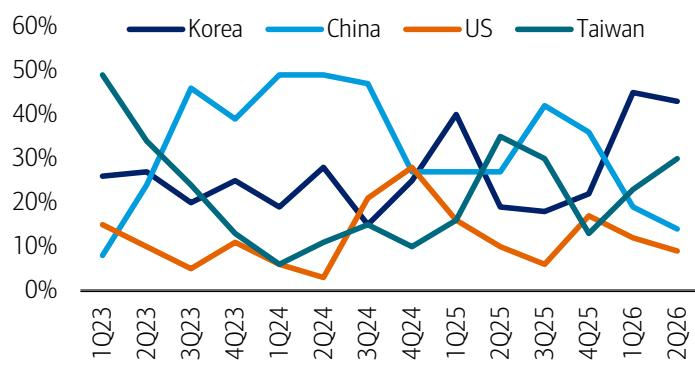

Source: Company

## Korea exports and Taiwan sales

Exhibit 20: MoM growth rate decelerated, but still record-high in July (US\$11.2bn; +1.3% MoM)
Korea semis exports – First 10 days of month US\$bn  
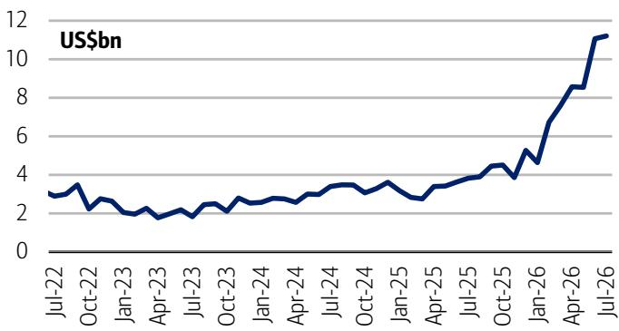  
Source: MoTIR  
BofA GLOBAL RESEARCH

Exhibit 21: YoY rebound still robust at +193% in July; already six consecutive months of triple-digit growth
Korea semis exports – YoY change in first 10 days of month  
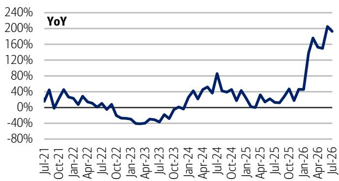  
Source: MoTIR  
BofA GLOBAL RESEARCH

Exhibit 22: Robust MoM growth led by logic/foundry/ODM names including Vanguard (+41%), MediaTek (+22%), Quanta (+24%)  
Taiwan tech companies' MoM monthly sales (Jun-2026)  
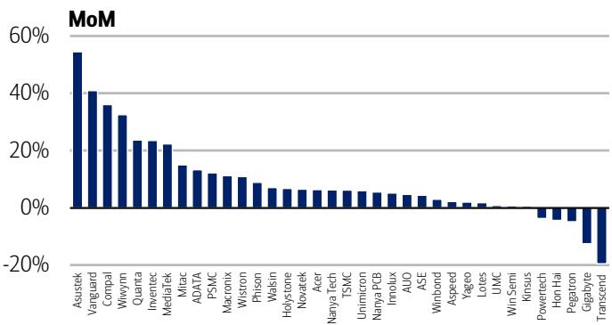  
Source: Companies  
BofA GLOBAL RESEARCH

Exhibit 23: Exceptionally strong YoY rebound led by memory names such as Nanya, Phison, Transcend; TSMC also solid at +68%
Taiwan tech companies' YoY monthly sales (Jun-2026)  
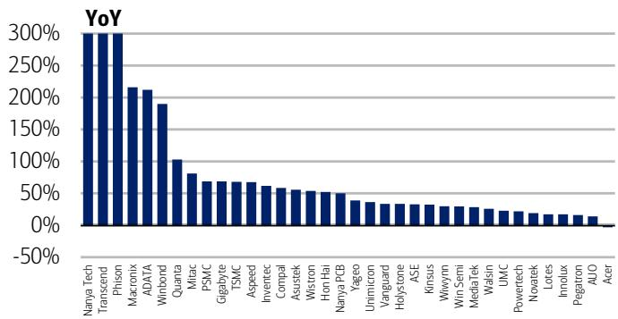

\*Nanya Tech up 621%, Transcend up 382%, Phison up 301%
Source: Companies

China IC imports and smartphone shipments
Exhibit 24: IC imports hit record high at US\$59.6bn in Jun, +72% YoY
China monthly integrated circuit (IC) imports and YoY  
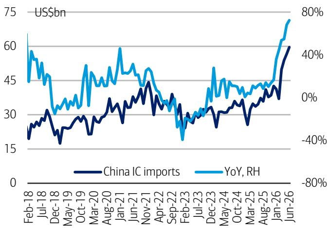  
Source: China General Customs  
BofA GLOBAL RESEARCH

Exhibit 25: China IC imports reached 53.7bn units in Jun, +7% YoY
China monthly integrated circuit (IC) imports volume and YoY  
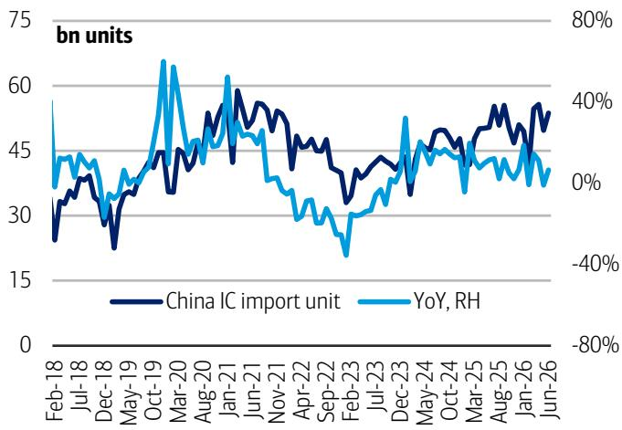  
Source: China General Customs  
BofA GLOBAL RESEARCH

Exhibit 26: Memory imports reached record high at US\$30.8bn in May, accounting for 54% of total imports
China IC imports by chip type  
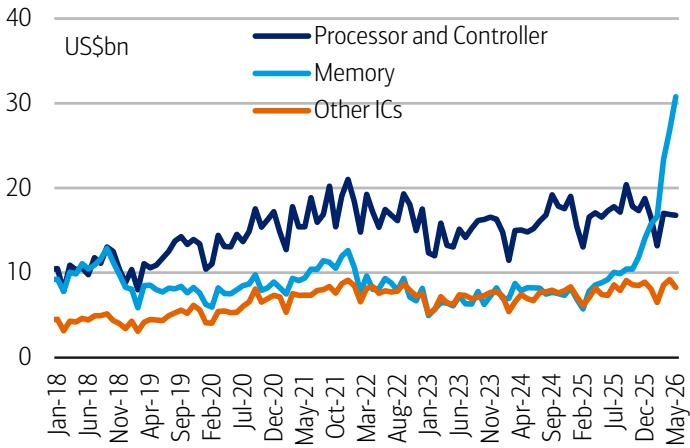  
Source: China General Customs  
BofA GLOBAL RESEARCH

Exhibit 27: Memory monthly imports grew 249% YoY growth during May  
Monthly memory chip imports to China and YoY  
  
Source: China General Customs

Exhibit 28: China smartphone shipments were 26.8mn units in May; well recovered but sustainable growth not yet confirmed
China smartphone – monthly shipment  
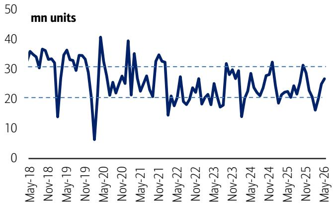  
Source: MIIT/CAICT, BofA Global Research  
BofA GLOBAL RESEARCH

## Exhibit 29: May smartphone shipment +19% YoY despite DRAM shortage

China smartphone – monthly shipment YoY  
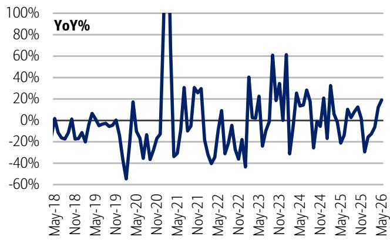  
Source: MIIT/CAICT, BofA Global Research  
BofA GLOBAL RESEARCH  
China smartphone – foreign brands' shipment

Exhibit 30: Implied smartphone shipment by foreign brands 3.7mn units in May

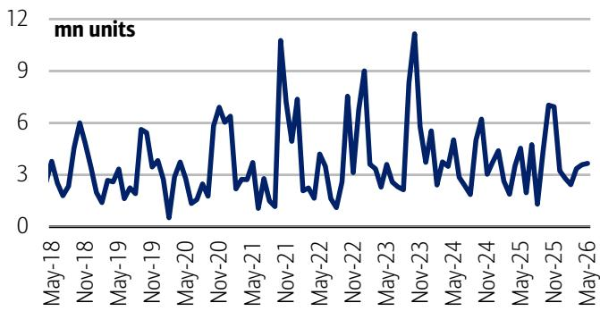  
Source: MIIT/CAICT, BofA Global Research  
BofA GLOBAL RESEARCH

Exhibit 31: Foreign brands shipment dropped 19% YoY in May
China smartphone – foreign brands' shipment YoY  
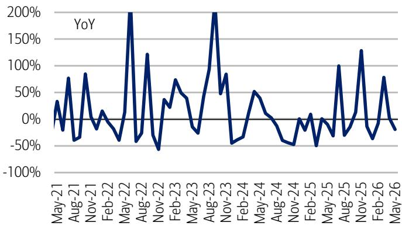  
Source: MIIT/CAICT, BofA Global Research  
BofA GLOBAL RESEARCH  
China smartphone shipments YoY growth

Exhibit 32: China's smartphone shipments down $4.3\%$ in 2Q26, with $19 - 24\%$ YoY growth for Apple and Huawei while $10 - 22\%$ decline for other major brands

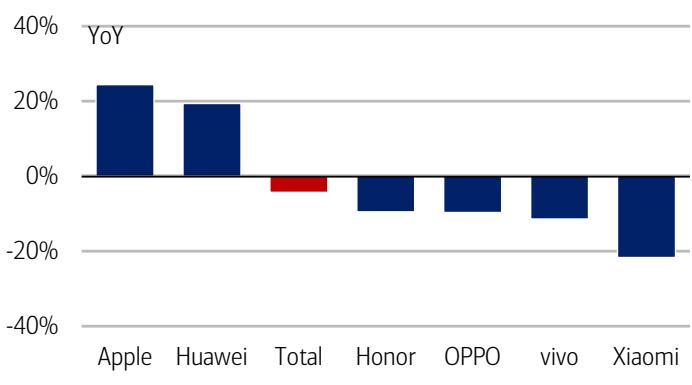  
BofA GLOBAL RESEARCH

Exhibit 33: Huawei saw clear market share gain (23% in 2Q26 vs 18% in 2Q25, followed by Apple
China smartphone market share  
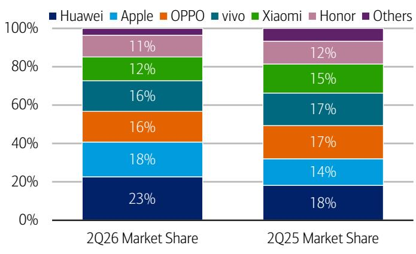  
BofA GLOBAL RESEARCH

## Memory price forecast and spot price short term trend

Exhibit 34: Well rebounded in June-July following April-May corrections; summary rally also possible given tight spot supply DRAM spot price outlook - US\$/16Gb equiv

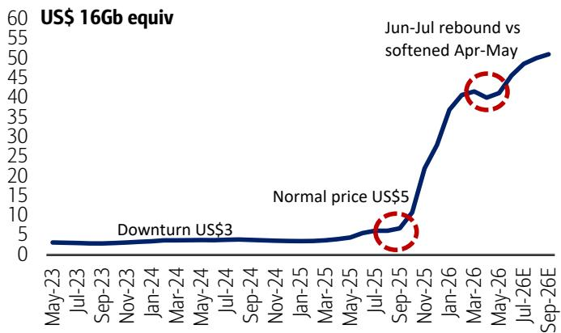  
Source: DRAMeXchange, BofA Global Research estimates  
BofA GLOBAL RESEARCH  
Source: DRAMeXchange, BofA Global Research estimates

Exhibit 36: DDR5 prices reached new highs (\$49) in 1H-July, supported by strong AI-related demand and constrained supply as DRAM makers prioritize HBM production
16Gb DDR5 spot price – daily, Jul'25 - Jul '26  
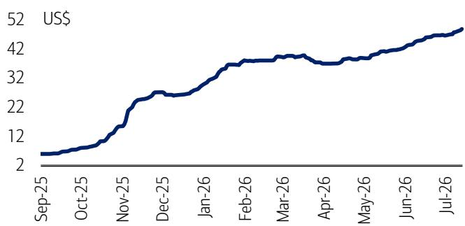  
Source: DRAMeXchange  
BofA GLOBAL RESEARCH

Exhibit 35: Unlike DRAM, NAND spot price has been corrected through June-July; further correction possible through summer but no hardlanding and absolute price still far higher than normal
NAND spot price outlook - US\$/512Gb equiv  
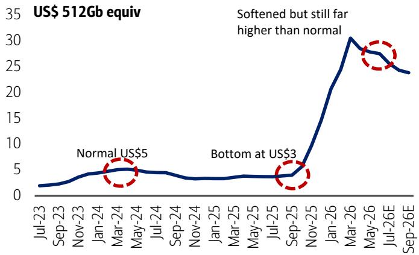  
Exhibit 38: 8Gb DDR4 prices remained firm near highs, driven by production exits and inventory replenishment
8Gb DDR4 spot price trend, Jul'25 - Jul '26  
BofA GLOBAL RESEARCH

Exhibit 37: DDR4 prices remained near cycle highs (\$80), supported by supply cuts and customer restocking, with a brief correction in May before recovering through June and 1H-July
16Gb DDR4 spot price trend, Jul'25 - Jul '26  
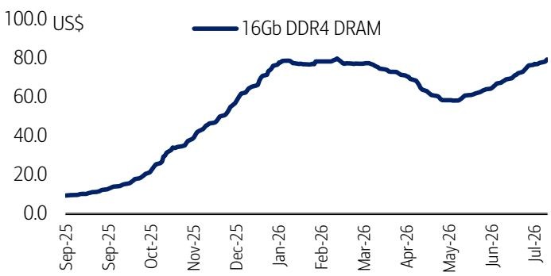  
Source: DRAMeXchange

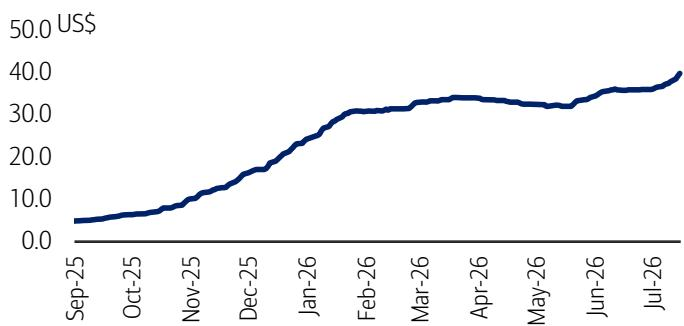  
BofA GLOBAL RESEARCH  
Source: DRAMeXchange  
BofA GLOBAL RESEARCH

Exhibit 39: NAND wafer pricing rose to elevated levels, through 4Q25-1Q26, on tight supply and stronger SSD demand, but has flattened/slightly softened through 2Q26 and 1H-Jul 512Gb NAND wafer spot price – weekly, Jun'25 - Jun '26  
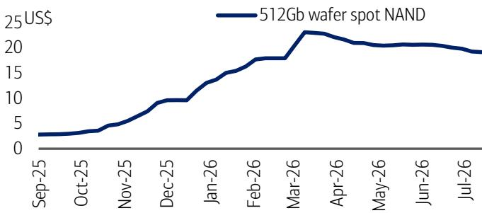  
Source: DRAMeXchange  
BofA GLOBAL RESEARCH

## Memory spot/contract price long term trend

Exhibit 40: DRAM spot prices rebounded through June after softening through April–May, following a strong rally from September 2025 to January 2026. Prices have reached multi-decade highs, with 16Gb DDR5 at \~\$49 and DDR4 at \~\$80, driven by supply reallocation toward HBM and server DRAM—well above the prior \~\$10 peak in October 2017.

DRAM spot price – long-term trend (2000-2025)

  
Source: DRAMeXchange  
BofA GLOBAL RESEARCH  
Exhibit 41: DRAM spot and contract prices climbed to record highs of \~\$35–40, with moderate growth in 2Q26 following a strong rally in 4Q25 and 1Q26.  
DRAM spot and contract price - quarterly average trend

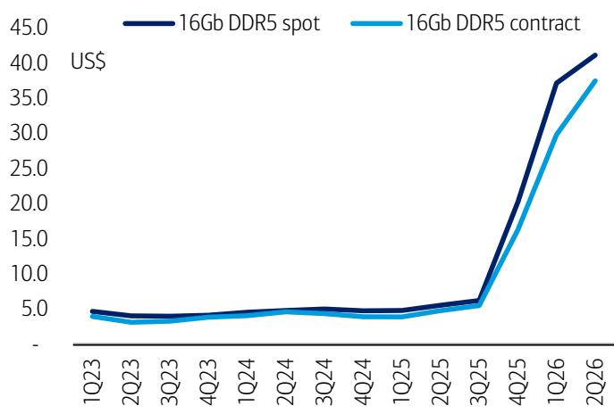  
Source: DRAMeXchange, TrendForce  
BofA GLOBAL RESEARCH  
Exhibit 42: NAND wafer contract prices have surged significantly ahead of spot prices, with both now at record-high levels
NAND wafer spot and contract price - quarterly average trend

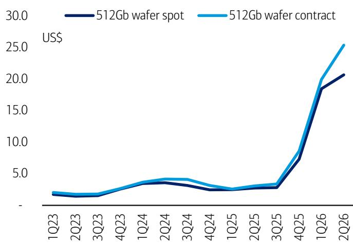  
Source: DRAMeXchange, TrendForce  
BofA GLOBAL RESEARCH

Exhibit 43: Prices rebounded through May/June/1H-Jul, reaching an all-time high (\$49). Uptrend was driven by strong gains in Oct (+70%), Nov (+60%), Jan (+25%), before moderating into a more subdued trend during Feb–Apr

16Gb DDR5 spot price – daily, Nov '23 - Jul '26

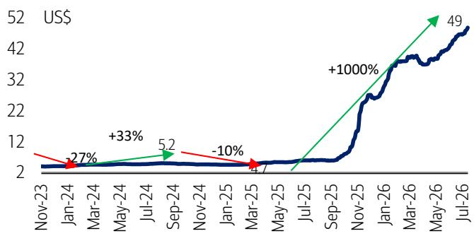  
Source: DRAMeXchange  
BofA GLOBAL RESEARCH  
Exhibit 45: 8Gb DDR4 spot prices reached a record high of \~\$40 in 1H-July, well above the prior \~\$10 peak in October 2017, driven by ongoing supply cuts from major vendors
8Gb DDR4 spot price trend, Nov '23 - Jul '26

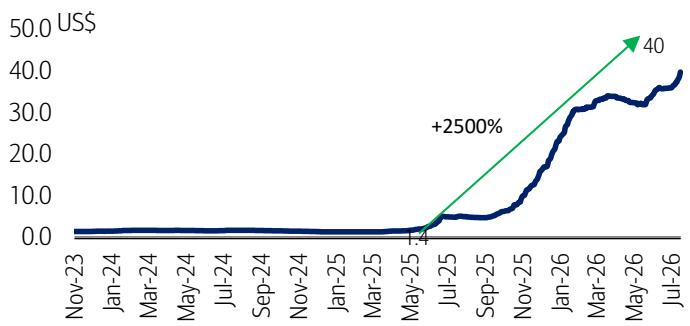  
Source: DRAMeXchange  
BofA GLOBAL RESEARCH  
Exhibit 47: DDR4 and DDR5 (16Gb) contract prices are similar at US\$35-\$40 levels – DDR5 price premium no longer exists due to DDR4 shortage  
16Gb DDR5 vs 16Gb DDR4 contract price trend, Mar '23-Jul '26

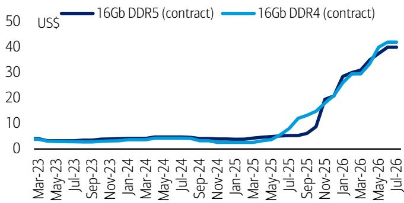  
Contract price update for Jul-26 is TrendForce estimate released on $15^{\text{th}}$ Jul Source: TrendForce  
Exhibit 44: Modest uptick observed in May/Jun/1H-Jul (+6-10%), following a sequential slowdown from Feb (+10%) to flat momentum in Mar and a minor decline in Apr, after the strong Jan (+25%) surge and the sharp Oct-Nov-25 rally (+60–120%) 16Gb DDR5 spot month-average price – MoM change, Nov '23 - Jul '26

BofA GLOBAL RESEARCH

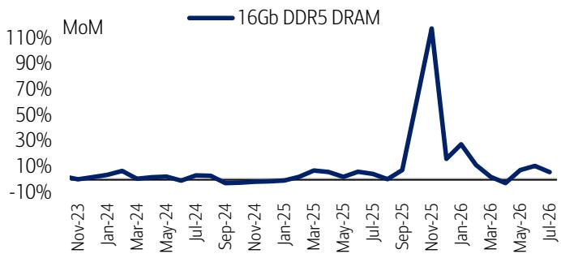  
Source: DRAMeXchange  
BofA GLOBAL RESEARCH  
Exhibit 46: Prices rebounded to record highs in late May–1H-July after a \~25% April–mid-May correction, remaining \~2000% above the October 2025 low (\~\$3)  
16Gb DDR4 spot price trend, Jul '23 - Jul '26

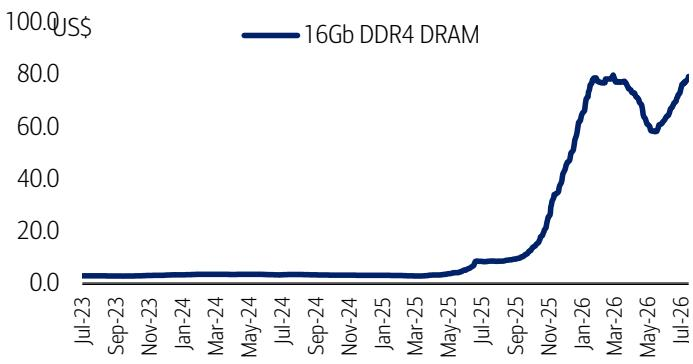  
Source: DRAMeXchange  
BofA GLOBAL RESEARCH  
Exhibit 48: DDR5 and DDR4 contract prices expected to be flat MoM in Jun/Jul vs up +10-15% MoM each in Apr/May-26; price strong through 2H25 and early 2026  
16Gb DDR5 vs 16Gb DDR4 contract price change - MoM, Mar ‘23-Jul ‘26

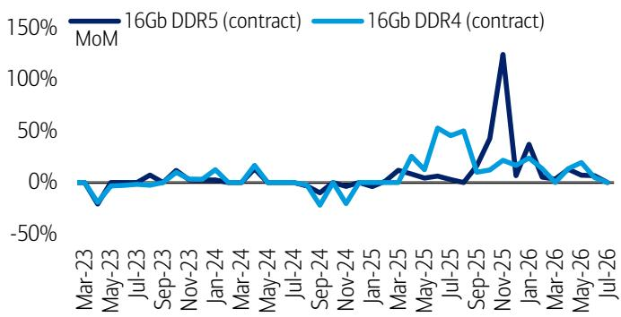  
Contract price update for Jul-26 is TrendForce estimate released on $15^{\text{th}}$ Jul Source: TrendForce

Exhibit 49: NAND spot prices remained broadly stable to slightly weaker through 1Q26 and 1H-Jul, but still stand more than 50% YTD and nearly 8x higher than the Feb-25 trough
512Gb NAND wafer spot price – weekly, Apr '21 - Jul '26  
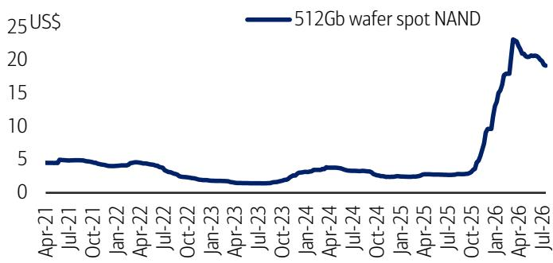  
Source: DRAMeXchange  
BofA GLOBAL RESEARCH  
NAND wafer contract price trend, Sep '23-Jul '26

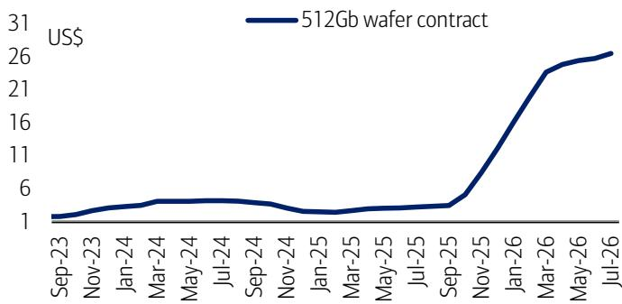  
Contract price update for Jul-26 is TrendForce estimate released on 15 $^{th}$ Jul Source: TrendForce, DRAMeXchange, BofA Global Research  
BofA GLOBAL RESEARCH

Exhibit 53: 16Gb DDR5 spot and contract prices are in the range of US\$35-40 vs historical range of US\$3-5  
16Gb DDR5 spot vs contract price trend (US\$), Sep '23-Jul '26  
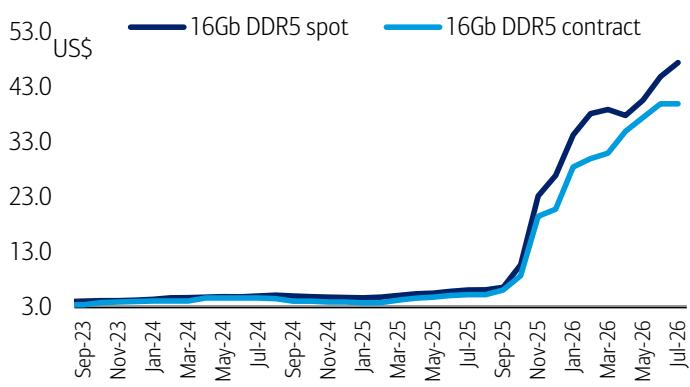  
Contract price update for Jul-26 is TrendForce estimate released on 15 $^{th}$ Jul Source: DRAMeXchange, TrendForce  
BofA GLOBAL RESEARCH  
Exhibit 50: Prices were largely flat in June and slightly lower in 1H-July, following the April–May correction, compared with gains of 15–20% in Feb–Mar 2026 and 40–70% MoM increases during Oct 2025–Jan 2026  
Exhibit 52: Apr/May/Jun/Jul price only up +1-5% MoM each following Jan/Feb/Mar-26 rally (up 20-30% MoM) and Oct/Nov/Dec upturn (up 40-60% MoM)

Exhibit 51: Current contract price at \~\$26, around 10x vs Feb-25 bottom of \$2.5; prices significantly up in 4Q25/1Q26 and remained broadly stable thereafter  
512Gb NAND wafer spot average – MoM change, Jul'21 - Jul'26  
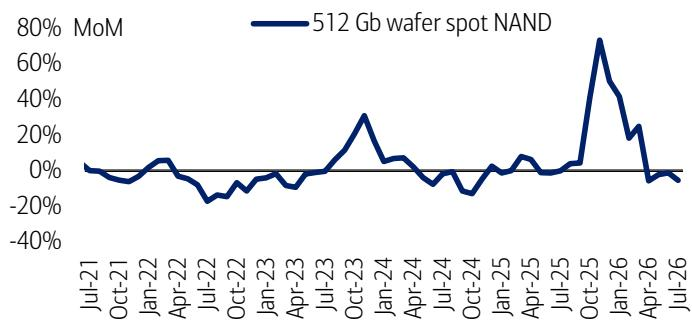  
Source: DRAMeXchange  
BofA GLOBAL RESEARCH  
MoM change of NAND contract price (512Gb wafer Sep '23-Jul '26

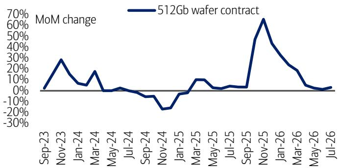  
Contract price update for Jul-26 is TrendForce estimate released on $15^{\text{th}}$ Jul Source: DRAMeXchange, TrendForce, BofA Global Research  
BofA GLOBAL RESEARCH  
Exhibit 54: Jun-26 spot and contract prices turned positive again after Feb-Mar moderation, while Jul spot price rose, contract remained stable; prices had witnessed a sharp Oct–Dec'25 rally 16Gb DDR5 spot vs contract price trend – MoM change, Sep '23-Jul '26

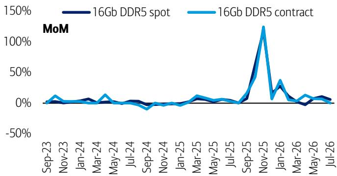  
Contract price update for Jul-26 is TrendForce estimate released on 15 $^{th}$ Jul Source: DRAMeXchange, TrendForce

Exhibit 55: Current NAND spot and contract prices are a few times higher than 2025 summer level

512Gb NAND wafer spot vs contract price trend (US\$), Jul '19 - Jul '26

![](images/6bda1bf68f2495d2d30a7a41bb
