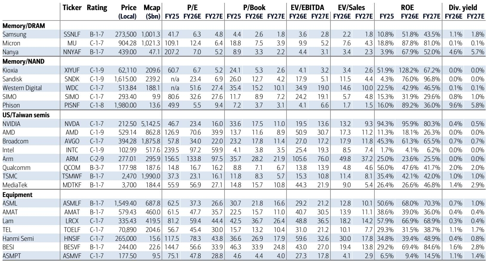
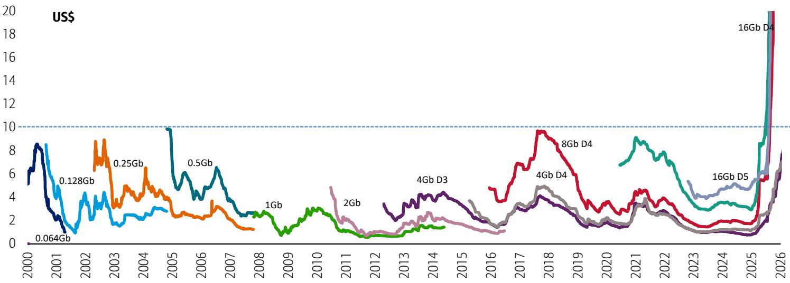
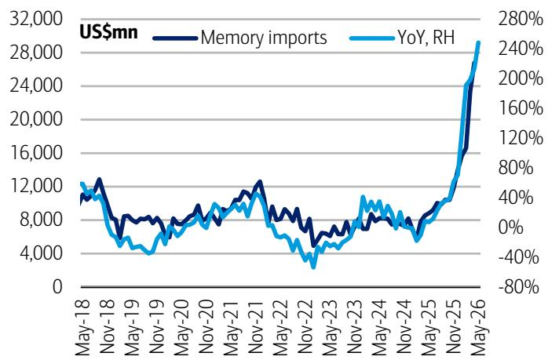

# 关于DRAM市场周期的观察：三季度定价趋势分析

对于关注半导体领域的研究者而言，2026年中期的一个关键问题是：存储周期是否已经转向。市场普遍观点，如TrendForce发布的预测，认为DRAM平均售价将从二季度58-63%的环比增长，大幅放缓至三季度的13-18%。这种快速回归常态的叙事可能并不准确。通过对新谈判的三季度DRAM合约价格的详细渠道调研，可以看到不同的图景：服务器DRAM定价环比上涨20-30%，DDR5和传统DDR4的现货需求都在加速，OEM的紧急订单确认了定价能力高于市场普遍预期。全球三季度DRAM ASP环比增长21%的预测并非乐观估计，而是一个下限。

这一分歧出现的时机值得关注，因为它与两个市场低估的催化因素相吻合。台积电二季度业绩显示，销售额达400亿美元，营业利润率60%，同时公布了2026年600-640亿美元的创纪录资本支出指引，以及单独的1000亿美元美国制造投资承诺。ASML的二季度业绩和指引同样积极，管理层对新的AI芯片需求和高数值孔径EUV的采用表达了乐观看法。这些发展对存储领域有直接正面影响，因为台积电的客户需要更先进的HBM、SOCAMM和企业级SSD。存储周期并未消退，而是在AI基础设施建设的推动下被结构性延长。

本文提出三个观点。第一，三季度DRAM定价走势强于普遍预期，这是由需求结构向高速高带宽产品转变所驱动。第二，现货市场正在发出积极信号，合约价格将跟随而非反向。第三，台积电和ASML的资本支出与技术路线图，为存储创造了超越单一产品周期的需求拉动机制。建议读者对市场普遍预期的减速叙事保持审慎，并相应调整对三季度的预期。

## 服务器DRAM与HBM4产品组合转变推动20-30%的环比价格上涨

从合约价格调研中最具体的发现是，服务器DRAM定价环比上涨20-30%，由高速LPDDR5引领。这超过了市场普遍预期的20%或更低。其机制并非简单的供应紧张，而是产品组合效应。OEM正在将采购组合转向更高价格的HBM4，而非更便宜的HBM3e代产品，且这一转变比预期更早发生。长期协议量目前占DRAM总销售额的比例远低于50%，这意味着60-70%的销量以非LTA方式定价，其中5-10%的环比价格增长正在常规化。即使在LTA内部，价格也在上涨。

这意味着TrendForce对三季度传统DRAM ASP 13-18%的预测，是基于对产品组合的过时看法。当包含HBM时，TrendForce的综合估计降至8-13%。但渠道证据指向相反方向：HBM溢价正在扩大而非压缩，向HBM4的销量转移正在加速。全球综合ASP达到21%与数据一致，如果服务器需求保持当前轨迹，还存在上行空间。

## 现货价格连续八周上涨，OEM开始以紧急订单方式采购

现货市场的情况与两三个月前相比已完全逆转。当时，市场情绪认为16Gb DDR5在35-40美元价位已无进一步上行空间，且现货价格已超过HBM价格——这在历史上通常预示着顶部。然而，现货价格已连续八周上涨，DDR5和DDR4均指向约20%的环比增长。1Tb NAND现货价格周环比回升4%，这是一个积极信号，表明三季度NAND ASP将超过10%。

OEM的行为是最具指示性的信号。今年早些时候，许多OEM通过减少PC、平板和智能手机的生产来抵制DRAM现货上涨，当时它们采购DRAM的价格约为每单位5美元。这种抵制已经瓦解。OEM现在正在购买更多存储芯片，为9月出货和四季度旺季做准备。由于现货交易量仅占全球供应量的个位数百分比，一些OEM正在以紧急订单方式采购传统DRAM，这确认了DRAM和NAND均超过20%的环比价格上涨。

这不是投机性泡沫。这是一个由需求驱动的补库存周期，得到了为AI设备和服务器更新做准备的真实终端市场支持。现货市场正在引领而非滞后于合约定价。

## 台积电资本支出激增与ASML技术路线图创造多季度需求拉动

台积电的二季度业绩和指引对存储领域是直接的正面催化剂，而不仅限于逻辑芯片。2026年创纪录的600-640亿美元资本支出，加上1000亿美元的美国工厂投资，表明台积电的客户正在积极扩大AI芯片生产。这些客户需要先进的HBM、SOCAMM和企业级SSD。每台AI服务器的存储含量已经是传统服务器的数倍，且随着HBM4进入量产，这一比例还在增加。

ASML的二季度业绩从设备角度强化了这一逻辑。管理层对新的AI芯片需求和高数值孔径EUV采用的乐观看法，意味着逻辑和代工客户正在为未来节点订购产能。对存储而言，积极的传导是ASML的销售正变得更加以台湾和逻辑为中心，而对中国出口的减少降低了来自本地芯片制造商的产能过剩风险。缺乏中国主导的供应过剩，消除了存储定价的一个关键下行风险。

台积电的需求拉动与ASML的技术赋能之间的相互作用，创造了存储周期的结构性延长。AI推理工作负载受限于存储带宽，每一代HBM都需要更先进的封装和更高速度的接口。这不是一个季度的现象。

## 三季度研究框架

建议从三个维度评估对存储领域的关注。首先，评估产品组合的敏感性。对服务器DRAM和HBM有较高敞口的公司，将比那些与商品化NAND或传统DRAM相关的公司受益更多。定价数据显示，高端产品的溢价正在扩大。

其次，关注现货与合约价格的收敛。当前现货价格已隐含20%的环比增长。如果合约价格在此水平或以上达成，市场对三季度存储收入的普遍预期将需要上调。风险不在于定价令人失望，而在于预期过低。

第三，观察OEM的补库存周期。7月观察到的紧急订单行为表明，相对于9月和四季度生产计划，OEM的库存水平偏低。如果这种补库存从DRAM扩展到NAND，三季度NAND ASP可能超过当前10-15%的普遍预期范围。7月的NAND现货数据已显示出这种扩展的早期迹象。

研究启示是清晰的：存储周期尚未见顶。它正在从供应驱动的复苏过渡到需求驱动的扩张，而来自台积电、ASML和OEM采购的需求信号强于市场普遍认知。关注三季度DRAM ASP上行可能性的研究者，将领先于预期修正周期。

*仅供参考。部分内容可能基于源材料通过AI辅助生成、翻译、总结或编辑，可能存在遗漏或错误。请独立核实。本文不构成专业建议。*

仅供参考。部分内容可能基于源材料通过AI辅助生成、翻译、总结或编辑，可能存在遗漏或错误。请独立核实。本文不构成专业建议。

