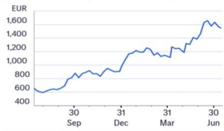
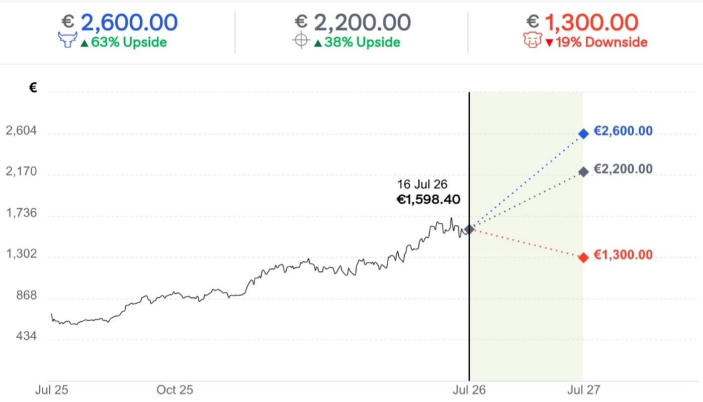

# ASML Holding NV (ASML.AS)

# AI Demand Extends Visibility into 2028; Raising Target to €2,200

## CITI'S TAKE

ASML's Q2 reinforces our view that the AI-driven semiconductor investment cycle remains in its early stages, with demand strength across both advanced logic and memory, and meaningful 2027 and 2028 orders already in hand. The combination of rising lithography intensity, accelerating memory capex, improving pricing power, and increasing customer visibility supports a multi-year growth outlook, prompting us to materially raise estimates and increase target to €2,200 while retaining our positive view and Focus List inclusion.

Momentum continues into 2027 and 2028 — ASML continues to benefit from strong AI-driven semiconductor demand and improving customer visibility, driving a significant increase to 2026 guidance. Leading-edge foundry expansion and strong HBM/DRAM-driven memory capex are supporting EUV demand. ASML expects logic sales growth of over 25% and memory growth of over 75% this year.

Order visibility has improved dramatically — ASML indicated 2027 Low-NA EUV capacity is nearly fully booked and is already receiving meaningful 2028 orders, supporting plans to expand Low-NA EUV and DUV capacity by 30% in 2027 with a further 30% increases possible in 2028. We now forecast 67 Low-NA EUV and 130 DUV immersion units in 2026, rising to 86 / 170 in 2027, with a further increase in 2028. Our system sales forecasts move up 16–45% in 2026–28 driven by the higher unit forecasts, particularly from memory players, coupled with higher ASPs.

Margins and pricing are improving — Tight capacity and strong demand are supportive of long-term pricing power. Management highlighted ongoing value-based pricing discussions, with further upside expected as higher-productivity EUV systems and High-NA EUV become a larger share of the mix. Combined with upgrade demand and operating leverage, this supports a positive margin outlook. High-NA progress continues as Intel confirms volume production on 18A.

Material upgrade to estimates; Target to €2,200 — We adjust our 2026–28 sales up 14–36% and EPS up 25–52% driven by our higher forecasts of Low-NA EUV and DUV units and ASP. Accordingly, our target moves to €2,200 (from €1,675) driven by 28x PE or 1x PEG based on 2028 earnings (from 39x 2027 PE). Retain positive view and Focus List.

ASML Holding NV (EUR)

<table><tr><td>Year to 31 Dec</td><td>2024A</td><td>2025A</td><td>2026E</td><td>2027E</td><td>2028E</td></tr><tr><td>Sales (€M)</td><td>28,262.9</td><td>32,667.3</td><td>44,741.9</td><td>58,849.1</td><td>73,374.6</td></tr><tr><td>Net Income (€M)</td><td>7,571.6</td><td>9,609.4</td><td>15,617.4</td><td>22,737.6</td><td>29,814.5</td></tr><tr><td>Diluted EPS (€)</td><td>19.24</td><td>24.72</td><td>40.42</td><td>59.10</td><td>78.05</td></tr><tr><td>Diluted EPS (Old) (€)</td><td>19.24</td><td>24.72</td><td>32.29</td><td>42.67</td><td>51.25</td></tr><tr><td>PE (x)</td><td>83.1</td><td>64.7</td><td>39.5</td><td>27.0</td><td>20.5</td></tr><tr><td>EV/EBITDA (x)</td><td>61.8</td><td>49.5</td><td>31.5</td><td>21.5</td><td>16.0</td></tr><tr><td>DPS (€)</td><td>6.40</td><td>7.50</td><td>8.63</td><td>9.92</td><td>11.41</td></tr><tr><td>Net Div Yield (%)</td><td>0.4</td><td>0.5</td><td>0.5</td><td>0.6</td><td>0.7</td></tr></table>

## Positive View

Price (16 Jul 26 16:30) €1,598.40

Target price €2,200.00↑

Expected share price return 37.6%

Expected dividend yield 0.4%

Expected total return 38.1%

Market Cap €620,415M

## Price Performance

## (RIC: ASML.AS, BB: ASML NA)

Andrew M. Gardiner, CFA $^{AC}$ +44-20-7986-4206
andrew.gardiner@citi.com

Pavan Daswani, CFA
+44-20-7986-6889
pavan.daswani@citi.com € 1,300.00
▼19% Downside

Figure 1. Key changes in our estimates

<table><tr><td>Dec FY, € m</td><td colspan="3">2026E</td><td colspan="3">2027E</td><td colspan="3">2028E</td></tr><tr><td></td><td>New</td><td>Old</td><td>Δ%</td><td>Citi</td><td>Old</td><td>Δ%</td><td>New</td><td>Old</td><td>Δ%</td></tr><tr><td>Group revenue</td><td>44,742</td><td>39,262</td><td>14%</td><td>58,849</td><td>47,633</td><td>24%</td><td>73,375</td><td>53,942</td><td>36%</td></tr><tr><td>Operating Income</td><td>18304</td><td>14401</td><td>27%</td><td>26782</td><td>19029</td><td>41%</td><td>35182</td><td>22753</td><td>55%</td></tr><tr><td>Diluted EPS (€)</td><td>40.42</td><td>32.29</td><td>25%</td><td>59.10</td><td>42.67</td><td>38%</td><td>78.05</td><td>51.25</td><td>52%</td></tr><tr><td>Other KPIs</td><td></td><td></td><td></td><td></td><td></td><td></td><td></td><td></td><td></td></tr><tr><td>Net System Sales</td><td>34,280</td><td>29,564</td><td>16%</td><td>46,521</td><td>36,188</td><td>29%</td><td>59,506</td><td>41,066</td><td>45%</td></tr><tr><td>Installed Base Management</td><td>10,462</td><td>9,698</td><td>8%</td><td>12,328</td><td>11,445</td><td>8%</td><td>13,869</td><td>12,876</td><td>8%</td></tr><tr><td>Gross margin (%)</td><td>55.0%</td><td>52.1%</td><td>291 bps</td><td>56.6%</td><td>52.9%</td><td>370 bps</td><td>57.6%</td><td>54.6%</td><td>303 bps</td></tr></table>

## Bull/Bear: ASML Holding NV (ASML.AS)

  
Spread 81pp Current Price and expected returns (upside/downside) as of 16 Jul 2026

## BULL Assumptions

\- Macro backdrop: Inflation proves less entrenched and moderation of banking stresses

• CY26E revenue: >30% growth in logic system sales and >100% growth in memory system sales

\- \~1.3x PEG based on FY28 earnings

## BASE Assumptions

\- Macro backdrop: A series of rolling country-level recessions and moderation of banking stresses

\- Base case revenue and EPS aligned with our underlying financial model

## BEAR Assumptions

\- Macro backdrop: Elevated concerns associated with banking stresses resulting in meaningful moderation of global GDP growth

• CY26 revenue: limited growth in logic system sales and memory system sales

\- \~0.6x PEG based on FY28 earnings

## ASML Holding NV

## Company description

ASML develops, manufactures, and markets photolithography projection systems used in integrated circuit semiconductor manufacturing. Since its founding in 1984, ASML has grown rapidly to become the world's top 3 semiconductor equipment company and the largest manufacturer of photolithography scanner systems.

## Research perspective

Our positive view on ASML is based on three premises: 1) faster digital transformation, and in particular the rise of Artificial Intelligence of Things (AIoT), driving increased demand; 2) higher operational profitability, primarily as EUV matures and its share becomes significant across both systems and installed base management; and 3) stronger computational platform of semiconductor fabrication leveraging Big Data.

## Valuation

We value ASML using a 28x 2028 or 1x PEG based on FY28 earnings, in line with other strong growth companies in our coverage, which leads to our target price of EUR 2,200. We continue to have conviction in ASML's long-term growth outlook, as evident in our forecast of a $30\%$ CAGR in EPS through 2030E. Given our strong multi-year growth forecast for ASML, we look further out than 2026 to capture the growth potential. We think this approach better captures its long-term exposure to artificial intelligence, semiconductor capex, and other structural growth areas.

## Risks

We highlight the following risk factors for ASML. If the impact of these risk factors is more or less negative than we anticipate, the share price could deviate significantly from our target price:

Technological: Challenges in development of EUV technology could result in delays and lower margins.

Competition: A gain/loss in lithography and/or process control market share would result in upside/downside risk to our estimates.

Customer Risk: ASML derives a significant share of its revenues from a few large customers, and an increase/cut in their capex could result in risk to our estimates.

Macroeconomic: A weak macroeconomic environment and/or escalation in geopolitical tensions resulting in subdued semiconductor growth/increase in cadence could cause downside to our estimates.

If you are visually impaired and would like to speak to a Citi representative regarding the details of the graphics in this document, please call USA 1-888-500-5008 (TTY: 711), from outside the US +1-210-677-3788

## Appendix A-1

## ANALYST CERTIFICATION

The research analysts primarily responsible for the preparation and content of this research report are either (i) designated by "AC" in the author block or (ii) listed in bold alongside content which is attributable to that analyst. If multiple AC analysts are designated in the author block, each analyst is certifying with respect to the entire research report other than (a) content attributable to another AC certifying analyst listed in bold alongside the content and (b) views expressed solely with respect to a specific issuer which are attributable to another AC certifying analyst identified in the price charts or rating history tables for that issuer shown below. Each of these analysts certify, with respect to the sections of the report for which they are responsible: (1) that the views expressed therein accurately reflect their personal views about each issuer and security referenced and were prepared in an independent manner, including with respect to Citi Global Markets Inc. and its affiliates; and (2) no part of the research analyst's compensation was, is, or will be, directly or indirectly, related to the specific recommendations or views expressed by that research analyst in this report.

## IMPORTANT DISCLOSURES

## ASML Holding NV (ASML.AS)

Analyst: Andrew M. Gardiner, CFA

<table><tr><td></td><td>Date</td><td>Rating</td><td>Target Price</td><td>Closing Price</td></tr><tr><td>1</td><td>15-Dec-23 00:00:00</td><td>1</td><td>*900.00</td><td>694.70</td></tr><tr><td>2</td><td>12-Apr-24 00:00:00</td><td>1</td><td>*1,250.00</td><td>907.50</td></tr><tr><td>3</td><td>18-Sep-24 00:00:00</td><td>1</td><td>*1,150.00</td><td>715.00</td></tr><tr><td>4</td><td>17-Oct-24 01:07:32</td><td>1</td><td>*930.00</td><td>634.20</td></tr></table>

\*Indicates Change

<table><tr><td colspan="2">Date</td><td>Rating</td><td>Target Price</td><td>Closing Price</td></tr><tr><td></td><td>5 17-Apr-25 11:23:20</td><td>1</td><td>*860.00</td><td>564.20</td></tr><tr><td></td><td>6 16-Jul-25 18:41:06</td><td>1</td><td>*825.00</td><td>625.80</td></tr><tr><td></td><td>7 07-Oct-25 00:06:11</td><td>1</td><td>*1,050.00</td><td>874.80</td></tr><tr><td></td><td>8 10-Dec-25 00:00:00</td><td>1</td><td>*1,200.00</td><td>946.00</td></tr></table>

<table><tr><td colspan="2">Date</td><td>Rating</td><td>Target Price</td><td>Closing Price</td></tr><tr><td>9</td><td>20-Jan-26 00:00:00</td><td>1</td><td>*1,400.00</td><td>1,140.00</td></tr><tr><td>10</td><td>29-Jan-26 00:00:00</td><td>1</td><td>*1,600.00</td><td>1,192.00</td></tr><tr><td>11</td><td>16-Apr-26 00:00:00</td><td>1</td><td>*1,675.00</td><td>1,222.60</td></tr></table>

Rating/target price changes above reflect Eastern Time

<table><tr><td></td><td>Date</td><td>Action</td><td>Expected Direction</td><td>Duration</td><td>Closing Price</td></tr><tr><td>1</td><td>15-Oct-23 21:48:46</td><td>Add CW</td><td>Upside</td><td>30 Days</td><td>573.60</td></tr><tr><td>2</td><td>15-Nov-23 05:34:57</td><td>Remove CW</td><td>Upside</td><td>30 Days</td><td>627.80</td></tr><tr><td>3</td><td>21-Jan-24 19:00:00</td><td>Add CW</td><td>Upside</td><td>30 Days</td><td>686.30</td></tr><tr><td>4</td><td>21-Feb-24 05:35:09</td><td>Remove CW</td><td>Upside</td><td>30 Days</td><td>834.00</td></tr><tr><td>5</td><td>11-Apr-24 20:00:00</td><td>Add CW</td><td>Upside</td><td>30 Days</td><td>909.10</td></tr><tr><td>6</td><td>10-May-24 12:08:52</td><td>Remove CW</td><td>Upside</td><td>30 Days</td><td>864.50</td></tr><tr><td>7</td><td>05-Jul-24 14:09:25</td><td>Add CW</td><td>Upside</td><td>90 Days</td><td>993.00</td></tr></table>

CW - Catalyst Watch, STV - Short-Term View

<table><tr><td></td><td>Date</td><td>Action</td><td>Expected Direction</td><td>Duration</td><td>Closing Price</td></tr><tr><td>8</td><td>30-Sep-24 23:33:40</td><td>Remove CW</td><td>Upside</td><td>90 Days</td><td>745.60</td></tr><tr><td>9</td><td>01-Oct-24 20:00:00</td><td>Add CW</td><td>Upside</td><td>90 Days</td><td>741.80</td></tr><tr><td>10</td><td>15-Oct-24 07:27:39</td><td>Remove CW</td><td>Upside</td><td>90 Days</td><td>668.10</td></tr><tr><td>11</td><td>14-Nov-24 20:44:40</td><td>Add STV</td><td>Upside</td><td>90 Days</td><td>671.60</td></tr><tr><td>12</td><td>29-Jan-25 20:23:53</td><td>Remove STV</td><td>Upside</td><td>90 Days</td><td>682.50</td></tr><tr><td>13</td><td>30-Mar-25 21:17:09</td><td>Add CW</td><td>Upside</td><td>90 Days</td><td>625.60</td></tr><tr><td>14</td><td>17-Apr-25 07:23:20</td><td>Remove CW</td><td>Upside</td><td>90 Days</td><td>564.20</td></tr></table>

<table><tr><td rowspan="2" colspan="2">Date</td><td>Action</td><td>ExpectedDirection</td><td>Duration</td><td>ClosingPrice</td></tr><tr><td>Add STV</td><td>Upside</td><td>90 Days</td><td>677.60</td></tr><tr><td>15</td><td>02-Jul-25 20:00:00</td><td></td><td></td><td></td><td></td></tr><tr><td>16</td><td>16-Jul-25 14:41:06</td><td>Remove STV</td><td>Upside</td><td>90 Days</td><td>625.80</td></tr><tr><td>17</td><td>06-Oct-25 20:06:11</td><td>Add STV</td><td>Upside</td><td>30 Days</td><td>897.30</td></tr><tr><td>18</td><td>06-Nov-25 05:35:31</td><td>Remove STV</td><td>Upside</td><td>30 Days</td><td>895.30</td></tr><tr><td>19</td><td>28-Jan-26 19:00:00</td><td>Add STV</td><td>Upside</td><td>90 Days</td><td>1,194.40</td></tr><tr><td>20</td><td>06-Apr-26 20:00:00</td><td>Remove STV</td><td>Upside</td><td>90 Days</td><td>1,161.00</td></tr></table>

Rating/target price changes above reflect Eastern Time

Citi Global Markets Inc. or its affiliates received compensation for products and services other than investment banking services from ASML Holding NV in the past 12 months.

Citi Global Markets Inc. or its affiliates currently has, or had within the past 12 months, the following as clients, and the services provided were non-investment-banking, securities-related: ASML Holding NV.

Citi Global Markets Inc. or its affiliates currently has, or had within the past 12 months, the following as clients, and the services provided were non-investment-banking, non-securities-related: ASML Holding NV.

Citi Global Markets Inc. and/or its affiliates has a significant financial interest in relation to ASML Holding NV. (For an explanation of the determination of significant financial interest, please refer to the policy for managing conflicts of interest which can be found at www.citiVelocity.com.)

Analysts' compensation is determined by Citi management and Citi's senior management and is based upon activities and services intended to benefit the investor clients of Citi Global Markets Inc. and its affiliates (the "Firm"). Compensation is not linked to specific transactions or recommendations. Like all Firm employees, analysts receive compensation that is impacted by overall Firm profitability which includes investment banking, sales and trading, and principal trading revenues. One factor in equity research analyst compensation is arranging corporate access events between institutional clients and the management teams of covered companies. Typically, company management is more likely to participate when the analyst has a positive view of the company.

For financial instruments recommended in the Product in which the Firm is not a market maker, the Firm is a liquidity provider in such financial instruments (and any underlying instruments) and may act as principal in connection with transactions in such instruments. The Firm is a regular issuer of traded financial instruments linked to securities that may have been recommended in the Product. The Firm regularly trades in the securities of the issuer(s) discussed in the Product. The Firm may engage in securities transactions in a manner inconsistent with the Product and, with respect to securities covered by the Product, will buy or sell from customers on a principal basis.

Unless stated otherwise neither the Research Analyst nor any member of their team has viewed the material operations of the Companies for which an investment view has been provided within the past 12 months.

For important disclosures (including copies of historical disclosures) regarding the companies that are the subject of this Citi product ("the Product"), please contact Citi, 388 Greenwich Street, 6th Floor, New York, NY, 10013, Attention: Legal/Compliance [E6WYB6412478]. In addition, the same important disclosures, with the exception of the Valuation and Risk assessments and historical disclosures, are contained on the Firm's disclosure website at https://www.citivelocity.com/cvr/eppublic/citi\_research\_disclosures. Valuation and Risk assessments can be found in the text of the most recent research note/report regarding the subject company. Pursuant to the Market Abuse Regulation a history of all Citi recommendations published during the preceding 12-month period can be accessed via Citi Velocity (https://www.citivelocity.com/cv2) or your standard distribution portal. Historical disclosures (for up to the past three years) will be provided upon request.

Citi Equity Ratings Distribution % of companies in each rating category that are investment banking clients

<table><tr><td></td><td colspan="3">12 Month Rating</td><td colspan="3">Catalyst Watch</td></tr><tr><td>Data current as of 01 Jul 2026</td><td>Buy</td><td>Hold</td><td>Sell</td><td>Buy</td><td>Hold</td><td>Sell</td></tr><tr><td>Citi Global Fundamental Coverage (Neutral=Hold)</td><td>61%</td><td>32%</td><td>7%</td><td>36%</td><td>48%</td><td>16%</td></tr></table>

## Guide to Citi Fundamental Research Investment Ratings:

Citi stock recommendations include an investment rating and an optional risk rating to highlight high risk stocks. Risk rating takes into account both price volatility and fundamental criteria. Stocks will either have no risk rating or a High risk rating assigned.

Investment Ratings: Citi investment ratings are Buy, Neutral and Sell. Our ratings are a function of analyst expectations of expected total return ("ETR") and risk. ETR is the sum of the forecast price appreciation (or depreciation) plus the dividend yield for a stock within the next 12 months. The target price is based on a 12 month time horizon. The Investment rating definitions are: Buy (1) ETR of 15% or more or 25% or more for High risk stocks; and Sell (3) for negative ETR. Any covered stock not assigned a Buy or a Sell is a Neutral (2). For stocks rated Neutral (2), if an analyst believes that there are insufficient valuation drivers and/or investment catalysts to derive a positive or negative investment view, they may elect with the approval of Citi management not to assign a target price and, thus, not derive an ETR. Citi may suspend its rating and target price and assign "Rating Suspended" status for regulatory and/or internal policy reasons. Citi may also suspend its rating and target price and assign "Under Review" status for other exceptional circumstances (e.g. lack of information critical to the analyst's thesis, trading suspension) affecting the company and/or trading in the company's securities. In both such situations, the rating and target price will show as "—" and "-" respectively in the rating history price chart. Prior to 11 April 2022 Citi assigned "Under Review" status to both situations and prior to 11 Nov 2020 only in exceptional circumstances. As soon as practically possible, the analyst will publish a note re-establishing a rating and investment thesis. Investment ratings are determined by the ranges described above at the time of initiation of coverage, a change in investment and/or risk rating, or a change in target price (subject to limited management discretion). At times, the expected total returns may fall outside of these ranges because of market price movements and/or other short-term volatility or trading patterns. Such interim deviations will be permitted but will become subject to review by Research Management. Your decision to buy or sell a security should be based upon your personal investment objectives and should be made only after evaluating the stock's expected performance and risk.

## Catalyst Watch/Short Term Views ("STV") Ratings Disclosure:

Catalyst Watch and STV Upside/Downside calls: Citi may also include a Catalyst Watch or STV Upside or Downside call to indicate the analyst expects the share price to rise (fall) in absolute terms over a specified period of 30 or 90 days in reaction to one or more specific near-term catalysts or events impacting the company or the market. A Catalyst Watch will be published when Analyst confidence is high that an impact to share price will occur; it will be a STV when confidence level is moderate. A Catalyst Watch or STV Upside/Downside call will automatically expire at the end of the specified 30/90 day period. The Catalyst Watch will also be automatically removed if share price performance (calculated at market close) exceeds $15\%$ against the direction of the call (unless over-ridden by the analyst). The analyst may also remove a Catalyst Watch or STV call prior to the end of the specified period in a published research note. A Catalyst Watch/STV Upside or Downside call may be different from and does not affect a stock's fundamental equity rating, which reflects a longer-term total absolute return expectation. For purposes of FINRA ratings-distribution-disclosure rules, a Catalyst Watch/STV Upside call corresponds to a buy recommendation and a Catalyst Watch/STV Downside call corresponds to a sell recommendation. Any stock not assigned to a Catalyst Watch Upside, Catalyst Watch Downside, STV Upside, or STV Downside call is considered Catalyst Watch/STV No View. For purposes of FINRA ratings distribution-disclosure rules, we correspond Catalyst Watch/STV No View to Hold in our ratings distribution table for our Catalyst Watch/STV Upside/Downside rating system. However, we reiterate that we do not consider No View to be a recommendation. For all Catalyst Watch/STV Upside/Downside calls, risk exists that the catalyst(s) and associated share-price movement will not materialize as expected.

## RESEARCH ANALYST AFFILIATIONS / NON-US RESEARCH ANALYST DISCLOSURES

The legal entities employing the authors of this report are listed below (and their regulators are listed further herein). Non-US research analysts who have prepared this report (i.e., all research analysts listed below other than those identified as employed by Citi Global Markets Inc.) are not registered/qualified as research analysts with FINRA. Such research analysts may not be associated persons of the member organization (but are employed by an affiliate of the member organization) and therefore may not be subject to the FINRA Rule 2241 restrictions on communications with a subject company, public appearances and trading securities held by a research analyst account.

Citi Global Markets Limited

Pavan Daswani, CFA; Andrew M. Gardiner, CFA

## OTHER DISCLOSURES

Any price(s) of instruments mentioned in recommendations are as of the prior day's market close on the primary market for the instrument, unless otherwise stated.

The completion and first dissemination of any recommendations made within this research report are as of the Eastern date-time displayed at the top of the Product. If the Product references views of other analysts then please refer to the price chart or rating history table for the date/time of completion and first dissemination with respect to that view.

Regulations in various jurisdictions require that where a recommendation differs from any of the author's previous recommendations concerning the same financial instrument or issuer that has been published during the preceding 12-month period that the change(s) and the date of that previous recommendation are indicated. For fundamental coverage please refer to the price chart or rating change history within this disclosure appendix or the issuer disclosure summary at https://www.citivelocity.com/cvr/eppublic/citi\_research\_disclosures.

Citi has implemented policies for identifying, considering and managing potential conflicts of interest arising as a result of publication or distribution of investment research. A description of these policies can be found at https://www.citivelocity.com/cvr/eppublic/citi\_research\_disclosures.

The proportion of all Citi recommendations that were the equivalent to "Buy", "Hold", "Sell" at the end of each quarter over the prior 12 months (with the % of these that had received investment firm services from Citi in the prior 12 months shown in brackets) is as follows; Q1 2026 Buy $33\% (63\%)$ , Hold $44\% (52\%)$ , Sell $23\% (46\%)$ , RV $0.5\% (89\%)$ : Q4 2025 Buy $33\% (63\%)$ , Hold $44\% (50\%)$ , Sell $23\% (46\%)$ , RV $0.4\% (91\%)$ ; Q3 2025 Buy $33\% (61\%)$ , Hold $44\% (52\%)$ , Sell $23\% (50\%)$ , RV $0.4\% (80\%)$ ; Q2 2025 Buy $33\% (63\%)$ , Hold $44\% (51\%)$ , Sell $23\% (49\%)$ , RV $0.4\% (86\%)$ . For the purposes of disclosing recommendations other than for equity (whose definitions can be found in the corresponding disclosure sections), "Buy" means a positive directional trade idea; "Sell" means a negative directional trade idea; and "Relative Value" means any trade idea which does not have a clear direction to the investment strategy.

Investors should always consider the investment objectives, risks, and charges and expenses of an ETF carefully before investing. The applicable prospectus and key investor information document (as applicable) for an ETF should contain this and other information about such ETF. It is important to read carefully any such prospectus before investing. Clients may obtain prospectuses and key investor information documents for ETFs from the applicable distributor or authorized participant, the exchange upon which an ETF is listed and/or from the applicable website of the applicable ETF issuer. The value of the investments and any accruing income may fall or rise. Any past performance, prediction or forecast is not indicative of future or likely performance. Any information on ETFs contained herein is provided strictly for illustrative purposes and should not be deemed an offer to sell or a solicitation of an offer to purchase units of any ETF either explicitly or implicitly. The opinions expressed are those of the authors and do not necessarily reflect the views of ETF issuers, any of their agents or their affiliates.

Citi Global Markets India Private Limited and/or its affiliates may have, from time to time, actual or beneficial ownership of 1% or more in the debt securities of the subject issuer.

Please be advised that pursuant to Executive Order 13959 as amended (the "Order"), U.S. persons are prohibited from investing in securities of any company determined by the United States Government to be the subject of the Order. This research is not intended to be used or relied upon in any way that could result in a violation of the Order. Investors are encouraged to rely upon their own legal counsel for advice on compliance with the Order and other economic sanctions programs administered and enforced by the Office of Foreign Assets Control of the U.S. Treasury Department.

This communication is directed at persons who are "Eligible Clients" as such term is defined in the Israeli Regulation of Investment Advice, Investment Marketing and Investment Portfolio Management law, 1995 (the "Advisory Law"). Within Israel, this communication is not intended for retail clients and Citi will not make such products or transactions available to retail clients or to non-Eligible Clients. The presenter is not licensed as investment advisor or investment marketer by the Israeli Securities Authority ("ISA") and this communication does not constitute investment or marketing advice. The information contained herein may relate to matters that are not regulated by the ISA. Any securities which are the subject of this communication may not be offered or sold to any Israeli person except pursuant to a security offering exemption according to the Israeli Securities Law, 1968 and the public offering rules provided thereunder.

Citi broadly and simultaneously disseminates its research content to the Firm's institutional and retail clients via the Firm's proprietary electronic distribution platforms (e.g., Citi Velocity and various Global Wealth platforms). As a convenience, certain, but not all, research content may be distributed through third party aggregators. Clients may receive published research reports by email, on a discretionary basis, and
