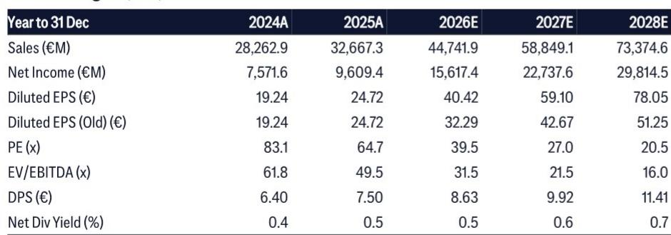
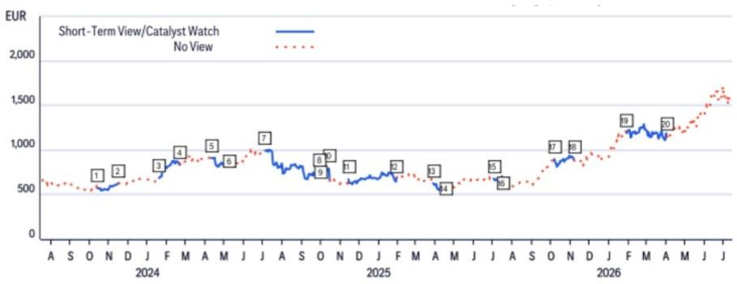
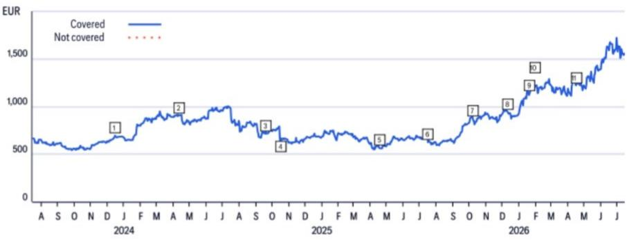

# ASML’s 2028 Visibility Proves the AI Semiconductor Cycle Is Still in Its First Inning

The most revealing data point in ASML’s latest quarter is not the revenue beat or the guidance raise. It is the fact that 2027 Low-NA EUV capacity is nearly fully booked, and meaningful orders for 2028 have already been placed. This is not a company reacting to near-term demand spikes. It is a company whose customers are committing to production roadmaps five years out, a horizon that historically has only been associated with the most durable technology inflections. For observers, the implication is decisive: the AI-driven semiconductor investment cycle is in its early stages, not its middle or end, and ASML is the structural bottleneck through which every major AI chipmaker must pass.

The scale of the revision makes the point concrete. A global research report now forecasts ASML system sales rising 16% in 2026, 29% in 2027, and 45% in 2028 relative to prior estimates. Diluted EPS projections for 2028 have been raised 52%, from €51.25 to €78.05. These are not incremental adjustments. They reflect a fundamental reassessment of how many lithography tools the world will need and what customers will pay for them. The positive scenario is no longer hypothetical; it is being written into order books.

Three structural forces are converging to create this outcome. First, rising lithography intensity per wafer as chipmakers pack more transistors onto each die. Second, an acceleration in memory capital expenditure, particularly for high-bandwidth memory and DRAM, which consume EUV tools at a rate that surprised even industry optimists. Third, improving pricing power as ASML’s capacity constraints become binding and its value-based pricing conversations yield higher average selling prices. Each force amplifies the others, creating a compounding effect that the market is only beginning to price.

This article unpacks the logic behind ASML’s extended visibility, explains why the margin trajectory is more durable than consensus assumes, and provides a decision framework for observers assessing whether the current valuation still offers upside. The central argument is straightforward: ASML is not just a supplier to the AI cycle. It is the cycle’s most reliable long-duration call option.

## ASML’s 2028 Order Book Proves That AI Chip Demand Is Not Cyclical but Structural

The most important distinction for an observer to make in semiconductor equipment is whether a demand surge is cyclical or structural. Cyclical surges reverse when inventory normalizes. Structural surges persist because they are tied to a change in how computing is done. ASML’s order visibility makes the answer unambiguous.

The company has indicated that its 2027 Low-NA EUV capacity is nearly fully booked. This is not a scenario where customers are placing tentative reservations. It means that the production slots for a machine that costs over €200 million and takes 18 months to build are already allocated. Furthermore, ASML is already receiving meaningful orders for 2028 delivery. The company is now planning to expand Low-NA EUV and DUV capacity by 30% in 2027, with a further 30% increase possible in 2028.

Consider what this implies about customer behavior. A foundry or memory manufacturer that places an EUV order today is committing to a specific wafer output three to four years in the future. That commitment only makes economic sense if the end-market demand is visible and durable. AI training clusters, data center expansion, and edge inference deployment all require multi-year planning horizons. The fact that ASML’s customers are placing orders for tools that will not ship until 2028 indicates that they see AI-driven semiconductor demand as a multi-generational investment, not a transient boom.

The unit forecasts reinforce this point. The report now models 67 Low-NA EUV units and 130 DUV immersion units in 2026, rising to 86 and 170 respectively in 2027, with further increases in 2028. These are not numbers that can be explained by a single customer or a single application. They reflect broad-based demand across leading-edge logic, DRAM, and high-bandwidth memory. The memory segment alone is expected to grow over 75% in 2025, a rate that would be impossible without structural drivers.

For observers, the conclusion is that ASML’s revenue trajectory is not dependent on the next quarterly earnings beat. It is underwritten by a backlog that extends further into the future than at any point in the company’s history. The risk of a demand cliff is low because the orders are not speculative; they are tied to specific fabs and specific production ramps.

## Rising Lithography Intensity and Memory Capex Are Creating a Step-Change in Tool Demand That Is Underappreciated

The standard way to think about ASML’s addressable market is to multiply the number of wafers produced by the number of lithography layers per wafer. Both variables are now moving in ASML’s favor simultaneously, and the combined effect is larger than most models capture.

On the logic side, the transition to gate-all-around architectures and backside power delivery requires additional EUV layers. Each new node generation increases the number of critical layers that must be printed with extreme ultraviolet light. This is not a one-time shift. It is a pattern that repeats with every process node shrink. As leading-edge foundries push toward 2-nanometer and beyond, the number of EUV steps per wafer rises, meaning that even if wafer volume stays flat, ASML’s tool demand increases.

On the memory side, the shift is even more dramatic. High-bandwidth memory stacks require advanced DRAM dies that are themselves produced with EUV. The report notes that memory system sales are expected to grow over 75% in 2025, driven by HBM and DRAM expansion. This is not a cyclical memory upcycle. It is a structural increase in the capital intensity of memory production. HBM is not a niche product. It is the backbone of AI accelerators, and every major memory manufacturer is building dedicated capacity to supply it.

The interaction between logic and memory demand creates a compounding effect. When both segments grow simultaneously, ASML’s capacity becomes the binding constraint. The company cannot simply add supply overnight. Expanding Low-NA EUV production capacity by 30% requires years of lead time for optics, chambers, and supply chain qualification. This scarcity gives ASML pricing power, which feeds directly into the margin story.

Observers who focus only on unit volumes miss half the picture. The average selling price for ASML’s systems is rising because customers are willing to pay a premium for guaranteed capacity and because the mix is shifting toward higher-productivity systems. The report explicitly cites ongoing value-based pricing discussions and expects further upside as High-NA EUV becomes a larger share of the mix. This is not a company that discounts to fill capacity. It is a company that rations capacity and charges accordingly.

## Margins Are Expanding Because Pricing Power, Mix Shift, and Operating Leverage Are All Aligning for the First Time This Cycle

A common concern among ASML observers is that margin expansion is capped because the company must invest heavily in R&D and capacity expansion to meet demand. The data suggests the opposite. ASML’s gross margin is projected to rise from 55.0% in 2026 to 57.6% in 2028, a gain of 260 basis points over three years. This improvement is not speculative. It is grounded in three concrete mechanisms.

First, pricing power. ASML’s capacity constraints mean that customers cannot easily switch to a competitor because no competitor offers EUV lithography. The company is using this leverage to negotiate higher prices for both new systems and upgrades. Value-based pricing means that ASML captures a share of the economic value its tools create for customers. As customers’ own margins improve from selling AI chips, ASML’s pricing headroom expands.

Second, mix shift. High-NA EUV systems, which are just beginning volume production, carry significantly higher average selling prices than Low-NA systems. As Intel confirms volume production on its 18A node using High-NA EUV, the technology moves from prototype to mainstream. The report notes that High-NA’s growing share of the mix supports margin expansion. This is a multi-year tailwind because High-NA adoption will spread across additional customers and nodes over time.

Third, operating leverage. ASML’s installed base management revenue, which includes service contracts, upgrades, and consumables, is expected to grow 8% annually through 2028. This revenue stream carries high incremental margins because the cost base is largely fixed. As the installed base grows, service revenue becomes a larger and more profitable component of total revenue. The report models installed base management revenue rising from €10.5 billion in 2026 to €13.9 billion in 2028, an increase that flows disproportionately to operating income.

The combination of these three forces means that ASML’s margin expansion is not dependent on a single factor. If pricing power softens, mix shift can compensate. If mix shift slows, operating leverage can fill the gap. The margin story is robust across multiple scenarios, which is exactly the kind of structural quality that justifies a premium valuation.

## A Decision Framework for ASML Observers: How to Weigh Visibility Against Valuation

Every decision involves a trade-off between what is known and what is priced. For ASML, the known factors are unusually favorable. The order book extends into 2028. The margin trajectory is supported by multiple independent drivers. The end-market demand for AI chips shows no sign of saturation. The question is whether the current valuation of approximately 28 times 2028 earnings, or roughly 1.0 times the PEG ratio, adequately reflects these facts.

The framework for answering this question has three components.

First, assess the earnings trajectory’s resilience. ASML’s EPS is forecast to grow from €24.72 in 2025 to €78.05 in 2028, a compound annual growth rate of approximately 47%. This growth is not back-end loaded or dependent on a single product cycle. It is spread across logic, memory, and installed base revenue, each of which has its own demand drivers. The 2028 EPS estimate has already been raised 52% from prior levels, suggesting that the base case is conservative relative to what the order book implies.

Second, evaluate the valuation methodology. The report uses a 28x multiple on 2028 earnings, which is consistent with other high-growth technology stocks in the coverage universe. This is not a distressed valuation or a deep-value play. It is a premium multiple applied to a premium growth rate. The key question is whether 28x is too high or too low given the duration of the growth runway. If ASML can sustain a 30% EPS CAGR through 2030, as the report forecasts, then a 28x multiple on 2028 earnings implies a PEG ratio below 1.0, which is historically attractive for a company with ASML’s competitive moat.

Third, consider the bull-bear spread. The report estimates an 81 percentage point spread between the bull and bear cases, with the bull case implying significantly higher revenue growth in both logic and memory. The bull case is not a fantasy. It is grounded in the same order book data that supports the base case, but with more aggressive assumptions about capacity expansion and pricing. The bear case, by contrast, assumes limited growth in both segments, which would require a meaningful moderation in AI capex. Given that ASML’s 2027 capacity is already nearly fully booked, the bear case would require a dramatic and sudden reversal in customer behavior that is not visible in any data point.

The framework leads to a clear conclusion: the base case is well-supported, the bull case is plausible, and the bear case requires a set of assumptions that contradict observable order trends. For long-term observers, the risk-reward skew is favorable.

## The Structural Shift in Memory Capex Creates a Second Growth Engine That Extends ASML’s Runway Beyond Logic Alone

Most observers understand ASML’s exposure to leading-edge logic foundries. Fewer appreciate how dramatically memory capital expenditure is changing. The report forecasts memory system sales growth of over 75% in 2025, and the memory segment is a key driver of the upward revisions to 2026 through 2028 estimates.

The reason is high-bandwidth memory. HBM is not a new type of memory. It is a packaging innovation that stacks multiple DRAM dies vertically and connects them through silicon vias. But to produce the advanced DRAM dies that go into an HBM stack, manufacturers need EUV lithography. Each HBM stack requires multiple advanced DRAM dies, and each die requires EUV layers. The result is that HBM production consumes EUV capacity at a rate far higher than traditional DRAM.

This is not a temporary phenomenon. HBM is the memory technology of choice for AI accelerators, and the leading manufacturers are building dedicated HBM fabs. These fabs require EUV tools, and they require them on an ongoing basis. Once an HBM fab is built, it needs to be replenished with new tools as nodes shrink and capacity expands. This creates a recurring demand stream that is independent of the logic cycle.

The memory opportunity also has a geographic dimension. Memory manufacturers are concentrated in Asia, and they are investing heavily in domestic capacity expansion. This investment is supported by government incentives and by the strategic importance of AI infrastructure. The combination of commercial demand and policy support creates a powerful tailwind that is less cyclical than traditional memory investment.

For ASML, the memory opportunity means that the company is not dependent on a single customer or a single technology node. It has two independent growth engines: logic and memory. When one slows, the other can compensate. The current cycle is unusual because both engines are firing simultaneously, but even in a scenario where logic investment moderates, memory demand provides a floor. This diversification is a structural advantage that is not fully captured in a simple PE multiple.

## The Capacity Expansion Plan Itself Is a Signal of Confidence That Should Not Be Ignored

When a company announces a 30% capacity expansion for its most complex and capital-intensive product line, it is making a statement about its view of the future. ASML is planning to expand Low-NA EUV and DUV capacity by 30% in 2027, with a further 30% increase possible in 2028. This is not a small adjustment. It is a multi-billion-euro commitment to tooling, clean rooms, and supply chain infrastructure.

The signal is that ASML’s management sees the demand as durable. Companies do not invest in capacity expansion for a cyclical spike. They invest when they believe the demand will persist for years. The fact that ASML is already planning for 2028 capacity increases means that the internal forecasts extend beyond the current order book. The visibility is not just into 2027 and 2028 orders. It is into the production capacity needed to fulfill orders that have not yet been placed.

This capacity expansion also has implications for competitors and customers. For competitors, it raises the barrier to entry. ASML is not just the incumbent. It is the incumbent that is investing aggressively to maintain its lead. For customers, it provides assurance that ASML will be able to meet their long-term needs, which strengthens the relationship and reduces the incentive for customers to seek alternative solutions.

The capacity expansion is also a source of operating leverage. Once the fixed costs of capacity expansion are absorbed, the incremental revenue from additional units flows through at high margins. The report’s margin projections already reflect this dynamic, but the full benefit will only become visible as the new capacity ramps. Observers who focus only on the near-term earnings impact of capacity investment miss the longer-term margin benefit.

For informational purposes only. Portions may be generated, translated, summarized, or edited with AI assistance based on source materials and may contain omissions or errors. Please verify independently. This is not professional advice.

For informational purposes only. Portions may be generated, translated, summarized, or edited with AI assistance based on source materials and may contain omissions or errors. Please verify independently. This is not professional advice.

