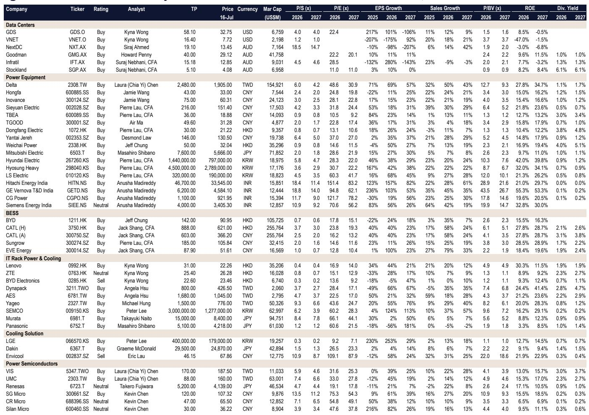
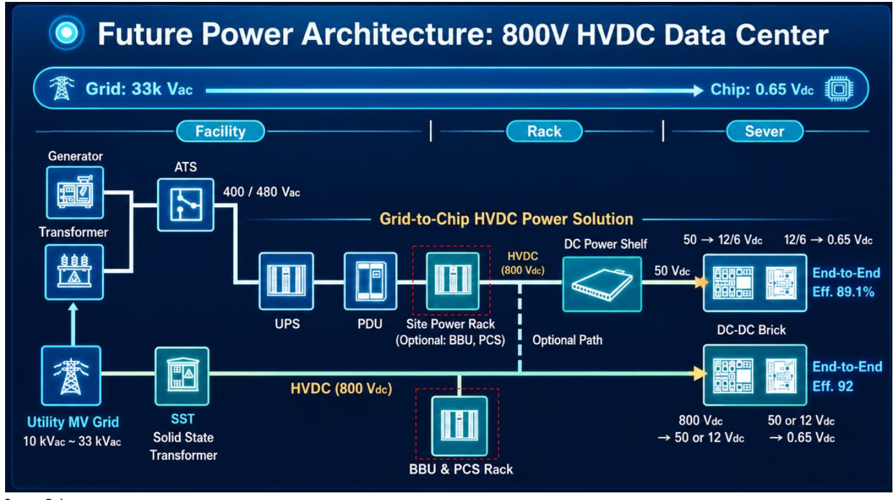
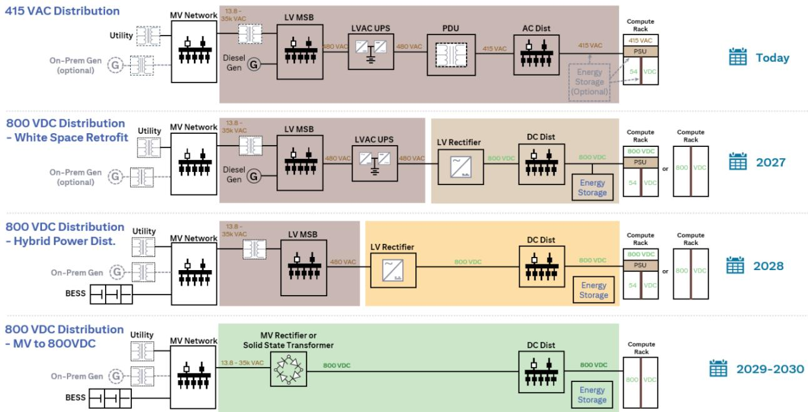

# Citi：亚洲通信基础设施-下一代AI数据中心800VDC架构

GPU机柜功率密度自2020年以来增长了近100倍——从每机柜10千瓦，到Blackwell平台的120千瓦，预计2028年Rubin Ultra及Kyber平台将突破1兆瓦。这一指数级增长并非渐进式工程挑战，而是结构性拐点：传统交流配电架构在物理和宏观环境上均已不可行。

Citi在最新发布的亚洲通信基础设施报告中系统论证了一个判断：800伏直流电（800VDC）正成为下一代AI数据中心的最优配电标准。该机构预测，到2030年，800VDC将覆盖全球新增数据中心容量的79%。这一转变并非单一设备升级，而是从电网到芯片的整条电力链路重构——传统交流链路的四次转换损耗将压缩为一次直流转换，同时催生固态变压器（SST）、电池储能系统（BESS）、备用电池单元（BBU）及新型冷却方案等全新设备品类。

> **KC评论：** Citi报告的核心不是“AI需要更多电”，而是“AI需要完全不同的电”。GPU机柜功率密度从10kW到1MW的跨越，使得传统低压交流配电的铜缆用量和线路损耗变得不可接受。800VDC通过提高电压来降低电流，本质上是用更少的铜传递更多的功率——这是物理层面的必然选择，而非技术路线的偏好。

## 1. 固态变压器需求将从2027年的901 MVA跃升至2030年的37,152 MVA

传统低压变压器在800VDC架构中将被固态变压器取代。Citi测算，SST需求将在三年内增长超过40倍。这一爆发式增长背后是GPU功率密度对配电架构的倒逼：当单机柜功率超过100kW，传统变压器的体积、效率和散热能力均无法满足要求。

SST的受益者覆盖多个区域。在中国市场，思源电气、特变电工和青岛特锐德被报告列为低压变压器及SST本土化建设与出口机会的标的。韩国晓星重工、LS电气同样受益于国内需求与海外出口。印度市场方面，日立能源印度、GE Vernova T&D India和CG Power则同时受益于本土需求增长和出口替代。

## 2. 800VDC架构下电池需求年复合增长率超过80%，储能成为数据中心标配

传统数据中心通常仅配备UPS（不间断电源）作为短时备电。但在800VDC架构中，电池储能系统（BESS）和备用电池单元（BBU）的角色发生了根本变化：它们不再仅仅是备电，而是参与功率调节和峰值削填，成为配电系统的有机组成部分。

Citi预计，2027年至2030年间，800VDC相关的电池需求将以超过80%的年复合增长率增长。阳光电源（计划2026年7月推出SST产品）、比亚迪、宁德时代和亿纬锂能被列为关键受益方。其中，阳光电源的角色尤为特殊——它既是SST供应商，又是BESS集成商，在800VDC架构中占据“电力电子+储能”的双重位置。

## 3. BBU单机柜价值量将从4000-5000美元升至33000-34000美元，MLCC需求同步爆发

随着功率密度提升，备用电池单元的单机柜价值量正在经历数量级跃升。Citi预测，BBU每机柜内容价值将从2022年的4000-5000美元增长至2029年的33000-34000美元。松下、顺达科技和AES被列为直接受益标的。

与此同时，800VDC架构对MLCC（多层陶瓷电容）的需求也在同步放大。村田制作所、三星电机和国巨被报告视为关键MLCC受益方。这一逻辑在于：更高电压的直流配电需要更多的滤波和稳压电容，而MLCC在体积、可靠性和高频特性上优于传统电解电容。

> **KC评论：** BBU价值量增长7-8倍，反映的不是电池变贵了，而是“备电”的定义变了。在800VDC架构中，BBU需要支撑的功率等级和响应速度远高于传统UPS，其设计复杂度、功率电子器件用量和热管理要求都大幅提升。这本质上是一个“功能升级”而非“容量扩容”的故事。

## 4. 液冷从可选变为刚需，冷却方案供应商迎来结构性升级

当GPU机柜功率密度突破100kW并向1MW迈进时，空气冷却的物理极限被彻底突破。Citi认为，液冷不再是“更优选择”，而是结构性必需。LG电子、大金工业和英维克被列为值得关注的关键企业。

这一判断的底层逻辑是热力学：空气的比热容和导热系数远低于液体。当单机柜发热量达到数百千瓦，风冷所需的空气流量和风扇功耗将变得不切实际。液冷方案（包括冷板式液冷和浸没式液冷）成为相对少见可行的热管理路径。

## 5. 功率半导体：SiC/GaN需求从边缘走向核心，VIS和UMC受益于高压前端

800VDC架构的整条电力链路——从AC-DC整流、DC-DC变换到逆变——都需要更高耐压、更低损耗的功率半导体。碳化硅（SiC）和氮化镓（GaN）器件正在从“可选”变为“标配”。

Citi认为，世界先进（VIS）在高电压前端制程中处于领先位置；联电（UMC）受益于PMIC/BCD特殊制程节点需求；瑞萨电子则通过收购Transphorm获得了GaN技术能力。在中国市场，圣邦微、华润微和士兰微被列为SiC/GaN需求的潜在受益方。

这份报告揭示的并非单一设备机会，而是一个“架构级”研究主题：800VDC正在重塑AI数据中心从电网到芯片的每一层设备。对于产业决策者而言，关键问题不再是“AI需要多少电”，而是“AI需要什么样的电”——以及现有供应链能否跟上这一结构性转变。

For informational purposes only. Portions may be generated,translated,summarized,or edited with AI assistance based on source materials and may contain omissions or errors. Please verify independently. This is not investment,legal,tax,accounting,or other professional advice.

