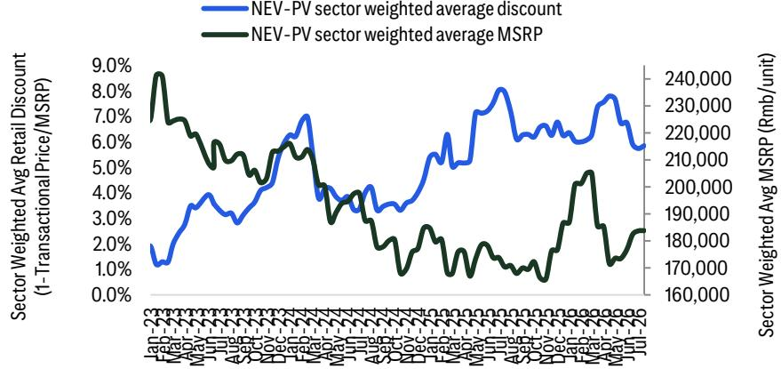
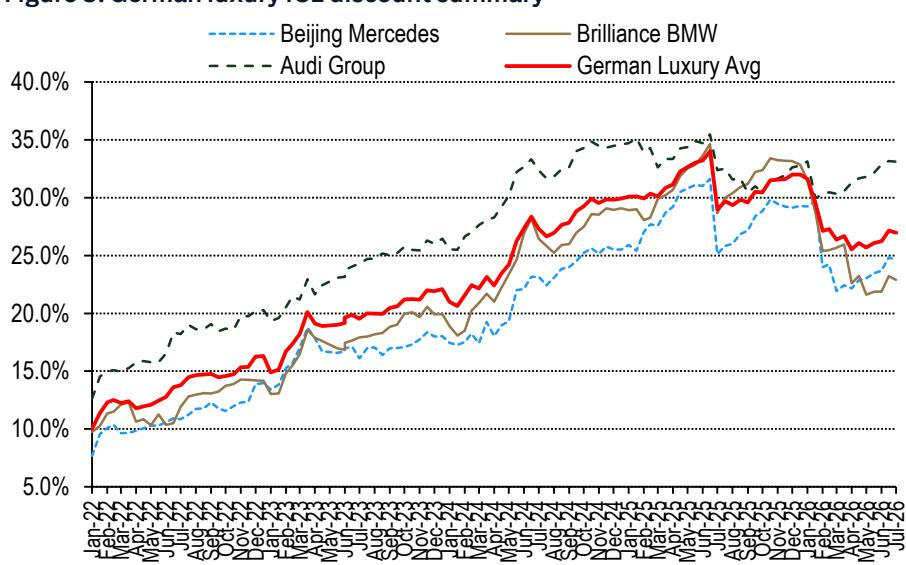
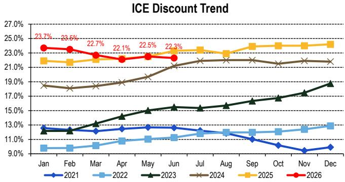
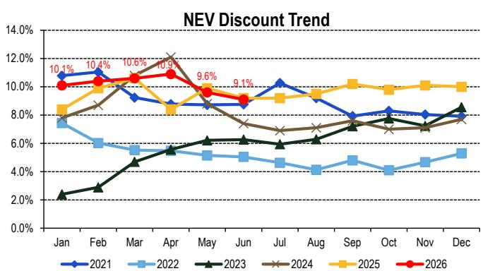
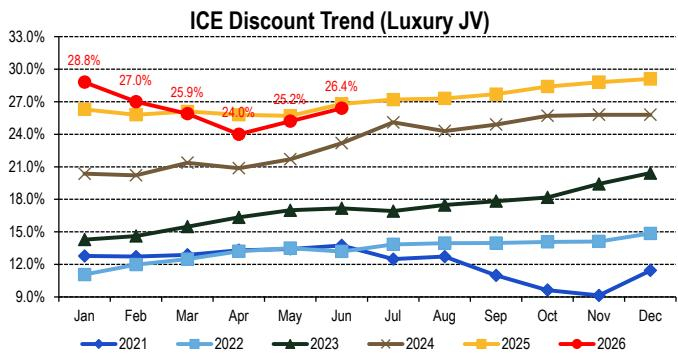
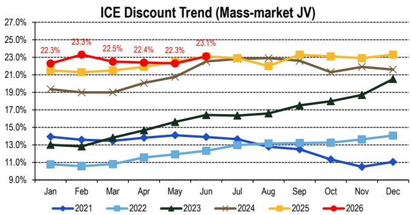
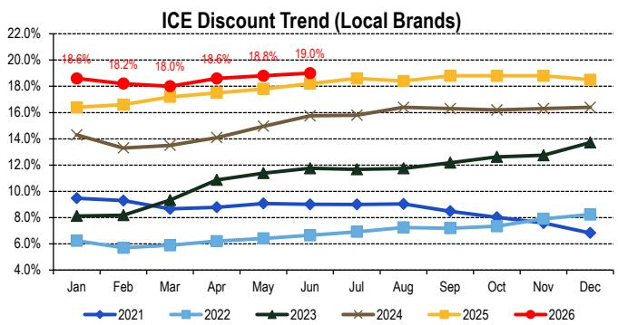

# 中国汽车制造商

## 双月新能源车定价趋势（零售折扣与厂商建议零售价）：2026年7月中旬

## 研究观点

在本期双月定价趋势报告中，我们基于Thinkercar收集的Top 30城市数据，监测主要整车厂的新能源乘用车定价情况。零售折扣计算为4S店零售价格与厂商建议零售价之间的差额。2026年7月上半月，中国新能源乘用车行业加权平均零售折扣环比上升0.1个百分点至5.9%（相较于6月底）。新能源乘用车行业加权平均厂商建议零售价环比上升0.1%至183,863元。

## 新能源品牌

— 特斯拉：零售折扣为0.6%（环比持平）；厂商建议零售价为293,628元（环比持平）

— 蔚来：零售折扣为1.6%（环比上升0.1个百分点）；厂商建议零售价为353,562元（环比持平）

— 小鹏：零售折扣为3.6%（环比上升0.1个百分点）；厂商建议零售价为196,720元（环比持平）

— 理想：零售折扣为4.1%（环比下降0.6个百分点）；厂商建议零售价为315,595元（环比上升0.7%）

— 问界：零售折扣为2.7%（环比上升1.1个百分点）；厂商建议零售价为372,634元（环比持平）

— 零跑：零售折扣为4.3%（环比持平）；厂商建议零售价为123,966元（环比上升1.0%）

## 传统自主品牌（仅新能源车型）

— 比亚迪：零售折扣为6.9%（环比上升0.2个百分点）；厂商建议零售价为133,685元（环比下降0.3%）

— 吉利：零售折扣为10.5%（环比上升0.4个百分点）；厂商建议零售价为117,312元（环比上升0.1%）

— 长城：零售折扣为5.3%（环比持平）；厂商建议零售价为265,827元（环比持平）

## 传统豪华品牌

— 北京奔驰：新能源+燃油车加权平均零售价格为297,069元（环比下降1.2%/同比下降8.4%）

— 华晨宝马：新能源+燃油车加权平均零售价格为289,639元（环比下降1.3%/同比下降7.1%）

— 奥迪集团：新能源+燃油车加权平均零售价格为238,369元（环比下降0.6%/同比下降8.9%）

## 见图6-11乘联会折扣汇总

## Jeff Chung $^{AC}$

+852-2501-2787

jeff.m.chung@citi.com

## Kyle Wu

+852-2501-8483

kyle.wu@citi.com

见附录A-1：分析师认证、重要披露及研究分析师关联信息。

<table><tr><td></td><td>2026年2月28日</td><td>2026年3月15日</td><td>2026年3月31日</td><td>2026年4月15日</td><td>2026年4月30日</td><td>2026年5月15日</td><td>2026年5月31日</td><td>2026年6月15日</td><td>2026年6月30日</td><td>2026年7月15日</td></tr><tr><td colspan="11">加权平均零售折扣</td></tr><tr><td>特斯拉</td><td>0.8%</td><td>0.7%</td><td>0.7%</td><td>0.3%</td><td>0.3%</td><td>0.9%</td><td>0.9%</td><td>0.6%</td><td>0.6%</td><td>0.6%</td></tr><tr><td>蔚来</td><td>1.9%</td><td>3.3%</td><td>3.3%</td><td>2.8%</td><td>2.8%</td><td>2.5%</td><td>2.5%</td><td>2.1%</td><td>1.5%</td><td>1.6%</td></tr><tr><td>小鹏</td><td>6.4%</td><td>6.8%</td><td>6.7%</td><td>3.9%</td><td>4.4%</td><td>4.4%</td><td>3.6%</td><td>3.6%</td><td>3.6%</td><td>3.6%</td></tr><tr><td>理想</td><td>5.3%</td><td>6.6%</td><td>6.6%</td><td>6.4%</td><td>6.4%</td><td>6.5%</td><td>6.1%</td><td>4.6%</td><td>4.6%</td><td>4.1%</td></tr><tr><td>问界</td><td></td><td></td><td></td><td></td><td></td><td></td><td></td><td>1.6%</td><td>1.6%</td><td>2.7%</td></tr><tr><td>零跑</td><td>9.2%</td><td>9.2%</td><td>9.2%</td><td>7.9%</td><td>7.9%</td><td>6.0%</td><td>6.3%</td><td>5.9%</td><td>4.3%</td><td>4.3%</td></tr><tr><td>比亚迪</td><td>7.5%</td><td>8.3%</td><td>8.6%</td><td>8.2%</td><td>7.8%</td><td>6.8%</td><td>6.9%</td><td>6.6%</td><td>6.7%</td><td>6.9%</td></tr><tr><td>吉利</td><td>10.2%</td><td>11.3%</td><td>11.7%</td><td>12.4%</td><td>12.6%</td><td>12.3%</td><td>12.5%</td><td>9.9%</td><td>10.1%</td><td>10.5%</td></tr><tr><td>长城</td><td>4.4%</td><td>4.4%</td><td>4.5%</td><td>7.3%</td><td>7.2%</td><td>5.8%</td><td>5.9%</td><td>5.3%</td><td>5.3%</td><td>5.3%</td></tr><tr><td>北京奔驰</td><td>31.2%</td><td>31.1%</td><td>31.2%</td><td>35.3%</td><td>35.7%</td><td>28.0%</td><td>28.1%</td><td>33.5%</td><td>33.5%</td><td>33.5%</td></tr><tr><td>华晨宝马</td><td>38.3%</td><td>37.5%</td><td>37.6%</td><td>33.2%</td><td>33.5%</td><td>33.1%</td><td>33.2%</td><td>32.5%</td><td>32.8%</td><td>33.4%</td></tr><tr><td>奥迪集团</td><td>19.2%</td><td>14.9%</td><td>14.9%</td><td>19.4%</td><td>16.5%</td><td>13.4%</td><td>13.5%</td><td>12.2%</td><td>15.8%</td><td>15.9%</td></tr><tr><td>新能源乘用车行业加权平均折扣</td><td>6.3%</td><td>7.4%</td><td>7.6%</td><td>7.8%</td><td>7.7%</td><td>6.7%</td><td>6.8%</td><td>5.9%</td><td>5.7%</td><td>5.9%</td></tr><tr><td colspan="11">加权平均零售折扣环比变化</td></tr><tr><td>特斯拉</td><td>0.5ppt</td><td>-0.1ppt</td><td>-0.1ppt</td><td>-0.4ppt</td><td>-0.4ppt</td><td>0.6ppt</td><td>0.6ppt</td><td>-0.3ppt</td><td>-0.3ppt</td><td>0.0ppt</td></tr><tr><td>蔚来</td><td>0.4ppt</td><td>1.4ppt</td><td>1.4ppt</td><td>-0.5ppt</td><td>-0.5ppt</td><td>-0.3ppt</td><td>-0.3ppt</td><td>-0.4ppt</td><td>-1.0ppt</td><td>0.1ppt</td></tr><tr><td>小鹏</td><td>3.1ppt</td><td>0.3ppt</td><td>0.3ppt</td><td>-2.8ppt</td><td>-2.4ppt</td><td>0.0ppt</td><td>-0.8ppt</td><td>0.0ppt</td><td>0.0ppt</td><td>0.1ppt</td></tr><tr><td>理想</td><td>-0.1ppt</td><td>1.3ppt</td><td>1.3ppt</td><td>-0.1ppt</td><td>-0.1ppt</td><td>0.1ppt</td><td>-0.3ppt</td><td>-1.5ppt</td><td>-1.5ppt</td><td>-0.6ppt</td></tr><tr><td>问界</td><td></td><td></td><td></td><td></td><td></td><td></td><td></td><td></td><td></td><td>1.1ppt</td></tr><tr><td>零跑</td><td>1.8ppt</td><td>0.0ppt</td><td>0.0ppt</td><td>-1.4ppt</td><td>-1.3ppt</td><td>-2.0ppt</td><td>-1.7ppt</td><td>-0.3ppt</td><td>-2.0ppt</td><td>0.0ppt</td></tr><tr><td>比亚迪</td><td>0.9ppt</td><td>0.8ppt</td><td>1.1ppt</td><td>-0.4ppt</td><td>-0.9ppt</td><td>-1.0ppt</td><td>-0.9ppt</td><td>-0.3ppt</td><td>-0.1ppt</td><td>0.2ppt</td></tr><tr><td>吉利</td><td>0.5ppt</td><td>1.1ppt</td><td>1.5ppt</td><td>0.7ppt</td><td>0.9ppt</td><td>-0.3ppt</td><td>-0.1ppt</td><td>-2.6ppt</td><td>-2.4ppt</td><td>0.4ppt</td></tr><tr><td>长城</td><td>0.3ppt</td><td>0.0ppt</td><td>0.1ppt</td><td>2.8ppt</td><td>2.7ppt</td><td>-1.4ppt</td><td>-1.3ppt</td><td>-0.6ppt</td><td>-0.5ppt</td><td>0.0ppt</td></tr><tr><td>北京奔驰</td><td>1.7ppt</td><td>-0.1ppt</td><td>0.0ppt</td><td>4.1ppt</td><td>4.5ppt</td><td>-7.7ppt</td><td>-7.6ppt</td><td>5.4ppt</td><td>5.4ppt</td><td>0.0ppt</td></tr><tr><td>华晨宝马</td><td>-1.0ppt</td><td>-0.8ppt</td><td>-0.7ppt</td><td>-4.4ppt</td><td>-4.1ppt</td><td>-0.3ppt</td><td>-0.3ppt</td><td>-0.7ppt</td><td>-0.4ppt</td><td>0.5ppt</td></tr><tr><td>奥迪集团</td><td>3.5ppt</td><td>-4.3ppt</td><td>-4.2ppt</td><td>4.5ppt</td><td>1.6ppt</td><td>-3.1ppt</td><td>-3.0ppt</td><td>-1.3ppt</td><td>2.3ppt</td><td>0.1ppt</td></tr><tr><td>行业加权平均折扣变化</td><td>0.3ppt</td><td>1.1ppt</td><td>1.3ppt</td><td>0.2ppt</td><td>0.1ppt</td><td>-0.9ppt</td><td>-0.9ppt</td><td>-0.8ppt</td><td>-1.0ppt</td><td>0.1ppt</td></tr></table>

来源：Citi，Thinkercar

图1. 各整车厂新能源乘用车零售折扣

© 2026 Citi集团。未经Citi书面许可不得转载。

图2. 行业加权平均新能源乘用车折扣与厂商建议零售价  
  
© 2026 Citi集团。未经Citi书面许可不得转载。  
来源：Citi，Thinkercar

图3. 各整车厂新能源乘用车零售厂商建议零售价

<table><tr><td></td><td>2026年2月28日</td><td>2026年3月15日</td><td>2026年3月31日</td><td>2026年4月15日</td><td>2026年4月30日</td><td>2026年5月15日</td><td>2026年5月31日</td><td>2026年6月15日</td><td>2026年6月30日</td><td>2026年7月15日</td></tr><tr><td colspan="11">加权平均厂商建议零售价</td></tr><tr><td>特斯拉</td><td>295,288</td><td>293,475</td><td>293,475</td><td>294,716</td><td>294,716</td><td>289,540</td><td>289,540</td><td>293,628</td><td>293,628</td><td>293,628</td></tr><tr><td>蔚来</td><td>345,919</td><td>330,031</td><td>330,031</td><td>317,320</td><td>320,799</td><td>313,047</td><td>313,047</td><td>354,313</td><td>353,577</td><td>353,562</td></tr><tr><td>小鹏</td><td>191,933</td><td>187,516</td><td>186,612</td><td>178,019</td><td>178,019</td><td>164,596</td><td>178,334</td><td>196,720</td><td>196,720</td><td>196,720</td></tr><tr><td>理想</td><td>282,728</td><td>282,677</td><td>282,677</td><td>282,865</td><td>282,865</td><td>288,739</td><td>291,513</td><td>313,356</td><td>313,356</td><td>315,595</td></tr><tr><td>问界</td><td></td><td></td><td></td><td></td><td></td><td></td><td></td><td>378,726</td><td>372,634</td><td>372,634</td></tr><tr><td>零跑</td><td>130,589</td><td>129,277</td><td>129,277</td><td>118,784</td><td>123,975</td><td>122,852</td><td>122,852</td><td>123,081</td><td>122,761</td><td>123,966</td></tr><tr><td>比亚迪</td><td>137,757</td><td>128,236</td><td>128,083</td><td>131,935</td><td>132,570</td><td>131,481</td><td>131,975</td><td>130,806</td><td>134,060</td><td>133,685</td></tr><tr><td>吉利</td><td>125,921</td><td>110,174</td><td>110,240</td><td>106,513</td><td>107,090</td><td>111,118</td><td>112,890</td><td>115,722</td><td>117,163</td><td>117,312</td></tr><tr><td>长城</td><td>267,758</td><td>258,235</td><td>258,235</td><td>231,473</td><td>255,107</td><td>225,924</td><td>267,995</td><td>266,532</td><td>265,827</td><td>265,827</td></tr><tr><td>北京奔驰</td><td>454,328</td><td>422,375</td><td>422,375</td><td>420,636</td><td>418,376</td><td>375,874</td><td>375,874</td><td>390,627</td><td>390,627</td><td>390,627</td></tr><tr><td>华晨宝马</td><td>320,878</td><td>321,588</td><td>321,588</td><td>301,729</td><td>301,729</td><td>297,410</td><td>297,410</td><td>297,949</td><td>297,949</td><td>297,949</td></tr><tr><td>奥迪集团</td><td>290,536</td><td>286,218</td><td>286,218</td><td>324,674</td><td>317,034</td><td>327,624</td><td>327,624</td><td>336,221</td><td>336,221</td><td>336,221</td></tr><tr><td>新能源乘用车行业加权平均厂商建议零售价</td><td>205,131</td><td>185,580</td><td>185,490</td><td>171,642</td><td>173,654</td><td>173,515</td><td>176,911</td><td>182,459</td><td>183,755</td><td>183,863</td></tr><tr><td colspan="11">加权平均厂商建议零售价环比变化</td></tr><tr><td>特斯拉</td><td>1.8%</td><td>-0.6%</td><td>-0.6%</td><td>0.4%</td><td>0.4%</td><td>-1.8%</td><td>-1.8%</td><td>1.4%</td><td>1.4%</td><td>0.0%</td></tr><tr><td>蔚来</td><td>-2.3%</td><td>-4.6%</td><td>-4.6%</td><td>-3.9%</td><td>-2.8%</td><td>-2.4%</td><td>-2.4%</td><td>13.2%</td><td>12.9%</td><td>0.0%</td></tr><tr><td>小鹏</td><td>-7.9%</td><td>-2.3%</td><td>-2.8%</td><td>-4.6%</td><td>-4.6%</td><td>-7.5%</td><td>0.2%</td><td>10.3%</td><td>10.3%</td><td>0.0%</td></tr><tr><td>理想</td><td>-0.1%</td><td>0.0%</td><td>0.0%</td><td>0.1%</td><td>0.1%</td><td>2.1%</td><td>3.1%</td><td>7.5%</td><td>7.5%</td><td>0.7%</td></tr><tr><td>问界</td><td></td><td></td><td></td><td></td><td></td><td></td><td></td><td></td><td></td><td>0.0%</td></tr><tr><td>零跑</td><td>1.3%</td><td>-1.0%</td><td>-1.0%</td><td>-8.1%</td><td>-4.1%</td><td>-0.9%</td><td>-0.9%</td><td>0.2%</td><td>-0.1%</td><td>1.0%</td></tr><tr><td>比亚迪</td><td>-3.9%</td><td>-6.9%</td><td>-7.0%</td><td>3.0%</td><td>3.5%</td><td>-0.8%</td><td>-0.4%</td><td>-0.9%</td><td>1.6%</td><td>-0.3%</td></tr><tr><td>吉利</td><td>1.1%</td><td>-12.5%</td><td>-12.5%</td><td>-3.4%</td><td>-2.9%</td><td>3.8%</td><td>5.4%</td><td>2.5%</td><td>3.8%</td><td>0.1%</td></tr><tr><td>长城</td><td>0.9%</td><td>-3.6%</td><td>-3.6%</td><td>-10.4%</td><td>-1.2%</td><td>-11.4%</td><td>5.1%</td><td>-0.5%</td><td>-0.8%</td><td>0.0%</td></tr><tr><td>北京奔驰</td><td>-0.3%</td><td>-7.0%</td><td>-7.0%</td><td>-0.4%</td><td>-0.9%</td><td>-10.2%</td><td>-10.2%</td><td>3.9%</td><td>3.9%</td><td>0.0%</td></tr><tr><td>华晨宝马</td><td>-6.7%</td><td>0.2%</td><td>0.2%</td><td>-6.2%</td><td>-6.2%</td><td>-1.4%</td><td>-1.4%</td><td>0.2%</td><td>0.2%</td><td>0.0%</td></tr><tr><td>奥迪集团</td><td>-13.6%</td><td>-1.5%</td><td>-1.5%</td><td>13.4%</td><td>10.8%</td><td>3.3%</td><td>3.3%</td><td>2.6%</td><td>2.6%</td><td>0.0%</td></tr><tr><td>行业加权平均厂商建议零售价变化</td><td>1.9%</td><td>-9.5%</td><td>-9.6%</td><td>-7.5%</td><td>-6.4%</td><td>-0.1%</td><td>1.9%</td><td>3.1%</td><td>3.9%</td><td>0.1%</td></tr></table>

© 2026 Citi集团。未经Citi书面许可不得转载。  
来源：Citi，Thinkercar

图4. 德系豪华燃油车折扣汇总

<table><tr><td></td><td>2026年7月15日</td><td>2026年6月30日</td><td>2026年7月环比</td><td>2025年7月15日</td><td>2026年7月同比</td><td>2025年6月30日</td><td>2025年7月环比</td></tr><tr><td>德系豪华燃油车（加权平均）</td><td>27.0%</td><td>27.2%</td><td>-0.2ppt</td><td>29.0%</td><td>-2.0ppt</td><td>34.0%</td><td>-5.0ppt</td></tr><tr><td colspan="8">按品牌</td></tr><tr><td>华晨宝马</td><td>22.9%</td><td>23.2%</td><td>-0.3ppt</td><td>28.7%</td><td>-5.8ppt</td><td>34.6%</td><td>-6.0ppt</td></tr><tr><td>北京奔驰</td><td>24.6%</td><td>24.8%</td><td>-0.2ppt</td><td>25.1%</td><td>-0.5ppt</td><td>31.6%</td><td>-6.5ppt</td></tr><tr><td>奥迪集团</td><td>33.1%</td><td>33.2%</td><td>-0.1ppt</td><td>32.4%</td><td>0.7ppt</td><td>35.5%</td><td>-3.1ppt</td></tr></table>

© 2026 Citi集团。未经Citi书面许可不得转载。  
来源：Citi，Thinkercar

图5. 德系豪华燃油车折扣汇总  
  
© 2026 Citi集团。未经Citi书面许可不得转载。  
来源：Citi，Thinkercar

图6. 乘联会：月度实施降价车型数量  

© 2026 Citi集团。未经Citi书面许可不得转载。

图7. 乘联会：燃油车折扣趋势
燃油车折扣趋势

  
© 2026 Citi集团。未经Citi书面许可不得转载。
来源：Citi，乘联会

图8. 乘联会：新能源车折扣趋势  
  
© 2026 Citi集团。未经Citi书面许可不得转载。
来源：Citi，乘联会

图9. 乘联会：豪华燃油车折扣  
  
© 2026 Citi集团。未经Citi书面许可不得转载。
来源：Citi，乘联会

图10. 乘联会：合资燃油车折扣  
  
© 2026 Citi集团。未经Citi书面许可不得转载。
来源：Citi，乘联会

图11. 乘联会：自主品牌燃油车折扣  
  
© 2026 Citi集团。未经Citi书面许可不得转载。
来源：Citi，乘联会

## 提及公司：

宝马 (BMWG.DE; €58.32; 2; 2026年7月16日; 17:30)

比亚迪 (1211.HK; HK\$88.7; 1; 2026年7月17日; 16:10)

比亚迪 (002594.SZ; Rmb93.47; 1; 2026年7月17日; 15:00)

吉利汽车 (0175.HK; HK\$18.48; 1; 2026年7月17日; 16:10)

长城汽车 (2333.HK; HK\$8.66; 3; 2026年7月17日; 16:10)

长城汽车 (601633.SS; Rmb15.66; 3; 2026年7月17日; 15:00)

零跑汽车 (9863.HK; HK\$35.14; 1; 2026年7月17日; 16:10)

理想汽车 (LI.O; US\$12.86; 2; 2026年7月16日; 16:00)

理想汽车 (2015.HK; HK\$48.94; 2; 2026年7月17日; 16:10)

梅赛德斯-奔驰集团 (MBGn.DE; €45.86; 2; 2026年7月16日; 17:30)

蔚来 (NIO.N; US\$4.99; 1; 2026年7月16日; 16:00)

蔚来 (9866.HK; HK\$37.78; 1; 2026年7月17日; 16:10)

赛力斯集团 (601127.SS; Rmb54.3; 3; 2026年7月17日; 15:00)

赛力斯集团 (9927.HK; HK\$42.08; 3; 2026年7月17日; 16:10)

大众汽车 (VOWG\_p.DE; €73.46; 1; 2026年7月16日; 17:30)

小鹏汽车 (XPEV.N; US\$14.04; 1; 2026年7月16日; 16:00)

小鹏汽车 (9868.HK; HK\$51.65; 1; 2026年7月17日; 16:10)

如果您有视觉障碍并希望与Citi代表就本文件中图表的细节进行沟通，请致电美国 1-888-500-5008（TTY: 711），美国境外请拨打 +1-210-677-3788

## 附录 A-1

## 分析师认证

主要负责本研究报告编制和内容的研究分析师，要么在作者栏中以"AC"标识，要么以粗体列在与该分析师相关的内容旁。如果作者栏中指定了多位AC分析师，每位分析师仅就整个研究报告进行认证，但以下情况除外：(a) 归属于另一位以粗体列出的AC认证分析师的内容，以及 (b) 仅针对特定发行人的观点，该观点归属于该发行人下方价格图表或评级历史表中标识的另一位AC认证分析师。每位分析师就其负责的报告部分认证：(1) 其中表达的观点准确反映了其个人对每个提及的发行人和证券的看法，并且是以独立方式编制的，包括对Citi全球市场公司及其关联方；(2) 研究分析师的薪酬的任何部分，过去、现在或将来，均不直接或间接与该分析师在本报告中表达的特定建议或观点相关。

## 重要披露

<table><tr><td>自2025年1月1日以来，本公司至少有一次在长城汽车股份有限公司的公开交易股权证券中做市。</td></tr><tr><td>自2025年1月1日以来，本公司至少有一次在理想汽车的公开交易股权证券中做市。</td></tr><tr><td>自2025年1月1日以来，本公司至少有一次在吉利汽车控股有限公司的公开交易股权证券中做市。</td></tr><tr><td>自2025年1月1日以来，本公司至少有一次在蔚来公司的公开交易股权证券中做市。</td></tr><tr><td>自2025年1月1日以来，本公司至少有一次在比亚迪股份有限公司的公开交易股权证券中做市。</td></tr><tr><td>自2025年1月1日以来，本公司至少有一次在浙江零跑科技股份有限公司的公开交易股权证券中做市。</td></tr><tr><td>Citi全球市场公司或其关联方实益持有宝马任何类别普通股证券的1%或以上。该头寸反映了截至前一交易日可获取的信息。</td></tr><tr><td>Citi全球市场公司或其关联方对宝马、理想汽车、蔚来的任何类别普通股证券持有0.5%或以上的净空头头寸。</td></tr><tr><
