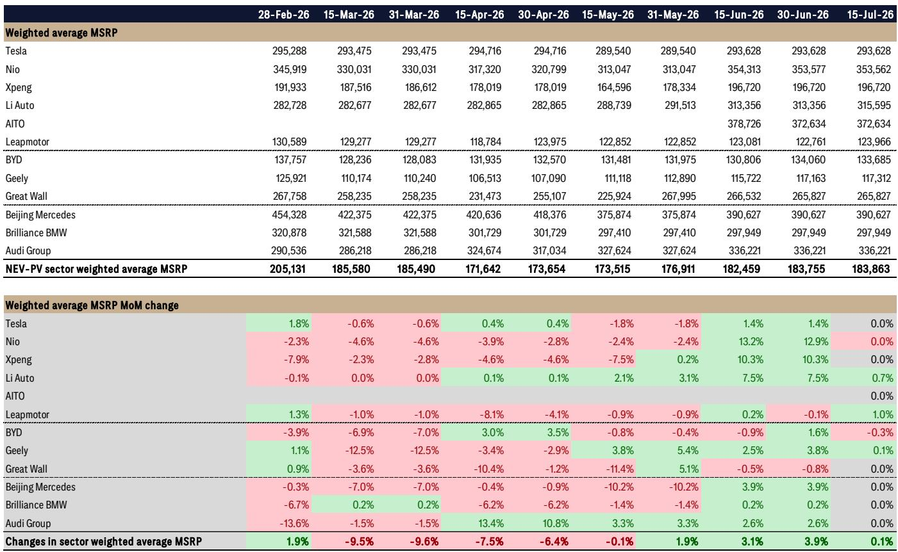
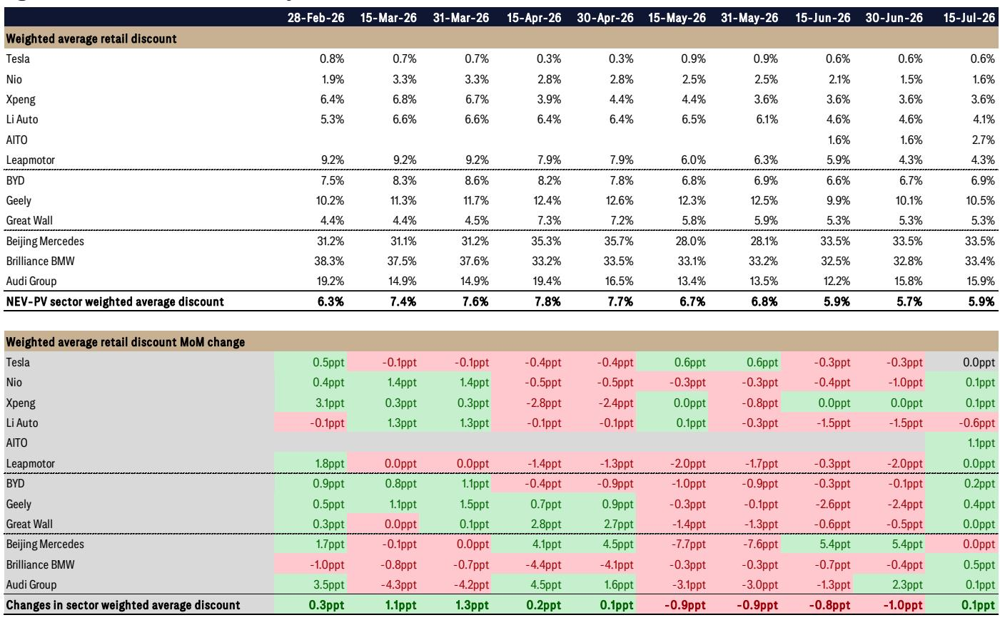
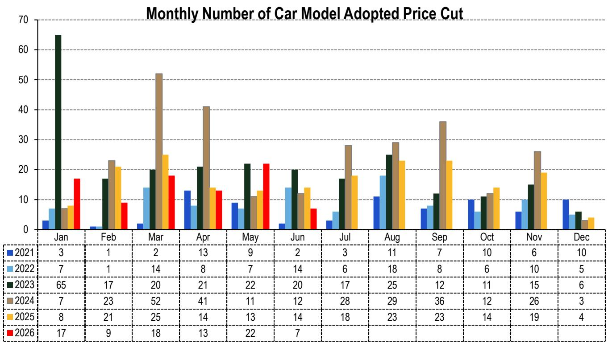

# 中国新能源车市场：折扣周期从全行业转向品牌分化

2026年7月上旬，中国新能源乘用车市场加权平均零售折扣为5.9%，较6月底仅微增0.1个百分点。该市场加权平均建议零售价环比微升0.1%，达到183,863元。从整体数据看，市场似乎处于均衡状态。但这种表面稳定掩盖了一个关键分化：定义2026年上半年的价格竞争已不再是全行业现象，而是演变为品牌层面的博弈，赢家与输家正变得泾渭分明。

来自Thinkercar对中国前30个城市的数据采集及某全球研究机构的分析显示，对大多数新能源品牌而言，普遍深度折扣的时代已经结束。市场平均折扣在4月中旬达到7.8%的峰值后趋于稳定。这并非市场强势的信号，而是竞争格局趋于成熟的标志。那些拥有定价能力的品牌正在坚守阵地；未能建立定价能力的品牌仍在让渡利润空间，但力度有所减弱。对于任何市场参与者、企业管理者或供应链相关方而言，关键的战略问题不再是“折扣会多深”，而是“哪些品牌赢得了保护价格的权利，哪些没有？”

7月中旬的定价数据给出的答案指向一个市场：高端定位、产品组合和品牌价值正重新成为定价纪律的主要决定因素。折扣压缩是真实的，但并非均匀分布。这种不对称性既带来风险，也创造机遇。

## 全行业折扣趋于稳定，但稳定背后的结构揭示出双层市场

2026年2月至4月间，市场加权平均折扣从6.3%升至7.8%，两个月内扩大了1.5个百分点。那是本轮周期的峰值。自4月中旬以来，折扣有所收窄或企稳，至7月中旬回落至5.9%。整体趋势表明市场已找到底部。然而，到达这一底部的路径在竞争格局中远非一致。

高端新能源品牌——特斯拉、蔚来、小鹏和理想——的折扣均已从峰值企稳或回落。特斯拉的折扣已连续三个测量周期维持在0.6%，与6月底持平。理想的折扣实际上有所收窄，从3月中旬的6.6%降至7月中旬的4.1%，减少了2.5个百分点。即便是蔚来，其折扣在3月曾升至3.3%，此后已收窄至1.6%。这些品牌展现出无需依赖激进的经销商激励措施即可捍卫其建议零售价的能力。

相比之下，以走量为导向的传统本土品牌则呈现不同图景。比亚迪的折扣自5月底以来徘徊在6.7%至6.9%之间，未见明显压缩。吉利的折扣为10.5%，环比上升0.4个百分点，仍接近历史峰值。市场平均折扣之所以企稳，并非因为所有品牌都找到了定价均衡，而是因为高端品牌收紧了折扣，足以抵消大众市场玩家持续甚至扩大的折扣。

这不是一个均匀愈合的市场，而是一个正在分化的市场。高端细分市场展现出定价纪律；走量细分市场仍陷于促销周期。战略含义清晰：品牌定位和产品差异化现已成为定价能力的主要决定因素，而非全市场的供需动态。

## 高端新能源品牌通过产品组合和品牌价值展现定价能力，而非牺牲销量

7月中旬数据中最引人注目的是理想汽车的表现。其折扣环比下降0.6个百分点至4.1%，同时加权平均建议零售价上升0.7%至315,595元。这是每个企业都希望看到的组合：标价上升而经销商激励下降。其背后的机制并非需求激增，而是产品组合。理想一直在将销售构成转向更高配置、更高建议零售价的车型，这机械地推高了加权平均建议零售价，同时减少了对低端车型提供折扣的需求。该品牌实际上是在用销量换取价值，数据证实这一策略正在奏效。

特斯拉的定价纪律更为显著。以0.6%的折扣水平，特斯拉实际上是在按建议零售价销售。其建议零售价已超过一个月持平于293,628元。这是一个选择以定价为导向而非追逐增量销量的品牌，这一决定反映了对其需求轨迹和管理生产成本能力的信心。对于一家历史上在全球电动车市场中最具攻击性的降价者而言，这种克制是一个信号：中国的需求环境虽然竞争激烈，但尚无需恐慌性定价。

蔚来和小鹏虽不如特斯拉那般严格，但也已企稳。蔚来的折扣微升0.1个百分点至1.6%，建议零售价持平。小鹏的折扣已连续三个周期冻结在3.6%。对这两个品牌而言，折扣水平足够低以保护毛利率，稳定性表明两者均无立即进一步降价的压力。

共同点是，这四个品牌——特斯拉、理想、蔚来和小鹏——都实现了一定程度的产品差异化，使其能够避免折扣螺旋。无论是通过技术领先、品牌声望还是精准的产品定位，它们都在自身与大众市场的价格驱动竞争之间建立了缓冲。

## 传统本土新能源品牌仍陷于不惜代价追求销量的策略，数据未见退出路径

与比亚迪、吉利和长城的对比再鲜明不过。比亚迪6.9%的折扣环比微增0.2个百分点，其建议零售价实际下降0.3%至133,685元。这是典型的销量领先者悖论：比亚迪在中国销售的新能源车超过任何其他品牌，但代价是持续以超过特斯拉两倍以上的折扣运营。该公司正在赢得市场份额，但牺牲了定价能力。对于市场参与者而言，问题在于这是可持续的竞争策略，还是一场最终将压缩利润率至不可持续水平的逐底竞争。

吉利的处境更令人担忧。其10.5%的折扣是报告追踪的主要新能源品牌中最高的，且仍在扩大。吉利的建议零售价为117,312元，在样本中属于最低水平之一，却仍需两位数的折扣来推动库存。这表明吉利的新能源产品线缺乏品牌吸引力或产品差异化来在市场中获取溢价。该公司实际上仅在价格上竞争，这种地位若无根本性的产品或品牌革新则难以摆脱。

长城5.3%的折扣较为温和，但已在该水平停滞超过一个月，建议零售价持平。该品牌既未取得进展也未失去阵地，处于等待状态。对长城而言，风险在于其新能源产品既不被视为足够高端以拥有定价能力，也不够便宜以在销量上取胜。

传统本土品牌并非失败。它们在销售汽车，但方式使其在消费者情绪进一步变化或竞争强度增加时结构性暴露。它们的折扣水平并非针对特定季度末的战术性应对，而是已成为其市场策略的永久特征。

## 豪华燃油车品牌仍处于结构性调整中，但折扣扩大速度放缓

德国豪华燃油车品牌——北京奔驰、华晨宝马和奥迪集团——继续在不同于新能源玩家的轨道上运行。它们的加权平均零售价格同比分别下降8.4%、7.1%和8.9%，同时折扣仍处于极高水平。北京奔驰的折扣为33.5%，华晨宝马为33.4%，奥迪集团为15.9%。这些并非促销水平，而是结构性减值。

德国豪华燃油车的同比折扣对比具有参考价值。截至2026年7月中旬，加权平均折扣为27.0%，较一年前的29.0%下降2.0个百分点。表面上看这像是改善，但对比具有误导性。2025年7月，折扣在6月底曾达34.0%，意味着一年前的下降更为剧烈。当前折扣水平按任何历史标准衡量仍极高。豪华燃油车细分市场并非在复苏，只是以较慢的速度在调整。

战略含义是这些品牌陷入结构性困境。它们无法提价而不将份额让给新能源竞争对手，也无法进一步降价而不破坏残值和品牌价值。在这些高位的折扣企稳并非健康信号，而是表明市场已为传统燃油车产品找到新的均衡，且这一均衡深度无利可图。对于豪华燃油车价值链中的任何参与者或管理者而言，数据证实其商业模式正面临结构性压力，且短期内无逆转催化剂。

## 评估哪些品牌能维持定价纪律的决策框架

7月中旬的定价数据为市场参与者和企业战略制定者提供了一个自然框架，用以评估哪些品牌可能在未来六至十二个月内维持或改善其定价能力。该框架包含三个维度：折扣趋势、建议零售价稳定性以及两者之间的关系。

首先，审视过去三至四个月的折扣趋势。折扣正在下降或在低水平企稳的品牌——特斯拉、理想、蔚来、小鹏——已展现出无需诉诸激进激励即可管理定价的能力。折扣正在上升或停留在高位的品牌——吉利、比亚迪、长城——仍处于未见结束迹象的促销周期中。

其次，评估建议零售价方向。建议零售价上升伴随折扣下降，如理想汽车所见，是定价能力的较强信号。建议零售价持平伴随低折扣稳定，如特斯拉所见，是次优信号。建议零售价下降伴随折扣稳定或上升，如比亚迪所见，是品牌正在失去定价杠杆的警示信号。

第三，考虑折扣相对水平相对于品牌市场地位。对理想这样的高端品牌而言，4%的折扣可以接受；对吉利这样的大众市场品牌而言，10.5%的折扣是结构性成本负担。折扣必须结合品牌的利润率结构和销量目标来评估，而非孤立看待。

运用这一框架，高端新能源品牌显然处于较强位置。它们拥有定价能力、稳定或上升的建议零售价以及低或下降的折扣。传统本土新能源品牌处于最弱位置。它们没有定价能力、持平或下降的建议零售价以及持续的高折扣。豪华燃油车品牌则处于结构性调整的独立类别。对于市场参与者而言，这一框架表明新能源市场已不再是单一押注，而是一组不同的竞争位置，它们之间的分化可能进一步扩大。

## 对中国汽车市场的更广泛启示：定价能力日益成为品牌架构的函数，而非规模

7月中旬数据带来的最重要二阶洞察是，中国新能源市场中规模与定价能力之间的传统关系已被打破。比亚迪是全球最大的新能源车制造商，却以6.9%的折扣运营。特斯拉在中国的单位销量小于比亚迪，却以0.6%的折扣运营。规模本身不再赋予定价杠杆。

赋予定价杠杆的是品牌架构。特斯拉、理想、蔚来和小鹏都建立了在消费者心智中占据独特位置的品牌。特斯拉是技术领导者。理想是家庭导向的增程式专家。蔚来是高端服务品牌。小鹏是智能驾驶先驱。这些品牌各自拥有证明溢价合理性的叙事，折扣数据证实消费者愿意为此买单。

相比之下，比亚迪、吉利和长城主要被视为价值品牌。它们的产品线广泛，品牌故事不够鲜明，定价策略反映了以可负担性而非向往感定义的市场位置。这并非对其商业模式的批评；价值品牌若能有效管理成本，同样可以高度盈利。但折扣数据表明它们尚未实现那种成本纪律。它们的折扣高，建议零售价面临压力。

对豪华燃油车品牌而言，品牌架构实际上是一种负担。奔驰、宝马和奥迪品牌与燃油车技术、高端定价和特定身份相关联。在新能源时代，这种品牌价值正在流失。想要高端新能源车的消费者越来越多地选择原生电动车品牌而非传统豪华品牌。豪华燃油车的高折扣并非临时促销策略，而是对一项正在贬值的资产的结构性重新定价。

7月中旬的定价数据是一个快照，但它捕捉到一种结构性转变。中国新能源车市场已从普遍价格攻击阶段转向品牌特定的定价纪律阶段。那些赢得保护价格权利的品牌正在这样做。那些尚未赢得这一权利的品牌仍陷于折扣周期。对于市场参与者和管理者而言，战略任务不再是预测下一轮降价，而是识别哪些品牌已建立起品牌架构、产品组合和成本结构，以在一个不再宽容弱者的市场中维持定价能力。

*仅供参考。部分内容可能基于源材料通过AI辅助生成、翻译、总结或编辑，可能存在遗漏或错误。请独立核实。本文不构成专业建议。*

仅供参考。部分内容可能基于源材料通过AI辅助生成、翻译、总结或编辑，可能存在遗漏或错误。请独立核实。本文不构成专业建议。

