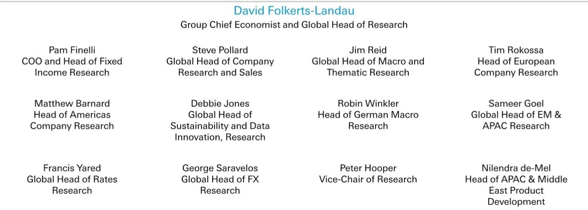

# China’s AI Chip Market Is No Longer About Hardware Parity—Supply Chain Dominance Will Decide the Winners

China’s domestic AI chip market shipped approximately 4 million units in 2025, and that number is expected to climb toward 5 million by 2026. The domestic share is projected to rise from roughly 40 percent to over 50 percent in the same period. These are not incremental shifts. They represent a structural rebalancing of a market that remains, by the account of a senior R&D director at a leading domestic AI chip company, a seller’s market. Demand far exceeds what domestic foundries can deliver, and the primary binding constraint is not design capability or architectural innovation—it is manufacturing capacity.

The implications are counterintuitive. In most technology markets, the company with the best silicon wins. In China’s AI chip market today, the company that can reliably secure wafer supply and manage a complex, capacity-constrained foundry relationship will win. Hardware capabilities among the top domestic players are largely comparable. The differentiating factor, according to the expert, is supply chain capability. This reframes the competitive landscape entirely. Observers and strategists who focus on benchmark comparisons between the Ascend 950 and the H100 are missing the point. The real contest is being decided upstream, in the foundries of SMIC and Hua Hong, where capacity is being ramped gradually and the supply-demand gap is expected to persist through at least 2027.

This article argues that the next phase of China’s AI chip market will be defined not by who builds the fastest tensor core, but by who can execute a multi-year, capital-intensive supply chain strategy under geopolitical constraints. The winners will be those that treat foundry relationships as a strategic asset, not a procurement line item.

## The Seller’s Market Will Persist Through 2027, Making Capacity Allocation the Single Most Important Strategic Variable

The expert’s assessment that the domestic AI chip market remains a seller’s market is not a casual observation. It is a structural diagnosis. With total shipments at roughly 4 million units in 2025 and an expected expansion toward 5 million in 2026, the growth trajectory is clear. Yet the domestic share, while rising from 40 percent to over 50 percent, still leaves nearly half the market dependent on non-domestic supply. The bottleneck is not design talent or software ecosystem maturity. It is physical manufacturing capacity concentrated in two foundries: SMIC and Hua Hong.

These foundries are ramping production gradually, but the expert explicitly states that the supply-demand gap will persist through 2026 and 2027. The reasons are threefold: limitations in absolute capacity, constraints in manufacturing process technology, and the lag in technology generation relative to global leaders. For a company like Huawei, which sits alone in Tier 1 of the domestic competitive landscape, this means that securing allocation from SMIC is not a commercial negotiation—it is a strategic imperative that determines whether the company can fulfill customer orders for upwards of 50,000 units at a time.

The so-what for market participants is stark. Any domestic AI chip company that cannot demonstrate a credible, multi-year capacity plan with its foundry partners will be structurally unable to compete for the largest customers, particularly the internet cloud service providers that demand high-volume supply chain reliability. Hardware performance parity is table stakes. Supply chain credibility is the differentiator.

## Hardware Parity Across Tiers Masks a Critical Divergence in System-Level Integration and Software Ecosystem Maturity

The expert’s tiered classification of domestic vendors is revealing. Huawei is the sole Tier 1 player. Tier 2 includes T-Head, Cambricon, and Kunlunxin. Tier 3 comprises Hygon and the so-called “four little dragons”—MetaX, Moore Threads, Iluvatar, and others. Tier 4 is the long tail of emerging smaller players.

The critical insight is not the ranking itself, but the expert’s observation that hardware capabilities across these tiers are largely comparable. Huawei’s Ascend 950, for example, is comparable to NVIDIA’s H100 and H200 in memory capacity. The gap is in compute performance and, more importantly, in system-level integration. NVIDIA’s offering is not a standalone accelerator; it is a comprehensive AI-factory architecture that spans networking, storage, software orchestration, and cluster management. Only Huawei and T-Head have even begun to partially address this holistic approach.

This distinction matters because the customer base is bifurcated. Internet CSPs prioritize performance, price-performance ratios, and robust supply chain capacity. They are sophisticated buyers who can evaluate system-level total cost of ownership. Telcos and state-owned enterprises, by contrast, value innovation and the flexibility of heterogeneous deployments, and they tend to favor Huawei. The divergence means that Tier 2 and Tier 3 players cannot simply benchmark their chips against Huawei’s specs and expect to win share. They must demonstrate that they can deliver at system scale, with software stacks that support both inference and training workloads.

## The 10:1 Inference-to-Training Ratio Reveals a Structural Weakness That Only System-Level Thinking Can Address

The domestic AI chip install base is heavily skewed toward inference workloads, with a ratio of approximately 10:1 compared to training. Current domestic chips are well-suited for inference tasks, but the expert notes that challenges persist in effectively handling training workloads, particularly for pre-training large models.

This imbalance is not a temporary artifact of market preference. It is a structural vulnerability. Inference workloads are less demanding in terms of interconnect bandwidth, memory coherency, and software framework optimization. Training, especially pre-training of frontier models, requires exactly the system-level capabilities where domestic players lag most. The H20-class specifications establish the qualification benchmark for domestic AI chips: adequate compute power, substantial memory capacity with high bandwidth, and rapid interconnect. Domestic players generally meet the hardware spec. They do not yet meet the system-level integration spec.

For observers, the implication is that the total addressable market for domestic AI chips is effectively capped at inference workloads until the system-level gap is closed. The training market will remain largely served by non-domestic alternatives or by Huawei’s proprietary ecosystem. Companies that focus solely on inference-optimized designs may achieve near-term revenue growth, but they will face a ceiling. The strategic prize is the training market, and that prize requires system-level architecture, not just chip-level performance.

## A Two-Stage Procurement Framework Reveals Why Multi-Vendor Sourcing Strategies Will Reshape the Competitive Landscape

The expert describes a customer segmentation that maps directly onto procurement behavior. Internet CSPs and telco/SOEs have distinct priorities, but both groups follow a two-stage qualification process: an initial sampling and admission phase, followed by rigorous procurement benchmarks. Critically, buyers commonly adopt a multi-vendor sourcing strategy to mitigate risks.

This procurement framework has second-order implications that are not immediately obvious. First, it means that no single vendor, not even Huawei, can expect to be a sole supplier to a major CSP. The multi-vendor strategy is a risk management tool, not a preference for diversity. Second, it means that Tier 2 and Tier 3 players have a viable path to revenue even if they are not the primary supplier. They can secure a secondary allocation in a CSP’s procurement basket, provided they meet the qualification benchmarks.

The decision framework for a domestic AI chip company is therefore clear. The first priority is to get through the sampling phase with at least two major CSPs. The second priority is to demonstrate supply chain reliability for volumes of at least 10,000 to 20,000 units, which is the minimum threshold to be considered a credible secondary supplier. The third priority is to offer a differentiated capability—either in software compatibility, as some vendors excel in this area, or in pricing, which varies across market segments and product cycles.

For a company like Cambricon or Kunlunxin, the strategy is not to out-benchmark Huawei. It is to become the reliable second source for a major CSP’s inference cluster. That is a viable and profitable position, but it requires a fundamentally different go-to-market approach than the one that has characterized the industry to date.

## The Growth Outlook of Over 30 Percent CAGR Is Realistic Only for Companies That Solve the Foundry Constraint

The expert expects a compound annual growth rate of over 30 percent for domestic AI chip shipments over the next two to three years. This is an aggressive but plausible forecast, given the demand dynamics and the localization trend. However, it is not a forecast that applies uniformly across all vendors. The growth will accrue disproportionately to companies that have secured foundry capacity.

The reason is simple. The supply-demand gap is not going to close before 2027. If total shipments grow from 4 million to 5 million units, and the domestic share rises from 40 percent to over 50 percent, that implies domestic shipments growing from roughly 1.6 million to 2.5 million units—an increase of 900,000 units. That additional capacity must come from SMIC and Hua Hong. These foundries have limited ability to scale, and they will allocate capacity to customers based on strategic relationships, pre-paid commitments, and proven yield track records.

The companies that are investing now in long-term capacity agreements, joint development programs, and process technology co-optimization will be the ones that capture the growth. Companies that treat foundry allocation as a quarterly negotiation will find themselves permanently on the waiting list. This is the central strategic insight of the entire market update: the bottleneck is not in the design house, it is in the fab. The winners will be those that treat the foundry as a strategic partner, not a supplier.

*For informational purposes only. Portions may be generated, translated, summarized, or edited with AI assistance based on source materials and may contain omissions or errors. Please verify independently. This is not professional advice.*

For informational purposes only. Portions may be generated, translated, summarized, or edited with AI assistance based on source materials and may contain omissions or errors. Please verify independently. This is not professional advice.

