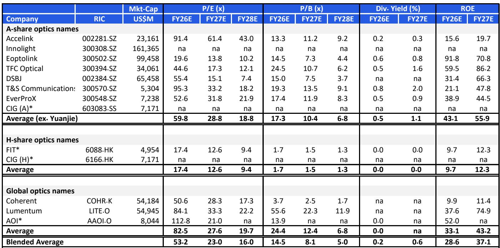
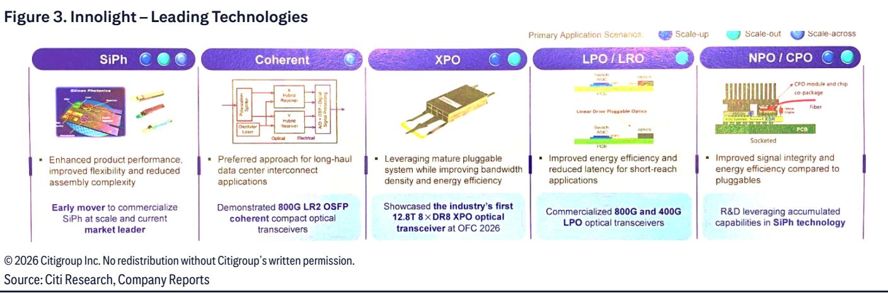
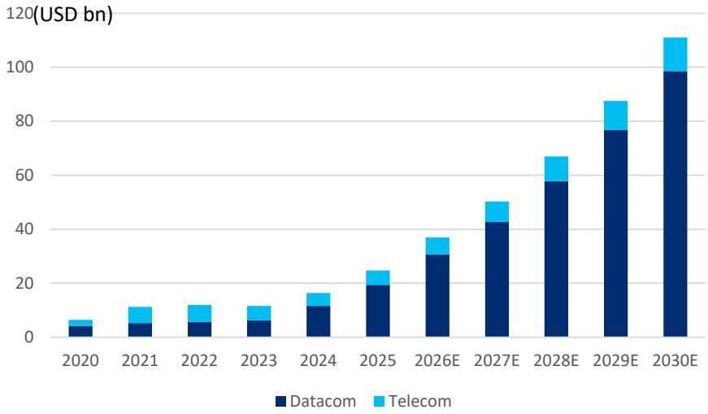

# Optical Interconnects Are Becoming the Physical Bottleneck of AI Scaling, and One Company Is Positioned to Capture the Majority of the Value Shift

Global AI capital expenditure is projected to reach USD 6.1 trillion between 2026 and 2030, more than five times the USD 0.9 trillion spent from 2021 to 2025. Within that massive wave, a single category of infrastructure is being transformed from a commodity component into a strategic chokepoint: optical interconnects. The global datacom optical interconnect market is forecast to grow from USD 19.4 billion in 2025 to USD 98.6 billion by 2030, a 33.8 percent CAGR. This is not merely a growth market. It is a market undergoing a structural re-rating, driven by the fact that copper can no longer satisfy the bandwidth, latency, and power demands of AI clusters at scale.

The company at the center of this shift is Zhongji Innolight, which has held the number-one global position in optical interconnect solutions for five consecutive years, capturing 21.2 percent market share by revenue in 2025. More important than its current share is the trajectory of its competitive advantages. Innolight was the first to launch 400G, 800G, and 1.6T optical transceivers globally. Its early and deep investment in Silicon Photonics technology, initiated in 2017, now means that more than 50 percent of its high-speed products already use SiPh, a technology whose penetration in the global datacom market is expected to rise from 38 percent in 2025 to 73 percent by 2030.

The financial implications are striking. Analysts forecast Innolight can deliver 129 percent revenue CAGR and 149 percent net profit CAGR from 2025 to 2028. These numbers are not hypothetical. They are grounded in a concrete capacity expansion plan, a clear product migration path from 800G to 1.6T to 3.2T, and a supply chain strategy that combines global sourcing with domestic diversification. For any observer or strategist evaluating the AI infrastructure buildout, understanding how Innolight is positioned to capture value across the entire optical interconnect stack is no longer optional. It is foundational.

## The Speed of Optical Migration Is Accelerating, and Each New Generation Brings a Step-Change in Revenue Per Unit

The optical transceiver market has historically followed a three-to-four-year product cycle. 100G Serdes entered commercialization in 2016, 400G in 2019, 800G in 2023, and 1.6T in 2025. What is different this time is not the rhythm but the magnitude. 1.6T accounted for approximately 4 percent of the global datacom optical interconnect market in 2025. By 2030, it is forecast to reach 45 percent. Meanwhile, 3.2T is expected to emerge in 2027 and expand to 32 percent of the market by 2030. The implication is clear: the industry is not just moving to higher speeds; it is compressing the adoption curve for successive generations, meaning that the revenue pool is shifting toward the highest-value products faster than in previous cycles.

Innolight's shipment mix reflects this reality. The company is projected to ship 30.1 million optical transceivers in 2026, 60.2 million in 2027, and 96.4 million in 2028. Critically, the proportion of high-speed products, defined as 800G or above, is expected to rise from 86 percent of total shipments in 2026 to 98 percent by 2028. This is not a volume story alone. It is a value story. High-speed transceivers carry significantly higher average selling prices and margins than legacy products. As 800G peaks in 2025 and 2026 and then declines to 16 percent of the market by 2030, Innolight's ability to front-run the transition to 1.6T and 3.2T means it is capturing the most profitable part of the product lifecycle.

The strategic takeaway for decision-makers is that optical interconnect investment decisions should not be based on aggregate market growth alone. They must be based on the speed tier migration curve. Companies that can align their production capacity and technology roadmap with the 1.6T and 3.2T inflection points will capture disproportionate value. Those that lag will be left competing in a shrinking 400G and 800G market where pricing pressure intensifies.

## Silicon Photonics Is Not a Future Technology. It Is the Present Competitive Moat, and It Is Deepening

Silicon Photonics is often discussed as an emerging technology, but the data suggests it has already crossed the adoption chasm. According to industry research, SiPh penetration in global datacom optical interconnects stood at 38 percent in 2025 and is forecast to reach 73 percent by 2030. Innolight's advantage here is not theoretical. The company began its R&D investment in SiPh-based optical transceivers in 2017, making it an early mover to commercialize the technology at scale. By the first quarter of 2026, products utilizing SiPh technology constituted approximately 70 percent of Innolight's high-speed product portfolio by revenue.

Why does SiPh matter strategically? Traditional optical transceivers rely on indium phosphide or gallium arsenide substrates, which are more expensive, less scalable, and harder to integrate with silicon electronics. SiPh allows optical components to be fabricated using standard CMOS processes, enabling higher integration, lower power consumption, and lower cost at scale. As AI clusters demand ever-higher bandwidth densities, SiPh becomes not just a cost advantage but a technical necessity. The 800G LR2 OSFP coherent compact optical transceiver that Innolight has demonstrated, along with the industry's first 12.8T 8xDR8 XPO optical transceiver showcased at OFC 2026, are examples of how SiPh enables performance that traditional approaches cannot match.

For a company evaluating its supply chain or technology partnerships, the implication is straightforward. SiPh is becoming the dominant optical platform. Suppliers that have deep SiPh expertise, production scale, and a proven track record of commercial deployment will be the ones that can guarantee delivery and performance. Innolight's 70 percent SiPh penetration in high-speed products is not a snapshot. It is a signal that the company has already internalized the technology transition that the rest of the market is still pursuing.

## Capacity Expansion Is the Binding Constraint, and Innolight Has Already Solved It at Global Scale

In a market growing at 33.8 percent CAGR, the ability to deliver product is as important as the ability to design it. Innolight's production capacity reached 28.1 million units in 2025, representing 2.9 times growth versus 2023. The company operates manufacturing bases in Suzhou, Chengdu, Tongling, Taiwan, and Thailand, with overseas capacity accounting for 71 percent of total production in 2025. This geographic diversification is not incidental. It is a deliberate hedge against geopolitical and trade risks, and it also positions the company closer to its major customers, 90 percent of whose revenue came from non-China markets in 2025.

The forward trajectory is even more telling. Capacity is expected to expand 100 percent year-over-year in 2026 and more than 100 percent in 2027. These are not aspirational targets. They are backed by a differentiated new product introduction process that uses highly adaptive equipment, streamlined production processes, and AI applications to accelerate the ramp from prototype to mass production. In an industry where time-to-market can determine whether a customer secures a generation of AI infrastructure, Innolight's ability to scale capacity faster than competitors is a structural advantage.

For a procurement officer or supply chain strategist, the critical question is not whether demand for optical interconnects will grow. It is which suppliers can actually fulfill the orders. Capacity constraints are already a reality in the industry, and as the transition to 1.6T and 3.2T accelerates, the bottleneck will tighten. Innolight's multi-year framework agreements with global premier suppliers for key components such as PMIC, DSP, and EML, combined with its cultivation of domestic supply chains, create a resilience that is rare in this market. The company's delivery track record and cost-competitive supply are not marketing claims. They are the output of a supply chain strategy that treats procurement as a competitive weapon.

## A Decision Framework for Evaluating Optical Interconnect Exposure in an AI Portfolio

The following framework is designed for research professionals, corporate strategists, and supply chain managers who need to assess their exposure to the optical interconnect value chain. It is not a checklist. It is a logic tree that surfaces the key variables that will determine winners and losers.

First, assess speed tier exposure. The value in this market is migrating from 400G and 800G to 1.6T and 3.2T. Any company whose revenue is concentrated in legacy speeds faces margin compression and volume decline. The question to ask is: what percentage of current and projected revenue comes from products at 800G or above, and how fast is that share increasing? Innolight's projection of 98 percent high-speed shipments by 2028 sets a benchmark.

Second, evaluate technology platform. SiPh penetration is forecast to nearly double by 2030. Companies that have not already commercialized SiPh at scale will face a catch-up cost that erodes margin. The key metric is the percentage of high-speed product revenue derived from SiPh. Anything below 50 percent in 2026 should be considered a risk factor.

Third, analyze capacity and supply chain geography. The ability to deliver 30 million units per year, with the majority produced outside mainland China, is a competitive differentiator. Questions to ask include: what is the current production capacity, what is the planned expansion rate, and what percentage of capacity is located in geopolitically stable regions? Innolight's 71 percent overseas capacity and 100 percent-plus annual expansion target provide a clear benchmark for what leadership looks like.

Fourth, examine customer concentration and diversification. Serving 90 percent of revenue to non-China markets and maintaining relationships with a majority of global leading CSPs and AI computing providers indicates a diversified and sticky customer base. A company that relies on a single hyperscaler for more than 30 percent of revenue carries concentration risk that is not present in Innolight's model.

Fifth, consider the R&D pipeline beyond 3.2T. The industry is already developing XPO, NPO, and CPO technologies for scale-up connectivity. Companies that have demonstrated progress in these areas, as Innolight has with its commercialization of 800G and 400G LPO transceivers and R&D on NPO and CPO solutions, are positioning for the next cycle. Those that are still investing in 800G alone are already behind.

## The Market Is Not Cyclical. It Is Structural, and the Scale of the Opportunity Is Underestimated

One of the risks cited in any analysis of optical interconnects is demand cyclicality. That framing is misleading. The current demand surge is not driven by a single product cycle or a single customer. It is driven by a fundamental architectural shift in how AI data centers are built. Scale-out networks, which accounted for 77 percent of datacom optical interconnect demand in 2025, are forecast to grow at 19.4 percent CAGR through 2030. Scale-up networks, which replace copper within the rack, are projected to grow at 297.7 percent in the same period. Scale-across networks, a niche today, are forecast to grow at 117.4 percent CAGR and reach 7 percent of the market by 2030.

These are not incremental growth rates. They are exponential. And they are driven by the fact that AI training and inference clusters require bandwidth densities that copper cannot support. The transition from copper to optical within the rack alone represents a market that is being created from near zero. The total global optical interconnects market is forecast to reach USD 111 billion by 2030, from USD 24.8 billion in 2025. To put that in context, the CAGR of 31.6 percent over 2026 to 2030 is more than double the growth rate of the semiconductor industry as a whole.

The risk is not that demand will slow. The risk is that supply will not keep up. Innolight's capacity expansion, technology leadership, and supply chain resilience are not just growth drivers. They are the mechanisms by which the company ensures it can capture the value of a market that is expanding faster than the industry can serve it. The companies that understand this distinction, and act on it, will be the ones that benefit from the most significant infrastructure buildout in the history of computing.

*For informational purposes only. Portions may be generated, translated, summarized, or edited with AI assistance based on source materials and may contain omissions or errors. Please verify independently. This is not professional advice.*

For informational purposes only. Portions may be generated, translated, summarized, or edited with AI assistance based on source materials and may contain omissions or errors. Please verify independently. This is not professional advice.

