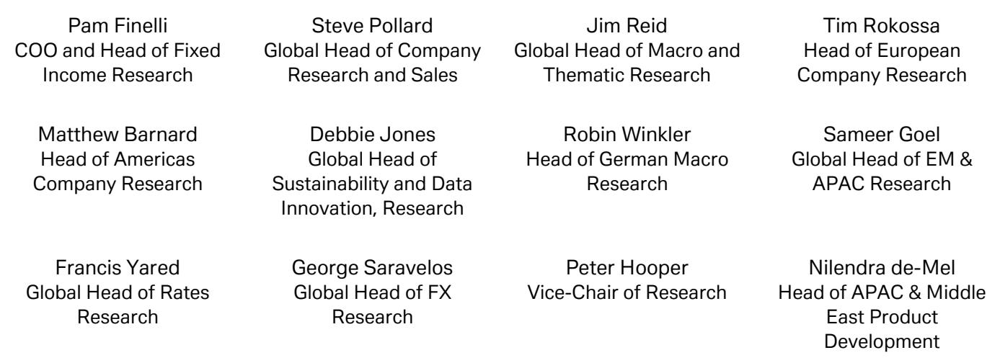
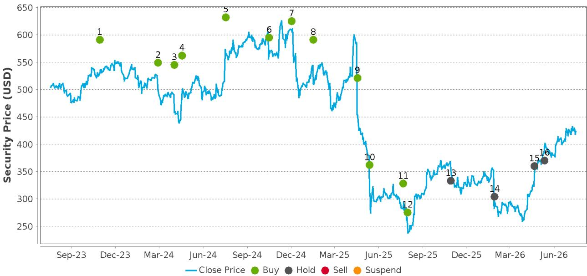

# When a Beat-and-Raise Fails to Convince the Market: The Strategic Paradox at UnitedHealth Group

UnitedHealth Group reported an exceptionally strong second quarter in 2026, delivering adjusted earnings per share of $6.38 against consensus expectations of $4.89, a beat of roughly 30 percent. The company raised its full-year 2026 adjusted EPS guidance by approximately $1.50 at the midpoint to a range of $19.50 to $20.00, and it tightened its medical loss ratio guidance by roughly 70 basis points. The shares initially surged nearly 9 percent in early trading. By the close, they had given back almost all of that gain, ending the session up only 1 percent. The entire managed care sector sold off alongside the leader.

This price action is the critical starting point for any strategic reading of the quarter. It signals that the market is no longer rewarding operational excellence in isolation. The dominant concern has shifted from whether UnitedHealth can execute to what the execution implies about the sustainability of earnings growth across the sector and within the company's own portfolio. The quarter was not dismissed because it was weak. It was dismissed because the strength was already discounted, and the remaining uncertainties—particularly in commercial insurance margins—are now the only variables that matter for forward valuation.

The thesis of this article is straightforward: UnitedHealth Group's Q2 2026 results confirm the company is successfully navigating the near-term headwinds in Medicare Advantage and Medicaid that defined 2025 as a transition year. However, the margin recovery story is now bifurcated. The Optum platform is recovering faster than expected, while the commercial insurance business is deteriorating more slowly but more persistently than previously modeled. The net effect is that UnitedHealth's 13 to 16 percent long-term EPS growth algorithm remains intact, but the path to it now depends on a commercial margin recovery that management explicitly pushed past 2027. Investors who focus only on the beat will miss the structural shift in how this company's earnings are composed.

## The Q2 Beat Was Broad-Based, but the Composition Reveals a Concentrated Recovery

UnitedHealth's second-quarter results were not a single-line-item surprise. Total revenue of $112.0 billion exceeded the Street's $110.6 billion estimate. The consolidated medical loss ratio of 86.7 percent beat consensus by 170 basis points, helped by $860 million of net favorable prior-period medical development, the majority of which was in-year development. Days claims payable increased to 47 days, up roughly 2.5 days year over year, providing a strong signal that reserving quality remains intact despite the favorable development. This is not a reserve release story; it is an operational underwriting story with conservative reserving as a foundation.

The most striking recovery came from OptumHealth, which reported an operating margin of 5.00 percent in the quarter, more than double the 2.1 percent the Street had modeled. Management attributed the improvement to stronger care management, operating discipline, and better payer alignment. The margin trajectory now implies a visible path from just above 2 percent in 2026 toward approximately 4 percent in 2027 and the aspirational 6 percent level in 2028. This is not aspirational in the vague sense. The quarter provided concrete evidence that the recovery is happening faster than the consensus expected.

Optum Insight also delivered a meaningful beat, with operating profit of $1.37 billion against an estimate of $943 million. However, management noted that the Q2 upside benefited from a payment integrity timing pull-forward. The longer-term AI-driven product opportunity remains intact, but the quarterly beat should not be extrapolated linearly. Optum Rx was steady, with no major investment required for the new transparency model, and scripts came in at 387 million for the quarter.

The pattern is clear: the Optum platform is outperforming, and it is doing so on the back of structural improvements in care management and technology-enabled efficiency, not on one-time factors. This is a durable source of earnings upside that the market may be underappreciating because it is being offset by a different problem.

## Commercial Insurance Is the One Offset That Changes the Earnings Calculus

The single most important negative surprise in the quarter was the commercial insurance segment. Management stated that cost trends remain stubbornly high and modestly above the prior expectation of roughly 11 percent. The drivers are not new—the No Surprises Act independent dispute resolution process, higher provider coding intensity, higher service intensity, and pharmacy cost pressure from specialty drugs, anti-inflammatories, and GLP-1s—but the persistence is worse than anticipated.

Commercial margin recovery is now expected to take longer than previously communicated, with full recovery extending past 2027. Management characterized this as a delay, not a setback. That distinction is analytically important but strategically less comforting. A delay in commercial margin recovery means that the company's overall earnings mix will shift more heavily toward Optum for a longer period. It also means that the 13 to 16 percent long-term growth algorithm, which management reiterated, now depends on a commercial turnaround that has no fixed timeline.

The commercial segment is also the largest single source of potential upside if conditions improve. The current run rate clearly pressures margins, but it also leaves room for recovery from pricing actions, administrative cost efficiency, AI-enhanced fraud and waste detection, and tighter medical cost management. The question is not whether these levers exist. They do. The question is whether they can be pulled fast enough to offset the structural cost pressures that are embedded in the commercial book.

For strategic readers, the implication is that UnitedHealth's earnings power in 2027 and 2028 will be determined less by Medicare Advantage, which is stabilizing, and more by whether commercial margins can recover from a higher-than-expected cost baseline. The company's guidance for 2026 EPS of $19.50 to $20.00, which includes prior-period development, was framed by management as the right baseline for 2027 growth. That baseline is higher than consensus, but it also embeds an assumption that commercial trends do not deteriorate further. If they do, the baseline itself becomes vulnerable.

## Medicare Advantage and Medicaid Are Stabilizing, but the Recovery Is Priced In

Medicare Advantage membership retention is now expected to be better than prior expectations, with enrollment expected to decline by approximately 1.1 million lives for the year. Medicare margins are expected to finish above 3 percent, which is a meaningful improvement from the trough. Management noted that Medicare trend remains elevated versus historical levels but is running below the initial expectation of roughly 10 percent, driven by benefit design, care management, network curation, favorable claims experience, a lighter respiratory season, and weather patterns.

Medicaid was broadly in line with expectations. Margins for 2026 are still expected to remain within the prior negative 1.0 to negative 1.7 percent range. Annualized 2026 rate impacts are expected around 6 to 7 percent but still lag elevated medical trend. This is not a recovery story yet. It is a stabilization story with a multiyear path to breakeven.

The market's reaction to the Medicare and Medicaid news was muted because the news was expected. The sector had already priced in a recovery in Medicare Advantage margins following the 2025 disruption. The fact that UnitedHealth delivered on that expectation did not provide incremental upside for the stock. What the market focused on instead was the commercial drag and the possibility that the entire managed care sector faces a similar commercial cost environment.

This is the core of the strategic paradox. UnitedHealth delivered a quarter that would have been celebrated in any other context. But because the recovery in its largest earnings driver was anticipated, and because the commercial headwind was worse than expected, the net effect on valuation was neutral at best. The stock's fade from the open tells investors that the market is now looking past the current year and demanding evidence that the commercial margin recovery is achievable within a reasonable timeframe.

## A Decision Framework for Investors: Three Variables That Will Determine UnitedHealth's Valuation Trajectory

For investors trying to assess whether UnitedHealth's current valuation of approximately 20 times forward 2027 EPS estimates is justified, three variables will determine the outcome. Each corresponds to a distinct earnings driver, and each has a different probability of upside or downside.

The first variable is the pace of OptumHealth margin expansion. The Q2 result of 5.00 percent operating margin provides a clear baseline. If OptumHealth can sustain margins at or above 5 percent for the remainder of 2026 and progress toward the 4 percent level in 2027 and 6 percent in 2028, it will generate significant upside to the current consensus. The risk is that the Q2 result included some one-time benefits or that the recovery slows as the low-hanging fruit of cost reduction is exhausted. The evidence from the quarter supports optimism, but the margin of safety is narrower than it appears because the beat was so large.

The second variable is the commercial cost trend. This is the most consequential uncertainty because it is the largest single earnings driver for UnitedHealthcare and because management has explicitly pushed the recovery past 2027. If commercial cost trends moderate in the second half of 2026 or in 2027, the earnings upside could be substantial. If they remain elevated, the company will face a multiyear grind to restore margins. The key leading indicator to watch is the independent dispute resolution process under the No Surprises Act, which has been a persistent source of cost pressure. Regulatory changes to that process could provide a material tailwind.

The third variable is capital deployment flexibility. UnitedHealth increased its guidance for cash flow from operations from $18 billion to $24 billion and doubled its share repurchase target to over $5 billion. This gives management significant optionality to support earnings per share through buybacks, even if operational earnings growth slows. The risk is that aggressive buybacks mask underlying operational weakness and leave the company with less financial flexibility if a downturn materializes. The opportunity is that disciplined deployment at current valuation levels can compound returns for shareholders over time.

These three variables are not independent. A slowdown in OptumHealth margin expansion would increase the importance of commercial cost trends. A deterioration in commercial margins would increase the importance of capital deployment. The investor who understands these interdependencies will be better positioned to evaluate the company's quarterly reports and to distinguish between noise and signal.

## The Market's Skepticism Is Rational, but It Overlooks the Structural Improvement in Optum

The sell-off in the managed care sector following UnitedHealth's report suggests that investors are applying a sector-wide discount based on the commercial cost headwind. This is rational in the sense that commercial cost pressures are not unique to UnitedHealth. However, it overlooks the degree to which UnitedHealth's diversified business model provides insulation that pure-play managed care companies lack.

OptumHealth's margin recovery is structural. It is driven by care management, operating discipline, and payer alignment that are specific to UnitedHealth's integrated model. Optum Insight's AI-driven product momentum is a multiyear opportunity that is only beginning to show in the financials. Optum Rx is steady and requires no major investment for the new transparency model. These are assets that competitors cannot replicate quickly.

The market's skepticism may also reflect a concern that the 2026 guidance, while raised, still includes prior-period development that is non-recurring. Management framed the $19.50 to $20.00 EPS range as the right baseline for 2027 growth, but that baseline includes approximately $1.49 of the Q2 beat, which itself included favorable development. If that development does not recur, the baseline for 2027 growth is lower than it appears.

This is a legitimate analytical concern, but it is also a conservative one. The company's underlying operational momentum in OptumHealth, the stabilization in Medicare Advantage, and the increased capital deployment flexibility all provide offsets. The question is whether the offsets are sufficient to overcome the commercial drag. The answer will not be clear until the second half of 2026, when the commercial cost trend for the full year becomes more visible.

For now, the strategic message is clear. UnitedHealth Group has demonstrated that it can execute in a challenging environment. The Q2 beat was real, broad-based, and supported by conservative reserving. The Optum platform is recovering faster than expected. The commercial headwind is real but manageable. The market's decision to fade the rally reflects a rational reassessment of the earnings mix and the timeline for margin recovery. It does not reflect a fundamental deterioration in the company's competitive position.

The next catalyst for the stock will not be another beat-and-raise quarter. It will be evidence that the commercial cost trend is peaking and that the margin recovery timeline can be accelerated. Until that evidence emerges, the shares are likely to trade in a range defined by the Optum recovery on the upside and the commercial drag on the downside. Investors who understand this dynamic will be better positioned to act when the next inflection point arrives.

*For informational purposes only. Portions may be generated, translated, summarized, or edited with AI assistance based on source materials and may contain omissions or errors. Please verify independently. This is not investment, legal, tax, accounting, or other professional advice.*

For informational purposes only. Portions may be generated, translated, summarized, or edited with AI assistance based on source materials and may contain omissions or errors. Please verify independently. This is not investment, legal, tax, accounting, or other professional advice.

