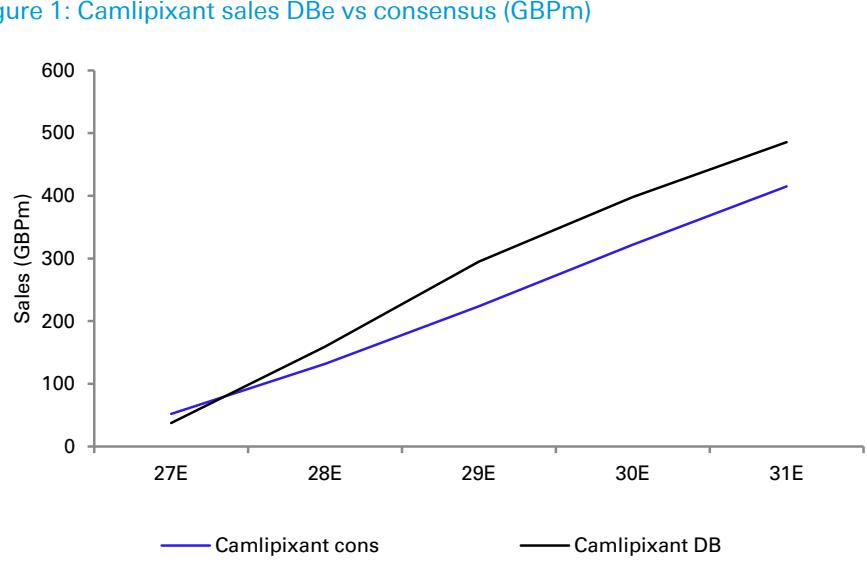
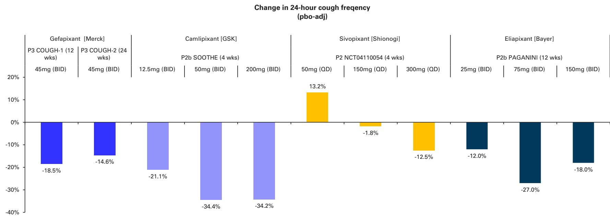
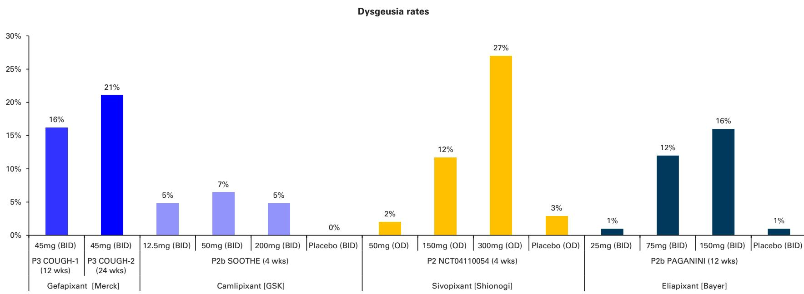
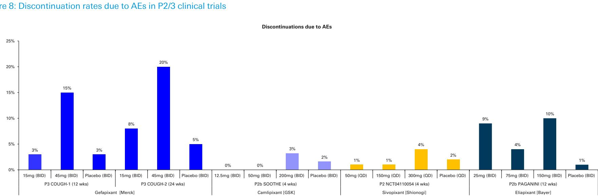
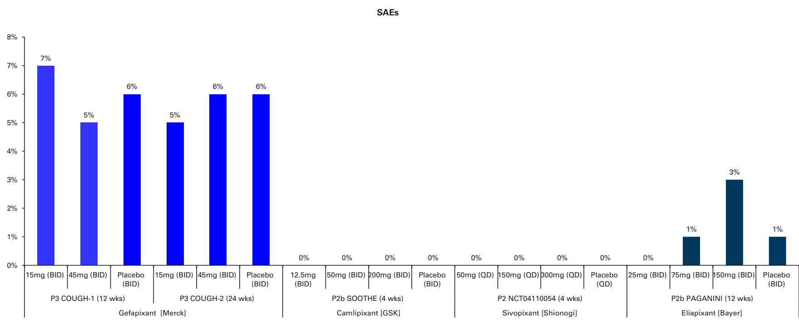
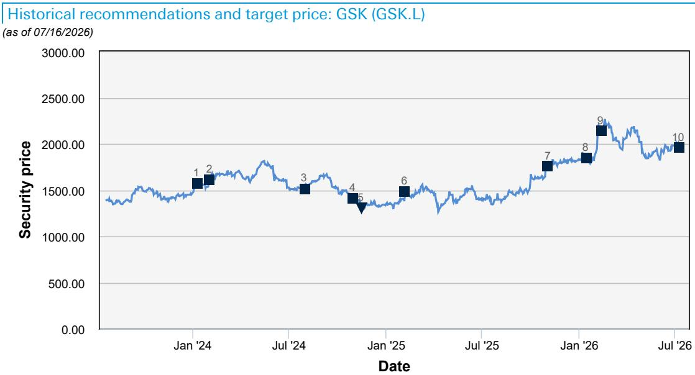
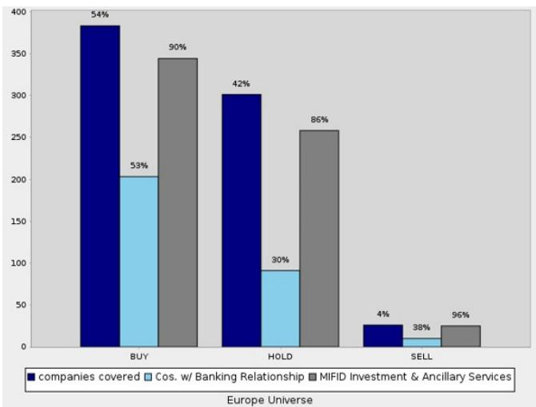

Rating
Hold

Company GSK

Europe
United Kingdom

Pharmaceuticals
Pharmaceuticals

Reuters
GSK.L

Bloomberg GSK LN

Exchange
LSE

Ticker GSK

Date
17 July 2026

Company Update

Price at 16 Jul 2026 (GBP) 1,956.00
Price Target (GBP) 1,950.00
52-week range (GBP) 2,268.00 - 1,344.00

# 保持冷静，但这座桥确实少了几块砖：camlipixant 头条分析

## 摘要分析

在我们发布详细且相对乐观的预览报告（GSK：保持冷静：他们仍需更多才能跨越400亿英镑大关（26年7月9日））之后不久，GSK并未如我们所愿迎来稍好一些的管线消息（例如，bepi（GSK：Bepi在乙肝方面取得进展：明确的管线胜利，但重磅药物基础待定（26年6月1日））），不仅未能发布改变格局的camlipixant头条（如我们预期），甚至未能发布任何积极消息（这是我们未曾预料到的）。今日的头条披露了两项重复的关键试验结果（CALM1达到主要终点，CALM2未达到），这将导致该资产被终止，并进一步拉大中期指引与市场一致预期之间的长期差距（到31年预期超过400亿英镑 vs DB/市场一致预期的350亿/370亿英镑）。这是一个明显的轻微负面信号。

## 简要细节/背景

有关详细背景，请参阅我们的camlipixant预览报告（链接见上文）。我们注意到，市场一致预期和DB对2031年的预期均约为5亿英镑（随着今日确认终止，我们将结合第二季度业绩和7月28日的“加速增长”活动，重新审视我们的模型）。

有关更广泛的GSK背景，请参阅我们的第一季度后更新报告（GSK：第一季度后：一些所谓的物美价廉的鸡开始归巢？（26年4月29日））、第二季度预览报告（欧盟制药：26年第二季度预览：大型欧盟制药公司（加上一些中小型公司）（26年7月7日））以及近期的研发电话会议纪要（GSK：研发电话会议系列反馈：肿瘤学和呼吸/免疫与炎症（26年6月5日）），以及NUVL交易分析（GSK：对NUVL的分析：它触及了一些旧有的价值，但情况是否有所改善？（+罗氏）（26年6月9日））。

## 估值与风险

Emmanuel Papadakis, Ph.D., CFA
研究分析师
+44-20-754-18522

Niall Alexander
研究分析师
+44-20-754-12185

Henrietta Boeg
研究助理
+44-20-754-10119

Kate Farrelly
研究助理

Supun Ukwatta
研究助理

## GSK camlipixant 估值

在我们对GSK集团的净现值估值（每股2396便士）中，我们将camlipixant的净现值估值为每股74便士，该估值基于2037年预期峰值销售额8亿英镑；DB的预期比市场一致预期的2031年4.15亿英镑高出17%。

目标价基于12个月市盈率，因此通常与净现值不同。

图1：Camlipixant 销售额DB预期 vs 市场一致预期（百万英镑）

来源：DB预期，公司数据

图2：慢性咳嗽临床格局

<table><tr><td>资产（公司）</td><td>作用机制</td><td>阶段</td><td>NCT编号</td><td>状态</td></tr><tr><td colspan="5">P2X3资产</td></tr><tr><td rowspan="2">Gefapixant / MK-7264 (默克)</td><td rowspan="2">P2X3受体拮抗剂</td><td rowspan="2">3</td><td>COUGH-1(NCT03449134)</td><td rowspan="2">已在欧盟、日本和瑞士获批。收到美国FDA两份完全回应函，称有效性证据不足。</td></tr><tr><td>COUGH-2(NCT03449147)</td></tr><tr><td rowspan="2">Camlipixant / BLU-5937 (GSK)</td><td rowspan="2">P2X3受体拮抗剂</td><td rowspan="2">3</td><td>CALM-1(NCT05599191)</td><td rowspan="2">CALM-1数据已内部接收，将与CALM-2数据在2026年中共同公布</td></tr><tr><td>CALM-2(NCT05600777)</td></tr><tr><td>Sivopixant / S-600918 (盐野义)</td><td>P2X3受体拮抗剂</td><td>2</td><td>NCT04110054</td><td>未达到主要终点。资产已从管线中移除。</td></tr><tr><td>Eliapixant / BAY 1817080 (拜耳)</td><td>P2X3受体拮抗剂</td><td>2b</td><td>PAGANINI(NCT04562155)</td><td>达到主要终点，但因安全性风险而终止</td></tr><tr><td>HRS-2261 (恒瑞医药)</td><td>P2X3受体拮抗剂</td><td>2</td><td>NCT05733533</td><td>1期结果于2024年1月公布。2期无更新。资产已从管线中移除。</td></tr><tr><td colspan="5">其他作用机制</td></tr><tr><td>Taplucainium (Nocion Therapeutics)</td><td>CSCB</td><td>2</td><td>ASPIRE(NCT06504446)</td><td>招募中</td></tr><tr><td>AX-8 (Axalbion)</td><td>TRPM8</td><td>2</td><td>NCT04866563</td><td>8小时时未达到主要终点。</td></tr><tr><td>Haduvio (Trevi Therapeutics)</td><td>kappa/mu-阿片受体激动剂</td><td>2</td><td>RIVER(NCT05962151)</td><td>正在特发性肺纤维化相关慢性咳嗽中推进</td></tr><tr><td>RG6341/GDC-6599 (罗氏)</td><td>TRPA1</td><td>2</td><td>NCT05660850</td><td>因未达到主要终点而终止</td></tr><tr><td>ADX-629 (Aldeyra Therapeutics)</td><td>RASP抑制剂</td><td>2</td><td>NCT05392192</td><td>已终止，以专注于下一代RASP资产</td></tr><tr><td>Orvepitant (NeRRe Therapeutics)</td><td>NK-1受体拮抗剂</td><td>2</td><td>NCT02993822</td><td>在24小时咳嗽减少方面未显示统计学显著性 - 正在特发性肺纤维化相关慢性咳嗽中推进</td></tr><tr><td>Bradanicline (Attenua)</td><td>NNR α7</td><td>2</td><td>NCT03622216</td><td>Bradanicline未减少清醒时咳嗽频率</td></tr><tr><td>Serlopitant (Menlo Therapeutics)</td><td>NK-1受体拮抗剂</td><td>2</td><td>TUSSIX(NCT03282591)</td><td>未显示统计学显著性 - 已终止</td></tr></table>

来源：公司数据

图3：慢性咳嗽临床试验

<table><tr><td>申办公司</td><td>药物名称</td><td>作用机制</td><td>阶段</td><td>NCT编号</td><td>n</td><td>主要完成日期</td><td>分组</td><td>主要终点</td><td>状态</td></tr><tr><td colspan="10">P2X3资产</td></tr><tr><td rowspan="2">默克</td><td rowspan="2">Gefapixant (MK-7264)</td><td rowspan="2">P2X3受体拮抗剂</td><td rowspan="2">3</td><td>COUGH-1(NCT03449134)</td><td>732</td><td>2020年6月</td><td>Gefapixant 15mg BID, Gefapixant 45mg BID, 安慰剂</td><td>24小时咳嗽频率，不良事件</td><td rowspan="2">已在欧盟、日本和瑞士获批。收到美国FDA两份完全回应函，称有效性证据不足。</td></tr><tr><td>COUGH-2(NCT03449147)</td><td>1317</td><td>2020年8月</td><td>Gefapixant 15mg BID, Gefapixant 45mg BID, 安慰剂</td><td>24小时咳嗽频率，不良事件</td></tr><tr><td rowspan="2">GSK</td><td rowspan="2">Camilipixant (BLU-5937)</td><td rowspan="2">P2X3受体拮抗剂</td><td rowspan="2">3</td><td>CALM-1(NCT05599191)</td><td>825</td><td>2025年12月</td><td>Camilipixant 25mg BID, Camlipixant 50mg BID, 安慰剂</td><td>24小时咳嗽频率，不良事件</td><td rowspan="2">CALM-1数据已内部接收，将与CALM-2数据在2026年中共同公布</td></tr><tr><td>CALM-2(NCT05600777)</td><td>975</td><td>2026年6月</td><td>Camilipixant 25mg, Camlipixant 50mg, 安慰剂</td><td>24小时咳嗽频率，不良事件</td></tr><tr><td>盐野义</td><td>Sivopixant (S-600918)</td><td>P2X3受体拮抗剂</td><td>2</td><td>NCT04110054</td><td>406</td><td>2020年12月</td><td>Sivopixant 50/150/300mg, 安慰剂</td><td>24小时咳嗽频率</td><td>未达到主要终点。资产已从管线中移除。</td></tr><tr><td>拜耳</td><td>Eliapixant (BAY 1817080)</td><td>P2X3受体拮抗剂</td><td>2b</td><td>PAGANINI(NCT04562155)</td><td>310</td><td>2021年6月</td><td>Eliapixant 25/75/150mg, 安慰剂</td><td>24小时咳嗽频率</td><td>达到主要终点，但因安全性风险而终止</td></tr><tr><td>恒瑞医药</td><td>HRS-2261</td><td>P2X3受体拮抗剂</td><td>2</td><td>NCT05733533</td><td>97</td><td>2024年3月</td><td>HRS-2261, 安慰剂</td><td>4周后咳嗽严重程度VAS评分</td><td>1期结果于2024年1月公布。2期无更新。资产已从管线中移除。</td></tr><tr><td colspan="10">其他作用机制</td></tr><tr><td>Nocion Therapeutics</td><td>Taplucainium</td><td>CSCB</td><td>2</td><td>ASPIRE(NCT06504446)</td><td>455</td><td>2026年4月</td><td>Taplucainium 1/3/6mg, 安慰剂</td><td>24小时咳嗽频率</td><td>招募中</td></tr><tr><td>Axalbion</td><td>AX-8</td><td>TRPM8</td><td>2</td><td>NCT04866563</td><td>108</td><td>2025年6月</td><td>AX-8, 安慰剂</td><td>4/8小时咳嗽频率</td><td>8小时时未达到主要终点。</td></tr><tr><td>Trevi Therapeutics</td><td>Haduvio</td><td>kappa/mu-阿片受体激动剂</td><td>2</td><td>RIVER(NCT05962151)</td><td>66</td><td>2025年1月</td><td>Nalbuphine 108mg, 安慰剂</td><td>24小时咳嗽频率</td><td>正在特发性肺纤维化相关慢性咳嗽中推进</td></tr><tr><td>罗氏</td><td>RG6341/GDC-6599</td><td>TRPA1</td><td>2</td><td>NCT05660850</td><td>49</td><td>2024年10月</td><td>GDC-6599, 安慰剂</td><td>24小时咳嗽频率</td><td>因未达到主要终点而终止</td></tr><tr><td>Aldeyra Therapeutics</td><td>ADX-629</td><td>RASP抑制剂</td><td>2</td><td>NCT05392192</td><td>51</td><td>2023年4月</td><td>ADX-629 300mg BID, 安慰剂</td><td>严重不良事件</td><td>已终止，以专注于下一代RASP资产</td></tr><tr><td>NeRRe Therapeutics</td><td>Orvepitant</td><td>NK-1受体拮抗剂</td><td>2</td><td>NCT02993822</td><td>315</td><td>2019年1月</td><td>Orvepitant 10/20/30mg QD, 安慰剂</td><td>清醒时客观咳嗽频率</td><td>在24小时咳嗽减少方面未显示统计学显著性 - 正在特发性肺纤维化相关慢性咳嗽中推进</td></tr><tr><td>Attenua</td><td>Bradanicline</td><td>NNR α7</td><td>2</td><td>NCT03622216</td><td>46</td><td>2019年5月</td><td>Bradanicline QD, 安慰剂</td><td>每小时清醒时咳嗽次数</td><td>Bradanicline未减少清醒时咳嗽频率</td></tr><tr><td>Menlo Therapeutics</td><td>Serlopitant</td><td>NK-1受体拮抗剂</td><td>2</td><td>TUSSIX(NCT03282591)</td><td>185</td><td>2018年8月</td><td>Serlopitant 5mg, 安慰剂</td><td></td><td>未显示统计学显著性 - 已终止</td></tr></table>

来源：公司数据

临床数据总结如下表所示。在2期临床数据公布后，多家公司选择继续在特发性肺纤维化相关慢性咳嗽领域进行开发。我们将在本报告后续的各个资产部分详细阐述P2X3临床数据。

图4：慢性咳嗽临床数据

<table><tr><td>申办公司</td><td>药物名称</td><td>作用机制</td><td>阶段</td><td>NCT编号</td><td>n</td><td>主要完成日期</td><td>分组</td><td>时间点</td><td>24小时咳嗽频率（相对百分比）</td><td>24小时咳嗽频率（安慰剂校正百分比）</td><td>味觉障碍</td><td>严重不良事件</td><td>因不良事件退出</td></tr><tr><td colspan="14">P2X3资产</td></tr><tr><td rowspan="2">默克</td><td rowspan="2">Gefapixant (MK-7264)</td><td rowspan="2">P2X3受体拮抗剂</td><td rowspan="2">3</td><td>COUGH-1(NCT0349134)</td><td>732</td><td>2020年6月</td><td>Gefapixant 15mg BID, Gefapixant 45mg BID, 安慰剂</td><td>第12周</td><td>几何计算：安慰剂：-54.8% 15mg：-51.3% 45mg：-61.0%</td><td>15mg：无减少 45mg：-16.5%</td><td>16.20%</td><td>15mg：7% 45mg：5.3% 安慰剂：5.8%</td><td>15mg：3% 45mg：15% 安慰剂：3%</td></tr><tr><td>COUGH-2(NCT0349147)</td><td>1317</td><td>2020年8月</td><td>Gefapixant 15mg BID, Gefapixant 45mg BID, 安慰剂</td><td>第24周</td><td>几何计算：安慰剂：-57.4% 15mg：-58.2% 45mg：-63.4%</td><td>15mg：无减少 45mg：-14.6%</td><td>21.10%</td><td>15mg：5.4% 45mg：5.7% 安慰剂：5.8%</td><td>15mg：8% 45mg：20% 安慰剂：5%</td></tr><tr><td>GSK</td><td>Camipixant (BILU-5937)</td><td>P2X3受体拮抗剂</td><td>2b</td><td>500/THE(NCT04676206)</td><td>310</td><td>2021年10月</td><td>Camipixant 12.5mg/50mg/200mg BID, 安慰剂</td><td>第28天</td><td>安慰剂：-28.0% 12.5mg：-43.2% 50mg：-52.8% 200mg：-52.6%</td><td>12.5mg：-21.1% 50mg：-34.4% 200mg：-34.2%</td><td>12.5mg：4.8% 50mg：6.5% 200mg：4.8% 安慰剂：0%</td><td>0%</td><td>12.5mg：0% 50mg：0% 200mg：3.2% 安慰剂：1.6%</td></tr><tr><td>盐野义</td><td>Sivopixant (S-600918)（未达到主要终点）</td><td>P2X3受体拮抗剂</td><td>2</td><td>NCT04110054</td><td>406</td><td>2020年12月</td><td>Sivopixant 50/150/300mg, 安慰剂</td><td>第4周</td><td>安慰剂：-60.38% 50mg：-55.16% 150mg：-61.08% 300mg：-65.32%</td><td>50mg：13.2% (p=0.3522) 150mg：-1.5% (p=0.9330) 300mg：-12.5% (p=0.3241)</td><td>50mg：2.0% 150mg：11.7% 300mg：27.0% 安慰剂：3.9%</td><td>0%</td><td>50mg：1% 150mg：1% 300mg：4% 安慰剂：2%</td></tr><tr><td>拜耳</td><td>Elapixant (BAY 1817080)（因安全性风险终止）</td><td>P2X3受体拮抗剂</td><td>2b</td><td>PAGANINI(NCT04562155)</td><td>310</td><td>2021年6月</td><td>Elapixant 25/75/150mg, 安慰剂</td><td>第12周</td><td>几何计算：安慰剂：-36% 25mg：-44% 75mg：-53% 150mg：-48%</td><td>25mg：-12% 75mg：-27% 150mg：-18%</td><td>25mg：1% 75mg：12% 150mg：16% 安慰剂：1%</td><td>25mg：0% 75mg：1% 150mg：3% 安慰剂：1%</td><td>25mg：9% 75mg：4% 150mg：10% 安慰剂：1%</td></tr><tr><td colspan="14">其他作用机制</td></tr><tr><td>Axalibion</td><td>AX-8（8小时时未达到主要终点）</td><td>TRPM8</td><td>2</td><td>NCT04866563</td><td>108</td><td>2025年6月</td><td>AX-8 40mg, 安慰剂</td><td>2/48小时</td><td>2小时咳嗽频率：44% vs 18%安慰剂 4小时咳嗽频率：35% vs 20%安慰剂 8小时咳嗽频率：未达到统计学显著性</td><td>2小时咳嗽频率：-26% 4小时咳嗽频率：-16% 8小时咳嗽频率：未达到统计学显著性</td><td>0%</td><td></td><td></td></tr><tr><td>Trevi Therapeutics</td><td>Haduvio（正在特发性肺纤维化相关慢性咳嗽中推进）</td><td>kappa/mu-阿片受体激动剂</td><td>2</td><td>RIVER(NCT05962151)</td><td>66</td><td>2025年1月</td><td>Nalbuphine 108mg, 安慰剂</td><td>第21天</td><td>108mg：67%</td><td>-57%</td><td>0%</td><td></td><td>15.20%</td></tr><tr><td>罗氏</td><td>RG8341/GDC-6599（因未达到主要终点而终止）</td><td>TRPA1</td><td>2</td><td>NCT05660850</td><td>49</td><td>2024年10月</td><td>GDC-6599, 安慰剂</td><td></td><td colspan="5">“在慢性咳嗽或患者感知的咳嗽严重程度方面未观察到有临床意义的改善”</td></tr><tr><td>Adeyra Therapeutics</td><td>ADX-629（已终止，以专注于下一代RASP资产）</td><td>RASP抑制剂</td><td>2</td><td>NCT05392192</td><td>51</td><td>2023年4月</td><td>ADX-629 300mg BID, 安慰剂</td><td></td><td colspan="3">“达到了统计学显著性”</td><td>0%</td><td>0%</td></tr><tr><td>NeRRe Therapeutics</td><td>Oveplant（在24小时咳嗽减少方面未显示统计学显著性 - 正在特发性肺纤维化相关慢性咳嗽中推进）</td><td>NK-1受体拮抗剂</td><td>2</td><td>NCT02938322</td><td>315</td><td>2019年1月</td><td>Oveplant 10/20/30mg QD, 安慰剂</td><td></td><td colspan="5">未显示统计学显著性</td></tr><tr><td>Attenua</td><td>Bradaricine（未显示统计学显著性 - 已终止）</td><td>NNR o7</td><td>2</td><td>NCT03622216</td><td>46</td><td>2019年5月</td><td>Bradaricine QD, 安慰剂</td><td></td><td colspan="5">治疗未减少清醒时咳嗽频率</td></tr><tr><td>Menlo Therapeutics</td><td>Seripixant（未达到主要终点 - 已终止）</td><td>NK-1受体拮抗剂</td><td>2</td><td>TUSSIX(NCT03282591)</td><td>185</td><td>2018年8月</td><td>Seripixant 5mg, 安慰剂</td><td></td><td colspan="5">未显示统计学显著性</td></tr></table>

来源：公司数据

图5：2/3期试验中安慰剂校正的24小时咳嗽频率变化

来源：公司数据

24小时咳嗽频率变化（相对值）

来源：公司数据

图7：2/3期临床试验中的味觉障碍发生率

来源：公司数据

图8：2/3期临床试验中因不良事件退出率

来源：公司数据

来源：公司数据

## GSK 研究链接（仅限6个月内）

GSK：ASH额外分析：Blenrep处于劣势？（25年12月18日）

欧盟制药：更多疫苗压力？市场影响待定（GSK/SAN/SOBI）（26年1月6日）

GSK：快速bepirovirsen分析+入门：一切可能并不像最初看起来那样美好？（26年1月7日）

欧盟制药：25年第四季度/26财年行业预览：看起来火马提前启动了（26年1月15日）

欧盟制药：血液肿瘤专家电话反馈（GMAB/GSK/NOVN/ROG）（26年1月15日）

GSK：未对RAPTURE感到兴奋，加上对VIIV、Exdensur和疫苗前景的分析（+SAN）（26年1月26日）

GSK：第四季度初步分析（26年2月4日）

GSK：GSK-第四季度后：价值增强？呼吸业务至少已脱离依赖（26年2月12日）

GSK：上市可能并非如此灵活？Exdensur简要分析（26年2月18日）

GSK：对（20）35年Winrevair对决的分析：看起来合理（26年2月25日）

GSK：HIV更新/CROI总结：双口服方案终成趋势（26年3月4日）

GSK：快速民意调查分析/交叉解读：Exdensur、Blenrep和Arexvy（+AZN）（26年3月23日）

NOVN：Remi在食物过敏中的应用：快速（迟来的）分析（+ROG/GSK）（26年3月23日）

欧盟制药：第一季度行业预览：防御性板块的防御（比喻意义）（26年3月27日）

GSK：SGO电话分析（B7H4/Jemperli）：已见红宝石，翡翠待定（26年4月13日）

GSK：第一季度初步分析（26年4月29日）

GSK：第一季度后：一些所谓的物美价廉的鸡开始归巢？（26年4月29日）

GSK：Bepi在乙肝方面取得进展：明确的管线胜利，但重磅药物基础待定（26年6月1日）

欧盟制药：ASCO周末LBA分析（AZN/GMAB/GSK/ROG）（26年6月1日）

GSK：研发电话会议系列反馈：肿瘤学和呼吸/免疫与炎症（26年6月5日）

GSK：对NUVL的分析：它触及了一些旧有的价值，但情况是否有所改善？（+罗氏）（26年6月9日）

欧盟制药：26年第二季度预览：大型欧盟制药公司（加上一些中小型公司）（26年7月7日）

GSK：保持冷静：他们仍需更多才能跨越400亿英镑大关（26年7月9日）

GSK：每周零售处方追踪（26年7月13日）

# 附录1

重要披露

\*其他信息可根据要求提供

<table><tr><td colspan="4">披露清单</td></tr><tr><td>公司</td><td>代码</td><td>近期价格*</td><td>披露</td></tr><tr><td>GSK</td><td>GSK.L</td><td>19.56 (GBp) 2026年7月16日</td><td>2, 7, 8, 14, 24, 26</td></tr></table>

\*除非另有说明，价格截至前一交易日收盘，并来自路透、彭博及其他供应商的当地交易所。其他信息来自DB、标的公司及其他来源。有关本研究报告主要标的以外的证券的建议或估计的披露，请参阅最近发布的公司报告，或访问我们网站上的全球披露查询页面：https://research.db.com/Research/Disclosures/EquityResearchDisclosures。除本报告外，重要的风险与利益冲突披露也可在 https://research.db.com/Research/Disclosures/Disclaimer 找到。强烈建议读者在投资前审阅此信息。

## 美国监管机构要求的重要披露

标有星号的披露可能也至少需要一个美国以外的司法管辖区进行披露。请参阅“非美国监管机构要求的重要披露”及解释性说明。

2. DB和/或其关联公司可能担任本公司发行的金融工具的市场做市商或流动性提供者。

7. DB和/或其关联公司在过去一年中已从本公司获得投资银行或财务顾问服务的报酬。

8. DB和/或其关联公司预计在未来三个月内寻求从本公司获得投资银行服务的报酬。

14. DB和/或其关联公司在过去一年中已从本公司获得非投资银行相关服务的报酬。

## 非美国监管机构要求的重要披露

标有星号的披露可能也至少需要一个美国以外的司法管辖区进行披露。请参阅“非美国监管机构要求的重要披露”及解释性说明。

2. DB和/或其关联公司可能担任本公司发行的金融工具的市场做市商或流动性提供者。

24. DB和/或其关联公司目前或过去12个月内与公司签订了关于提供2014/65/EU指令附件一A和B部分所述服务的协议，或在过去12个月内已或有义务（如适用）支付或收取与提供2014/65/EU指令附件一A和B部分所述服务相关的报酬。

26. 在过去12个月内，DB和/或其关联公司已因提供投资银行服务而获得报酬，或目前正在或已向本公司提供投资银行服务。

有关本研究报告主要标的以外的证券的建议或估计的披露，请参阅最近发布的公司报告，或访问我们网站上的全球披露查询页面：https://research.db.com/Research/Disclosures/EquityResearchDisclosures。除本报告外，重要的风险与利益冲突披露也可在 https://research.db.com/Research/Disclosures/Disclaimer 找到。强烈建议读者在投资前审阅此信息。

## 分析师认证

本报告中表达的观点准确反映了签署首席分析师对标的发行人和发行人证券的个人观点。此外，签署首席分析师未曾且不会因在本报告中提供特定建议或观点而获得任何报酬。Emmanuel Papadakis。

1. 2024年10月1日 买入，目标价变动 GBP 1850.00，当前价格 GBP 1570.80 Emmanuel Papadakis, Ph.D., CFA
2. 2024年2月2日 买入，目标价变动 GBP 1950.00，当前价格 GBP 1611.20 Emmanuel Papadakis, Ph.D., CFA
3. 2024年7月31日 买入，目标价变动 GBP 1850.00，当前价格 GBP 1512.00 Emmanuel Papadakis, Ph.D., CFA
4. 2024年10月30日 买入，目标价变动 GBP 1700.00，当前价格 GBP 1407.00 Emmanuel Papadakis, Ph.D., CFA
5. 2024年11月15日 下调至持有，目标价变动 GBP 1350.00，当前价格 GBP 1301.00 Emmanuel Papadakis, Ph.D., CFA

当前建议
买入
持有
卖出
未评级
暂停评级

\*\* 分析师已不在DB任职

6. 2025年2月5日 持有，目标价变动 GBP 1450.00，当前价格 GBP 1485.00 Emmanuel Papadakis, Ph.D., CFA
7. 2025年11月3日 持有，目标价变动 GBP 1600.00，当前价格 GBP 1757.00 Emmanuel Papadakis, Ph.D., CFA
8. 2026年1月15日 持有，目标价变动 GBP 1675.00，当前价格 GBP 1848.00 Emmanuel Papadakis, Ph.D., CFA
9. 2026年2月12日 持有，目标价变动 GBP 1900.00，当前价格 GBP 2141.00 Emmanuel Papadakis, Ph.D., CFA
10. 2026年7月9日 持有，目标价变动 GBP 1950.00，当前价格 GBP 1959.50 Emmanuel Papadakis, Ph.D., CFA

股票评级分布与银行关系

股票评级与分布关键

股票评级分布图描绘了以下内容：

过去12个月内被评为“买入”、“卖出”和“持有”的建议比例。这以指定区域（例如“欧洲市场”）发行的证券显示。请参阅下面的评级定义。这在图表中以“覆盖公司”柱状图表示。柱状图上显示的百分比值为比例百分比。例如，“买入”/“覆盖公司”柱状图上方显示50%意味着DB在过去12个月内覆盖的公司中有50%获得“买入”评级。

在显示“买入”、“卖出”和“持有”建议比例的三个相应柱状图旁边，我们提供了两个额外的柱状图来显示：

-
