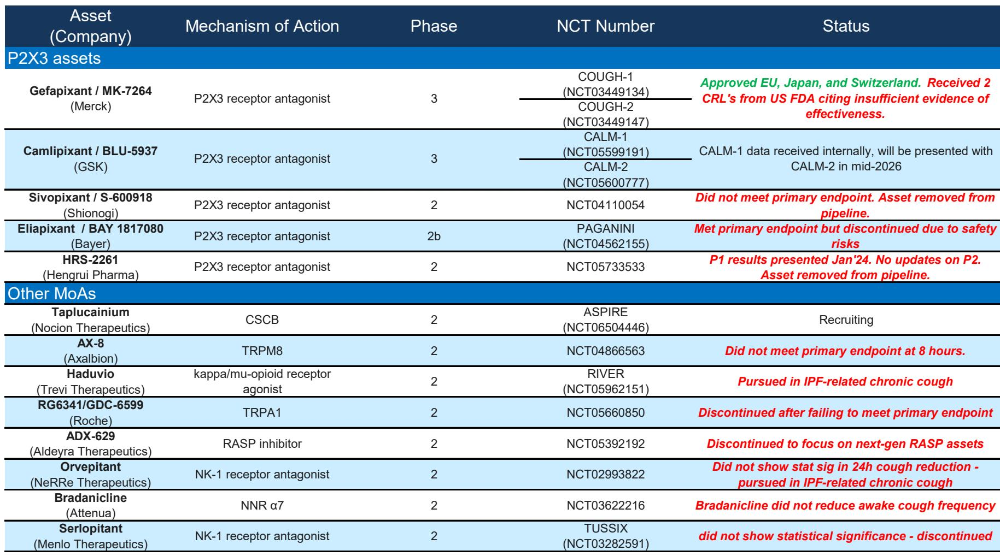
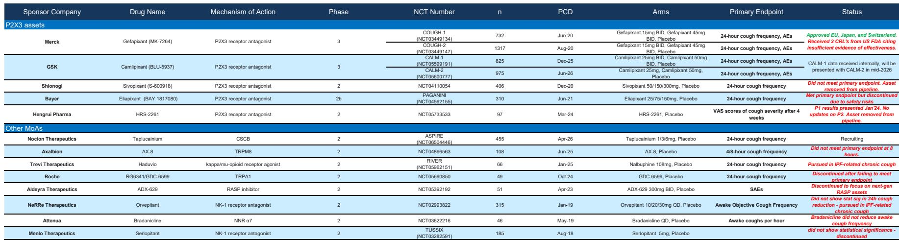
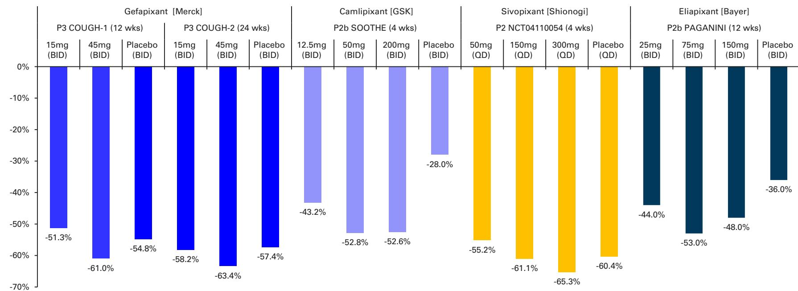

# DB：GSK慢性咳嗽管线桥墩少了几块-CALM-2未达终点

GSK在7月17日公布了一项让市场失望的临床数据。其核心在研药物camlipixant在两项III期试验中一胜一负：CALM-1达到主要终点，CALM-2未达到。DB随即发布报告，将这一结果定性为“明确的轻度谨慎”，并指出该资产将被终止开发。

这份报告的价值不在于它判断了“利空”，而在于它揭示了GSK中期营收指引与市场共识之间那道已经存在多年的缺口，如今变得更难填补。DB此前在7月9日的预览报告中曾乐观预期camlipixant可能带来“改变叙事”的正面消息，但实际结果不仅没有正面，连中性都算不上。

，与当前报价1956便士几乎持平。这不是一份恐慌性下调，而是一份冷静的重新校准。

## 1. 两项试验一胜一负，资产终止意味着中期营收缺口固化

Camlipixant的两项III期试验设计几乎对称：CALM-1入组825人，CALM-2入组975人，均以24小时咳嗽频率变化为主要终点。结果却是CALM-1达标、CALM-2未达标。这种“复制失败”在临床开发中并不罕见，但对GSK而言，这意味着整个P2X3受体拮抗剂路径在慢性咳嗽适应症上再次受挫。

DB此前对camlipixant的估值是每股74便士，基于2037年峰值销售8亿英镑的假设。如今这一估值需要归零。更重要的是，GSK的中期目标是2031年营收超过400亿英镑，而DB和共识的预估分别为350亿和370亿英镑。camlipixant的失败，让这个缺口从“可能被填补”变成了“大概率维持”。

> **KC评论：** 慢性咳嗽领域至今没有一款获得FDA批准的P2X3药物。默克的gefapixant虽在欧洲和日本获批，但两次被FDA拒绝，理由是有效性证据不足。GSK的camlipixant本有机会成为差异化产品，但CALM-2的失败让这条路径再次陷入不确定性。对于关注GSK中期营收结构的读者，这份报告提供了一个清晰的锚点：缺口约30-50亿英镑，且短期内没有明确的管线资产可以弥补。

## 2. 慢性咳嗽领域的竞争格局：P2X3路径尚未跑出赢家

DB在报告中附了一张详尽的慢性咳嗽临床格局表。从中可以看到，P2X3受体拮抗剂这条路径上，几乎所有的候选药物都遇到了问题。默克的gefapixant虽然获批，但FDA两次拒绝；拜耳的eliapixant因安全性不确定性终止；盐野义的sivopixant未达主要终点；恒瑞的HRS-2261也已从管线中移除。

其他作用机制的候选药物同样不乐观。罗氏的TRPA1拮抗剂、Aldeyra的RASP抑制剂、NeRRe的NK-1拮抗剂，均因未达终点或安全性问题而终止或调整方向。目前相对少见仍在积极招募的是Nocion Therapeutics的taplucainium，其作用机制为CSCB，但尚处于II期阶段。

这意味着，慢性咳嗽领域至今没有一个真正意义上的“标准疗法”。GSK的camlipixant失败，不是一家公司的问题，而是整个领域的研发瓶颈。对于关注这一赛道的读者，这份报告提供了一个清晰的信号：P2X3路径的成药性仍然存疑，而其他机制路径的临床数据也远未成熟。

## 3. DB的估值框架：NPV与P/E的差异如何理解

报告在估值部分做了一个重要区分：camlipixant的NPV估值为每股74便士。DB明确写道，因此通常与NPV不同”。

这一区分值得注意。NPV反映的是资产的内在价值。camlipixant的失败对NPV的冲击是直接的——每股74便士的价值归零。，以及管理层在7月28日的“加速增长”活动上能否给出新的叙事。

对于习惯用NPV框架评估药企的读者，DB的这份报告提供了一个可复用的方法：当一项核心资产失败时，先看它在NPV中的权重。前者是数学问题，后者是市场情绪问题。

## 4. 7月28日的“加速增长”活动将成为下一个关键节点

DB在报告中提到，将在Q2业绩和7月28日的“加速增长”活动后更新模型。这意味着，camlipixant的失败虽然是一个明确的谨慎信号，但GSK的完整叙事尚未落地。

报告还引用了此前一系列研究，包括bepirovirsen在乙肝领域的正面数据、NUVL交易的分析、以及Q1业绩后的评估。这些线索共同指向一个判断：GSK的管线并非全无亮点，但camlipixant的失败让中期营收目标的实现路径变得更窄。

对于关注GSK的读者，7月28日的活动值得留意。管理层能否在camlipixant失败后给出新的增长支点，将直接影响市场对GSK中期叙事的信心。

For informational purposes only. Portions may be generated,translated,summarized,or edited with AI assistance based on source materials and may contain omissions or errors. Please verify independently. This is not investment,legal,tax,accounting,or other professional advice.

For informational purposes only. Portions may be generated,translated,summarized,or edited with AI assistance based on source materials and may contain omissions or errors. Please verify independently. This is not investment,legal,tax,accounting,or other professional advice.

