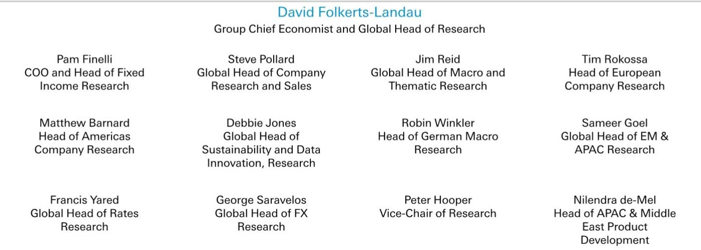
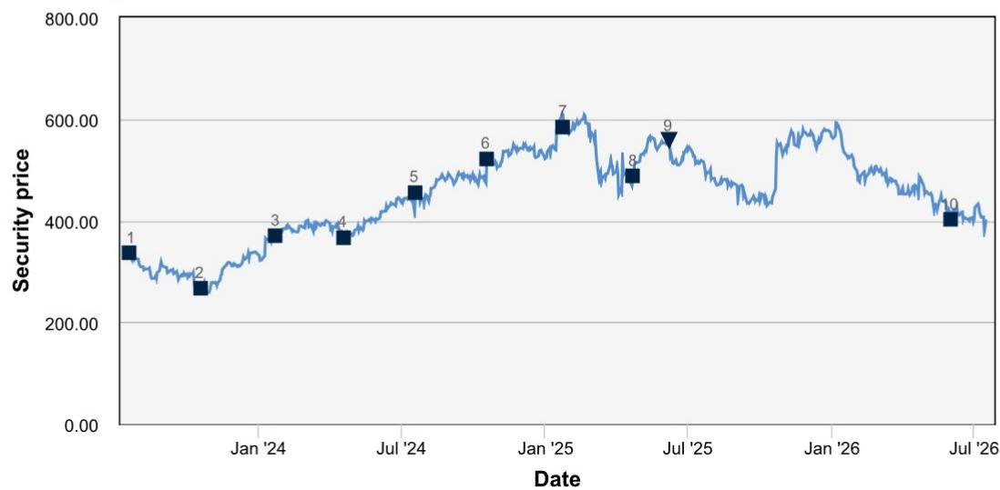
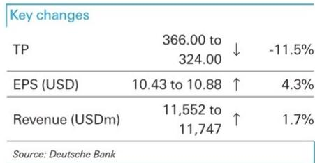

# DB：达芬奇手术机器人三重护城河正被侵蚀

二季度全球手术量增长15%，看似符合预期，但美国市场仅增长12%，低于市场已经调低后的期望。更值得关注的是，这家长期保持“beat and raise”记录的公司，这次维持了全年指引，没有上调。对于习惯了超预期的读者来说，这本身就是信号。

DB在最新报告中维持了对直觉外科的公司观点。核心逻辑不是单一季度的波动，而是支撑其高估值的几道护城河正在同时变薄。

## 1. 美国本土手术量增速节奏变化，ACA补贴削减的影响比预期更持久

二季度美国达芬奇手术量增速仅12%，低于市场预期。公司管理层将原因指向ACA保费补贴削减——这一政策变化导致部分患者推迟或放弃择期手术，包括良性子宫切除术、胆囊切除术和疝修补术等机器人手术的主要类别。

虽然强生、雅培等同行在随后发布的业绩中并未提及类似冲击，但直觉外科的数据表明，其手术量对医保政策变化的敏感度可能高于同行。报告将全年美国手术量增速预测下调110个基点至12.1%。

> **KC评论：** 这里的关键不是季度波动本身，而是公司历史上首次在手术量上“不调高”。对于一家长期以beat and raise著称的公司，维持指引已经是一种隐性下调。

## 2. 中国市场的断崖式下滑，正在改变海外增长叙事

中国市场曾是直觉外科海外增长的重要引擎。过去几年，公司每年在中国安装55至60台达芬奇系统。但今年二季度仅安装了2台，上半年累计6台，而去年同期为29台。

原因很直接：本土手术机器人企业的竞争正在挤压达芬奇的招标中标率。更关键的是，随着存量设备利用率接近上限，中国市场的装机仍在调整正在传导至手术量增速——过去中国市场的技术采纳对全球手术量增长有显著正向贡献，现在这个贡献正在消失。

印度市场同样面临挑战。虽然二季度手术量表现强劲，但DB与印度大型医院系统的沟通显示，低价位的本土和中国产机器人正在持续抢占装机份额。达芬奇5虽然获得了印度监管批准，但在一个对价格高度敏感的市场，高端机型的渗透空间有限。

## 3. 耗材业务的两重不确定性：Extended Use与翻新器械

直觉外科的耗材（I&A）业务是其利润核心，也是支撑其高估值的关键。但未来两年，这个业务将面临两重结构性不确定性。

第一重来自公司自身。2027年上半年将启动第二轮Extended Use计划，允许客户对部分高用量器械执行更多次手术。参考2021年第一轮Extended Use的经验——当时导致单台手术耗材收入下降约7%——第二轮的影响同样不可忽视。公司的战略逻辑是降低单次手术成本以扩大整体市场，但DB认为，这同时也是应对翻新器械竞争和未来更多竞品进入美国市场的防御性动作。

第二重来自外部。翻新器械的渗透正在加速。以单极剪刀为例——这是耗材业务中最大的单品SKU，约占该板块销售额的14%——翻新器械已占据约5%至7%的市场份额。随着更多翻新产品获批上市，这一比例在2027至2028年将持续上升。

> **KC评论：** 耗材业务曾是直觉外科最深的护城河——客户一旦安装达芬奇系统，就会持续购买原厂器械。翻新器械和Extended Use正在从两个方向侵蚀这条护城河：一个从外部抢份额，一个从内部主动降价。

## 4. 估值溢价的基础正在松动

直觉外科的估值长期享有显著溢价。DB此前的估值框架假设其PEG比率比大型医疗科技同行（史赛克、爱德华生命科学、美敦力）高出75%。现在，随着美国手术量增速节奏变化、中国和印度市场面临竞争、耗材业务承受双重不确定性，这一溢价的基础正在松动。

，隐含约19%的节奏变化空间。上行不确定性方面，报告认为主要来自翻新器械推广不及预期、手术量超预期增长或达芬奇5装机超预期——但这些情景在当前数据下概率有限。

对于关注医疗科技赛道的读者而言，这份报告提供了一个观察框架：当一家公司的护城河从多个方向同时受到侵蚀时，估值溢价的调整往往不是线性的，而是阶梯式的。

For informational purposes only. Portions may be generated,translated,summarized,or edited with AI assistance based on source materials and may contain omissions or errors. Please verify independently. This is not investment,legal,tax,accounting,or other professional advice.

For informational purposes only. Portions may be generated,translated,summarized,or edited with AI assistance based on source materials and may contain omissions or errors. Please verify independently. This is not investment,legal,tax,accounting,or other professional advice.

