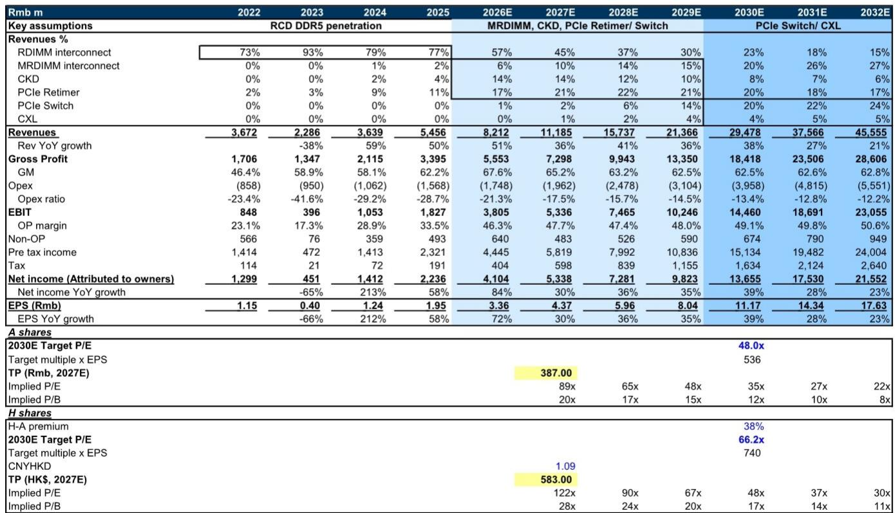
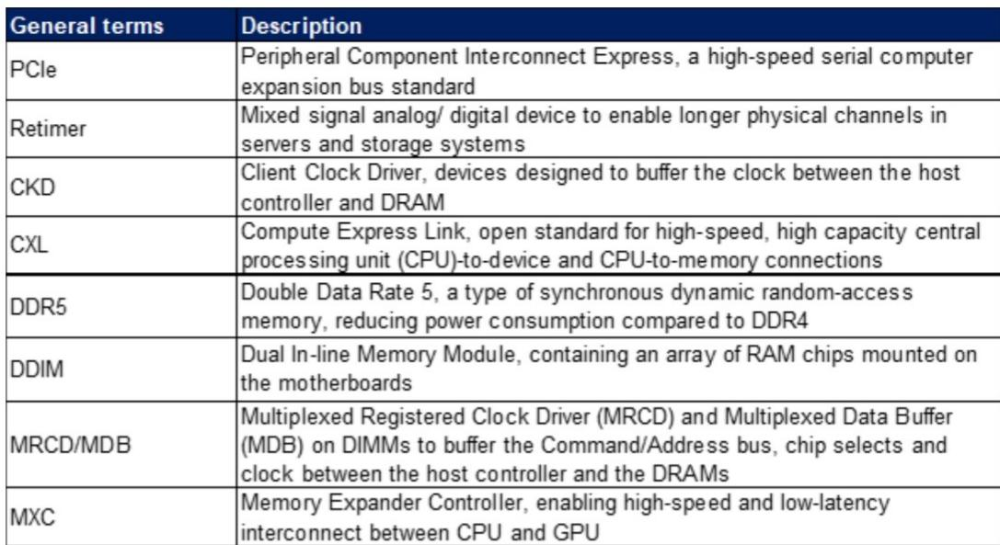
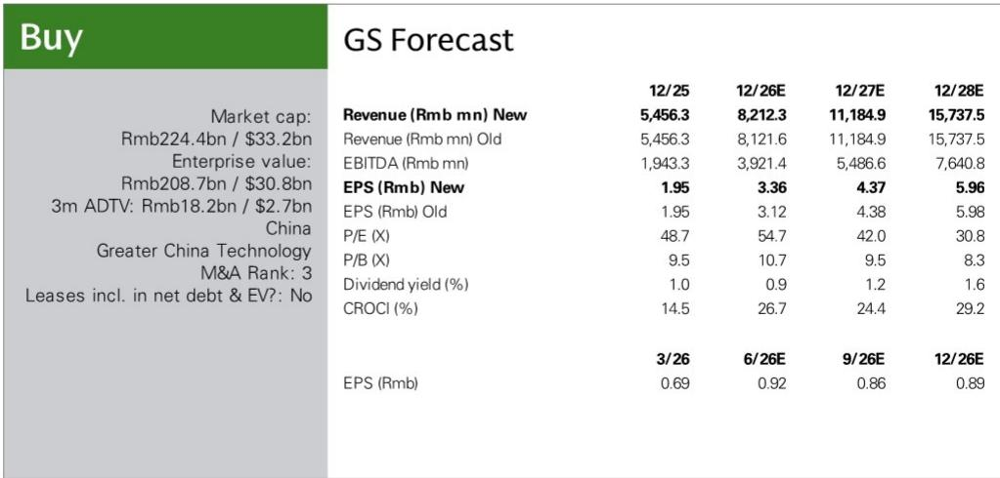

# GS：澜起科技DDR5代际升级推动净利润超预期

澜起科技2026年第二季度净利润指引中值达到10亿至12亿元人民币，同比增幅61%至77%，超出GS此前预期约48%。这份来自GS的研报揭示了一个关键信号：推动业绩超预期的并非市场普遍关注的AI算力芯片，而是内存接口芯片的代际升级——DDR5 Gen-3和Gen-4产品占比持续提升，叠加PCIe Retimer等新品的强劲增长。

报告指出，澜起科技第二季度营收19亿元，同比增长34%，其中互联芯片业务同比增长28%。管理层明确表示，DDR5 Gen-3和Gen-4接口芯片的贡献在第二季度继续扩大，直接拉动了产品组合优化和毛利率改善。公司已开始向客户交付Gen-5接口芯片，并正在开发下一代DDR6 Gen-1产品。在MRCD/MDB领域，Gen-2产品正在客户验证中，GS预计加速采用将从2027年开始。

> **KC评论：** 澜起科技的增长逻辑正在从“DDR5渗透率提升”切换到“DDR5内部代际升级”。Gen-3和Gen-4产品单价和毛利率显著高于早期版本，这才是净利润超预期48%的真正来源。PCIe Retimer作为第二增长曲线，其收入占比已从2024年的9%提升至2026年预期的17%，正在成为新的利润引擎。

## 1. 产品组合升级是净利润超预期的核心变量，而非规模效应

GS将2026年净利润预测上调约8%，主要依据是第二季度业绩指引中产品组合升级带来的毛利率提升和非营业利润超预期。从利润表看，2026年预期毛利率从67.3%上调至67.6%，净利率从46.9%大幅上调至50.0%。这一变化并非来自营收规模扩张——营收仅上调1%——而是来自高毛利新品占比提升带来的结构性改善。

报告中的收入结构拆解显示，RDIMM互联芯片收入占比将从2025年的77%降至2026年的57%，而MRDIMM互联、CKD、PCIe Retimer等新产品的合计占比将从17%升至37%。这种产品结构的代际切换，使得公司在营收增长51%的同时，净利润增速达到84%。

## 2. 代理AI和CPU负载加重正在重塑内存接口芯片的需求逻辑

研报提出一个值得关注的长期判断：随着代理AI的普及和CPU、内存管理工作负载的加重，市场对内存接口芯片的需求将持续上升。这不是一个短期周期逻辑，而是技术架构层面的结构性变化。澜起科技的产品线覆盖了MRCD/MDB、CXL、PCIe和光互联IC，这些产品恰好对应了AI时代内存带宽和互联效率的核心瓶颈。

从收入预测看，PCIe Switch和CXL产品将从2027年开始加速放量，预计到2032年PCIe Switch收入占比将达到24%，成为仅次于MRDIMM的第二大收入来源。这意味着公司正在从单一的内存接口芯片供应商，向数据中心互联芯片平台型公司演进。

## 3. 估值框架的核心假设是2027-2032年盈利预测不变，但产品结构将发生根本性变化

基于48.0倍2030年预期市盈率，对应34%的2020-2031年平均EPS增速，较相关市场有38%的溢价。值得注意的是，2027年至2032年的盈利预测基本未作调整，但收入结构在这段时间内将发生根本性变化。

根据报告中的收入占比预测，到2032年，RDIMM互联收入占比将从2025年的77%降至15%，而MRDIMM、PCIe Retimer、PCIe Switch和CXL的合计占比将从13%升至73%。这意味着公司未来十年的增长驱动力将完全不同于当前市场认知。对于关注半导体产业链的读者而言，理解这一结构性变化比关注季度业绩波动更为重要。

> **KC评论：** GS估值模型的核心假设是2030年目标市盈率48倍，这一倍数来自同业的市盈率与净利润增长相关性。但产品结构的变化意味着公司未来面临的竞争格局和客户结构也将改变——从服务器内存模组市场进入更广阔的互联芯片市场，竞争对标将从Rambus转向Broadcom和Astera Labs。这是估值框架中尚未充分定价的变量。

For informational purposes only. Portions may be generated,translated,summarized,or edited with AI assistance based on source materials and may contain omissions or errors. Please verify independently. This is not investment,legal,tax,accounting,or other professional advice.

For informational purposes only. Portions may be generated,translated,summarized,or edited with AI assistance based on source materials and may contain omissions or errors. Please verify independently. This is not investment,legal,tax,accounting,or other professional advice.

