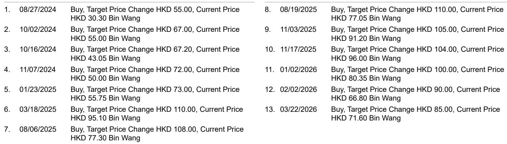
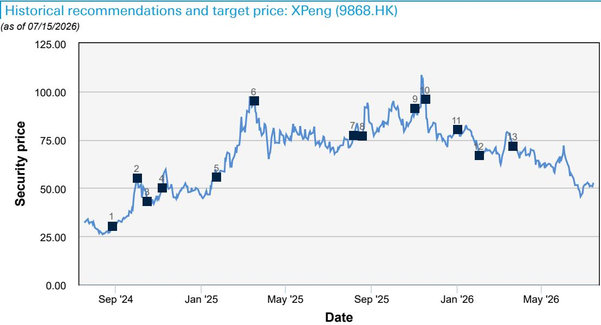

# 小鹏Mona L03发布：设计驱动的定价策略正在重塑市场格局

2026年7月16日，小鹏汽车正式发布Mona L03 SUV，最终售价区间为12.4万至15.7万元人民币，较预售价格下调约1万元，成为公司产品线中价格最亲民的SUV车型。在最终价格公布后的前七分钟内，该车型获得了2万个不可取消订单。这不仅仅是一次成功的产品发布，更表明市场对竞争策略的反馈机制正在发生根本性转变。

核心逻辑清晰：在智能驾驶能力迅速成为行业标配而非差异化优势的背景下，决定性的竞争变量已转向设计驱动的定价策略。小鹏在过去两年中两次验证了这一模式——先是2024年Mona M03轿车实现月均销量超过1万辆，如今Mona L03 SUV再次印证。这一模式具有可复制性，因为它源于结构性因素，而非偶然。

Mona L03的战略意义超越了小鹏自身的产品周期。它表明，长期由比亚迪、零跑、吉利和长安主导的低价SUV细分市场，如今已对兼具美学差异化和激进定价策略的新进入者敞开大门。对于行业观察者和战略研究者而言，问题已不再是“小鹏能否实现规模突破”，而是“驱动Mona L03初期成功的逻辑能否在多个细分市场和时间维度上持续”。

---

## Mona L03的设计由前法拉利设计师操刀，创造了价格无法复制的差异化优势

Mona L03的前脸延续了小鹏家族式设计语言，但融入了SUV专属风格：独立大灯单元、全覆盖式前引擎盖区域，以及两侧略微隆起的特征线条。侧面轮廓采用齐平式侧窗、无框车门和隐藏式窗框饰条，呈现出简洁流畅的外观，车身线条克制。与传统SUV突出的轮拱不同，Mona L03采用无轮拱隆起设计来增强肌肉感。尾部方面，尾门上的水平腰线和熏黑下保险杠营造出层次分明的视觉效果，而贯穿式星环尾灯则融入了动态灯光元素。

这些细节之所以重要，是因为它们有意背离了低价SUV细分市场主流的“成本优先”设计理念。内饰进一步强化了这一思路：环抱式座舱设计在频繁接触区域采用哑光软触感材质，车顶内衬采用天鹅绒质感材料，并配备256色环绕氛围灯，支持音乐律动效果。

关键事实在于，Mona L03由小鹏全球设计团队操刀，该团队由前法拉利设计师JuanMa Lopez领导，他在法拉利任职八年，于2024年6月加入小鹏。这并非简单的外观升级，而是对设计能力作为竞争护城河的战略性投入。在竞争对手通常以续航、电池容量或屏幕规格为差异化卖点的细分市场中，小鹏选择在美学和触感品质上展开竞争。初期订单数据表明，这一策略正在奏效。

---

## Mona L03较预售价格下调1万元，是对中型SUV市场的明确信号，七分钟内2万订单印证了市场反馈

Mona L03车身尺寸为长4650毫米、宽1920毫米、高1600毫米，轴距2850毫米，定位与比亚迪海狮06（13万-20万元）、零跑C10（12.1万-14.3万元）、吉利银河M7（12万-14.8万元）以及长安启源Q07（13万-18万元）展开竞争。小鹏的最终定价使Mona L03处于或低于所有竞品的价格下限，同时提供了比上述车型更具辨识度的设计组合。

从预售到最终价格下调1万元，并非简单的战术调整，而是一种战略宣示：小鹏愿意在短期内牺牲单车利润，以在规模决定长期成本竞争力的细分市场中建立领先地位。七分钟内2万个不可取消订单验证了这一取舍。这些并非投机性预订——不可取消订单代表的是真实需求。

基于这一趋势，报告估计2026年月交付量约为1.5万辆，2027年全年销量预计达到15万辆。如果实现，这将使Mona L03成为小鹏历史上销量最高的车型之一，并从根本上改变公司的成本结构和品牌定位。

---

## 小鹏飞行汽车项目开辟第二增长曲线，与汽车业务结构独立，分散经营风险

在Mona L03代表小鹏近期规模策略的同时，公司的飞行汽车项目提供了与汽车业务结构无关的长期增长选项。小鹏已宣布其飞行汽车项目计划于2026年实现量产，建立两条独立产品线：聚焦个人低空飞行体验的“陆地航母”，以及面向多人、长距离、高效出行的全新eVTOL A868。

公司已宣布累计获得超过7000个订单，使其成为全球飞行汽车订单量的领先者。为推进量产，小鹏建立了其描述为全球首座飞行汽车工厂，年产能1万辆，建筑面积12万平方米。

这一项目常被视作投机或为时过早。但其逻辑与小鹏更广泛的战略模式一致：识别一个高增长的相邻领域，在该领域中设计与工程能力能够创造差异化，率先进入，并在竞争对手做出反应之前建立规模。飞行汽车业务无需在收入上与汽车业务匹敌，便具有战略价值。即使仅实现预期销量的一小部分，它也能为小鹏提供一条免受汽车行业定价压力和监管周期影响的收入来源。

---

## 评估小鹏策略的分析框架：三个核心问题

Mona L03的发布与飞行汽车项目共同构成了一幅需要结构化评估框架的战略图景。任何深入分析都需围绕三个核心问题展开。

第一，小鹏能否在未来的产品代际中持续推行设计驱动的定价模式？Mona L03的初期成功依赖于其设计在该细分市场中的新颖性。随着竞争对手推出各自的设计改进，差异化优势可能收窄。关键风险在于，小鹏的设计优势是一次性事件，而非可重复的能力。任命前法拉利设计师领导全球设计团队表明了一种制度性承诺，但验证仍需后续车型。

第二，小鹏能否在不侵蚀利润的情况下，将订单量快速转化为生产规模？仅Mona L03一款车型在2027年预计15万辆的销量，就需要显著的制造能力和供应链协调。报告未提供详细的利润率预测，而较预售价格下调1万元意味着Mona L03的初期利润率可能较薄。这一策略的赌注在于规模将随时间推移降低单位成本，但这并非必然，尤其是在原材料成本或电池价格波动的情况下。

第三，飞行汽车项目是真正的增长选项，还是分散管理层注意力和资本的行为？7000个订单和工厂投资表明其严肃意图。但低空飞行的监管环境仍在演变，消费者对个人飞行交通工具的接受度尚未得到验证。风险在于，在汽车市场需要高度专注的时刻，小鹏的管理层精力被分散在两个要求极高的业务上。

---

## 市场可能低估了小鹏双轨策略的战略逻辑，但执行风险仍是关键约束

Mona L03的发布表明，小鹏能够通过设计差异化与激进定价相结合的方式，在竞争激烈的细分市场中实现规模突破。飞行汽车项目则开辟了与汽车业务结构独立的第二增长曲线。这两条轨道共同构成了一个比当前市场定价更为多元化的战略格局。

但关键约束在于执行。汽车业务要求小鹏将Mona L03的月产量提升至1.5万辆，同时保持品质、管理供应链成本并应对竞争反应。飞行汽车业务则需要应对不确定的监管环境，并说服消费者接受一种新型个人出行方式。两者单独来看都是艰巨任务；同时推进则是对管理能力的高度信心押注。

Mona L03最初七分钟的数据令人鼓舞。但七分钟的订单并不能成就一项多年战略。未来十二个月将揭示小鹏能否将初期需求转化为可持续的规模，以及飞行汽车项目能否从订单走向交付。在此之前，战略逻辑令人信服，但结果取决于尚未在规模上得到验证的执行力。

*本文仅供参考。部分内容可能基于源材料通过AI辅助生成、翻译、摘要或编辑，可能存在遗漏或错误。请独立核实。本文不构成任何专业建议。*

本文仅供参考。部分内容可能基于源材料通过AI辅助生成、翻译、摘要或编辑，可能存在遗漏或错误。请独立核实。本文不构成任何专业建议。

