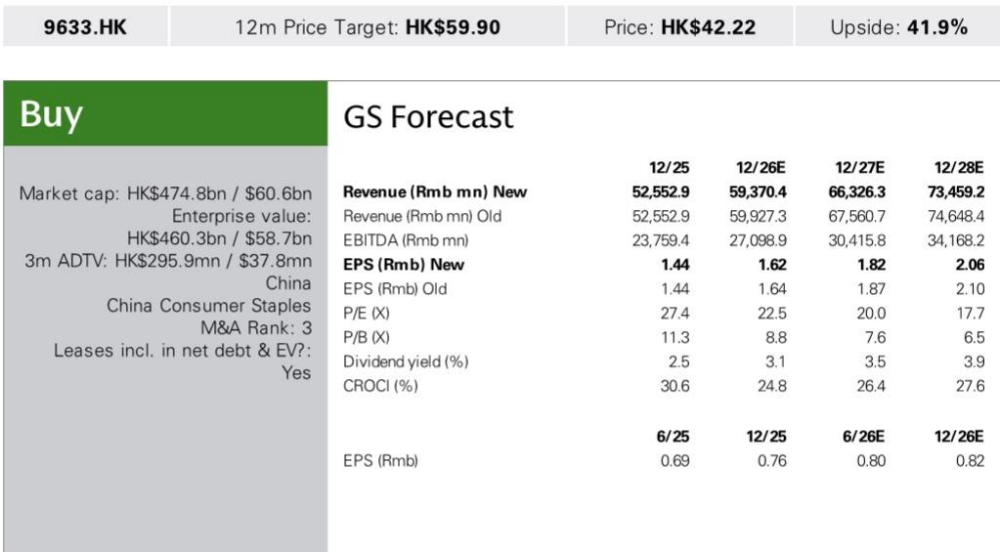
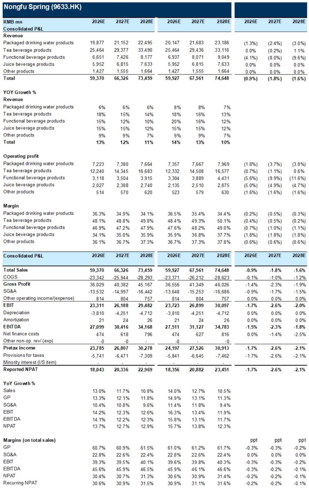
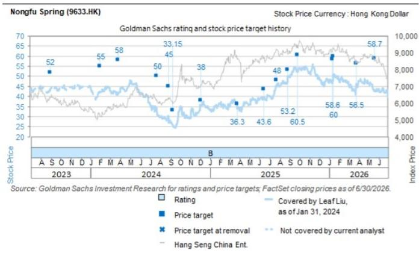

# 某饮品公司无糖茶主导地位重塑其定位：该公司已不再是一家伪装成饮料公司的水企

某饮品公司预计2026年上半年营收约293亿元，报告净利润约89亿元，同比分别增长14%和17%。这并非一个复苏故事，而是一个已经发生的结构性转型故事。这家曾被观察者归类为高端瓶装水生产商的公司，在三年内已转变为一家也卖水的无糖茶公司。到2026年上半年，茶饮料产品将占总营收的42%，高于2023年上半年的26%；而同期包装水占比则从51%缩减至34%。这一战略意义深远：该公司的增长算法不再依赖水业务的恢复，而是取决于一个在中国仍处于早期普及阶段的品类的持续渗透。

这一转变的时机至关重要，因为外部环境对传统水业务并不友好。根据CT品牌数据，2026年第二季度，包装水行业在追踪的线下渠道录得9%的同比销售额下滑。不利的天气模式以及消费者向健康饮品（包括无糖饮料）的结构性转变，压缩了水品类。该公司水业务预计2026年上半年仅同比增长6%，仍落后于2023年上半年的水平。其水业务并非失败，但已不再是增长引擎。现在的增长引擎是茶，特别是无糖茶品牌“东方树叶”，报告预计该品牌2026年上半年将同比增长约35%。

这不是一次周期性反弹。这是一个正在实时构建的竞争护城河。中国的无糖茶品类在2026年第二季度仍以16.1%的同比速度扩张，这一速度远超其他追踪的饮料子品类。在该品类中，“东方树叶”正在抢占份额。对于观察者而言，问题不在于该公司能否在天气好转时卖出更多的水，而在于该公司能否维持由茶驱动的增长轨迹——该轨迹已在2023年和2024年分别实现了83%和32%的茶营收年增长率，并有望在2026年实现18%的增长。答案取决于三个结构性驱动因素：品类顺风、利润架构和成本管理。

## 无糖茶品类仍处于渗透早期，该公司在尚未饱和的市场中占据主导地位

报告中最重要的数据点并非关于该公司本身，而是2026年第二季度无糖茶品类16.1%的同比增长（由CT品牌在线下渠道追踪）。这一增长发生在更广泛的饮料市场面临挑战的背景下。包装水下降9%，其他品类持平或负增长。无糖茶是例外，并且其增长基数在过去三年中已扩大了三倍。该品类并未接近饱和，仍在吸收从含糖饮料、水及其他茶饮形式转换而来的新消费者。

该公司的“东方树叶”是这一转变的主要受益者。报告预计“东方树叶”2026年上半年同比增长约35%，而该公司“茶π”品牌仅增长3%。这一差异揭示了一个关键的战略洞察：该公司并非在广泛地增长茶业务，而是在消费者偏好集中的无糖子品类中获胜。公司推出了“新季龙井茶”等新口味，并部署了显然行之有效的促销活动。结果是，该公司茶业务营收预计在2026年上半年达到123亿元，而2025年上半年为101亿元。这意味着在单个半年期内增加了22亿元，几乎完全由一个品牌在一个子品类中驱动。

第二个层面的含义是，该公司在无糖茶领域的竞争地位正在自我强化。作为品类领导者，公司受益于优越的货架位置、分销密度和消费者认知。新进入者必须克服这些优势，而该品类仍在快速增长，足以容纳多个参与者。但报告的数据表明，该公司并非仅仅在搭乘品类浪潮，而是超越了它。品类增长16%与“东方树叶”增长35%的对比，意味着显著的市场份额增长。这是一个不仅存在于增长品类中，而且正在积极定义其轨迹的企业的标志。

## 利润率扩张是结构性的，而非周期性的，由产品组合转变和运营杠杆驱动

该公司的净利润率预计将从2025年上半年的29.7%扩大至2026年上半年的30.4%。这70个基点的改善看似温和，但这是在投入成本上升和消费环境偏弱的背景下发生的。利润率故事并非传统意义上的定价权，而是产品组合。茶饮料产品在2026年上半年的预期运营利润率为49.0%，而包装水为36.1%。营收组合每从水向茶转移一个百分点，都会机械地提升合并利润率。该公司茶业务预计在2026年上半年实现123亿元营收，运营利润率为49%，贡献约60亿元运营利润。水业务营收100亿元，利润率为36.1%，贡献约36亿元。利润率差异不小，它是利润增长的核心驱动力。

报告还指出成本锁定和库存收益是促成因素。该公司显然已管理好原材料采购，以减轻PET价格上涨的影响——报告假设2026年下半年PET价格同比上涨约30%，达到每吨7500元。公司在价格上涨生效前以有利水平锁定成本的能力，是规模和采购纪律的体现。较小的竞争对手不具备这种优势。结果是，即使投入成本上升，该公司也能维持其利润率轨迹，而较小的参与者则面临利润率压缩。

运营杠杆是第三个利润率驱动因素。公司的销售和分销费用预计在2026年上半年同比增长17%，略高于14.4%的营收增长，表明公司正在投资分销以支持其茶业务扩张。但行政费用仅增长12.5%，低于营收增长。净效果是，销售、一般及行政费用占营收的比例大致稳定，使得产品组合转变带来的毛利率改善能够传导至运营利润线。这是一家成熟公司以纪律执行，而非一家成长型公司不计后果地支出。

## 果汁和功能饮料业务提供多元化，但并非增长故事的核心

果汁饮料产品预计2026年上半年同比增长18%，由100%果汁和NFC果汁产品驱动，这些产品受益于与推动无糖茶相同的健康意识消费趋势。旗舰产品“C100”保持韧性。功能饮料预计同比增长12%，2026年上半年约3.5亿元销售额来自3月成功推出的新电解质水产品。这些业务增长快于水业务且盈利。果汁运营利润率预计在2026年上半年达到34.0%，功能饮料利润率预计为48.4%。

这些业务对多元化很重要，但并未改变研究主题。果汁仅占营收的10%，功能饮料占11%。即使合并，它们也小于茶业务本身。增长率稳健但并不突出。这些业务的战略价值在于，它们为该公司提供了额外的分销杠杆点。同一辆为便利店配送“东方树叶”的卡车，也可以配送“C100”果汁和电解质水。分销网络的固定成本被分摊到更多产品上，提高了整体投入资本回报率。

更重要的观察是，该公司的产品组合现在覆盖了多个健康导向的子品类。该公司不再是对水的单一产品押注。它是一个平台，可以将新产品推入现有分销系统并实现快速规模化。3月推出的电解质水，预计到2026年上半年产生约3.5亿元销售额，证明了这一能力。观察者应关注在相邻健康饮料品类中的进一步产品推出，因为平台经济将随着规模扩大而改善。

## 评估该公司风险回报状况的决策框架

报告指出，该公司目前交易于2026年预期市盈率23倍和2027年预期市盈率20倍，而历史平均水平约为30倍。该报价已从历史倍数显著下降，问题在于这一下降是否由基本面恶化所证明，还是代表一个机会。一个结构化的决策框架可以帮助观察者从三个维度评估这一问题：增长可持续性、利润率韧性和估值支撑。

关于增长可持续性，关键假设是无糖茶品类增长在未来几年内保持中十几的百分比速度。报告的预测暗示茶营收在2026年增长18%，2027年增长15%，2028年增长14%。这些是递减的增长率，对于一个正在成熟的品类来说是合适的。但即使在14%的增长下，茶业务到2028年也将达到335亿元，占总营收的46%。问题在于品类增长能否持续。报告未提供品类规模估计，但2026年第二季度16%的增长率，尽管消费环境偏弱，表明从含糖饮料到无糖饮料的结构性转变仍处于早期到中期阶段。风险在于品类增长随着基数扩大而快于预期放缓，但当前轨迹并不支持这一担忧。

关于利润率韧性，关键变量是PET成本。报告假设2026年下半年PET价格同比上涨30%，这是一个显著的不利因素。但该公司的成本锁定和库存管理应在短期内减轻影响。更重要的结构性因素是，产品组合向茶转移、远离水的趋势将继续提升利润率，即使PET成本上升。报告的预测显示，茶运营利润率从2025年上半年的48.4%上升至2026年上半年的49.0%，而水利润率从35.4%上升至36.1%。茶利润率扩张温和，但组合效应强大。观察者还应关注农产品原料成本，特别是茉莉花，报告指出由于广西不利天气，该成本年初至今呈上升趋势。这是某些茶产品的特定风险，但在整体成本结构中是可控的。

关于估值支撑，当前23倍2026年预期市盈率，相对于历史平均30倍，代表约23%的折价。如果公司实现其增长和利润率预测，隐含的上行空间显著。风险在于，如果消费者情绪进一步走弱或无糖茶竞争加剧，市场可能继续下调该报价。但报告的数据表明该公司正在获得市场份额，而非失去，这应为倍数提供支撑。

该框架表明，当前估值正在定价一个运营数据不支持的悲观情景。公司营收增长13%，利润率扩大，并在中国增长最快的饮料品类中获得份额。在23倍收益下，该报价正在定价要么增长急剧减速，要么利润率崩溃，而报告的分析不支持这一点。相信无糖茶趋势持久且该公司竞争地位可防御的观察者，应发现当前估值具有吸引力。

## 下半年展望取决于成本波动和投入节奏，但结构性轨迹清晰

报告对2026年下半年的展望突出了两个关键波动因素：PET成本波动和农产品原料（如茉莉花）的价格。假设2026年下半年PET价格同比上涨30%是一个显著的不利因素，但部分被公司的成本锁定和库存收益所抵消。更重要的因素是公司的投入节奏。该公司已表示，尽管宏观环境偏弱，它将继续通过品类扩张和渠道渗透追求两位数的销售增长。这意味着公司愿意在分销和营销上投入以维持其增长轨迹，这可能在短期内对利润率构成压力。

报告对2026年全年的估计考虑了2026年下半年每吨7500元的PET价格，并因功能饮料和水预测下调以及原材料成本上升，对2026-2028年的营收和净利润估计分别小幅下调1-2%和2-3%。这些是温和的修正，并未改变基本故事。公司仍预计在2026年实现13%的营收增长和14%的净利润增长，随着茶业务持续规模化，2027年和2028年将进一步加速。

结构性轨迹清晰。该公司已从一家以茶为副业的水公司，转变为一家也卖水的茶公司。利润率状况正在改善，增长驱动力可持续，估值低于历史平均水平。风险是真实的，特别是在成本方面，但对于拥有该公司规模和采购能力的企业而言，这些风险是可控的。报告的分析支持以下观点：该公司在各品类的领先地位已在2026年年初至今得到巩固，而无糖茶机会仍处于早期阶段。对于能够看透短期成本波动的观察者而言，该公司在提供此类机会不多的消费环境中，提供了增长、利润率扩张和估值支持的罕见组合。

*仅供参考。部分内容可能基于源材料通过AI辅助生成、翻译、总结或编辑，可能存在遗漏或错误。请独立核实。本文不构成专业建议。*

仅供参考。部分内容可能基于源材料通过AI辅助生成、翻译、总结或编辑，可能存在遗漏或错误。请独立核实。本文不构成专业建议。

