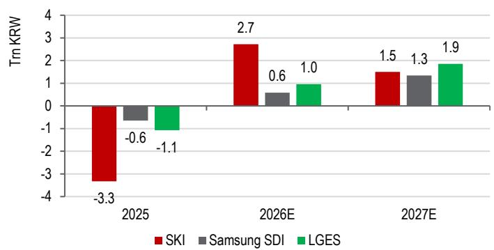
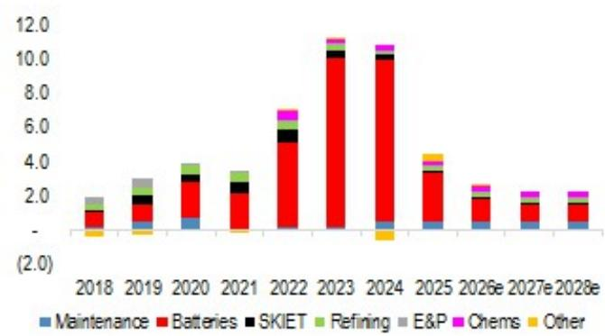
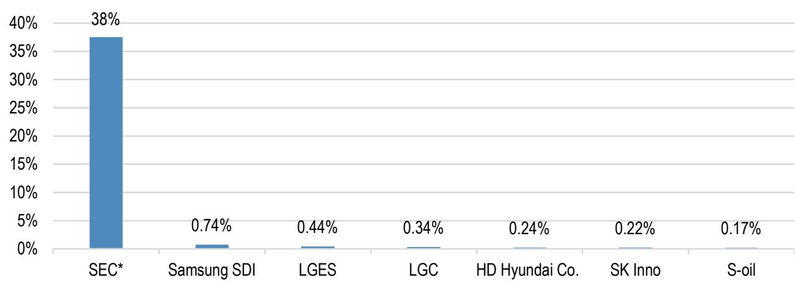
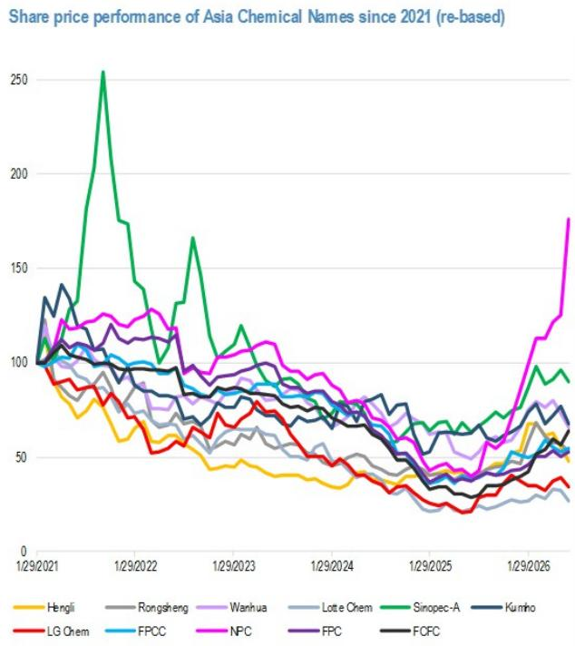
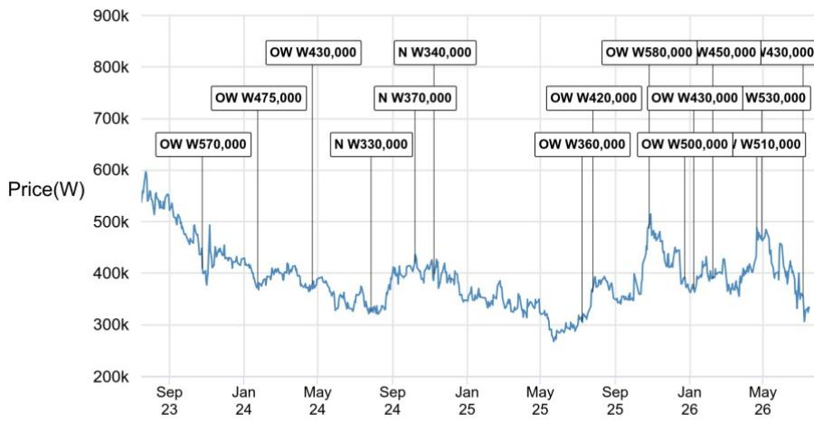
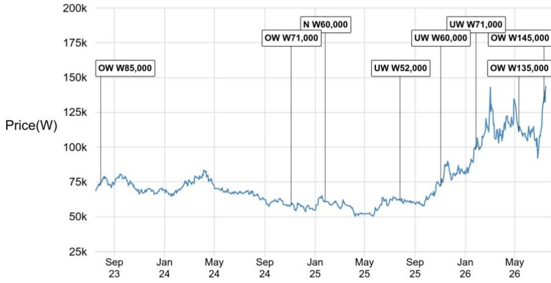
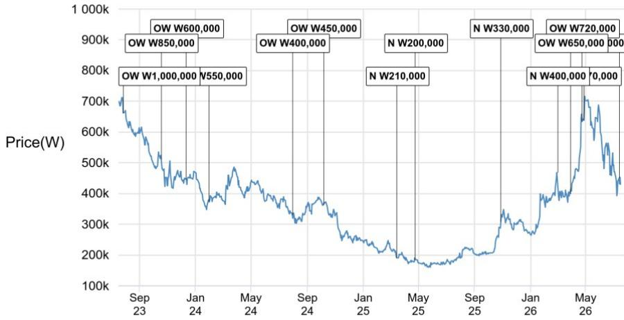

# 行业观察

## 韩国电池产业动态

## LGES获得谷歌2.9GWh储能项目；SK On赢得韩国AI储能招标13%份额

7月15日，韩联社报道，LGES将为谷歌的太阳能+储能项目供应储能系统，以满足其数据中心及其他项目日益增长的电力需求。该项目将采用LGES的第二代磷酸铁锂储能电池系统。与此同时，韩国政府首次AI驱动储能招标（640兆瓦时）已授予韩国电池三家企业。我们注意到，第三次韩国储能中央招标（预计约3.2吉瓦时）预计将于9月公布。我们认为这些进展对韩国电池行业具有积极意义，市场关注点主要在于利润回升或未使用电池资产的重新利用/出售/变现，而非仅仅是订单获取。我们更看好电池电芯而非电池材料，并近期将SK Innovation列为韩国能源板块的首选标的。

\- LGES向谷歌供应2.9GWh储能系统：7月15日，韩联社报道了LGES与谷歌及Cypress Creek Energy在密西西比州和阿肯色州建设Steel River能源中心的储能供应合作。Steel River是美国迄今为止最大的太阳能+储能项目，设计电池储能容量为2.94吉瓦时。该项目将分阶段建设，初始储能容量为2.0吉瓦时，到2029年全面运营时扩展至2.9吉瓦时。谷歌作为主要读者和承购方，将支持项目前两阶段的开发。LGES计划供应其第二代磷酸铁锂储能电池系统JF2 DC Link。该产品于去年9月发布，采用LGES专有的安全强化电池包和系统设计，满足北美运营商对热失控蔓延抑制的严格要求，包括UL9540A和大型火灾测试标准。

\- SDI/LGES/SK Inno赢得640MWh韩国AI储能项目66%/22%/13%份额。据当地媒体报道，三星SDI/LGES/SK Inno已从韩国首个政府主导的AI驱动配电网储能项目中获得420兆瓦时/140兆瓦时/80兆瓦时的储能电池订单。"2026年AI驱动储能部署支持项目"总规模为640兆瓦时，授予了包括LGES、HD Electric、现代工程、SK Eternix等在内的九家运营商组成的联合体。LGES作为单一运营商获得最大订单（140兆瓦时），而三星SDI将向9家运营商中的6家供应NCA储能电池电芯。SK On获得80兆瓦时，占总招标量的13%。第三批KPX中央储能订单预计将于9月公布，行业观察人士认为其规模可能超过前两批招标。

\- Ultium Tennessee开始供应磷酸铁锂储能电池，Warren电动汽车工厂计划8月重启：7月10日，GM Authority报道，Ultium工厂已在其田纳西州斯普林希尔工厂开始生产磷酸铁锂储能电池电芯。该工厂将向LGES Vertech（LGES在美国的储能系统集成子公司，100%持股）供应第二代磷酸铁锂电池。GM-LGES Ultium合资企业已停产6个月进行储能生产线改造，目前进展符合LGES关于第三季度重启的指引。Ultium Tennessee原有的NCMA第一代电芯产能已整合至俄亥俄州沃伦工厂，该工厂计划于2026年8月恢复生产。LGES 2026年上半年储能产量因生产瓶颈低于预期，但我们注意到LGES近期已完成第二家储能封装企业的引入，预计下半年生产瓶颈将基本缓解。我们预测LGES美国储能出货量将从上半年的10.6吉瓦时弹性较高至下半年的19.4吉瓦时，规模效应将帮助公司在2026年第四季度前实现盈亏平衡。

\- SK Inno因润滑油/炼油业务支撑，有望在2026-27年实现韩国电池三家企业中最高的净利润？我们近期调整了韩国能源板块的首选标的，在第二季度业绩公布前将SK Innovation列为首选，预期其润滑油/炼油业务将大幅超出预期。SK Innovation年初至今的表现优于同行炼油企业，主要受电池业务拖累。我们于5月开始覆盖SK Innovation，认为其风险回报比有利，因为该公司已停止电池业务的现金消耗，正在出售/优化电池资产，并有望因炼油和润滑油业务强劲而实现多年高位盈利。维持评级。

截至2026年7月17日  
图1：韩国储能招标结果汇总

<table><tr><td rowspan="2">批次</td><td rowspan="2">招标公告日期</td><td rowspan="2">结果公告/新闻日期</td><td rowspan="2">合同容量</td><td rowspan="2">安装截止日期</td><td colspan="3">结果</td></tr><tr><td>三星SDI</td><td>LGES</td><td>SK On</td></tr><tr><td>#1</td><td>2025/5/22</td><td>2025/7/25</td><td>540MW/3,240MWh</td><td>2026年12月</td><td>2,574MWh (79%)</td><td>666MWh (21%)</td><td>无</td></tr><tr><td>#2</td><td>2025/11/27</td><td>2026/2/12</td><td>540MW/3,240MWh</td><td>2027年12月</td><td>1,212MWh (35.7%)</td><td>1,212MWh (35.7%)</td><td>1,704 MWh (53%)</td></tr><tr><td>AI储能建设支持项目</td><td></td><td>2026/7/10</td><td>128MW/640MWh</td><td>2029年12月</td><td>420MWh (66.1%)</td><td>140MWh (21.8%)</td><td>80MWh (12.5%)</td></tr></table>

来源：媒体报道、韩国电力交易所、JPM亚洲能源研究

图2：韩国电池企业2026-27年净利润预测  
  
来源：JPM预测

图3：SK Innovation资本支出随电池投入下降而显著减少  
  
来源：公司数据、JPM预测

图4：MSCI韩国指数中部分标的权重  
  
来源：Bloomberg Finance L.P.、JPM

图5：部分炼油/化工企业自2021年以来报价表现  
  
来源：公司数据、JPM亚洲能源研究

图6：月度电动汽车出货量趋势

<table><tr><td>国家</td><td>类型</td><td>2025年6月</td><td>2025年7月</td><td>2025年8月</td><td>2025年9月</td><td>2025年10月</td><td>2025年11月</td><td>2025年12月</td><td>2026年1月</td><td>2026年2月</td><td>2026年3月</td><td>2026年4月</td><td>2026年5月</td><td>2026年6月</td><td>2024年</td><td>2025年</td><td>2026年</td></tr><tr><td>德国</td><td>BEV</td><td>47,163</td><td>48,614</td><td>39,367</td><td>45,495</td><td>52,425</td><td>55,741</td><td>54,774</td><td>42,692</td><td>46,275</td><td>70,663</td><td>64,350</td><td>59,969</td><td>84,057</td><td>380,609</td><td>545,142</td><td>368,006</td></tr><tr><td></td><td>PHEV</td><td>25,608</td><td>27,197</td><td>23,973</td><td>27,685</td><td>30,946</td><td>32,433</td><td>30,259</td><td>21,790</td><td>24,328</td><td>29,996</td><td>27,546</td><td>27,921</td><td>32,212</td><td>191,905</td><td>311,398</td><td>163,793</td></tr><tr><td></td><td>合计</td><td>72,771</td><td>75,811</td><td>63,340</td><td>73,180</td><td>83,371</td><td>88,174</td><td>85,033</td><td>64,482</td><td>70,603</td><td>100,659</td><td>91,896</td><td>87,890</td><td>116,269</td><td>572,514</td><td>856,540</td><td>531,799</td></tr><tr><td>英国</td><td>BEV</td><td>47,354</td><td>29,825</td><td>21,969</td><td>72,779</td><td>36,830</td><td>39,965</td><td>47,139</td><td>29,654</td><td>21,840</td><td>86,120</td><td>39,084</td><td>43,931</td><td>63,950</td><td>381,970</td><td>473,348</td><td>284,579</td></tr><tr><td></td><td>PHEV</td><td>21,382</td><td>17,489</td><td>9,803</td><td>38,308</td><td>17,601</td><td>18,005</td><td>16,898</td><td>18,557</td><td>10,438</td><td>49,671</td><td>20,597</td><td>22,167</td><td>26,702</td><td>167,178</td><td>225,143</td><td>148,132</td></tr><tr><td></td><td>合计</td><td>68,736</td><td>47,314</td><td>31,772</td><td>111,087</td><td>54,431</td><td>57,970</td><td>64,037</td><td>48,211</td><td>32,278</td><td>135,791</td><td>59,681</td><td>66,098</td><td>90,652</td><td>549,148</td><td>698,491</td><td>432,711</td></tr><tr><td>法国</td><td>BEV</td><td>28,858</td><td>19,547</td><td>16,992</td><td>31,349</td><td>34,108</td><td>34,383</td><td>42,211</td><td>30,307</td><td>35,683</td><td>49,735</td><td>36,216</td><td>37,421</td><td>55,851</td><td>290,608</td><td>326,923</td><td>245,213</td></tr><tr><td></td><td>PHEV</td><td>11,784</td><td>8,415</td><td>5,855</td><td>9,118</td><td>9,323</td><td>9,515</td><td>17,272</td><td>4,821</td><td>6,980</td><td>8,216</td><td>8,333</td><td>7,648</td><td>12,300</td><td>146,392</td><td>108,627</td><td>48,298</td></tr><tr><td></td><td>合计</td><td>40,642</td><td>27,962</td><td>22,847</td><td>40,467</td><td>43,431</td><td>43,898</td><td>59,483</td><td>35,128</td><td>42,663</td><td>57,951</td><td>44,549</td><td>45,069</td><td>68,151</td><td>437,000</td><td>435,550</td><td>293,511</td></tr><tr><td>意大利</td><td>BEV</td><td>7,973</td><td>5,864</td><td>3,298</td><td>7,169</td><td>6,280</td><td>15,266</td><td>12,104</td><td>9,423</td><td>12,483</td><td>16,137</td><td>13,238</td><td>13,724</td><td>14,894</td><td>65,620</td><td>94,704</td><td>79,899</td></tr><tr><td></td><td>PHEV</td><td>9,528</td><td>8,742</td><td>4,669</td><td>10,670</td><td>9,086</td><td>8,664</td><td>9,835</td><td>11,638</td><td>12,610</td><td>16,998</td><td>14,184</td><td>15,164</td><td>15,723</td><td>51,852</td><td>96,456</td><td>86,317</td></tr><tr><td></td><td>合计</td><td>17,501</td><td>14,606</td><td>7,967</td><td>17,839</td><td>15,366</td><td>23,930</td><td>21,939</td><td>21,061</td><td>25,093</td><td>33,135</td><td>27,422</td><td>28,888</td><td>30,617</td><td>117,472</td><td>191,160</td><td>166,216</td></tr><tr><td>西班牙</td><td>BEV</td><td>11,243</td><td>8,691</td><td>7,032</td><td>10,110</td><td>9,065</td><td>9,316</td><td>11,179</td><td>6,472</td><td>10,181</td><td>13,125</td><td>11,039</td><td>13,434</td><td>14,224</td><td>57,377</td><td>104,507</td><td>68,475</td></tr><tr><td></td><td>PHEV</td><td>13,533</td><td>12,311</td><td>7,907</td><td>10,369</td><td>12,622</td><td>11,999</td><td>12,682</td><td>8,740</td><td>12,793</td><td>15,830</td><td>13,922</td><td>14,868</td><td>15,567</td><td>58,551</td><td>125,108</td><td>81,720</td></tr><tr><td></td><td>合计</td><td>24,776</td><td>21,002</td><td>14,939</td><td>20,479</td><td>21,687</td><td>21,315</td><td>23,861</td><td>15,212</td><td>22,974</td><td>28,955</td><td>24,961</td><td>28,302</td><td>29,791</td><td>115,928</td><td>229,615</td><td>150,195</td></tr><tr><td>EU5</td><td>BEV</td><td>142,591</td><td>112,541</td><td>88,658</td><td>166,902</td><td>138,708</td><td>154,671</td><td>167,407</td><td>118,548</td><td>126,462</td><td>235,780</td><td>163,927</td><td>168,479</td><td>232,976</td><td>1,176,184</td><td>1,544,624</td><td>1,046,172</td></tr><tr><td></td><td>PHEV</td><td>81,835</td><td>74,154</td><td>52,207</td><td>96,150</td><td>79,578</td><td>80,616</td><td>86,946</td><td>65,546</td><td>67,149</td><td>120,711</td><td>84,582</td><td>87,768</td><td>102,504</td><td>615,878</td><td>866,732</td><td>528,260</td></tr><tr><td></td><td>合计</td><td>224,426</td><td>186,695</td><td>140,865</td><td>263,052</td><td>218,286</td><td>235,287</td><td>254,353</td><td>184,094</td><td>193,611</td><td>356,491</td><td>248,509</td><td>256,247</td><td>335,480</td><td>1,792,062</td><td>2,411,356</td><td>1,574,432</td></tr><tr><td>中国</td><td>BEV</td><td>660,000</td><td>607,000</td><td>690,000</td><td>832,000</td><td>810,000</td><td>827,000</td><td>782,000</td><td>348,000</td><td>278,000</td><td>568,000</td><td>505,270</td><td>637,000</td><td>685,000</td><td>6,320,413</td><td>7,869,960</td><td>3,021,270</td></tr><tr><td></td><td>PHEV</td><td>451,000</td><td>380,000</td><td>425,000</td><td>466,000</td><td>472,000</td><td>494,000</td><td>555,000</td><td>248,000</td><td>186,000</td><td>280,000</td><td>271,000</td><td>313,000</td><td>322,000</td><td>4,584,924</td><td>4,842,131</td><td>1,620,000</td></tr><tr><td></td><td>合计</td><td>1,111,000</td><td>987,000</td><td>1,115,000</td><td>1,298,000</td><td>1,282,000</td><td>1,321,000</td><td>1,337,000</td><td>596,000</td><td>464,000</td><td>848,000</td><td>776,270</td><td>950,000</td><td>1,007,000</td><td>10,905,337</td><td>12,712,091</td><td>4,641,270</td></tr><tr><td>美国</td><td>BEV</td><td>100,792</td><td>130,270</td><td>148,557</td><td>147,398</td><td>72,408</td><td>69,054</td><td>86,668</td><td>65,725</td><td>70,545</td><td>83,883</td><td>78,409</td><td>86,495</td><td>73,014</td><td>1,306,537</td><td>1,270,541</td><td>458,072</td></tr><tr><td></td><td>PHEV</td><td>20,955</td><td>24,137</td><td>29,971</td><td>24,676</td><td>11,546</td><td>12,671</td><td>14,281</td><td>9,938</td><td>11,225</td><td>13,218</td><td>15,043</td><td>18,728</td><td>17,633</td><td>316,610</td><td>292,682</td><td>85,785</td></tr><tr><td></td><td>合计</td><td>121,747</td><td>154,407</td><td>178,528</td><td>172,074</td><td>83,954</td><td>81,725</td><td>100,949</td><td>75,663</td><td>81,771</td><td>97,101</td><td>93,452</td><td>105,223</td><td>90,647</td><td>1,623,147</td><td>1,563,223</td><td>543,857</td></tr><tr><td>加拿大</td><td>合计</td><td>14,015</td><td>13,916</td><td>14,643</td><td>17,101</td><td>14,653</td><td>14,199</td><td>15,995</td><td>8,672</td><td>12,626</td><td>21,574</td><td>17,795</td><td></td><td></td><td>264,277</td><td>169,972</td><td>60,667</td></tr></table>

来源：各汽车行业协会、JPM亚洲能源研究

## 相关研究

韩国能源：第二季度润滑油业务有望超预期，炼油商补偿基金为第四季度提供支撑；维持评级，但调整首选顺序为SK Inno > S-Oil（2026年7月12日）

LG Energy Solution：第二季度基本符合预期，但储能生产瓶颈仍存；关注下半年核心利润更显著恢复（2026年7月7日）

韩国电池：受美国AIDC基础设施加速建设预期推动，报价上涨10-26%；上调美国储能需求预测52%（2026年6月29日）

SK Innovation：电池业务压力已反映在报价中；亚洲被低估的综合能源平台之一；开始覆盖，给予评级（2026年5月14日）

LG Energy Solution：Oracle AIDC订单仅为其中之一。数据中心到2032年将占美国储能需求的18%（2026年5月28日）

LG Energy Solution：指引第二季度前景改善。计划2028年前推出第三代电网项目，报道称获得宝马超过100吉瓦时圆柱形订单（2026年4月30日）

本报告讨论的公司（除非另有说明，本报告中所有报价均为2026年7月16日收盘价）：LG Energy Solution(373220.KS/W332,000/OW)、S-Oil Corp(010950.KS/W143,800/OW)、SK Innovation(096770.KS/W120,300/OW)、Samsung SDI(006400.KS/W430,000/OW)

分析师认证：本报告封面标注"AC"的研究分析师证明（或，若多位研究分析师主要负责本报告，封面或文档内标注"AC"的研究分析师分别证明，针对其在本研究中涵盖的每个证券或发行人）：(1) 本报告中表达的所有观点准确反映了研究分析师对任何及所有标的证券或发行人的个人观点；(2) 研究分析师的任何部分薪酬从未、不会直接或间接与本研究分析师在本报告中表达的具体建议或观点相关。对于封面列出的所有韩国研究分析师，如适用，他们还根据KOFIA要求证明，研究分析师的分析是善意进行的，观点反映了研究分析师自身的意见，没有受到不当影响或干预。

本报告中列出的所有作者均为研究分析师，除非另有说明，他们独立进行研究。在欧洲，行业专家（销售和交易）可能作为联系人出现在本报告中，但并非报告作者或研究部门成员。

## 重要披露

• 做市商/流动性提供者：JPM是LG Energy Solution、S-Oil Corp、Samsung SDI、SK Innovation或相关实体金融工具的做市商和/或流动性提供者。

\- 主承销商或联合主承销商：JPM在过去12个月内担任过LG Energy Solution或相关实体证券或金融工具公开发行的主承销商或联合主承销商。

\- 实益所有权（1%或以上）：JPM实益持有LG Energy Solution或相关实体一类普通股证券的1%或以上。

\- 客户：JPM目前拥有，或过去12个月内曾拥有以下实体作为客户：LG Energy Solution、S-Oil Corp、Samsung SDI、SK Innovation或相关实体。

\- 客户/投资银行：JPM目前拥有，或过去12个月内曾拥有以下实体作为投资银行客户：LG Energy Solution、SK Innovation或相关实体。

\- 客户/非投资银行、证券相关：JPM目前拥有，或过去12个月内曾拥有以下实体作为客户，提供的服务为非投资银行、证券相关：LG Energy Solution、S-Oil Corp、Samsung SDI、SK Innovation或相关实体。

\- 客户/非证券相关：JPM目前拥有，或过去12个月内曾拥有以下实体作为客户，提供的服务为非证券相关：LG Energy Solution、SK Innovation或相关实体。

\- 已收投资银行报酬：JPM在过去12个月内已从LG Energy Solution、SK Innovation或相关实体获得投资银行服务报酬。

\- 潜在投资银行报酬：JPM预计在未来三个月内将从LG Energy Solution、S-Oil Corp、Samsung SDI、SK Innovation或相关实体获得或寻求投资银行服务报酬。

• 非投资银行报酬：JPM在过去12个月内已从LG Energy Solution、S-Oil Corp、Samsung SDI、SK Innovation或相关实体获得非投资银行产品或服务报酬。

\- 债务头寸：JPM可能持有LG Energy Solution、S-Oil Corp、Samsung SDI、SK Innovation或相关实体的债务证券头寸。

公司特定披露：JPM确实并寻求与其研究报告涵盖的公司开展业务。因此，读者应注意，该公司可能存在利益冲突，可能影响本报告的客观性。读者应将本报告仅视为做出投资决策的单一因素。重要披露，包括价格图表和信用意见历史表（如适用），可在https://www.jpmm.com/research/disclosures获取，或致电1-800-477-0406，或发送电子邮件至research.disclosure.inquiries@JPM.com索取。

LG Energy Solution (373220.KS, 373220 KS) 价格图表  

<table><tr><td>日期</td><td>评级</td><td>价格 (韩元)</td><td>目标价 (韩元)</td></tr><tr><td>2023年10月26日</td><td>OW</td><td>409500</td><td>570,000</td></tr><tr><td>2024年1月25日</td><td>OW</td><td>380500</td><td>475,000</td></tr><tr><td>2024年4月23日</td><td>OW</td><td>378500</td><td>430,000</td></tr><tr><td>2024年7月28日</td><td>N</td><td>325000</td><td>330,000</td></tr><tr><td>2024年10月8日</td><td>N</td><td>420000</td><td>370,000</td></tr><tr><td>2024年11月9日</td><td>N</td><td>398500</td><td>340,000</td></tr><tr><td>2025年7月9日</td><td>OW</td><td>307000</td><td>360,000</td></tr><tr><td>2025年7月27日</td><td>OW</td><td>363500</td><td>420,000</td></tr><tr><td>2025年10月27日</td><td>OW</td><td>486500</td><td>580,000</td></tr><tr><td>2025年12月24日</td><td>OW</td><td>390000</td><td>500,000</td></tr><tr><td>2026年1月9日</td><td>OW</td><td>369500</td><td>430,000</td></tr><tr><td>2026年2月8日</td><td>OW</td><td>389500</td><td>450,000</td></tr><tr><td>2026年4月22日</td><td>OW</td><td>488000</td><td>510,000</td></tr><tr><td>2026年4月30日</td><td>OW</td><td>473000</td><td>530,000</td></tr><tr><td>2026年7月7日</td><td>OW</td><td>354500</td><td>430,000</td></tr></table>

来源：Bloomberg Finance L.P. 和 JPM；价格数据已根据股票分割和股息调整。覆盖起始日期：2022年4月21日。所有报价均为前一个交易日收盘价。

S-Oil Corp (010950.KS, 010950 KS) 价格图表  
  
来源：Bloomberg Finance L.P. 和 JPM；价格数据已根据股票分割和股息调整。覆盖起始日期：2002年7月31日。所有报价均为前一个交易日收盘价。

Samsung SDI (006400.KS, 006400 KS) 价格图表

<table><tr><td>日期</td><td>评级</td><td>价格 (韩元)</td><td>目标价 (韩元)</td></tr><tr><td>2023年7月30日</td><td>OW</td><td>72900</td><td>85,000</td></tr><tr><td>2024年11月4日</td><td>OW</td><td>58100</td><td>71,000</td></tr><tr><td>2025年1月26日</td><td>N</td><td>60700</td><td>60,000</td></tr><tr><td>2025年7月27日</td><td>UW</td><td>62300</td><td>52,000</td></tr><tr><td>2025年11月3日</td><td>UW</td><td>72000</td><td>60,000</td></tr><tr><td>2026年1月27日</td><td>UW</td><td>98500</td><td>71,000</td></tr><tr><td>2026年5月12日</td><td>OW</td><td>111200</td><td>135,000</td></tr><tr><td>2026年7月12日</td><td>OW</td><td>131900</td><td>145,000</td></tr></table>

  
来源：Bloomberg Finance L.P. 和 JPM；价格数据已根据股票分割和股息调整。覆盖起始日期：2003年7月23日。所有报价均为前一个交易日收盘价。

<table><tr><td>日期</td><td>评级</td><td>价格 (韩元)</td><td>目标价 (韩元)</td></tr><tr><td>2023年7月28日</td><td>OW</td><td>662000</td><td>1,000,000</td></tr><tr><td>2023年10月19日</td><td>OW</td><td>512000</td><td>850,000</td></tr><tr><td>2023年12月12日</td><td>OW</td><td>446000</td><td>600,000</td></tr><tr><td>2024年1月31日</td><td>OW</td><td>374500</td><td>550,000</td></tr><tr><td>2024年7月31日</td><td>OW</td><td>330500</td><td>400,000</td></tr><tr><td>2024年10月7日</td><td>OW</td><td>361500</td><td>450,000</td></tr><tr><td>2025年3月16日</td><td>N</td><td>191400</td><td>210,000</td></tr><tr><td>2025年4月25日</td><td>N</td><td>184700</td><td>200,000</td></tr><tr><td>2025年10月29日</td><td>N</td><td>309000</td><td>330,000</td></tr><tr><td>2026年3月2日</td><td>N</td><td>468000</td><td>400,000</td></tr><tr><td>2026年3月30日</td><td>OW</td><td>398500</td><td>650,000</td></tr><tr><td>2026年4月24日</td><td>OW</td><td>634000</td><td>720,000</td></tr><tr><
