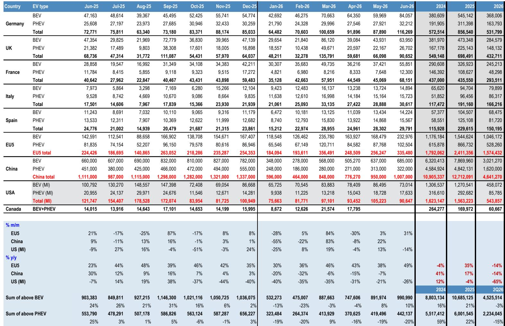
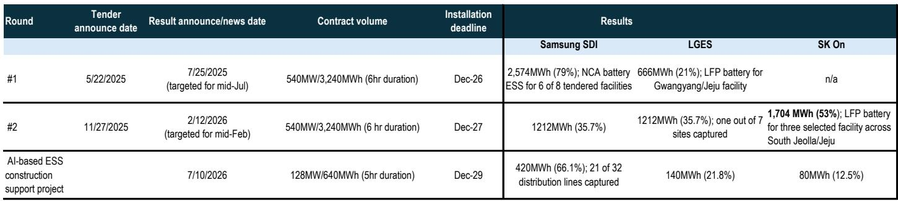

# JPM：2.韩国AI储能招标揭示了一个新变量，运营商结构正在分化

7月中旬，韩国电池行业接连出现两个信号：LG新能源拿下谷歌2.9GWh储能项目，三星SDI、LG新能源和SK On共同赢得韩国首个AI驱动配电网储能招标。订单本身并不令人意外，但JPM在最新研究报告中给出了一个更关键的判断——对韩国电池企业而言，读者真正关注的已不再是订单规模，而是利润拐点何时到来，以及闲置电池资产能否被重新盘活。

这份报告的核心主张是：韩国电池行业正在从“抢份额”转向“算利润”，而资产出清的速度将决定哪家公司能率先走出估值低谷。

## 1. 谷歌订单验证了LFP储能的技术路径，但规模对利润的拉动有限

LG新能源将为谷歌在密西西比州和阿肯色州的“钢铁河能源中心”项目供应2.9GWh储能系统。这是美国迄今最大的光储项目，设计电池储能容量2.94GWh，分阶段建设，2029年全部投运。谷歌既是锚定读者也是电力承购方。

值得注意的不是订单量，而是技术选择。LG新能源将供应其第二代LFP储能电池系统JF2 DC Link，该产品去年9月发布，通过了北美运营商最严苛的热失控蔓延测试（UL9540A和大规模火灾测试）。这意味着在数据中心等高安全需求场景中，LFP已从备选变成主流。

但JPM提醒，这类订单对利润的拉动仍需时间。LG新能源上半年美国储能产量因封装瓶颈低于预期，直到近期才完成第二家封装供应商的导入。报告预计下半年出货量将从上半年的10.6GWh弹性较高至19.4GWh，规模效应有望帮助公司在2026年四季度实现扣除AMPC（先进制造生产税收抵免）后的盈亏平衡。

> **KC评论：** 谷歌订单是技术路线的背书，但读者不应把它等同于利润改善。真正要跟踪的是LG新能源下半年封装产能的爬坡节奏，以及它能否在4Q26实现盈亏平衡——那是市场给这家公司重新定价的前提。

## 2. 韩国AI储能招标揭示了一个新变量：运营商结构正在分化

韩国政府首个AI配电网储能项目规模仅640MWh，但招标结果透露了行业格局的变化。三星SDI拿下66%份额（420MWh），LG新能源占22%（140MWh），SK On获得13%（80MWh）。表面看三星SDI领先，但关键细节在于：LG新能源是作为单一运营商拿下最大单笔订单，而三星SDI主要通过向6家运营商供应NCA电芯来覆盖份额。

更值得关注的是后续。韩国第三轮中央储能招标预计9月公布，行业观察者认为规模可能超过前两轮（每轮约3.2GWh）。韩国政府设定的2035年储能安装目标为25GWh，目前三轮招标加AI项目合计仅7.12GWh，这意味着未来两年仍有大量订单待释放。

但JPM的态度是“小幅正面”——订单增长已是预期内，真正超预期的变量是运营商能否从“中标”转化为“盈利”。

## 3. SK On的13%份额背后，是SK Innovation更激进的资产重组逻辑

SK On在AI储能招标中仅获13%份额，但JPM近期将SK Innovation上调为韩国能源板块首选。理由与电池业务无关——SK Innovation的润滑油和炼油业务预计将贡献2026-2027年韩国电池三巨头中最高的净利润。

报告指出，SK Innovation自2025年二季度以来相对S-Oil跑输超过140%，相对三星SDI和LG新能源分别跑输150%和13%。这种大幅折价的核心原因是电池业务的持续亏损。但转折正在发生：SK Innovation已停止对电池业务的现金投入，转而出售和优化电池资产。资本开支的急剧下降（见图3）表明公司正在主动调整战线。

> **KC评论：** SK Innovation的逻辑不是“电池业务变好了”，而是“电池业务不再影响整体利润”。当一家公司从烧钱模式转向资产出清模式，市场给的估值折价会逐步收窄。这是JPM将其列为板块首选的核心原因——不是看好电池，而是看好资产重组带来的利润释放。

## 4. 观察韩国电池行业的框架：从订单竞赛转向资产效率

JPM在报告中明确了一个观察框架：电池电芯优于电池材料，资产出清优于订单增长。这意味着读者需要从三个维度重新审视韩国电池公司：

第一，利润拐点的时间表。LG新能源的目标是4Q26实现扣除AMPC后的盈亏平衡，SK On的资产出清进度，三星SDI的NCA电芯利润率——这些才是决定估值修复节奏的关键。

第二，资产货币化的可能性。闲置电池产能能否被改造为储能产线（如Ultium Tennessee工厂从NCMA转向LFP），或者直接出售/租赁给第三方，将直接影响企业的现金流和资产负债表情况。

第三，非电池业务的支撑力。SK Innovation的润滑油和炼油利润、三星SDI的电子材料业务——这些“现金牛”能否在电池业务扭亏前提供足够的财务缓冲，决定了公司是否有耐心等待行业出清。

韩国电池行业正在经历从“规模竞赛”到“效率竞赛”的切换。订单是入场券，但真正的胜负手在于谁能更快地把产能转化为利润，谁能更果断地处置无效资产。JPM的这份报告提供了一个清晰的坐标：当市场不再为订单欢呼时，资产出清的速度就是新的定价锚。

For informational purposes only. Portions may be generated,translated,summarized,or edited with AI assistance based on source materials and may contain omissions or errors. Please verify independently. This is not investment,legal,tax,accounting,or other professional advice.

For informational purposes only. Portions may be generated,translated,summarized,or edited with AI assistance based on source materials and may contain omissions or errors. Please verify independently. This is not investment,legal,tax,accounting,or other professional advice.

