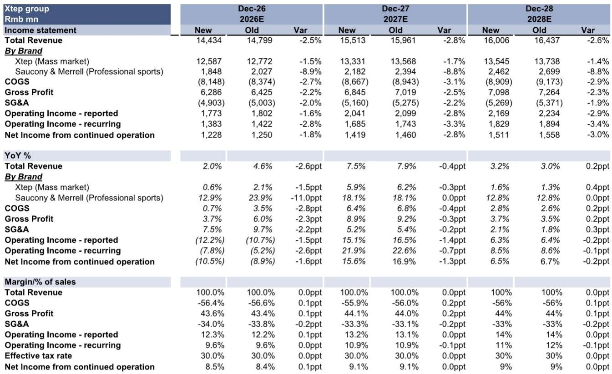
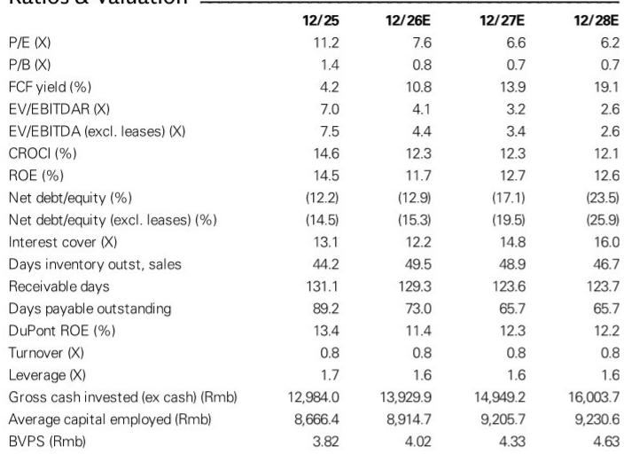
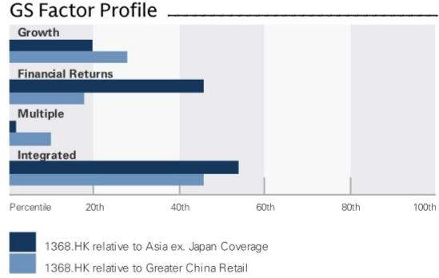

# GS：特步二季度销售观察——行业折扣加深但特步折扣纪律未松

二季度特步核心品牌零售额同比下滑中个位数，索康尼增速也从一季度的超过20%收窄至低个位数。这份GS研究笔记没有回避不确定性——管理层将节奏变化归因于宏观环境变化和主动收紧折扣以维护品牌力。但真正值得关注的不是增速本身，而是这家公司在行业普遍加深折扣的环境下，选择了一条更克制、也更考验执行力的路。

报告给出的行业参照系提供了清晰的坐标：安踏二季度零售额增长中个位数，李宁（成人加童装）持平，宝胜下滑3%，滔搏下滑低两位数。特步核心品牌的表现并非最差，但它的库存水平已从二季度的4.0-4.5个月上升至4.5-5.0个月。库存上升而折扣没有同步加深，这组数据组合才是理解特步当前策略的关键。

## 1. 折扣纪律没有松动，但库存不确定性正在积累

特步核心品牌二季度零售折扣维持在25-30%，同比基本持平，线上折扣甚至有所改善。索康尼的折扣同样保持稳定或小幅收窄。这与行业趋势形成对比——管理层在交流中提及，行业整体折扣在加深。

但库存的上升不容忽视。4.5-5.0个月的渠道库存水平，高于一季度的4.0-4.5个月。如果品牌提升的进度慢于预期，未来折扣不确定性可能被动加大。这份GS研究笔记在调整盈利预测时，将2026至2028年的收入预期下调了2-3%，净利润预期下调1-3%，但维持了毛利率受折扣纪律支撑的判断。

> **KC评论：** 库存上升但折扣未松，意味着公司选择用短期周转效率换取品牌定价权。这个策略能否持续，取决于消费者对品牌价值的认可速度是否跑赢库存累积速度。

## 2. 两条产品线的转型节奏都在变慢，但方向没有偏移

特步核心品牌方面，电商和童装保持稳健增长，线下渠道承压且环比出现变化。管理层重申了拓宽消费群体、通过DTC转型提升品牌力的长期策略。上半年已完成100家门店的DTC转换，下半年计划再转换400家。精选奥莱门店已开出60余家，效果积极，下半年将继续铺开。

索康尼的节奏变化更多是主动选择。品牌在二季度主动收紧线上折扣，导致线上增速回落，但线下门店仍保持20%以上的同比增长。管理层明确将2026年的优先级放在提升高端品牌定位上，通过跑步赛事和赞助活动触达高净值消费者。线下开店节奏也趋于审慎，全年计划新增20-30家门店，集中在高线城市核心位置，单店面积200-300平方米。

两条线的共同特征是：短期增速让位于品牌建设。报告没有美化这一选择，而是直接指出执行速度慢于预期。

## 3. 海外和跨境业务提供了另一个观察维度

特步的跨境电商上半年同比增长超过100%，线下在印尼和马来西亚新开13家门店，并计划继续在东盟拓展。这一块业务目前体量不大，但它提供了一个与国内截然不同的增长叙事——在海外市场，特步不需要面对同样的库存和折扣不确定性，可以更直接地测试产品和品牌力。

报告没有对海外业务给出单独的收入预测，但将其作为长期观察框架的一部分。对于关注中国运动品牌出海能力的读者，这是一个值得持续追踪的变量。

## 4. 2026年指引未变，但三季度至今没有改善信号

管理层重申了全年指引：集团收入同比增长中个位数（特步品牌正增长，索康尼增长20-30%），净利润率高个位数。但报告同时披露，7月至今的零售趋势没有出现有意义的改善，终端需求依然承压。

这意味着下半年的业绩兑现，将高度依赖DTC转换、精选奥莱门店和海外扩张这些结构性动作能否在消费环境没有明显好转的情况下，独立支撑起增长。报告对此的判断是：2026年的投入将为长期更健康、更可持续的业务铺路。

For informational purposes only. Portions may be generated,translated,summarized,or edited with AI assistance based on source materials and may contain omissions or errors. Please verify independently. This is not investment,legal,tax,accounting,or other professional advice.

For informational purposes only. Portions may be generated,translated,summarized,or edited with AI assistance based on source materials and may contain omissions or errors. Please verify independently. This is not investment,legal,tax,accounting,or other professional advice.

