# China alt-data trackers chartpack (Series 59)

# Limited government bond issuance pick-up so far

Extel - 2026

Global Fixed Income Research Survey

CLICK TO VOTE

Voting Open July 6 - July 24

Please vote for JPM (5 stars)

Emerging Markets Asia, Economic and Policy Research

Tingting Ge
(852) 2800-0143
tingting.ge@JPM.com

China's 2Q GDP fell well short of expectations, despite some upside surprise in June industrial production. This has prompted a reassessment of the 2H growth trajectory, with near-term momentum now in focus. We have updated our alt-data trackers (vs. our last update) and our key takeaways are below.

\- Exports: Typhoon Bavi disrupted vessel traffic and port operations in the past week. Port tracking shows departing container (-15.4%) and bulk (-9.0%) shipping deadweight tonnage both declined in m/m nsa terms mtd in July.

\- In aggregate, departing shipments' deadweight tonnage (excluding tankers) rose $8.7\%$ oya mtd in July (vs. $17.2\%$ in June), suggesting volume growth is moderating. But there could be some recovery as port operations normalize.

\- Oil tanker arrivals decline narrowed to \~20 %oya mtd (vs. >30% in June).

Tongfang Yuan
(852) 2800-0085
tongfang.yuan@JPM.com

Jiayi Li
(852) 2800-5229
jiayi.c.li@JPM.com

Feng Zhu
(852) 2800 1745
feng.zhu@JPM.com
JPM Chase Bank, N.A., Hong Kong Branch

\- CCFI to USEC, USWC rose 8.6%, 14.9%, respectively, compared to two weeks ago; CCFI to the Persian Gulf/Red Sea route increased 6.6%.

\- Production: Processed crude oil production contraction may have narrowed mtd in July (vs -17.7% oya in June), as petroleum asphalt plants' operating rates continued to recover in the first half of July. Auto production volume decline may have widened (vs -0.2% in June) while steel IP growth may have turned negative (vs 0.0% in June). Coke oven plants stabilized.

\- Fiscal: Government bond issuance reached 1170bn yuan in July mtd, exceeding June's amount. But there will be over 450bn yuan of CGB maturities at month-end. With 2Q real GDP growth surprising to the downside, we expect faster fiscal deployment in 3Q to utilize the remaining approved annual quota.

• Monetary: PBOC net injected 1970bn yuan via pledged 7-day OMO in July mtd, while withdrawing 300bn yuan via outright OMO.

\- 2Q MPC statement and PBOC press conference signaled no urgency for near-term easing and a gradual shift towards a price-based policy framework, prompting us to push our low-conviction rate cut call from 3Q to 4Q.

\- Auto sales remained a drag on retail sales. Passenger car retail sales fell 15% oya in July 1-12, partially on lower per-car trade-in subsidies and purchase tax exemptions, and higher fuel costs. NEV sales fell a narrower 8%.

\- Housing: Secondary home sales continued to outperform the same period last year, albeit at a slower pace, and new home sales contraction narrowed.

\- Inflation: With a re-escalation of US-Iran tensions, Brent oil prices spiked in the past week. The transmission to domestic energy and petrochemical prices lagged. Agricultural food prices fell $2.3\%$ oya in July mtd amid ample summer supply, widening the drag on headline CPI. Pork wholesale prices picked up in July mtd from the recent bottom, despite remaining in deflation.

## See page 11 for analyst certification and important disclosures.

## 1. Mapping: High-frequency trackers --> official activity

Regarding the mapping efforts from high-frequency data to monthly official activity tracking:

\- Operating rates for petroleum asphalt plants suggest processed crude oil production contraction may have narrowed mtd in July (vs -17.7% oya in June).

\- Operating rates for tire plants suggest auto production unit decline may have widened mtd in July (vs -0.2% oya in June).

\- Operating rates for steel rebar suggest that steel IP growth may have turned negative mtd in July (vs 0.0% oya in June).

\- Housing transactions for 30 major cities fell $1.0\%$ oya mtd in July (vs $-7.3\%$ in June).

\- Port tracking suggests that export volume growth may have moderated mtd in July, as departing shipments deadweight tonnage (excluding tankers) rose 8.7% oya mtd in July (vs. 17.2% in June). This reflects shipping disruption caused by Typhoon Bavi, and port operation normalization may bring some recovery in the second half of the month.

Figure 1.1: Industrial production - Processed crude oil  
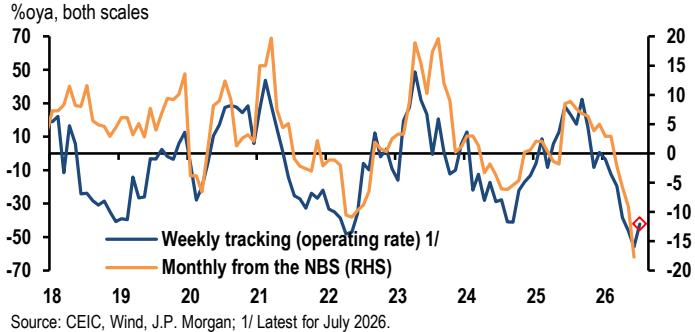  
Source: CEIC, Wind, JPM; 1/ Latest for July 2026.

Figure 1.2: Industrial production - Auto  
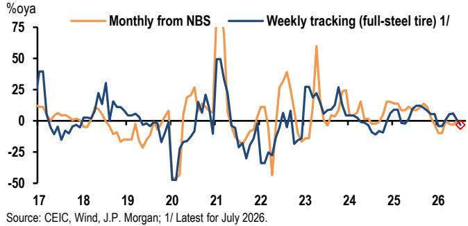  
Source: CEIC, Wind, JPM; 1/ Latest for July 2026.

Figure 1.3: Industrial production - Steel  
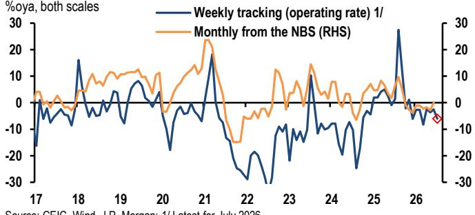  
Source: CEIC, Wind, JPM; 1/ Latest for July 2026.

Figure 1.4: China exports  
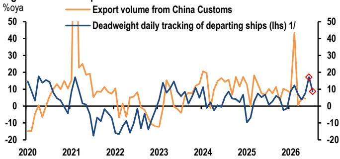  
Source: Elane Shipping, China Customs, JPM; 1/ Latest for July 2026, excl. tankers

## 2. Trade

China's outbound container costs increased further across major routes, amid renewed Middle East tensions. By destination, CCFI to USEC, USWC rose $8.6\%$ , $14.9\%$ , respectively, compared to two weeks ago; CCFI to the Persian Gulf/Red Sea route increased by another $6.6\%$ . Baltic Dry Index rebounded after a brief retreat. US-bound shipping dropped $13.5\%$ oya or $21.0\%$ m/m nsa mtd in July (vs $7.1\%$ oya or $16.0\%$ m/m nsa in June).

Typhoon Bavi disrupted vessel traffic and port operations at major East China ports during July 11-14.

\- Container ships usually carry consumer goods, as well as some machinery equipment and electronics. Departing container ships' deadweight tonnage fell 11.6% oya or

Source: Wind, JPM

Source: Elane Shipping Statistics, JPM.

Source: Elane Shipping Statistics, JPM.

15.4%m/m nsa mtd in July. Arriving container ships' deadweight tonnage fell 13.9%oya or 15.8%m/m nsa.

\- Bulk carriers transport unpackaged bulk cargo for grain, coal, iron ore, steel, etc., in their cargo holds. Departing bulk ships' deadweight tonnage rose 13.2% oya (or down 9.0% m/m nsa), while arriving bulk ships' deadweight tonnage rose 7.8% oya or down 12.3% m/m nsa.

\- Oil tanker arrivals recovered somewhat, down \~20% oya mtd in July, compared to >30% contraction in June.

China's flight execution continued to recover, despite a mild uptick in the cancelation rate.

China's soybean imports from the world increased in June, exceeding previous years' levels. The White House statement said China would purchase at least US\$17bn of US agricultural products annually from 2026 to 2028.

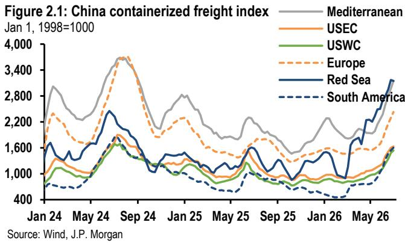

Figure 2.2: BEISL freight index  
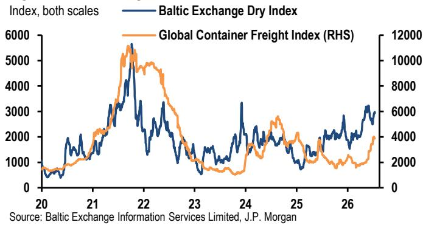

Figure 2.3: Deadweight tonnage of departing ships - Container Ton mn  
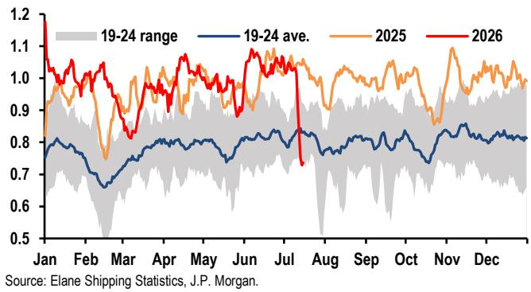  
Figure 2.5: Deadweight tonnage of departing ships - Bulk Ton mn

Figure 2.4: Deadweight tonnage of arrived ships - Container Ton mn  
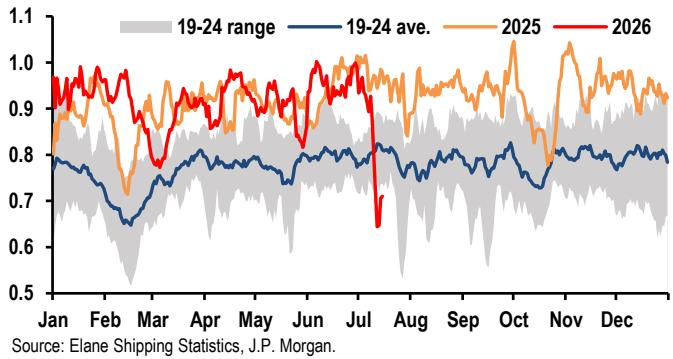

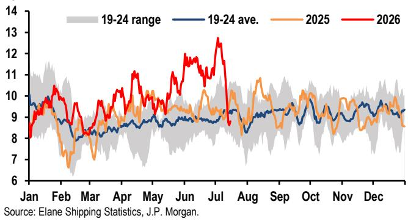

Figure 2.6: Deadweight tonnage of arrived ships - Bulk Ton mn  
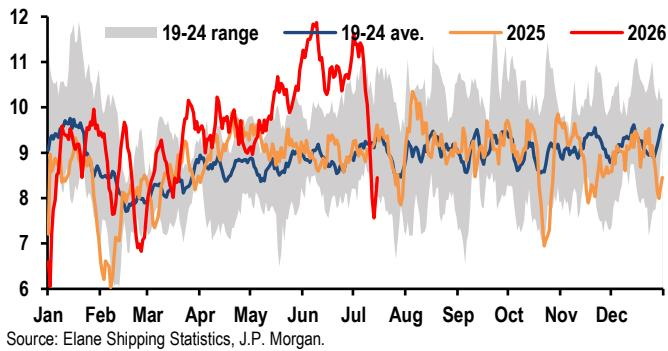

Figure 2.7: Deadweight tonnage of arrived ships - Oil Tanker Ton mn  
  
Source: Elane Shipping Statistics, JPM.

Figure 2.9: China flight execution % of 2019 avg, 7dma  
Figure 2.8: Deadweight tonnage of departing ships - Oil Tanker Ton mn  
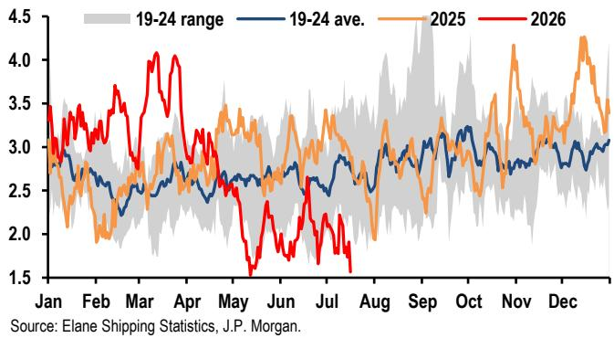

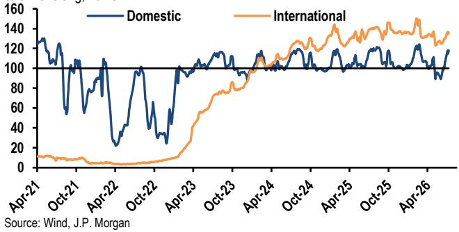  
Source: Wind, JPM

Figure 2.11: China imports of soybeans from world Ton mn  
Figure 2.10: China flight cancellation rate % of planned, 7dma  
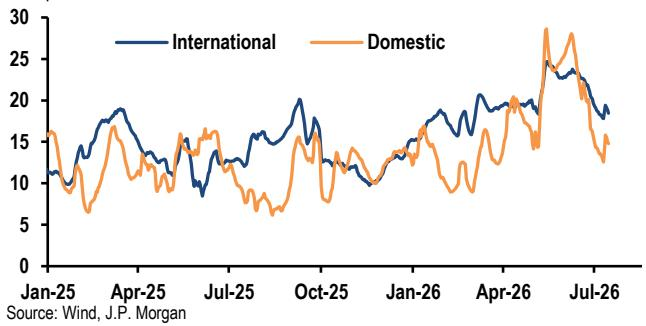  
Figure 2.12: China imports of soybeans from US

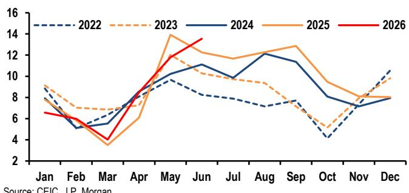  
Source: CEIC, JPM

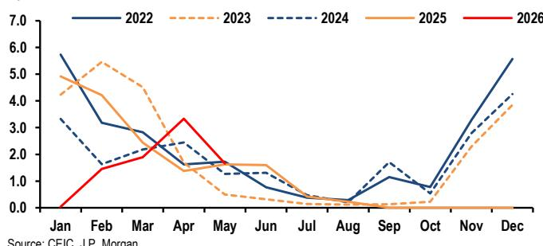  
Source: CEIC, JPM

## 3. Sales and production

\- Auto sales: According to CPCA, passenger car retail sales fell 15% oya in July 1-12, partially on lower per-car trade-in subsidies and purchase tax exemptions, and higher fuel costs. NEV sales fell a narrower 8%.

\- Operating rates of petroleum asphalt plants continued to recover in the first half of July, though still lower than the pre-Middle East conflict levels. Operating rates for steel rebar ticked down mtd in July, while semi-steel tires continued to fall. Coke oven plants' operation rates stabilized after the modest fall from mid-May to early June.

Figure 3.1: Weekly auto retail sales
Thousand units  
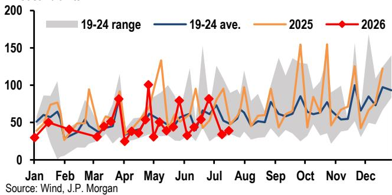  
Source: Wind, JPM

Figure 3.2: Operating rate for all-steel tire  
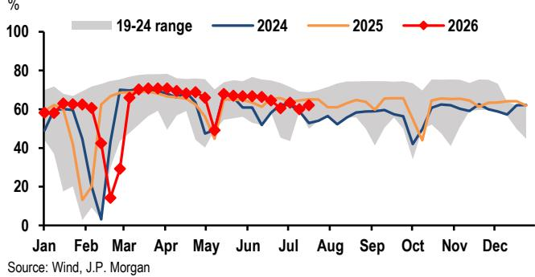  
Source: Wind, JPM

Figure 3.3: Operating rate for semi-steel tire  
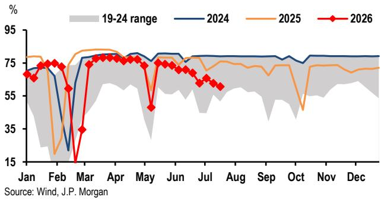  
Source: Wind, JPM

Figure 3.4: Operating rate for petroleum asphalt plants  
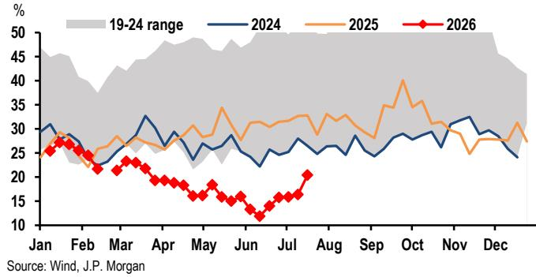  
Source: Wind, JPM

Figure 3.5: Operating rate for steel rebar at major steel plants  
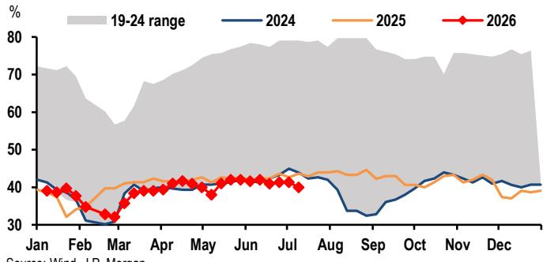  
Source: Wind, JPM

Figure 3.6: Operating rate for coke oven plants  
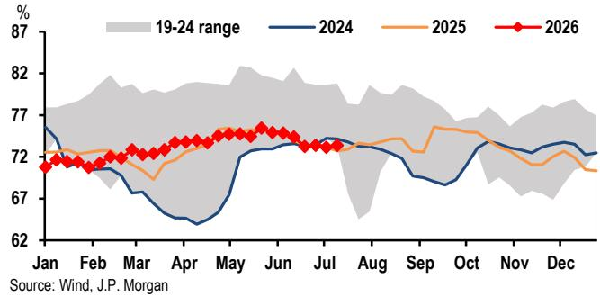  
Source: Wind, JPM

## 4. Policy: Government bond issuance and liquidity operations

Government bond issuance reached 1170bn yuan in July mtd, exceeding June's amount. With 2Q real GDP growth surprising to the downside, we expect faster fiscal deployment in 3Q to utilize the remaining quota approved at March NPC.

\- CGB issuance rose to 845bn yuan in July mtd (including scheduled issuance in the coming one week), compared to 318bn yuan in June. But there will be over 450bn yuan of CGB maturities at month-end, hence full-month net issuance will depend on the final week's issuance. Ytd issuance is reaching 52.9% of the annual issuance target, trailing last year's 57.4% pace. In terms of further breakdown, special CGB issuance remained solid at 190bn yuan in July mtd (vs. 204bn yuan in June).

\- Special LGB issuance moderated to 222bn yuan in July mtd, after rising strongly to 572bn yuan in June. Year-to-date issuance reached $52.0\%$ of the annual target, lagging last year's pace.

\- General LGB issuance recorded 38bn yuan; refinancing LGB slowed to 65bn yuan (vs.

Source: Wind, JPM. Month-to-date (scheduled) issuance for July 2026.

207bn yuan).

\- PBOC net injected 1970bn yuan via pledged 7-day OMO in July mtd, while withdrawing 300bn yuan via outright OMO.

\- 2Q MPC statement and PBOC press conference this week signaled no urgency for near-term easing and a gradual shift towards price-based monetary policy framework, prompting us to push our low-conviction rate cut call from 3Q to 4Q. As usual, a 10bp move would likely be more of a policy signal than a meaningful easing impulse.

Figure 4.1: China CGB net issuance  
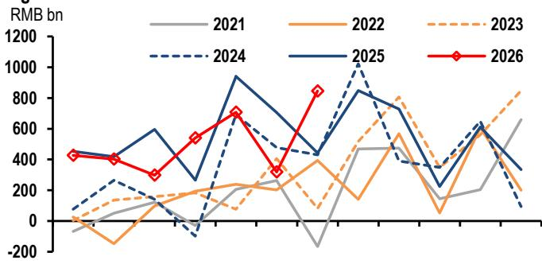  
Jan Feb Mar Apr May Jun Jul Aug Sep Oct Nov Dec
Source: Wind, JPM. Month-to-date (scheduled) issuance for July 2026.

Figure 4.2: China CGB net issuance progress % of annual issuance (target)  
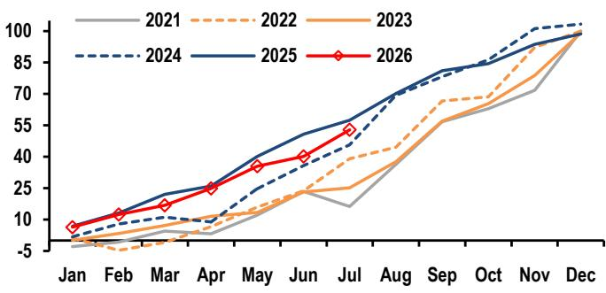  
Source: Wind, JPM. Month-to-date (scheduled) issuance for July 2026.

Figure 4.3: China special LGB issuance  
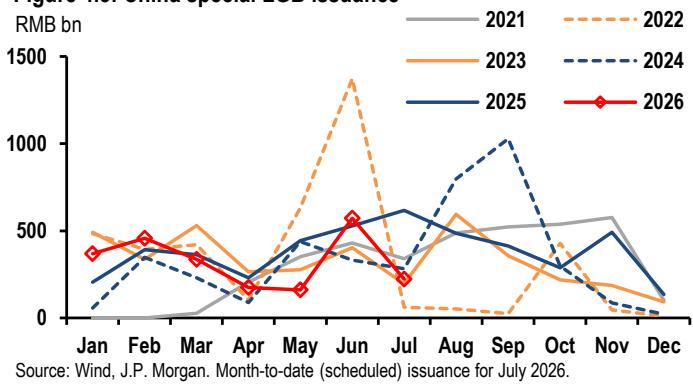  
Jan Feb Mar Apr May Jun Jul Aug Sep Oct Nov Dec
Source: Wind, JPM. Month-to-date (scheduled) issuance for July 2026.

Figure 4.4: China special LGB issuance progress % of annual issuance (target)  
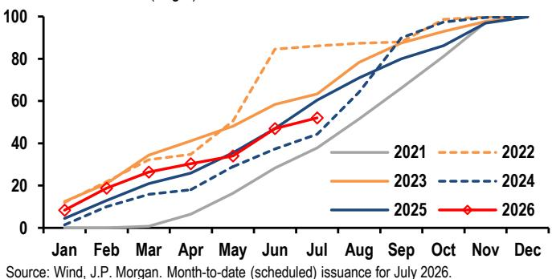

Figure 4.5: China special CGB net issuance
RMB bn  
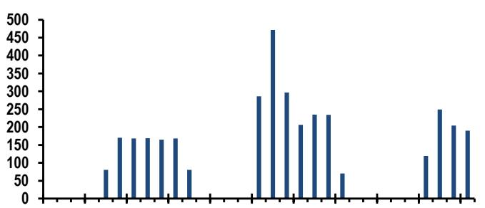  
Jan 24 Apr 24 Jul 24 Oct 24 Jan 25 Apr 25 Jul 25 Oct 25 Jan 26 Apr 26 Jul 26  
Source: Wind, JPM; Month-to-date (scheduled) issuance for July 2026.

Figure 4.6: Local government special refinancing bonds issuance RMB bn  
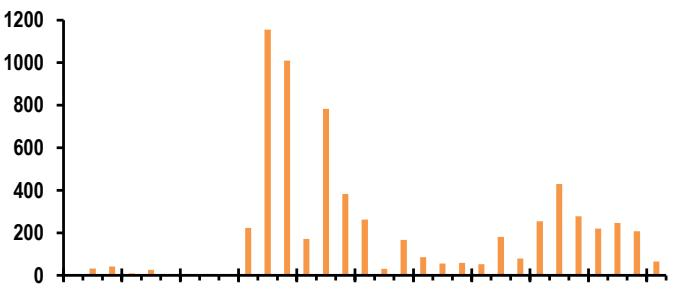  
Jan 24 Apr 24 Jul 24 Oct 24 Jan 25 Apr 25 Jul 25 Oct 25 Jan 26 Apr 26 Jul 26
Source: Wind, JPM; Month-to-date (scheduled) issuance for July 2026.

Figure 4.7: General LGB new issuance  
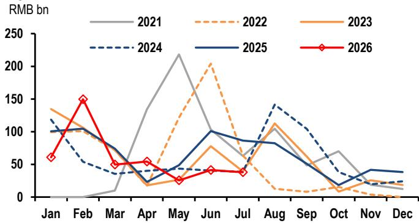  
Source: Wind, JPM. Month-to-date (scheduled) issuance for July 2026.

Figure 4.8: General LGB new issuance progress % of annual issuance (target)  
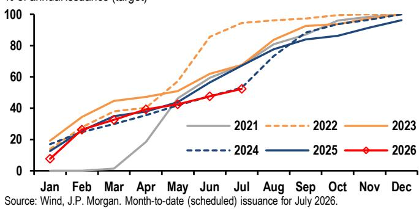  
Source: Wind, JPM. Month-to-date (scheduled) issuance for July 2026.

Figure 4.9: Outstanding major monetary policy instruments  
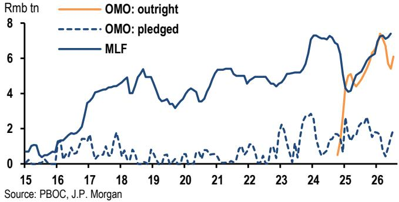  
Source: PBOC, JPM

Figure 4.10: Outright OMO operation  
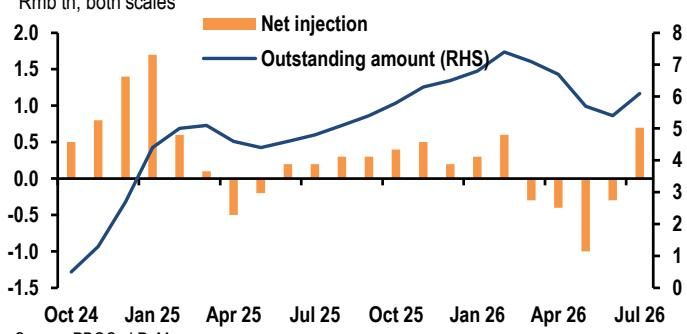  
Source: PBOC, JPM

## 5. Housing

Secondary home sales continued to outperform the same period last year in July mtd, albeit at a slower pace, and new home sales %oya contraction narrowed.

\- The contraction in 30 major cities' new home sales narrowed to $-1.0\%$ oya in July mtd from $-7.3\%$ in June, assuming the pace persists into month-end. Major cities' secondary home sales rose $3.5\%$ oya in July mtd, despite moderating from $12.3\%$ oya in June.

\- Centraline's sales manager confidence index ticked up temporarily before easing back, while the secondary home asking price index edged down further.

Land sales values fell in July mtd, continuing to weigh on government fund account revenues. The sales premium rate dropped at the beginning of July and was stable last week.

Figure 5.1: Housing transactions by sqm in 30 major cities  
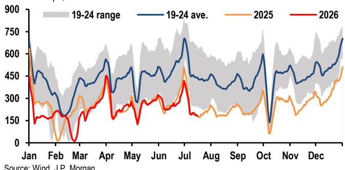  
Source: Wind, JPM

Figure 5.2: Major cities' secondary housing transactions
Avg unit, 7dma  
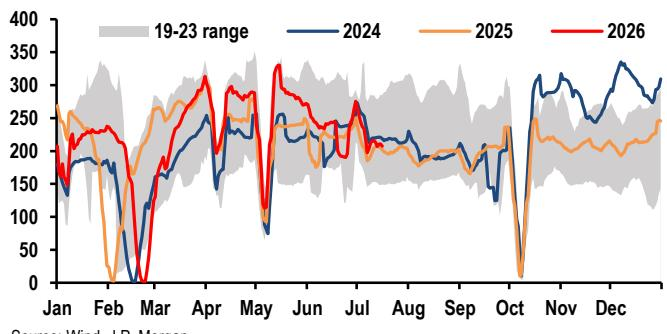  
Source: Wind, JPM

Figure 5.3: Centraline tier-1 cities' secondary asking price index Index  
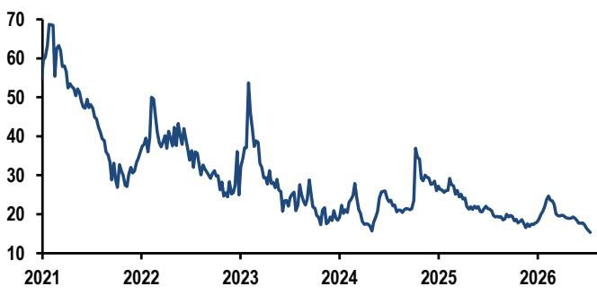  
Source: Wind, JPM. Note: Simple average for 4 tier-1 cities.

Figure 5.4: Centraline sales manager index Index  
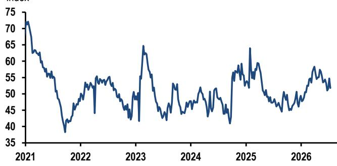  
Source: Wind, JPM. Note: Simple average for Shanghai, Shenzhen and Guangzhou.

Figure 5.5: Weekly land sales  
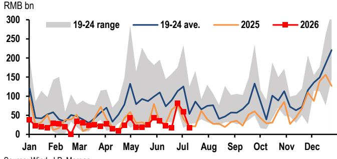  
Source: Wind, JPM

Figure 5.6: Land sale premium rate  
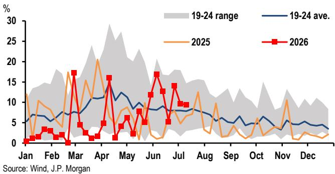  
Source: Wind, JPM

## 6. Inflation

\- With the re-escalation of US-Iran tensions, Brent oil prices spiked in the recent week. The transmission to domestic energy prices lagged, with gasoline, diesel, LNG and LPG prices continuing to moderate in the first ten days of July. Coal prices have also started to ease, despite summer seasonal demand.

\- Most petrochemical products prices fell further in the first ten days of July, while sulfuric acid prices continued to rise. Prices of polyethylene, polypropylene, and rubber have declined to near pre-conflict levels. Polyester yarn and methanol prices have also eased, though they remain above pre-conflict levels. Petro-benzene prices ticked up lately.

\- Compared to the same period last year, agricultural food price fell 2.3% oya in July mtd amid ample summer supply (vs -0.5% in June), widening the drag on headline CPI. Rice, wheat and corn prices were largely stable.

\- Pork wholesale prices picked up in July mtd from the recent trough, with price deflation narrowing to -25.1% oya (vs. -28.3% oya in June), as overcapacity and profitability pressure in the industry accelerated the destocking process.

\- Lithium carbonate prices edged lower in July mtd, while polysilicon prices were largely unchanged at a subdued level relative to early 2026.

\- Copper prices picked up in July mtd, remaining elevated on AI-related demand, while aluminum prices rebounded over the past two weeks. Cement and steel rebar prices both ticked down.

Source: Wind, JPM

Jan 22 Jul 22 Jan 23 Jul 23 Jan 24 Jul 24 Jan 25 Jul 25 Jan 26 Jul 26
Source: NBS, JPM

Figure 6.1: Energy price  
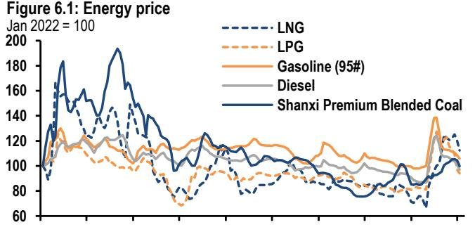  
Jan 22 Jul 22 Jan 23 Jul 23 Jan 24 Jul 24 Jan 25 Jul 25 Jan 26 Jul 26
Source: NBS, JPM

Figure 6.2: Petrochemical product price  
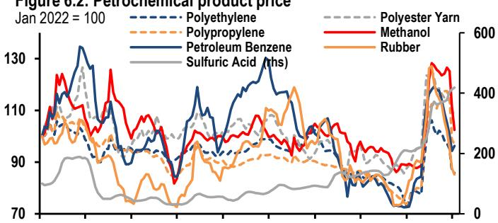  
Jan 22 Jul 22 Jan 23 Jul 23 Jan 24 Jul 24 Jan 25 Jul 25 Jan 26 Jul 26
Source: NBS, JPM

Figure 6.3: Fertilizer price  
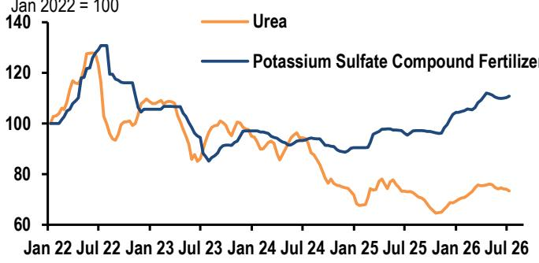

Figure 6.4: Grain and hog price  
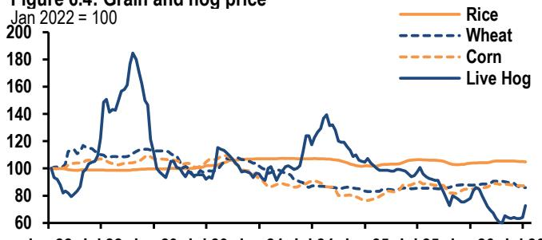  
Jan 22 Jul 22 Jan 23 Jul 23 Jan 24 Jul 24 Jan 25 Jul 25 Jan 26 Jul 26
Source: NBS, JPM

Figure 6.5: Agricultural food product wholesale price  
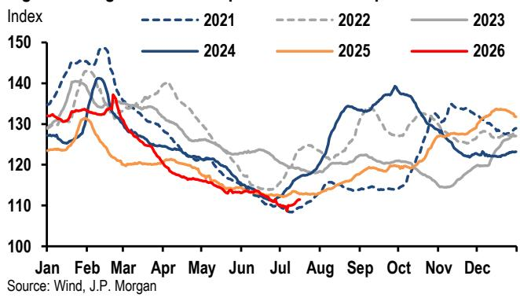  
Figure 6.7: Pork wholesales price vs. NBS data

Figure 6.6: Pork wholesales price  
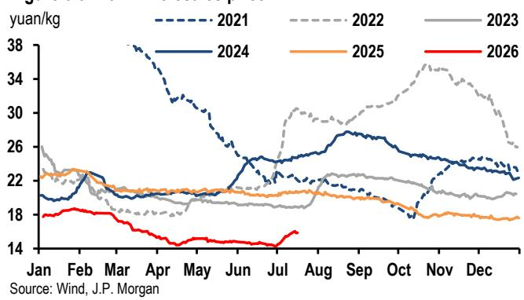

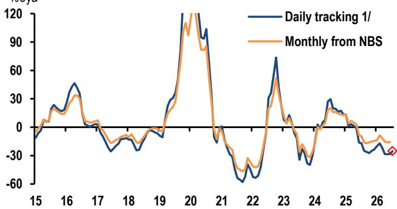  
Source: NBS, Wind, JPM. 1/ Latest for May 2026.

Figure 6.8: Commodity futures prices  
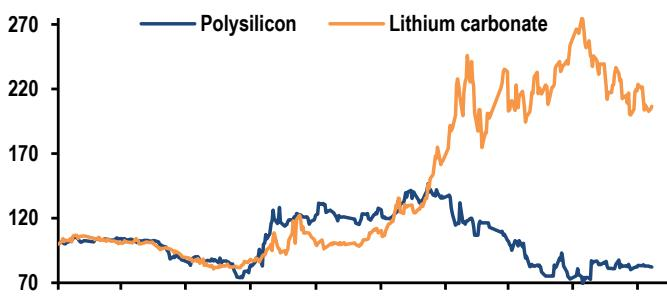  
Jan 25 Mar 25 May 25 Jul 25 Sep 25 Nov 25 Jan 26 Mar 26 May 26 Jul 26
Source: Wind, JPM

Figure 6.9: Copper price '0000 yuan/ton

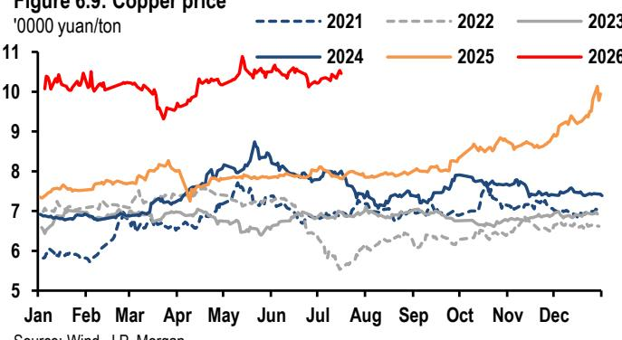  
Source: Wind, JPM

Figure 6.10: Cement price  
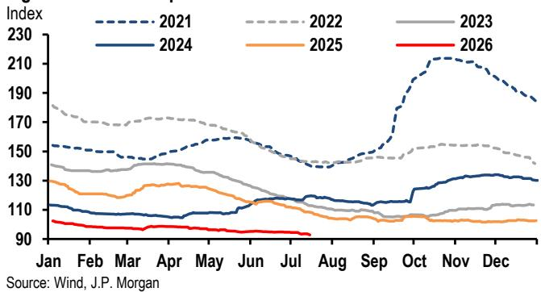  
Source: Wind, JPM

Figure 6.11: Aluminum price  
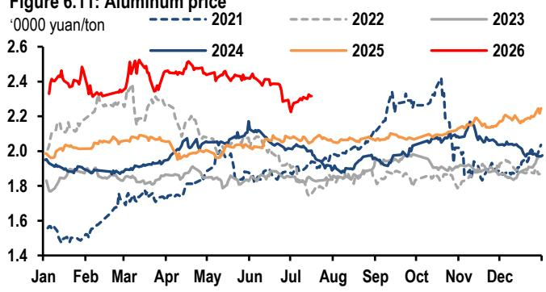  
Source: Wind, JPM

Figure 6.12: Steel rebar price
Thousand yuan/ton  
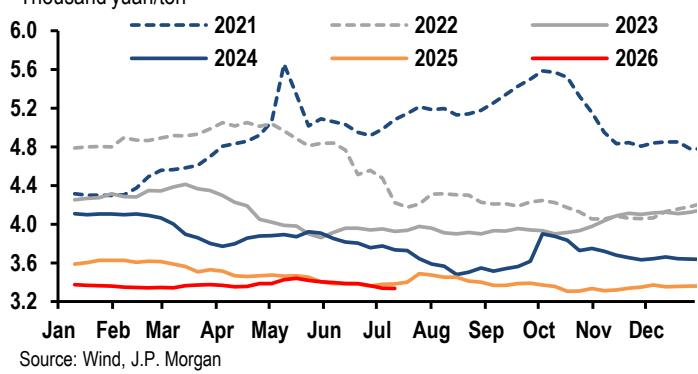  
Source: Wind, JPM

Figure 6.13: Retail gasoline price vs. Brent oil Index, 2016 = 100  
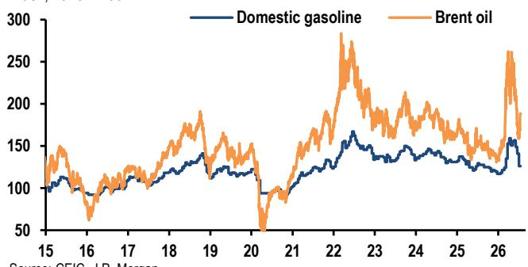  
Source: CEIC, JPM

Figure 6.14: Global commodity price vs. China PPI  
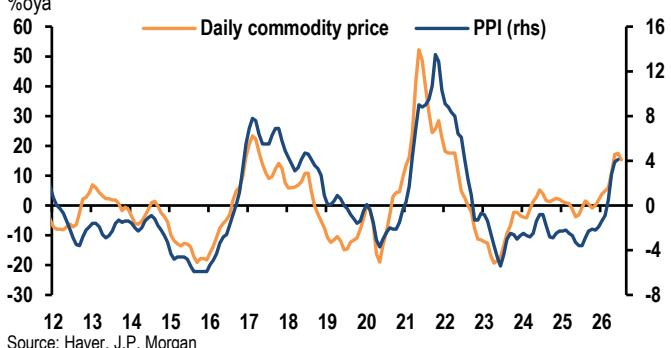  
Source: Haver, JPM

Analysts' Compensation: The research analysts responsible for the preparation of this report receive compensation based upon various factors, including the quality and accuracy of research, client feedback, competitive factors, and overall firm revenues.

## Other Disclosures

JPM is a marketing name for investment banking businesses of JPM Chase & Co. and its subsidiaries and affiliates worldwide.

UK MIFID FICC research unbundling exemption: UK clients should refer to UK MIFID Research Unbundling exemption for details of JPM's implementation of the FICC research exemption and guidance on relevant FICC research categorisation.

Any long form nomenclature for references to China; Hong Kong; Taiwan; and Macau within this research material are Mainland China; Hong Kong SAR (China); Taiwan (China); and Macau SAR (China).

JPM may, from time to time, write on issuers or securities targeted by economic or financial sanctions imposed or administered by the governmental authorities of the U.S., EU, UK or other relevant jurisdictions (Sanctioned Securities). Nothing in this report is intended to be read or construed as encouraging, facilitating, promoting or otherwise approving investment or dealing in such Sanctioned Securities. Clients should be aware of their own legal and compliance obligations when making investment decisions.

Any digital or crypto assets discussed in this research report are subject to a rapidly changing regulatory landscape. For relevant regulatory advisories on crypto assets, including bitcoin and ether, please see https://www.JPM.com/disclosures/cryptoasset-disclosure.

The author(s) of this research report may not be licensed to carry on regulated activities in your jurisdiction and, if not licensed, do not hold themselves out as being able to do so.

Exchange-Traded Funds (ETFs): JPM Securities LLC (“JPMS”) acts as authorized participant for substantially all U.S.-listed ETFs. To the extent that any ETFs are mentioned in this report, JPMS may earn commissions and transaction-based compensation in connection with the distribution of those ETF shares and may earn fees for performing other trade-related services, such as securities lending to short sellers of the ETF shares. JPMS may also perform services for the ETFs themselves, including acting as a broker or dealer to the ETFs. In addition, affiliates of JPMS may perform services for the ETFs, including trust, custodial, administration, lending, index calculation and/or maintenance and other services.

Changes to Interbank Offered Rates (IBORs) and other benchmark rates: Certain interest rate benchmarks are, or may in the future become, subject to ongoing international, national and other regulatory guidance, reform and proposals for reform. For more information, please consult: https://www.JPM.com/global/disclosures/interbank\_offered\_rates

Private Bank Clients: Where you are receiving research as a client of the private banking businesses offered by JPM Chase & Co. and its subsidiaries (“JPM Private Bank”), research is provided to you by JPM Private Bank and not by any other division of JPM, including, but not limited to, the JPM Corporate and Investment Bank and its Global Research division.

Legal entity responsible for the production and distribution of research: The legal entity identified below the name of the Reg AC Research Analyst who authored this material is the legal entity responsible for the production of this research. Where multiple Reg AC Research Analysts authored this material with different legal entities identified below their names, these legal entities are jointly responsible for the production of this research. Where more than one legal entity is listed under an analyst's name, the first legal entity is responsible for the production unless stated otherwise. Research Analysts from various JPM affiliates may have contributed to the production of this material but may not be licensed to carry out regulated activities in your jurisdiction (and do not hold themselves out as being able to do so). Unless otherwise stated below in the legal entity disclosures, this material has been distributed by the legal entity responsible for production, or where more than one legal entity is listed under the analyst's name, the first legal entity will be responsible for distribution. If you have any queries, please contact the relevant Research Analyst in your jurisdiction or the entity in your jurisdiction that has distributed this research material.

## Legal Entities Disclosures and Country-/Region-Specific Disclosures:

Argentina: JPM Chase Bank N.A Sucursal Buenos Aires is regulated by Banco Central de la República Argentina (“BCRA”- Central Bank of Argentina) and Comisión Nacional de Valores (“CNV”- Argentinian Securities Commission - ALYC y AN Integral N°51).

Australia: JPM Securities Australia Limited (“JPMSAL”) (ABN 61 003 245 234/AFS Licence No: 238066) is regulated by the Australian Securities and Investments Commission and is a Market Participant of ASX Limited, a Clearing and Settlement Participant of ASX Clear Pty Limited and a Clearing Participant of ASX Clear (Futures) Pty Limited. This material is issued and distributed in Australia by or on behalf of JPMSAL only to "wholesale clients" (as defined in section 761G of the Corporations Act 2001). A list of all financial products covered can be found by visiting https://www.jpmm.com/research/disclosures. JPM seeks to cover companies of relevance to the domestic and international investor base across all Global Industry Classification Standard (GICS) sectors, as well as across a range of market capitalisation sizes. If applicable, in the course of conducting public side due diligence on the subject company(ies), the Research Analyst team may at times perform such diligence through corporate engagements such as site visits, discussions with company representatives, management presentations, etc. Research issued by JPMSAL has been prepared in accordance with JPM Australia’s Research Independence Policy which can be found at the following link: JPM Australia - Research Independence Policy.

Brazil: Banco JPM S.A. is regulated by the Comissao de Valores Mobiliarios (CVM) and by the Central Bank of Brazil. Ombudsman

JPM: 0800-7700847 / 0800-7700810 (For Hearing Impaired) / ouvidoria.jp.morgan@jpmchase.com.

Canada: JPM Securities Canada Inc. is a registered investment dealer, regulated by the Canadian Investment Regulatory Organization and the Ontario Securities Commission and is the participating member on Canadian exchanges. This material is distributed in Canada by or on behalf of JPM Securities Canada Inc.

Chile: Inversiones JPM Limitada is an unregulated entity incorporated in Chile.

China: JPM Securities (China) Company Limited has been approved by CSRC to conduct the securities investment consultancy business.

Colombia: Banco JPM Colombia S.A. is supervised by the Superintendencia Financiera de Colombia (SFC). Any reference in this material to products or services offered abroad by entities other than the Bank in Colombia is included exclusively for descriptive purposes. Such references do not constitute, and should not be construed as, promotional activity or the provision of financial products or services within Colombian territory, as defined under applicable Colombian regulation.

Dubai International Financial Centre (DIFC): JPM Chase Bank, N.A., Dubai Branch is regulated by the Dubai Financial Services Authority (DFSA) and its registered address is Dubai International Financial Centre - The Gate, West Wing, Level 3 and 9 PO Box 506551, Dubai, UAE. This material has been distributed by JPM Chase Bank, N.A., Dubai Branch to persons regarded as professional clients or market counterparties as defined under the DFSA rules.

European Economic Area (EEA): Unless specified to the contrary, research is distributed in the EEA by JPM SE (“JPM SE”), which is authorised as a credit institution by the Federal Financial Supervisory Authority (Bundesanstalt für Finanzdienstleistungsaufsicht, BaFin) and jointly supervised by the BaFin, the German Central Bank (Deutsche Bundesbank) and the European Central Bank (ECB). JPM SE is a company headquartered in Frankfurt with registered address at TaunusTurm, Taunustor 1, Frankfurt am Main, 60310, Germany. The material has been distributed in the EEA to persons regarded as professional investors (or equivalent) pursuant to Art. 4 para. 1 no. 10 and Annex II of MiFID II and its respective implementation in their home jurisdictions (“EEA professional investors”). This material must not be acted on or relied on by persons who are not EEA professional investors. Any investment or investment activity to which this material relates is only available to EEA relevant persons and will be engaged in only with EEA relevant persons.

Hong Kong: JPM Securities (Asia Pacific) Limited (CE number AAJ321) is regulated by the Hong Kong Monetary Authority and the Securities and Futures Commission in Hong Kong, and JPM Broking (Hong Kong) Limited (CE number AAB027) is regulated by the Securities and Futures Commission in Hong Kong. JPM Chase Bank, N.A., Hong Kong Branch (CE Number AAL996) is regulated by the Hong Kong Monetary Authority and the Securities and Futures Commission, is organized under the laws of the United States with limited liability. Where the distribution of this material is a regulated activity in Hong Kong, the material is distributed in Hong Kong by or through JPM Securities (Asia Pacific) Limited and/or JPM Broking (Hong Kong) Limited.

India: JPM India Private Limited (Corporate Identity Number - U67120MH1992FTC068724), having its registered office at JPM Tower, Off. C.S.T. Road, Kalina, Santacruz - East, Mumbai – 400098, is registered with the Securities and Exchange Board of India (SEBI) as a 'Research Analyst' having registration number INH000001873. JPM India Private Limited is also registered with SEBI as a member of the National Stock Exchange of India Limited and the Bombay Stock Exchange Limited (SEBI Registration Number – INZ000239730) and as a Merchant Banker (SEBI Registration Number - MB/INM000002970). Telephone: 91-22-6157 3000, Facsimile: 91-22-6157 3990 and Website: http://www.jpmipl.com. JPM Chase Bank, N.A. - Mumbai Branch is licensed by the Reserve Bank of India (RBI) (Licence No. 53/Licence No. BY.4/94; SEBI - IN/CUS/014/ CDSL : IN-DP-CDSL-444-2008/ IN-DP-NSDL-285-2008/ INBI00000984/ INE231311239) as a Scheduled Commercial Bank in India, which is its primary license allowing it to carry on Banking business in India and other activities, which a Bank branch in India are permitted to undertake. For non-local research material, this material is not distributed in India by JPM India Private Limited. Compliance Officer: Ashutosh Sharma; ashutosh.j.sharma@jpmchase.com; +912261575002. Grievance Officer: Ramprasadh K, jpmipl.research.feedback@JPM.com; +912261573000. Registration granted by SEBI and certification from NISM in no way guarantee performance of the intermediary or provide any assurance of returns to investors. Please visit Terms and Conditions and Most Important Terms and Conditions (MITC). The annual Compliance audit report is available at http://www.jpmipl.com/#research.

Indonesia: PT JPM Sekuritas Indonesia is a member of the Indonesia Stock Exchange and is registered and supervised by the Otoritas Jasa Keuangan (OJK).

Korea: JPM Securities (Far East) Limited, Seoul Branch, is a member of the Korea Exchange (KRX). JPM Chase Bank, N.A., Seoul Branch, is licensed as a branch office of foreign bank (JPM Chase Bank, N.A.) in Korea. Both entities are regulated by the Financial Services Commission (FSC) and the Financial Supervisory Service (FSS). For non-macro research material, the material is distributed in Korea by or through JPM Securities (Far East) Limited, Seoul Branch.

Japan: JPM Securities Japan Co., Ltd. and JPM Chase Bank, N.A., Tokyo Branch are regulated by the Financial Services Agency in Japan.

Malaysia: This material is issued and distributed in Malaysia by JPM Securities (Malaysia) Sdn Bhd (18146-X), which is a Participating Organization of Bursa Malaysia Berhad and holds a Capital Markets Services License issued by the Securities Commission in Malaysia.

Mexico: JPM Casa de Bolsa, S.A. de C.V., JPM Grupo Financiero is member of the Mexican Stock Exchange (“Bolsa Mexicana de Valores”) and the Institutional Stock Exchange (“Bolsa Institucional de Valores”), and it is authorized to act as a broker dealer by the

National Banking and Securities Exchange Commission (“Comisión Nacional Bancaria y de Valores”).

New Zealand: This material is issued and distributed by JPMSAL in New Zealand only to "wholesale clients" (as defined in the Financial Markets Conduct Act 2013). JPMSAL is registered as a Financial Service Provider under the Financial Service providers (Registration and Dispute Resolution) Act of 2008.

Philippines: JPM Securities Philippines Inc. is a Trading Participant of the Philippine Stock Exchange and a member of the Securities Clearing Corporation of the Philippines and the Securities Investor Protection Fund. It is regulated by the Securities and Exchange Commission.

Singapore: This material is issued and distributed in Singapore by or through JPM Securities Singapore Private Limited (JPMSS) [MDDI (P) 057/08/2025 and Co. Reg. No.: 199405335R], which is a member of the Singapore Exchange Securities Trading Limited, and/or JPM Chase Bank, N.A., Singapore branch (JPMCB Singapore), both of which are regulated by the Monetary Authority of Singapore. This material is issued and distributed in Singapore only to accredited investors, expert investors and institutional investors, as defined in Section 4A of the Securities and Futures Act, Cap. 289 (SFA). This material is not intended to be issued or distributed to any retail investors or any other investors that do not fall into the classes of “accredited investors,” “expert investors” or “institutional investors,” as defined under Section 4A of the SFA. Recipients of this material in Singapore are to contact JPMSS or JPMCB Singapore in respect of any matters arising from, or in connection with, the material.

South Africa: JPM Equities South Africa Proprietary Limited and JPM Chase Bank, N.A., Johannesburg Branch are members of the Johannesburg Securities Exchange and are regulated by the Financial Services Conduct Authority (FSCA).

Taiwan: JPM Securities (Taiwan) Limited is a participant of the Taiwan Stock Exchange (company-type) and regulated by the Taiwan Securities and Futures Bureau. Material relating to equity securities is issued and distributed in Taiwan by JPM Securities (Taiwan) Limited, subject to the license scope and the applicable laws and the regulations in Taiwan. To the extent that JPM Securities (Taiwan) Limited produces research materials on securities not listed on the Taiwan Stock Exchange or Taipei Exchange (“Non-Taiwan Listed Securities”), these materials shall not constitute securities recommendations for the purpose of applicable Taiwan regulations, and, for the avoidance of doubt, JPM Securities (Taiwan) Limited does not act as broker for Non-Taiwan Listed Securities. According to Paragraph 2, Article 7-1 of Operational Regulations Governing Securities Firms Recommending Trades in Securities to Customers (as amended or supplemented) and/or other applicable laws or regulations, please note that the recipient of this material is not permitted to engage in any activities in connection with the material that may give rise to conflicts of interests, unless otherwise disclosed in the “Important Disclosures” in this material.

Thailand: This material is issued and distributed in Thailand by JPM Securities (Thailand) Ltd., which is a member of the Stock Exchange of Thailand and is regulated by the Ministry of Finance and the Securities and Exchange Commission. The registered address is 548 One City Center Building, 50th Floor, Ploenchit Road, Lymphini, Pathum Wan, Bangkok 10330.

UK: Research is produced in the UK by JPM Securities plc (“JPMS plc”) which is a member of the London Stock Exchange and is authorised by the Prudential Regulation Authority and regulated by the Financial Conduct Authority and the Prudential Regulation Authority or JPM Markets Limited (“JPMML Ltd”) which is authorised and regulated by the Financial Conduct Authority. Unless specified to the contrary, this material is distributed in the UK by JPMS plc and is directed in the UK only to: (a) persons having professional experience in matters relating to investments falling within article 19(5) of the Financial Services and Markets Act 2000 (Financial Promotion) (Order) 2005 (“the FPO”); (b) persons outlined in article 49 of the FPO (high net worth companies, unincorporated associations or partnerships, the trustees of high value trusts, etc.); or (c) any persons to whom this communication may otherwise lawfully be made; all such persons being referred to as "UK relevant persons". This material must not be acted on or relied on by persons who are not UK relevant persons. Any investment or investment activity to which this material relates is only available to UK relevant persons and will be engaged in only with UK relevant persons. A description of JPM EMEA’s policy for prevention and avoidance of conflicts of interest related to the production of Research can be found at the following link: JPM EMEA - Research Independence Policy.

U.S.: JPM Securities LLC (“JPMS”) is a member of the NYSE, FINRA, SIPC, and the NFA. JPM Chase Bank, N.A. is a member of the FDIC. Material published by non-U.S. affiliates is distributed in the U.S. by JPMS who accepts responsibility for its content.

General: Additional information is available upon request. The information in this material has been obtained from sources believed to be reliable. While all reasonable care has been taken to ensure that the facts stated in this material are accurate and that the forecasts, opinions and expectations contained herein are fair and reasonable, JPM Chase & Co. or its affiliates and/or subsidiaries (collectively JPM) make no representations or warranties whatsoever to the completeness or accuracy of the material provided, except with respect to any disclosures relative to JPM and the Research Analyst's involvement with the issuer that is the subject of the material. Accordingly, no reliance should be placed on the accuracy, fairness or completeness of the information contained in this material. There may be certain discrepancies with data and/or limited content in this material as a result of calculations, adjustments, translations to different languages, and/or local regulatory restrictions, as applicable. These discrepancies should not impact the overall investment analysis, views and/or recommendations of the subject company(ies) that may be discussed in the material. Artificial intelligence tools may have been used in the preparation of this material, including assisting in data analysis, pattern recognition, and content drafting for research material. JPM accepts no liability whatsoever for any loss arising from any use of this material or its contents, and neither JPM nor any of its respective directors, officers or employees, shall be in any way responsible for the contents hereof, apart from the liabilities and responsibilities that may be imposed on them by the relevant regulatory authority in the jurisdiction in question, or the regulatory regime thereunder. Opinions, forecasts or projections contained in this material represent JPM's current opinions or judgment as of the date of the material only and are therefore subject to change without notice. Periodic updates may be provided on companies/industries based on company-specific developments or announcements, market

Tingting Ge (852) 2800-0143  
tingting.ge@JPM.com  
JPM Chase Bank, N.A., Hong Kong Branch  
Jiayi Li (852) 2800-5229  
jiayi.c.li@JPM.com

Tongfang Yuan (852) 2800-0085
tongfang.yuan@JPM.com
Feng Zhu (852) 2800 1745
feng.zhu@JPM.com

Asia Pacific Economic Research
China alt-data trackers chartpack
(Series 59)
17 July 2026

conditions or any other publicly available information. There can be no assurance that future results or events will be consistent with any such opinions, forecasts or projections, which represent only one possible outcome. Furthermore, such opinions, forecasts or projections are subject to certain risks, uncertainties and assumptions that have not been verified, and future actual results or events could differ materially. The value of, or income from, any investments referred to in this material may fluctuate and/or be affected by changes in exchange rates. All pricing is indicative as of the close of market for the securities discussed, unless otherwise stated. Past performance is not indicative of future results. Accordingly, investors may receive back less than originally invested. This material is not intended as an offer or solicitation for the purchase or sale of any financial instrument. The opinions and recommendations herein do not take into account individual client circumstances, objectives, or needs and are not intended as recommendations of particular securities, financial instruments or strategies to particular clients. This material may include views on structured securities, options, futures and other derivatives. These are complex instruments, may involve a high degree of risk and may be appropriate investments only for sophisticated investors who are capable of understanding and assuming the risks involved. The recipients of this material must make their own independent decisions regarding any securities or financial instruments mentioned herein and should seek advice from such independent financial, legal, tax or other adviser as they deem necessary. JPM may trade as a principal on the basis of the Research Analysts' views and research, and it may also engage in transactions for its own account or for its clients' accounts in a manner inconsistent with the views taken in this material, and JPM is under no obligation to ensure that such other communication is brought to the attention of any recipient of this material. Others within JPM, including Strategists, Sales staff and other Research Analysts, may take views that are inconsistent with those taken in this material. Employees of JPM not involved in the preparation of this material may have investments in the securities (or derivatives of such securities) mentioned in this material and may trade them in ways different from those discussed in this material. This material is not an advertisement for or marketing of any issuer, its products or services, or its securities in any jurisdiction.

Confidentiality and Security Notice: This transmission may contain information that is privileged, confidential, legally privileged, and/or exempt from disclosure under applicable law. If you are not the intended recipient, you are hereby notified that any disclosure, copying, distribution, or use of the information contained herein (including any reliance thereon) is STRICTLY PROHIBITED. Although this transmission and any attachments are believed to be free of any virus or other defect that might affect any computer system into which it is received and opened, it is the responsibility of the recipient to ensure that it is virus free and no responsibility is accepted by JPM Chase & Co., its subsidiaries and affiliates, as applicable, for any loss or damage arising in any way from its use. If you received this transmission in error, please immediately contact the sender and destroy the material in its entirety, whether in electronic or hard copy format. This message is subject to electronic monitoring: https://www.JPM.com/disclosures/email

MSCI: Certain information herein (“Information”) is reproduced by permission of MSCI Inc., its affiliates and information providers (“MSCI”) ©2026. No reproduction or dissemination of the Information is permitted without an appropriate license. MSCI MAKES NO EXPRESS OR IMPLIED WARRANTIES (INCLUDING MERCHANTABILITY OR FITNESS) AS TO THE INFORMATION AND DISCLAIMS ALL LIABILITY TO THE EXTENT PERMITTED BY LAW. No Information constitutes investment advice, except for any applicable Information from MSCI ESG Research. Subject also to msci.com/disclaimer

Sustainalytics: Certain information, data, analyses and opinions contained herein are reproduced by permission of Sustainalytics and: (1) includes the proprietary information of Sustainalytics; (2) may not be copied or redistributed except as specifically authorized; (3) do not constitute investment advice nor an endorsement of any product or project; (4) are provided solely for informational purposes; and (5) are not warranted to be complete, accurate or timely. Sustainalytics is not responsible for any trading decisions, damages or other losses related to it or its use. The use of the data is subject to conditions available at https://www.sustainalytics.com/legal-disclaimers. ©2026 Sustainalytics. All Rights Reserved.

"Other Disclosures" last revised July 04, 2026.

Copyright 2026 JPM Chase & Co. All rights reserved. This material or any portion hereof may not be reprinted, sold or redistributed without the written consent of JPM. It is strictly prohibited to use or share without prior written consent from JPM any research material received from JPM or an authorized third-party (“JPM Data”) in any third-party artificial intelligence (“AI”) systems or models when such JPM Data is accessible by a third-party.