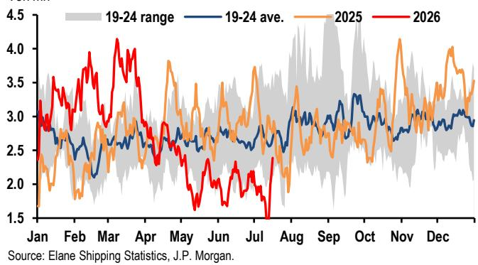

# JPM：中国高频数据追踪，7月前两周政府债券发行1.17万亿元

二季度GDP不及预期后，市场对下半年增长节奏的重新评估正在展开。JPM最新一期中国高频数据追踪报告显示，7月前两周的宏观环境活动信号并不一致：出口量增速在台风扰动下明显节奏变化，但政府债券发行节奏加快，且部分工业领域出现边际改善。这份报告的价值不在于给出一个方向性的结论，而在于提供了多个可交叉验证的观测锚点。

报告覆盖了7月截至17日的数据，其核心发现是：增长动能正在经历结构性分化，而非全面走弱。出口、汽车销售和部分工业品产量承压，但原油加工、二手房交易和财政支出端出现了积极信号。

> **KC评论：** 高频数据追踪的价值在于捕捉月度官方数据发布前的边际变化。报告中的“mtd”（month-to-date）口径意味着这些数字是7月前两周的局部快照，后续可能因台风影响消退和财政加速落地而出现修正。

## 1. 出口量增速明显节奏变化，但台风扰动是主因

报告中最引人关注的变化来自港口追踪数据。7月截至17日，中国离港船舶（不含油轮）的载重吨同比增速从6月的17.2%降至8.7%。其中，集装箱船离港载重吨环比下降15.4%，散货船环比下降9.0%。这一降幅与7月11日至14日台风“巴威”对华东主要港口运营的干扰直接相关。

报告认为，随着港口运营恢复正常，下半月出口量可能出现一定程度的回补。但集装箱运价仍在上涨：中国出口集装箱运价指数（CCFI）至美东和美西航线分别较两周前上涨8.6%和14.9%，至波斯湾/红海航线也上涨了6.6%。这表明航运供给端的紧张并未缓解。

## 2. 工业生产信号分化：原油加工改善，汽车和钢铁承压

高频运营率数据提供了7月工业生产的早期信号。石油沥青装置开工率在7月上半月继续回升，暗示原油加工量的同比调整幅度可能较6月的-17.7%有所收窄。但汽车轮胎开工率节奏变化，意味着汽车产量的同比降幅可能从6月的-0.2%进一步扩大。螺纹钢开工率也出现小幅回落，钢铁工业增加值增速可能由6月的零增长转为负值。

这三个行业的同步分化值得关注。原油加工改善与炼厂利润修复和夏季出行需求有关，而汽车和钢铁的疲软则反映了终端需求——尤其是房地产和消费——的传导不确定性尚未缓解。

## 3. 财政端出现加速信号，但货币政策仍按兵不动

7月前两周政府债券发行达到1.17万亿元，已超过6月全月水平。其中，国债发行8450亿元，特别国债发行1900亿元。但报告同时指出，月末将有超过4500亿元国债到期，因此全月净融资规模仍取决于最后一周的发行节奏。截至7月中旬，国债发行进度达到年度目标的52.9%，略低于去年同期的57.4%。

货币政策方面，央行通过7天逆回购净投放1.97万亿元，同时通过买断式逆回购回笼3000亿元。二季度货币政策委员会声明和央行新闻发布会均释放了“近期无降息紧迫性”的信号，并强调向价格型调控框架的渐进转型。JPM因此将此前低确信度的降息预期从三季度推迟至四季度。

> **KC评论：** 财政加速与货币观望的组合，表明政策层更倾向于用支出端而非利率工具来应对增长节奏变化。对于市场参与者而言，三季度专项债和特别国债的发行节奏，可能比降息与否更能影响流动性和市场定价。

## 4. 二手房韧性延续，但新房和土地市场仍在筑底

房地产市场的分化格局在7月延续。30个大中城市新房销售面积的同比降幅从6月的-7.3%收窄至-1.0%，二手房销售则同比增长3.5%，但增速较6月的12.3%明显节奏变化。中原地产的经理人信心指数短暂回升后再度回落，一线城市二手房挂牌价指数继续小幅节奏变化。

土地市场方面，7月前两周土地出让金额下降，溢价率在月初走低后趋于稳定。土地出让收入持续承压，将继续影响地方政府性产品收入。报告没有给出明确的触底判断，但新房销售降幅收窄和二手房成交仍高于去年同期，至少说明市场并未进一步出现变化。

## 5. 通胀信号：食品影响扩大，猪肉价格从底部回升

7月前两周，农产品批发价格同比下跌2.3%，较6月的-0.5%降幅扩大，主要受夏季供应充裕影响。猪肉批发价格虽仍处于价格变化区间（同比-25.1%），但已从近期底部回升，6月为-28.3%。报告认为，产能过剩和行业盈利不确定性正在加速去库存进程。

能源价格方面，布伦特原油因地缘政治紧张而短期冲高，但向国内成品油和化工品的传导存在滞后。多数石化产品价格已回落至接近冲突前水平。铜价在AI相关需求的支撑下维持高位，铝价近两周有所反弹，而水泥和螺纹钢价格继续小幅节奏变化。

这份报告没有给出一个简单的“好”或“坏”的判断。它更像一张高频数据拼图：出口受扰动但运价仍在涨，财政在加速但货币在观望，二手房在修复但土地在承压。对于关注宏观节奏的读者而言，三季度财政支出的实际落地速度，以及台风影响消退后出口数据的回补幅度，将是判断下半年增长斜率的关键变量。

For informational purposes only. Portions may be generated,translated,summarized,or edited with AI assistance based on source materials and may contain omissions or errors. Please verify independently. This is not investment,legal,tax,accounting,or other professional advice.

For informational purposes only. Portions may be generated,translated,summarized,or edited with AI assistance based on source materials and may contain omissions or errors. Please verify independently. This is not investment,legal,tax,accounting,or other professional advice.

