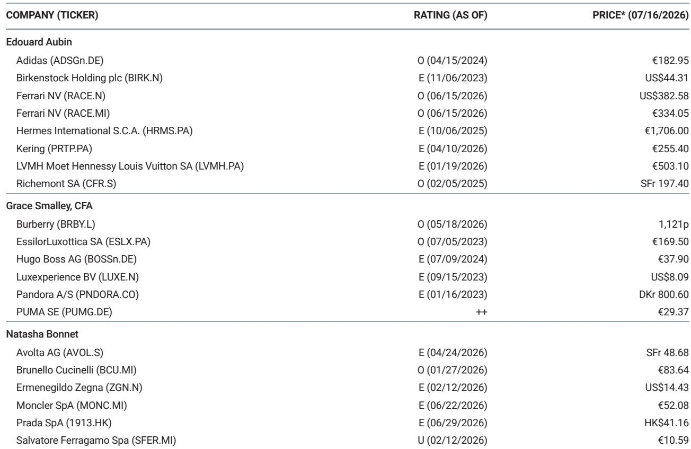
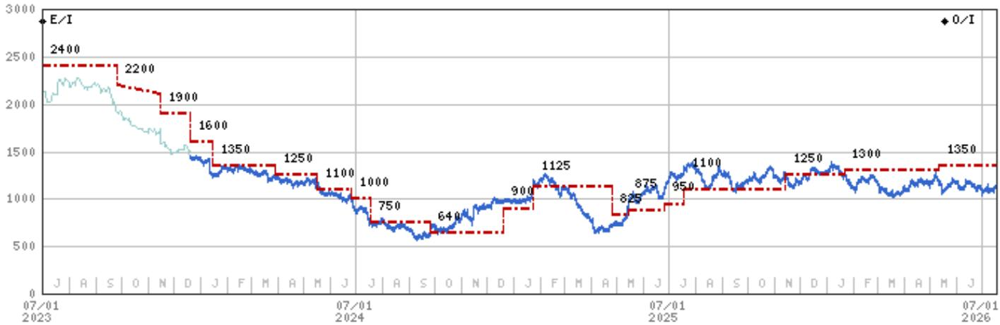
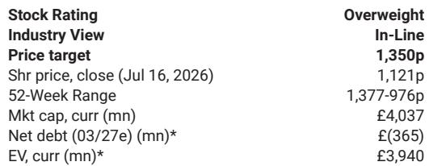

# Burberry's Turnaround Is Working: The Market's Skepticism About Q1 Is a Misread of the Real Trajectory

Burberry reported first-quarter sales for fiscal 2027 that delivered a 5% like-for-like increase despite a 500-basis-point acceleration in the year-over-two-year comparison base, incremental headwinds from Middle Eastern tourism, and the brand's seasonally weakest quarter. The company's performance underperformed the sector by roughly 500 basis points on the day. That gap between operating results and market reaction is the central tension this report addresses.

The investor pushback arriving after the print clusters around four arguments: that the second-half growth implied by consensus is unrealistically steep, that first-half gross margin may decline year on year, that operating expense phasing will compress first-half earnings, and that management's unwillingness to raise consensus guidance amounts to an implicit downgrade. Each of these concerns, when examined against the evidence management provided on the conference call, collapses under its own assumptions.

This is not a quarter that raises new doubts. It is a quarter that confirms a pattern. Burberry has now delivered four consecutive quarters of sequential year-over-two-year like-for-like acceleration. The quality of that growth is improving: handbags turned positive, the European cluster turned positive, discounting declined year on year, and full-price selling increased. The market's focus on phasing mechanics rather than underlying momentum represents a failure to distinguish between noise and signal in a turnaround story.

The following sections dissect each area of pushback, explain why the bear case misinterprets the data, and translate the quarter into a decision framework for investors trying to separate temporary accounting dynamics from durable operating improvement.

## The "Tougher Comps" Argument Misses the Point of a Turnaround: Acceleration Is the Pattern, Not an Exception

The most common pushback from investors centers on the belief that Burberry's top-line trajectory will decelerate in the second half because the comparison base becomes more difficult. This argument treats a brand turnaround as a mechanical exercise in year-over-year arithmetic. It is not.

Burberry's first-quarter like-for-like growth of 5% represented a 500-basis-point sequential acceleration on a year-over-two-year basis. That is the fourth consecutive quarter of such acceleration. The improvement occurred despite a seasonally low period for the brand, a quarter with above-average tourism exposure that remains a net drag, and an incremental 200-basis-point headwind from the Middle East that was double the impact seen in the fourth quarter.

Management did not hedge on the second-half trajectory. They provided a detailed overview of the product pipeline and marketing initiatives designed to sustain momentum. More importantly, the comparison-base argument misunderstands how turnarounds work. When a brand is rebuilding relevance, the relevant metric is not whether growth is easier or harder relative to a prior period. The relevant metric is whether the brand is gaining traction with consumers quarter after quarter. Burberry is.

Investors who focus on the denominator of the comparison are missing the numerator: the strategy is working, and the proof points are accumulating. The quality of growth is also improving. Growth is broadening across product categories, with handbags now positive after a prolonged period of weakness. Growth is broadening across geographic clusters, with Europe turning positive. And growth is being driven by full-price selling, with markdowns declining year on year. This is not a promotional sugar hit. It is a structural recovery in brand health.

## The Gross Margin Phasing Concern Is About Normalized Provisioning, Not Deteriorating Pricing Power

Investors reacted negatively to management's comment that first-half gross margin could be "maybe down ever so slightly" year on year. The bear interpretation is that Burberry is discounting more to drive sales. That interpretation is directly contradicted by what management said and by the data.

Chief Financial Officer Kate Ferry explicitly stated that the gross margin dynamic is "not to do with inventory positions" and that the company is "in a cleaner position than we have ever been." The decline in first-half gross margin is a function of returning to normalized inventory provisioning after two years of abnormal dynamics. In fiscal 2025, Burberry raised significant inventory provisions, which depressed gross margin at that time. In fiscal 2026, the first-half gross margin benefited from selling inventory that had already been provided for. That created a tough year-on-year comparison for fiscal 2027's first half.

This is accounting, not pricing. The company is not discounting more. Management explicitly stated that the quality of sales is improving, with lower markdowns year on year and less discounting. The gross margin phasing is a mechanical consequence of the provision cycle, not a signal of weakening brand power.

Additionally, first-half gross margins face headwinds from licensing, Middle Eastern exposure, and tariffs. All of these are expected to fade in the second half. Management reiterated their confidence in the medium-term gross margin target of 70%, a level the company achieved just a few years ago. The near-term phasing does not change the structural path.

The risk here is that investors confuse a temporary accounting dynamic with a deterioration in underlying pricing power. They are not the same thing. Burberry's gross margin story remains intact. The delivery is simply back-end loaded this year, which is consistent with historical seasonality and the company's return to growth mode.

## Operating Expense Phasing Is a Timing Shift, Not a Cost Overrun

Management flagged that first-half operating expenses could be slightly higher than the prior year due to the timing of marketing spend, with roughly 10 million pounds shifting from October to September. Full-year opex guidance remains unchanged: broadly flat.

The bear case seizes on this as evidence of cost creep. The more accurate interpretation is that Burberry is investing in marketing ahead of its peak selling season, and the accounting treatment simply pushes some of that spend into the first half. There is no change to the total marketing budget for the year.

More importantly, management emphasized multiple times on the call that they are "absolutely committed" to broadly flat opex for the full year. That commitment, if delivered, will produce significant operating leverage. The company's EBIT margin is currently well below historical levels. Flat opex combined with mid-single-digit revenue growth is a powerful margin expansion formula.

The phasing concern is a distraction. The full-year trajectory is what matters, and on that metric, management's messaging was consistent and confident. The real story is that Burberry is controlling costs tightly while investing selectively in growth, which is exactly what a turnaround requires.

## The "Implied Downgrade" Narrative Ignores What Management Actually Said

Some investors concluded that Burberry's decision not to raise consensus guidance despite an FX upgrade and a wholesale upgrade amounts to an implicit downgrade of underlying expectations. This is a logical error.

Management was clear: "There is absolutely no downgrade." They noted that they are "happy with 246 million pounds" for full-year EBIT but also proactively stated that there is a "broad range out there" and that it is too early in the year to adjust consensus. This is standard practice for a company that has just reported its first quarter. No credible management team revises full-year guidance based on one quarter of data, especially when that quarter is seasonally the smallest.

The more important signal is what management said about confidence. On the call, they stated: "We are feeling more confident, whether it's in the short and indeed more importantly, the longer-term trajectory for Burberry, absolutely. We are continuing to see improvement quarter-on-quarter. We are seeing more and more proof points that the strategy is working. And therefore, whilst we are not changing consensus at this early stage of the year, we are certainly increasing in our confidence in Burberry forward."

That is not the language of a management team that sees deterioration. It is the language of a management team that sees improvement but is appropriately measured about changing external expectations after one quarter. Investors who read the lack of guidance revision as a downgrade are confusing conservatism with weakness.

## A Decision Framework for Investors: Distinguishing Accounting Phasing from Operating Reality

The four areas of investor pushback share a common structure. Each one identifies a real phenomenon—a tougher comparison base, a gross margin decline, higher first-half opex, no guidance raise—but then misattributes the cause. The correct framework for evaluating this quarter requires separating three distinct layers.

Layer one is the underlying operating trajectory. On this dimension, the evidence is unambiguous. Like-for-like growth is accelerating. Growth is broadening across categories and regions. Full-price selling is improving. Discounting is declining. Inventory is clean. Management confidence is increasing. This is the layer that determines the multi-year equity story.

Layer two is accounting and provisioning dynamics. Inventory provisioning cycles, the timing of marketing spend, and the normalization of gross margin phasing after two years of abnormal adjustments create noise in the quarterly P&L. These dynamics are real but temporary. They do not change the underlying trajectory. Investors who focus on this layer will systematically underestimate the company's progress.

Layer three is management communication strategy. Burberry's management is deliberately conservative in setting external expectations. They are not raising guidance after one quarter because it is too early to do so credibly. That is not a signal of weakness. It is a signal of discipline. Investors who interpret conservatism as a downgrade are misreading the incentive structure.

The correct decision depends on which layer an investor believes is most predictive. If the accounting and communication layers dominate, the company looks risky. If the underlying operating trajectory dominates, the company looks undervalued. The evidence from four consecutive quarters of improving momentum, combined with clean inventory and improving full-price mix, strongly favors the latter interpretation.

The market's negative reaction to this quarter is a function of overweighting phasing mechanics and underweighting the structural improvement in brand health. That gap between perception and reality is precisely where the opportunity lies.

*For informational purposes only. Portions may be generated, translated, summarized, or edited with AI assistance based on source materials and may contain omissions or errors. Please verify independently. This is not professional advice.*

For informational purposes only. Portions may be generated, translated, summarized, or edited with AI assistance based on source materials and may contain omissions or errors. Please verify independently. This is not professional advice.

