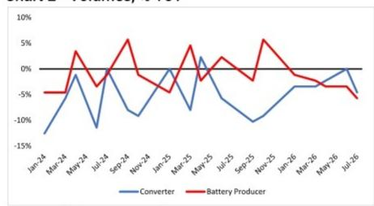
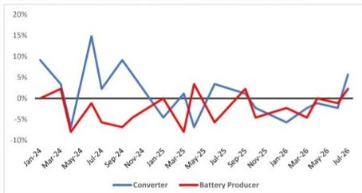
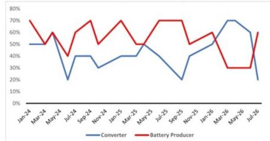
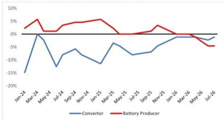
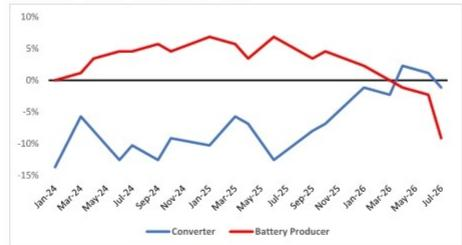
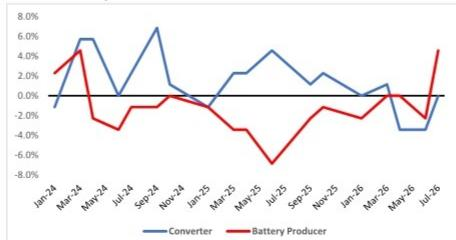
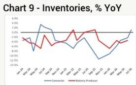

## 锂价值链调研：动能趋缓，前景调整

我们对锂加工企业（其中98%的销售面向中国市场）及电池材料生产商（占比61%）的调研显示，第三季度表现有所放缓，生产端感受更为明显。预计第三季度报价将出现一定幅度下调，电池生产商的新订单增速明显回落，同时加工企业的积压订单也有所收缩。从库存同比变化来看，加工企业和电池生产商的库存增速均领先于出货量增速，这种情况在过去三年中仅出现过两次。

图1 - 锂价，未来三个月变化百分比  
  
来源：JEF专项调研

图2 - 出货量，同比变化  
  
图3 - 库存同比变化 - 出货量同比变化  
来源：JEF专项调研

  
来源：JEF专项调研  
来源：JEF专项调研

图4 - 订单积压：>50% = 扩张  
图5 - 下月销售额，同比变化  

图7 - 客户库存：>50% = "偏高"  
  
来源：JEF专项调研  
来源：JEF专项调研

图6 - 新订单，同比变化  
  
来源：JEF专项调研

图8 - 预期销售额同比变化 - 新订单同比变化  
  
来源：JEF专项调研

  
来源：JEF专项调研

Laurence Alexander \* | 研究分析师 +1 (212) 284-2553 | lalexander@JEF.com

Kevin Estok \* | 研究助理

+1 (212) 778-8516 | kestok@JEF.com

Daniel Rizzo \* | 研究分析师 (212) 336-6284 | drizzo@JEF.com

Xianrao Zhu \* | 研究助理 +1 (212) 778-8742 | xzhu@JEF.com

Carol Jiang \* | 研究助理 +1 (212) 284-1714 | cjiang@JEF.com

## 分析师声明：

本人Laurence Alexander声明，本研究报告中所表达的所有观点均准确反映本人对相关标的公司及证券的个人观点。本人亦声明，本人薪酬的任何部分过去、现在或将来均与本研究报告中的具体建议或观点无直接或间接关联。

本人Kevin Estok声明，本研究报告中所表达的所有观点均准确反映本人对相关标的公司及证券的个人观点。本人亦声明，本人薪酬的任何部分过去、现在或将来均与本研究报告中的具体建议或观点无直接或间接关联。

本人Daniel Rizzo声明，本研究报告中所表达的所有观点均准确反映本人对相关标的公司及证券的个人观点。本人亦声明，本人薪酬的任何部分过去、现在或将来均与本研究报告中的具体建议或观点无直接或间接关联。

本人Xianrao Zhu声明，本研究报告中所表达的所有观点均准确反映本人对相关标的公司及证券的个人观点。本人亦声明，本人薪酬的任何部分过去、现在或将来均与本研究报告中的具体建议或观点无直接或间接关联。

本人Carol Jiang声明，本研究报告中所表达的所有观点均准确反映本人对相关标的公司及证券的个人观点。本人亦声明，本人薪酬的任何部分过去、现在或将来均与本研究报告中的具体建议或观点无直接或间接关联。

与所有JEF员工一样，负责本报告所讨论金融工具覆盖范围的分析师的薪酬部分基于公司整体业绩，包括投行业务收入。我们力求适时更新研究，但各种法规可能阻止我们这样做。除某些定期发布的行业报告外，大部分报告由分析师根据其判断不定期发布。

## 研究交流记录

（《市场滥用条例》第3(1)e条和第7条）

建议发布时间

2026年7月16日 16:04

建议分发时间

2026年7月17日 0:00

## JEF评级说明

买入 - 指我们预期在未来12个月内总回报（价格上涨加收益）达到15%或以上的证券。

持有 - 指我们预期在未来12个月内总回报（价格上涨加收益）在正15%至负10%之间的证券。

弱于大盘 - 指我们预期在未来12个月内总回报（价格上涨加收益）为负10%或以下的证券。

对于平均价格持续低于10美元的报告评级证券，预期未来12个月总回报（价格上涨加收益）为20%或以上，因为这些公司通常比整体市场波动更大。对于平均价格持续低于10美元的持有评级证券，预期未来12个月总回报（价格上涨加收益）为正负20%。对于平均价格持续低于10美元的弱于大盘评级证券，预期未来12个月总回报（价格上涨加收益）为负20%或以下。

NR - 投资评级和目标价已暂时暂停。此类暂停符合适用法规和/或JEF政策。

CS - 覆盖暂停。JEF已暂停对该公司的覆盖。

NC - 未覆盖。JEF未覆盖该公司。

受限 - 指因JEF参与某些交易，公司政策或适用证券法规禁止特定类型沟通（包括研究交流）的发行人。

观察 - 指正在监测公司基本面和财务状况的证券，不提供财务预测或对公司研究价值的意见。

## 估值方法

JEF分配评级的方**可能包括：市值、期限、成长/价值、波动性以及未来12个月的预期总回报。目标价基于多种方**，可能包括但不限于对市场风险、增长率、收入流、现金流折现、EBITDA、每股收益、现金流、自由现金流、EV/EBITDA、市盈率、市盈率/增长率、P/CF、P/FCF、溢价（折价）/平均组EV/EBITDA、溢价（折价）/平均组市盈率、分部加总、净资产价值、股息回报和未来12个月净资产回报表现（ROE）的分析。JEF精选股

JEF精选股包括我们研究分析师在未来12个月内从最佳选股思路中挑选的股票。选股基于基本面分析，并可能考虑其他因素，如分析师信心、差异化分析、有利的风险/回报比以及JEF分析师推荐的投资主题。JEF精选股将仅包含报告评级股票，数量可能因分析师推荐纳入情况而异。当新机会出现时，股票将被加入；当纳入理由发生变化、股票已达到预期回报、不再被评为买入和/或触发止损时，股票将被移除。在标普500股票中120日波动率处于最低四分位的股票将继续设有15%的止损，其余股票设有20%的止损。精选股并非旨在代表推荐的投资组合，也不基于行业，但我们可能会指出我们认为某只精选股属于成长或价值等投资风格。

## 可能阻碍实现目标价的风险

本报告为一般性流通而编制，不提供针对特定个人读者的研究交流。因此，本报告中讨论的金融工具可能不适合所有读者，读者必须根据其特定的投资目标和财务状况，利用其认为必要的财务顾问做出自己的投资决策。本报告中推荐的金融工具的过往表现不应被视为未来结果的指示或保证。本报告中提及的任何金融工具的价格、价值和收入都可能上涨或下跌，并可能受到经济、金融和政治因素变化的影响。如果金融工具以读者本国货币以外的货币计价，汇率变化可能对本报告中描述的金融工具的价格、价值或收入产生不利影响。如果价格以非美元货币显示，请注意我们的当地货币目标价是基于前一交易日（除非另有说明）的汇率换算。如果此后汇率出现波动，将影响非美元目标价，不应再依赖。此外，投资于存托凭证等证券的读者，其价值受基础证券货币影响，实际上承担了货币风险。

<table><tr><td colspan="3">评级分布</td><td colspan="2">投行服务/过去12个月</td><td colspan="2">JIL市场服务/过去12个月</td></tr><tr><td></td><td>数量</td><td>百分比</td><td>数量</td><td>百分比</td><td>数量</td><td>百分比</td></tr><tr><td>买入</td><td>2239</td><td>62.63%</td><td>390</td><td>17.42%</td><td>111</td><td>4.96%</td></tr><tr><td>持有</td><td>1174</td><td>32.84%</td><td>95</td><td>8.09%</td><td>16</td><td>1.36%</td></tr><tr><td>弱于大盘</td><td>162</td><td>4.53%</td><td>1</td><td>0.62%</td><td>1</td><td>0.62%</td></tr></table>

## 其他重要披露

## 其他重要披露

JEF与其研究报告所覆盖的公司开展业务并寻求开展业务，并期望从这些公司获得或打算寻求投行服务及其他活动的报酬。因此，读者应注意，JEF可能存在可能影响本报告客观性的利益冲突。读者应将本报告视为做出投资决策的单一因素。

JEF权益研究指由以下JEF金融集团（“JEF”）公司之一雇用的分析师制作的研究报告：美国：JEF LLC，一家在美国证券交易委员会注册的经纪交易商，FINRA成员（并由在美国证券交易委员会注册的投资顾问JEF Services, LLC向单独支付此类研究费用的客户分发）。

加拿大：JEF Securities Inc.，一家在加拿大十三个司法管辖区注册的投资交易商，加拿大投资监管组织的交易商成员，包括由JEF Securities Inc.与另一JEF实体联合制作的研究报告（并由JEF Securities Inc.分发）。

若JEF Securities Inc.分发由JEF LLC、JEF International Limited、JEF Japan Company Limited或JEF India Private Limited制作的研究报告，请注意，JEF LLC、JEF International Limited、JEF Japan Company Limited和JEF India Private Limited均依据国家文书31-103《注册要求、豁免和持续注册人义务》中的交易商注册要求豁免在您的司法管辖区作为交易商运营，因此，JEF LLC、JEF International Limited、JEF Japan Company Limited和JEF India Private Limited无需也并非在您所在司法管辖区注册的交易商或顾问。请注意，若JEF LLC或JEF International Limited准备了本研究，其并非按照加拿大关于研究报告的披露要求编制。

英国：JEF International Limited，由金融行为监管局授权和监管；在英格兰和威尔士注册，编号1978621；注册办公室：100 Bishopsgate, London EC2N 4JL；电话 +44 (0)20 7029 8000；传真 +44 (0)20 7029 8010。

德国：JEF GmbH，由德国联邦金融监管局授权和监管，BaFin-ID：10150151；注册办公室：Bockenheimer Landstr. 24, 60323 Frankfurt a.M., Germany；电话：+49 (0) 69 719 1870

香港：JEF Hong Kong Limited，由香港证券及期货事务监察委员会持牌，CE编号ATS546；位于香港中环金融街8号国际金融中心二期26楼；电话：+852 3743 8000。

新加坡：JEF Singapore Limited，由新加坡金融管理局持牌；位于10 Collyer Quay #41-01, Ocean Financial Centre, Singapore 049315，电话：+65 6551 3950。

日本：JEF Japan Company Limited，由日本金融厅注册的证券公司，日本证券业协会成员；位于东京都千代田区有乐町1-1-2日比谷三井大厦30楼；电话 +813 5251 6100；传真 +813 5251 6101。

印度：JEF India Private Limited (CIN - U74140MH2007PTC200509)，由印度证券交易委员会持牌：股票经纪商 (NSE & BSE) INZ000243033，研究分析师 INH000000701，商人银行家 INM000011443，位于Level 16, Express Towers, Nariman Point, Mumbai 400 021, India；电话 +91 22 4356 6000。合规官姓名：Sanjay Pai，电话：+91 22 42246150，电子邮件：spai@JEF.com，申诉官姓名：Sanjay Pai，电话：+91 22 42246150，电子邮件：compliance\_india@JEF.com。SEBI的注册和NISM的认证绝不保证中介机构的业绩或为读者提供任何回报保证。

澳大利亚：JEF (Australia) Pty Limited (ACN 623 059 898)，持有澳大利亚金融服务牌照 (AFSL 504712)，位于Level 20, 60 Martin Place, Sydney NSW 2000；电话 +61 2 9364 2800。

迪拜：JEF International Limited, Dubai branch，由迪拜金融服务局持牌（DFSA参考编号F007325）；注册办公室Unit L31-06, L31-07, Level 31, ICD Brookfield Pace, DIFC, PO Box 121208, Dubai, UAE。

本报告由与JEF（JEF Securities Inc.、JEF International Limited、JEF GmbH、JEF Hong Kong Limited、JEF Singapore Limited、JEF Japan Company Limited、JEF India Private Limited）和JEF (Australia) Pty Ltd相关的人员，或与JEF LLC和JEF Services LLC（“JRS”）均相关的人员编制。JEF LLC是一家美国注册经纪交易商，与JRS关联，JRS是一家美国注册投资顾问。JRS不创建定制或个性化研究，JRS提供的所有研究均为非个人化。如果您单独为这项研究付费，则由JRS提供给您。否则，由JEF LLC提供。JEF LLC、JRS及其关联公司在下文中统称为“JEF”。JEF可能寻求与本研究报告所覆盖的公司开展业务。因此，读者应注意，JEF可能存在可能影响本报告客观性的利益冲突。读者应将本报告视为做出投资决策的众多因素之一。FINRA、加拿大投资监管组织及其他规则要求的特定利益冲突和其他披露在本披露部分中阐述。

## \*\*\*

如果您从非美国JEF实体收到本报告，请注意以下事项：除非经修订的1933年美国证券法S条例的规定禁止，否则本材料在美国由JEF LLC分发，JEF LLC根据经修订的1934年美国证券交易法规则15a-6的规定对其内容负责。任何美国人士的交易或代表美国人士的交易只能通过JEF LLC进行。在英国和欧洲经济区，本报告由JEF International Limited（“JIL”）和/或JEF GmbH发布和/或批准分发，仅供具有或已被评估为具有适当专业经验和专业知识的人士，或可以合法分发的其他人士使用。JEF LLC、JIL、JEF GmbH及其关联公司可能在本报告提及的金融工具中做市或提供流动性；若其确实做市，此类活动将在本报告“公司特定披露”中具体披露。

对于加拿大读者，本材料仅供专业或机构读者使用。本文提及或描述的任何投资或投资服务均不适用于其他人士或加拿大任何非“许可客户”（定义见国家文书31-103《注册要求、豁免和持续注册人义务》，如适用）的人士。本研究报告仅是对一种或多种证券的优缺点和风险的一般性讨论，绝不旨在适应任何接收者的需求和情况。本文所含信息并非，且在任何情况下均不得被解释为在加拿大或其任何省或地区出售本文所述证券的要约，或招揽购买本文所述证券的要约。在加拿大出售本文所述证券的任何要约或销售将仅在豁免向相关加拿大证券监管机构提交招股说明书要求（如适用）的情况下进行，并且仅由根据适用证券法适当注册的交易商或根据相关加拿大省或地区交易商注册要求的豁免进行。本文所含信息在任何情况下均不得被解释为加拿大任何省或地区的研究交流，也不适应接收者的需求。若本文所含信息涉及根据加拿大或加拿大某省或地区法律注册、组建或创建的发行人的证券，此类证券的任何交易必须通过加拿大注册的交易商进行。加拿大任何证券委员会或类似监管机构均未审查或以任何方式对本研究报告、本文所含信息或本文所述证券的优缺点做出判断，任何相反的陈述均属违法。

在新加坡，JEF Singapore Limited（“JSL”）受新加坡金融管理局监管。对于新加坡共和国的读者，若本材料由新加坡境外的JEF关联公司编制和发布，则由JSL根据《财务顾问条例》第32C条分发。本文件所含材料仅供认可、专家或机构读者（定义见2001年《证券及期货法》（新加坡））使用。若对本材料有任何疑问或相关问题，请联系JSL，地址：80 Raffles Place #15-20, UOB Plaza 2, Singapore 048624，电话：+65 6551 3950。在迪拜，本材料由JEF International Limited, Dubai branch发布和分发，仅供专业客户使用，不应分发给零售客户（定义见DFSA）或依赖。各行业评级百分比分布可向您的销售代表索取。在日本，本材料由JEF Japan Company Limited仅向机构读者发布和分发。在香港，本报告由JEF Hong Kong Limited发布和批准，仅供专业读者（定义见香港《证券及期货条例》及其附属法例）使用。在中华民国（台湾），不应分发本报告。与本报告相关的研究在中华人民共和国（“中国”）境外进行。本报告不构成在中国出售任何证券的要约或招揽购买任何证券的要约。中国读者应具备投资此类证券的相关资格，并应自行负责从相关政府机构获得所有相关批准、许可、验证和/或注册。在印度，本报告由JEF India Private Limited提供。在澳大利亚，本报告由或代表JEF (Australia) Securities Pty Ltd (ACN 610 977 074) 发布和/或批准分发，该公司持有澳大利亚金融服务牌照 (AFSL 487263)。本报告仅针对《2001年公司法》（澳大利亚）（“公司法”）含义内的批发客户，供其考虑本报告主题的任何投资或投资服务。本报告可能包含一般性金融产品建议。若本报告提及特定金融产品，您应在就该产品做出任何决定前获取相关产品披露声明或要约文件副本。任何其他司法管辖区的本文件接收者应自行了解并遵守接收本文件的任何适用法律要求。本报告不是购买或出售任何证券或衍生工具或进行任何投资的要约或招揽。任何意见或估计均构成编制者截至编制日期的最佳判断，如有更改，恕不另行通知。JEF不承担基于后续信息或事件维护或更新本报告的义务。JEF及其各自的高级职员、董事和员工可能持有多头或空头头寸，或可能作为代理人或本人为其自身账户购买或出售本文提及或描述的任何证券、衍生工具或其他投资。本材料仅供参考，不针对任何接收者，并非基于或考虑任何接收者的特定投资目标、投资组合持有、策略、财务状况或需求。因此，本报告中的任何建议或推荐可能不适合特定接收者。JEF假定本报告的接收者能够评估本文所含信息并独立做出判断。本报告的接收者在做出任何投资决策前，应首先根据其自身情况考虑本报告中的任何建议或推荐是否适合该接收者，并在适当或必要时寻求专业建议，包括税务建议。JEF不进行任何适当性或其他分析，以检查接收者基于本报告做出的投资决策是否与接收者的投资目标、投资组合持有、策略、财务状况或需求一致。

通过提供本报告，JRS或任何其他JEF实体均不接受对接收者资产管理的任何授权、自由裁量权或控制权。本报告接收者基于本报告信息采取的任何行动，均由接收者自行判断并承担风险。接收者必须对任何潜在投资进行独立审查。如果接收者使用JEF LLC（或其他关联经纪交易商）的服务进行本材料主题证券的购买或销售，该经纪交易商可能作为本人为其自身账户或作为代理人代表另一人行事。只有JRS在美国证券交易委员会注册为投资顾问；因此，JEF LLC或任何其他JEF关联公司在分发这些报告时均无任何受托责任。

本文提及的投资的价格和价值以及从中获得的收入可能会波动。过往表现并非未来表现的指引，未来回报不保证，且可能发生原始资本损失。汇率波动可能对某些投资的价值、价格或从中获得的收入产生不利影响。

本报告可能包含前瞻性陈述，这些陈述可能受到不准确假设或已知或未知风险、不确定性及其他重要因素的影响。因此，金融产品的实际结果、事件、表现或成就可能与此类陈述中明示或暗示的内容存在重大差异。

本报告独立于本文提及的任何证券发行人编制，并非作为任何证券发行人的代理人。任何权益研究人员的均无权代表发行人做出任何陈述或保证。本文中的任何评论或陈述均为制作本报告的JEF实体的观点，可能与其他JEF实体的观点不同。

本报告可能包含从第三方获得的信息，包括信用评级机构（如标准普尔）的评级，以及源自第三方或专有生成式人工智能模型的信息。JEF不保证此类信息的准确性、完整性、及时性或可用性，并且不对因使用此类内容而产生的任何错误或遗漏（无论是否疏忽）或任何结果负责。JEF及任何第三方内容提供商（包括生成式人工智能模型提供商）均不提供任何明示或暗示的保证，包括但不限于任何适销性或特定用途适用性的保证。JEF及任何第三方内容提供商均不对因使用其内容（包括评级）而产生的任何直接、间接、附带、示范性、补偿性、惩罚性、特殊或后果性损害、成本、费用、法律费用或损失（包括收入或利润损失及机会成本）承担责任。信用评级是意见陈述，而非事实陈述或购买、持有或出售证券的建议。它们不涉及证券的适当性或证券用于投资目的的适当性，不应作为研究交流依赖。未经相关第三方事先书面许可，禁止以任何形式复制和分发第三方内容。

JEF报告以电子方式传播并提供，在某些情况下也以印刷形式提供。电子研究同时提供给所有客户。未经JEF事先书面同意，接收者或任何第三方不得通过内容抓取或提取、自动化处理或任何其他形式或方式复制、转载、出售、再分发或披露本报告或其任何部分。任何未经授权的使用均被禁止。JEF或其各自的董事、高级职员或员工均不保证任何投资的财务成功，也不对因使用本报告或其内容而产生的任何直接、间接或后果性损害或损失承担任何责任。本文中的任何内容均不得解释为放弃JEF根据适用的美国联邦或州证券法承担的任何责任。

有关JRS的重要披露信息，请参阅 https://adviserinfo.sec.gov/IAPD/Content/Common/crd\_iapd\_Brochure.aspx?BRCHR\_VRSN\_ID=483878 和 https://adviserinfo.sec.gov/Firm/292142 或访问我们的网站 https://avatar.bluematrix.com/sellside/Disclosures.action，或 www.JEF.com，或致电 1.888.JEF。

© 2026 JEF
