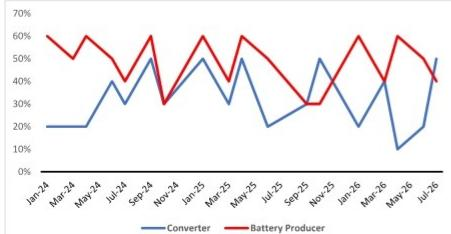
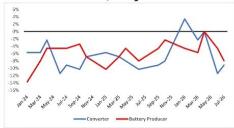

# 锂材料库存信号：行业备货节奏与需求变化出现分化

一项针对锂材料加工商和电池材料生产商的调研显示，过去三年中仅出现过两次的库存与出货量背离现象正在重现：库存增速明显高于出货量增速。这并非正常的补库周期，而是锂材料供应链进入被动库存积累阶段的信号——生产商持有的材料量超过了终端市场实际消耗所需。上一次出现这一模式后，锂材料报价进入了一段持续调整期。当前数据显示类似情况可能正在发生，第三季度报价预期出现高个位数下调，电池生产商的新订单增速明显放缓，而加工商在手订单也在收缩。

该调研覆盖了中国锂材料加工商98%的销售额和61%的电池材料生产商，呈现了两个关联环节同步调整的图景。加工商和电池生产商均报告，其库存同比增速目前超过了出货量同比增速。这不是供应链的正常化调整，而是计划外库存的积累，后续需要通过价格调整和产量削减来消化。对于市场参与者而言，信号清晰：锂材料市场正从偏紧状态转向相对宽松，对现货报价敏感的公司面临盈利环境的变化。

以下分析将调研数据转化为一个观察框架，解释库存与出货量差距为何重要、在手订单变化如何印证当前判断，以及在这一环境下企业和观察者应如何评估。

## 库存与出货量差距处于近三年最大，历史上曾先于价格调整出现

当库存增速超过出货量增速时，供应链并非为满足增长的需求而备货。要么是相对于消费量生产过多，要么是下游订单减少导致材料积压在仓库。调研数据显示，锂材料加工商和电池材料生产商的库存同比增速与出货量同比增速之差目前均为正值且在扩大。这一差距在过去36个月中仅出现过两次，且在这两次之后，锂材料报价均在后续季度出现明显调整。

其机制较为直接。加工商和电池生产商持有的锂化学品和前驱体材料超过了其销售量所对应的合理水平。这部分过剩库存构成了潜在的供应压力。即使需求企稳，市场也需要先消化这部分库存，之后新增产量才能以合理利润定价。调研中的报价预期印证了这一动态：受访者预计第三季度锂材料报价将出现高个位数下调。这一预期与买方供应充足、无紧迫补库需求的市场状态一致。

需要强调的是，这并非需求崩溃。出货量同比仍在增长，但增速在放缓。问题在于库存增速快于出货量增速，这意味着在现行价格下，产量超过了市场能够消化的水平。这是价格调整可能持续超过一个季度的典型信号。

## 在手订单收缩与新订单增速放缓，确认需求端正在调整

第二个确认信号来自调研中的在手订单和新订单数据。对于锂材料加工商，报告在手订单扩大的受访者比例已降至50%以下，意味着更多公司看到在手订单在缩减而非增长。这种收缩发生在电池材料生产商新订单增速明显放缓的背景下。当在手订单缩减与新订单放缓同时出现时，供应链并非经历暂时性低谷，而是订单行为正在发生结构性变化。

顺序很重要。在健康的市场中，当新订单超过出货量时，在手订单会增长。在当前环境下，在手订单收缩是因为出货量超过了新订单。生产商从现有订单簿中出货的速度快于补充新订单的速度。这种动态迫使公司要么减少产量，要么在价格上更具竞争力以吸引新业务。调研中电池生产商的新订单数据显示增速明显放缓，这表明电动汽车和储能终端市场吸收材料的速度未达到供应链此前的预期。

对于观察者而言，在手订单收缩是利润空间变化的前瞻指标。当在手订单充足时，生产商可以争取更好的价格条件，优先选择利润较高的合同。当在手订单减少时，议价能力转向买方，生产商为了维持开工率以覆盖固定成本，不得不接受较低的利润空间。调研数据表明，从卖方市场向买方市场的转变已经发生。

## 客户库存感知转向“偏高”，将抑制补库需求

调研还追踪了客户如何看待自身库存水平——偏高、偏低或适中。报告客户库存“偏高”的受访者比例已升至50%以上。这是一个重要的情绪指标，因为它直接影响采购行为。当客户认为库存过多时，他们会停止提前采购，转而消耗现有库存。这种去库存行为会放大生产商层面的需求放缓。

客户库存感知的变化尤其值得关注，因为它可能形成自我强化的循环。生产商看到订单减少，进而通过降价来刺激需求。客户预期价格进一步下调，推迟采购并继续去库存。这一循环可能持续多个季度，直到库存水平与终端市场消费重新平衡。调研数据表明，锂材料供应链正处于这一循环的早期阶段，而非后期。

对策略的启示是，生产商不应假设当前需求疲软只是暂时现象。客户库存数据显示下游买方库存充足，没有紧迫的补库需求。任何订单的恢复都可能滞后于终端市场需求的改善至少一到两个季度，因为客户需要先消化现有库存。

## 观察锂材料调整期的分析框架

调研数据为企业和观察者提供了一个结构化的分析框架，包含四个维度：库存动量、订单健康度、报价预期和客户库存感知。

第一，库存动量。比较库存同比增速与出货量同比增速。如果库存增速超过出货量增速5个百分点以上，市场处于相对宽松状态。当前数据已超过这一阈值。相应的应对是降低产量、推迟扩张投入、优先保障现金流而非市场份额。

第二，订单健康度。追踪报告在手订单扩大的公司比例。如果这一比例降至50%以下（当前正是如此），议价能力正向买方转移。公司应避免锁定固定价格的长期供应合同，转而寻求允许价格调整的灵活协议。

第三，报价预期。调研中下一季度报价高个位数下调的预期，与市场尚未找到稳定点的状态一致。生产商应测试其财务模型在低于当前现货价格15%至20%水平下的表现，以确保能够承受更深度的调整。

第四，客户库存感知。当超过50%的受访者报告客户库存偏高时，补库需求至少在两个季度内不太可能出现。公司应为订单疲软期做好规划，并相应调整成本结构。

应用这一框架，当前数据指向市场正处于调整期的早期到中期阶段。库存与出货量差距、在手订单收缩和客户库存感知均指向同一方向。相对少见可能打破这一循环的因素是终端市场需求的显著加速，而调研数据并不支持这一情景。

## 应对策略应以防御为主

在调整期，一种常见的倾向是将价格下调视为买入机会或通过降价抢占市场份额的时机。调研数据不支持这一做法。当库存在整个供应链中积累时，降价并不会刺激额外需求，而只是将利润从生产商转移给原本就会购买的客户。正确的策略是减少产出、保存现金，等待库存过剩被消化。

生产商应关注三个行动。第一，根据订单而非内部预测来安排产量。调研显示，库存积累表明预测此前过于乐观。第二，重新谈判原材料供应协议，引入更多可变成本成分。在产量下降时，固定成本承诺存在风险。第三，与市场参与者就库存状况进行透明沟通。承认调整并主动采取措施管理的公司，将在周期转变时获得信任。

对于观察者而言，调研数据表明，与锂材料相关的公司报价尚未完全反映库存调整的幅度。当前价格与库存与出货量比率所隐含的水平之间的差距，提示存在进一步调整的可能。观察者应关注成本优势明显、资产负债表稳健、且能够灵活降低产量而不产生严重现金损失的公司。

锂材料市场并非面临需求危机，而是经历供应链协调的阶段性调整——产量跑在了消费前面，库存积累到了需要时间消化的水平。调研数据提供了清晰一致的信号：调整已经开始，且仍有空间。

*仅供参考。部分内容可能基于源材料通过AI辅助生成、翻译、总结或编辑，可能存在遗漏或错误。请独立核实。本文不构成任何专业建议。*

仅供参考。部分内容可能基于源材料通过AI辅助生成、翻译、总结或编辑，可能存在遗漏或错误。请独立核实。本文不构成任何专业建议。

