# A picture is worth a thousand words

Comprehensive US drug market analysis (IQVIA Rx). The latest weekly Total Prescription YoY change (wk ending 7/10) was -5.3% vs. +9.2% last wk and +1.2% over the past 12 wks.

For week ended Jul 10, US total market weekly TRx YoY change was -5.3% vs. +4.0% year ago (Exhibit10). Rolling 4-week TRx YoY was +1.3% and rolling 12-week TRx YoY was +1.2%. Extended unit (EUTRx) weekly YoY growth was +5.6%, below TRx YoY (Exhibit 13). Sequential weekly TRx growth was -2.8% compared to +0.1% week before. Exhibit17 – Exhibit19 depict YoY momentum for key products.

BMY's Cobenfy was approved for schizophrenia on 9/26/24. Scripts are ~3,300 for the week vs ~3,220 last week. For full details on our views on the launch see our note "Contextualizing Cobenfy launch expectations", where we discuss that the analogs we are most focused on are the schizophrenia volumes from the Rexulti, Caplyta, and Lybalvi launches. We estimated that to achieve 2026 consensus expectations Cobenfy TRx needs to track at ~2-5x the volumes from those launches (see Exhibit 1) based on the implied consensus trend, as '26 estimate is $289mn, which implies ~197K TRx are required to reach consensus estimates (assuming a ~$1,450 net price, in line with our estimated price in our BMY model). We also show the Cobenfy launch to date and our estimate of the trajectory to achieve consensus relative to recent anti-psychotic launches, with TRx combined across all indications, in Exhibit 2 below for reference as well.

GILD's Yeztugo vs. Descovy vs. Apretude launch comparison chart ( Exhibit 4 ). GILD's Yeztugo (lenacapavir) was approved on 6/18/2025. Latest week total TRx (oral + injectable) were ~1,750 vs. ~1,310 previous week, and last week TRx for injectable were ~1,030 vs. ~750 previous week. Using a linear method, we project the weekly injectable TRx needed to achieve 2Q26 cons, utilizing 1Q26 implied $/script ( Exhibit 5 ), but acknowledging we have limited visibility here at this point in the launch. Our analysis of IQVIA prescription data implies only modest incremental script growth is required to achieve 2Q26 VA cons of US $223mn, based on applying the 1Q capture ratio to 1Q script volume/Yeztugo WAC, though we note there are several caveats including GTN dynamics. Channel mix is a key swing factor. We use price/IQVIA Rx to quantify the impact of channel mix, and our analysis brackets consensus with projected 2Q26 Yeztugo sales of $208mn/$251mn using 1Q26/4Q25 price/Rx. See our recent 2Q pre-preview HERE. Bigger picture, we note Yeztugo has already secured 95% payor coverage. Moreover, most payers do not require copays, and only a limited number have prior authorization or step-edit requirements, which is an indication that most payers are aligning with USPSTF guidelines. Overall, we are encouraged by strong PrEP market growth (+14% y/y) and sustained Descovy share (>45%), which reinforce our confidence in 2026+ PrEP estimates (Yeztugo MSe $1,148mn US ($1,155mn WW) vs. VA cons $999mn US ($1,059mn WW)) and

MS & CO. LLC
Terence C Flynn, Ph.D.
Equity Analyst
Terence.Flynn@morganstanley.com +1 212 761-2230

Alexander Yevdokimov, Ph.D.
Research Associate
Alexander.Yevdokimov@morganstanley.com +1 212 761-2167

Chris Yu, J.D., Ph.D.
Equity Analyst
Chris.L.Yu@morganstanley.com +1 212 761-2535

Hailey Horowitz
Research Associate
Hailey.Horowitz@morganstanley.com +1 212 761-5264

Damien H Kerner
Research Associate
Damien.H.Kerner@morganstanley.com +1 212 761-3829

Connor M Massari
Equity Analyst
Connor.Massari@morganstanley.com +1 212 761-2417

## MAJOR PHARMACEUTICALS

North America
Industry View In-Line

+= Analysts employed by non-U.S. affiliates are not registered with FINRA, may not be associated persons of the member and may not be subject to FINRA restrictions on communications with a subject company, public appearances and trading securities held by a research analyst account.

GILD's US guidance of ~$1.0bn. See our Yeztugo deep dive HERE.

VRTX's Journavx was approved for acute pain on 1/30/25. Scripts are ~23,460 for the week vs ~22,770 last week. VRTX notes that hospital scripts are not captured by IQVIA - hospital/retail mix 45%/55% in 2025, and it recently commented that the average script duration is 10-11 days vs. 14 days prior, with the duration expected to increase in 2026 (LINK). To achieve 2026 VA cons estimate of $ 241 mn, we estimate that ~ 1.2 / 2.1 mn total scripts are needed for 12-day script duration at GTN of 50%/70% respectively. Based on quarterly Journavx sales and scripts, we estimate the GTN to be around 65-75% for the past few quarters. Using a linear method, we project the weekly TRx needed to achieve cons estimate, by flexing the GTN from 50% to 70% for 12-day scripts ( Exhibit 3 ). In addition, we include a line where the actual scripts are grossed up with estimated hospital scripts.

JNJ's Icotyde, partnered with Protagonist (not covered), was approved for the treatment of moderate-to-severe plaque psoriasis on 3/18/26 (LINK). Prescriptions were ~800 for the week vs ~470 last week. On JNJ's 1Q26 earnings call the company highlighted a strong initial launch noting day-one readiness with the first patient treated within 24 hours, noting ~1,500 patients have received prescriptions from more than 1,000 unique prescribers (~3 weeks post-launch, by our estimate), but did not comment on sampling dynamics. Additionally, we connected with a dermatologist who has prescribed Icotyde to ~21 patients. Early feedback suggests it is viewed as a compelling oral IL-23 option for moderate psoriasis with potential to expand the treated patient pool, though near-term uptake may be tempered by sampling friction (see our takeaways HERE). As such, we believe early IQVIA script data may not fully capture underlying prescribing dynamics. We estimate that achieving 2026 U.S. consensus revenue of $270mn would require Icotyde TRx to ramp broadly in line with Otezla/Rinvoq (see Exhibit 6). This implies ~33-43k TRx are required in 2026, assuming a $8,285/month list price and 0–25% gross-to-net. We also compare Icotyde's launch trajectory to recent psoriasis biologic and oral launches, alongside our estimated path to consensus.

New chart added. We added a new chart for tracking Biosimilar Tysabri monthly sales share 0.

Immunology pricing analysis. We updated the charts for 1Q26 (Exhibit 77 - Exhibit 82). We have divided the historical quarterly reported sales for Stelara, Tremfya, Skyrizi, Rinvoq, Dupixent and Cosentyx with respective quarterly IQVIA TRx to see how volume from additional indications impacts price/script.

ABBV's Skyrizi and Rinvoq. Please refer to Exhibit 91 to Exhibit 95 for key Skyrizi charts and Exhibit96 to Exhibit 100 for key Rinvoq charts. Skyrizi and Tremfya latest 52-week NRx trend chart (Exhibit 7).

Alzheimer's launch. See Exhibit 141 to Exhibit 144 for LLY/Kisunla and BIIB/Eisai Leqembi sales charts.

COVID vaccine tracking exhibits. See COVID vaccine weekly & monthly TRx launch trend chart in Exhibit 164 to Exhibit 167.

Comprehensive biosimilar adoption analysis. See adoption of biosimilars across various branded drugs in these charts—Actemra, Avastin, Epogen, Herceptin,

Humalog, Humira, Lantus, Lucentis, Neulasta, Neupogen, Prolia, Remicade, Rituxan, and Stelara. For IV drugs, we track monthly IQVIA sales only. See Exhibit 20 for Biosimilars U.S. approval/launch time-line.

\- JNJ: Stelara biosimilar TRx share and sales charts (Exhibit 37 & Exhibit 38). Biocon's (not covered) Yesintek has ~78% and AMGN's Wezlana has ~18% share in latest week.

\- AMGN: Prolia biosimilar TRx share chart (Exhibit 34). Sandoz's Jubbonti has ~25% TRx share in latest week, Celltrion's Stoboclo has ~12% vs branded Prolia share at ~56%.

## Charts of note:

Exhibit 1: MS-Estimated Cobenfy TRx trajectory to achieve 2025/2026 consensus estimates vs. schizophrenia launch analogs

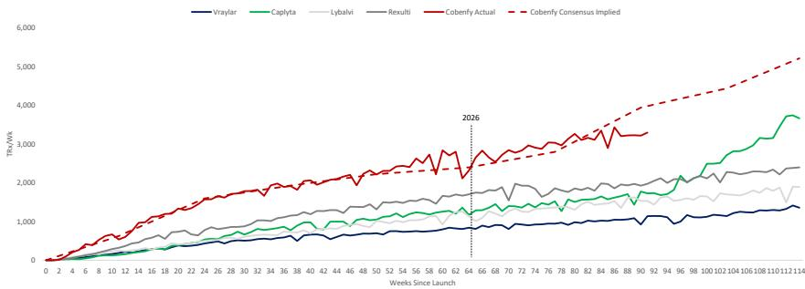  
Source: IQVIA, MS Research; estimates for Vraylar, Lybalvi, and Rexulti are for schizophrenia TRx only

Exhibit 2: Cobenfy Launch vs. Recent antipsychotic launches (all indications)  
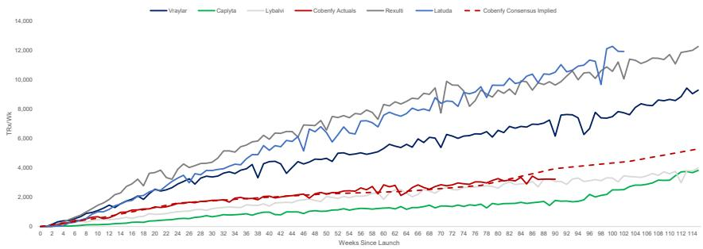  
Source: IQVIA, MS Research

Exhibit 3: MS-Estimated Journavx TRx trajectory based on gross to net (GTN) pricing to achieve 2026 consensus estimates  
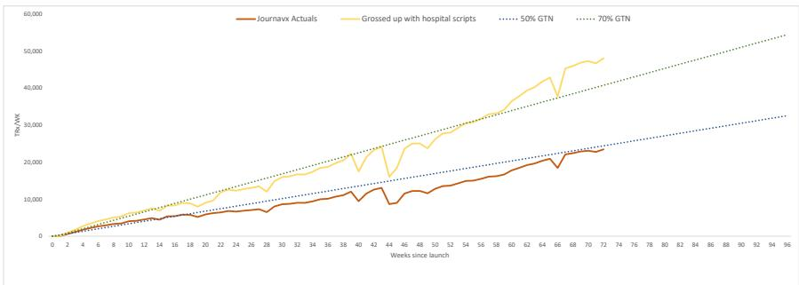  
Source: IQVIA, MS Research

Exhibit 4: GILD's Yeztugo and Descovy vs. GSK's Apretude TRx launch comparison  
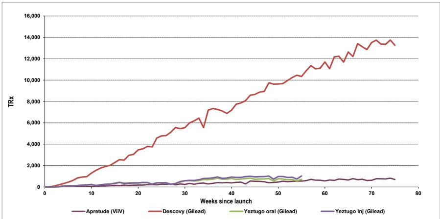  
Source: IQVIA

Exhibit 5: MS-Estimated Yeztugo TRx trajectory based on 1Q $/script to achieve 2Q26 cons estimate of $225mn  
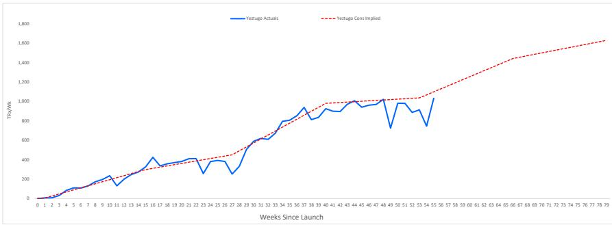  
Source: IQVIA, MS Research

Exhibit 6: MS-estimated Ico TRx trajectory to achieve 2026 consensus vs. prior I&I launches  
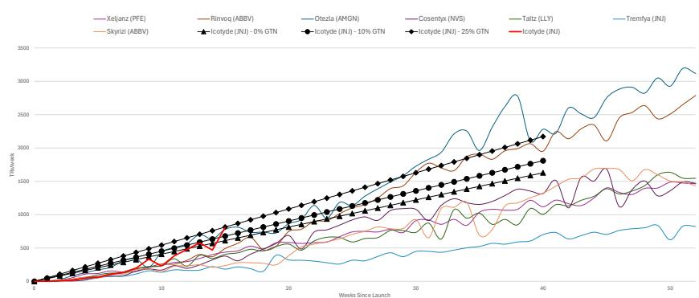  
Source: IQVIA, Visible Alpha, MS Research

Exhibit 7: Tremfya and Skyrizi NRx trend  
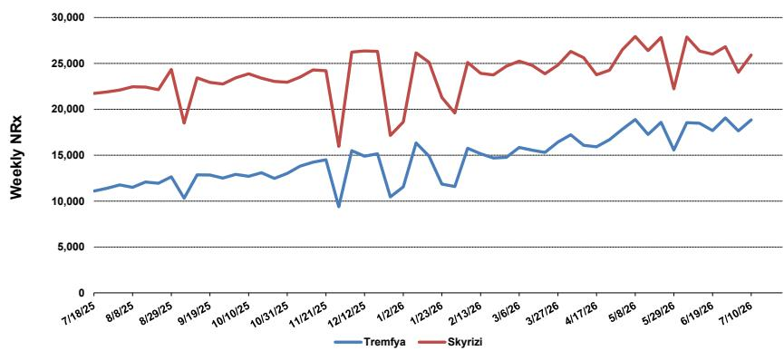  
Source: IQVIA, MS Research

## Momentum of top outpatient drugs:

Exhibit 8: Key products TRx YOY % for US Major Pharma and Biotech

<table><tr><td>TRx YOY %</td><td>12-wk rolling</td><td>4-wk rolling</td><td>Weekly</td></tr><tr><td colspan="4">ABBVIE:</td></tr><tr><td>Humira</td><td>-49%</td><td>-49%</td><td>-51%</td></tr><tr><td>Rinvoq</td><td>25%</td><td>25%</td><td>41%</td></tr><tr><td>Skyrizi</td><td>25%</td><td>23%</td><td>11%</td></tr><tr><td>Imbruvica</td><td>-13%</td><td>-14%</td><td>-12%</td></tr><tr><td>Venclexta</td><td>30%</td><td>28%</td><td>31%</td></tr><tr><td>Vraylar</td><td>8%</td><td>8%</td><td>1%</td></tr><tr><td>Ubrelvy</td><td>11%</td><td>11%</td><td>2%</td></tr><tr><td>Qulipta</td><td>22%</td><td>23%</td><td>13%</td></tr><tr><td colspan="4">AMGEN:</td></tr><tr><td>Otezla</td><td>-2%</td><td>-4%</td><td>7%</td></tr><tr><td>Enbrel</td><td>2%</td><td>-1%</td><td>-9%</td></tr><tr><td>Repatha</td><td>33%</td><td>34%</td><td>23%</td></tr><tr><td>Tavneos</td><td>8%</td><td>-15%</td><td>-30%</td></tr><tr><td colspan="4">BRISTOL MYERS:</td></tr><tr><td>Soytktu</td><td>-29%</td><td>-33%</td><td>-25%</td></tr><tr><td>Camzyos</td><td>36%</td><td>35%</td><td>23%</td></tr><tr><td>Zeposia</td><td>-8%</td><td>-6%</td><td>1%</td></tr><tr><td>Krazati</td><td>18%</td><td>4%</td><td>-23%</td></tr><tr><td>Revlimid</td><td>-69%</td><td>-69%</td><td>-73%</td></tr><tr><td>Pomalyst</td><td>-82%</td><td>-85%</td><td>-87%</td></tr><tr><td>Eliquis (50/50 w/Pfizer)</td><td>5%</td><td>4%</td><td>-2%</td></tr><tr><td>Sprycel</td><td>-33%</td><td>-29%</td><td>-20%</td></tr><tr><td colspan="4">GILEAD:</td></tr><tr><td>Genvoya</td><td>-19%</td><td>-20%</td><td>-20%</td></tr><tr><td>Odefsey</td><td>-12%</td><td>-13%</td><td>-11%</td></tr><tr><td>Descovy</td><td>-8%</td><td>-7%</td><td>-9%</td></tr><tr><td>Biktarvy</td><td>-2%</td><td>-2%</td><td>-5%</td></tr><tr><td>Total HIV Franchise</td><td>-5%</td><td>-5%</td><td>-7%</td></tr><tr><td colspan="4">JNJ:</td></tr><tr><td>Tremfya</td><td>72%</td><td>69%</td><td>54%</td></tr><tr><td>Stelara</td><td>-65%</td><td>-68%</td><td>-77%</td></tr><tr><td>Erleada</td><td>21%</td><td>18%</td><td>27%</td></tr><tr><td>Spravato</td><td>23%</td><td>23%</td><td>24%</td></tr><tr><td>Xarelto</td><td>-8%</td><td>-9%</td><td>-16%</td></tr><tr><td colspan="4">ELI LILLY:</td></tr><tr><td>Trulicity</td><td>-23%</td><td>-23%</td><td>-29%</td></tr><tr><td>Mounjaro</td><td>40%</td><td>38%</td><td>26%</td></tr><tr><td>Zepbound</td><td>70%</td><td>59%</td><td>76%</td></tr><tr><td>Taltz</td><td>-1%</td><td>-3%</td><td>-8%</td></tr><tr><td>Verzenio</td><td>1%</td><td>-1%</td><td>11%</td></tr><tr><td colspan="4">ORGANON</td></tr><tr><td>Vtama</td><td>-2%</td><td>-1%</td><td>15%</td></tr><tr><td colspan="4">MERCK:</td></tr><tr><td>Januvia Franchise (incl. Steglujan)</td><td>-25%</td><td>-43%</td><td>-53%</td></tr><tr><td>Gardasil</td><td>22%</td><td>31%</td><td>19%</td></tr><tr><td colspan="4">PFIZER:</td></tr><tr><td>Ibrance</td><td>1%</td><td>-1%</td><td>8%</td></tr><tr><td>Comirnaty</td><td>-31%</td><td>-41%</td><td>-47%</td></tr><tr><td>Paxlovid</td><td>-80%</td><td>-82%</td><td>-80%</td></tr><tr><td>Nurtec</td><td>17%</td><td>18%</td><td>10%</td></tr><tr><td>Prevnar</td><td>-29%</td><td>-18%</td><td>-23%</td></tr><tr><td>Vyndaqel</td><td>7%</td><td>7%</td><td>30%</td></tr><tr><td>Xeljanz/XR</td><td>-21%</td><td>-54%</td><td>-62%</td></tr><tr><td>Xtandi</td><td>8%</td><td>5%</td><td>10%</td></tr></table>

Exhibit 9: Notable drug total prescriptions (TRx). All figures are rounded to the nearest hundred because IQVIA does not allow publication of exact Rx counts

<table><tr><td>~TRx / Week ending Diabetes (GLP-1) Obesity</td><td>06/19/26</td><td>06/26/26</td><td>07/03/26</td><td>07/10/26</td></tr><tr><td>Victoza (Novo)</td><td>900</td><td>1,800</td><td>1,500</td><td>1,100</td></tr><tr><td>Xultophy (Novo)</td><td>600</td><td>600</td><td>700</td><td>600</td></tr><tr><td>Ozempic (Novo)</td><td>515,400</td><td>516,900</td><td>527,300</td><td>500,000</td></tr><tr><td>Rybelsus (Novo)</td><td>48,800</td><td>43,200</td><td>39,500</td><td>32,900</td></tr><tr><td>Wegovy (Novo)</td><td>466,700</td><td>464,700</td><td>468,900</td><td>448,500</td></tr><tr><td>Novo GLP-1 franchise T2D</td><td>565,700</td><td>562,500</td><td>568,900</td><td>534,700</td></tr><tr><td>Novo GLP-1 franchise T2D+Obesity</td><td>1,032,400</td><td>1,027,200</td><td>1,037,800</td><td>983,200</td></tr><tr><td>Trulicity (Eili Lilly)</td><td>120,500</td><td>121,000</td><td>123,300</td><td>117,000</td></tr><tr><td>Mounjaro (LLY)</td><td>804,300</td><td>814,100</td><td>844,100</td><td>783,500</td></tr><tr><td>Zepbound (Eli Lilly)</td><td>658,900</td><td>664,400</td><td>680,400</td><td>659,400</td></tr><tr><td>LLY GLP-1 franchise</td><td>924,900</td><td>935,100</td><td>967,300</td><td>900,500</td></tr><tr><td>LLY GLP-1 franchise T2D +Obesity</td><td>1,583,800</td><td>1,599,500</td><td>1,647,700</td><td>1,559,900</td></tr><tr><td>Endometriosis</td><td></td><td></td><td></td><td></td></tr><tr><td>Orilissa (Abbvie)</td><td>1,800</td><td>1,800</td><td>1,800</td><td>1,600</td></tr><tr><td>Migraine (CGRP others)</td><td></td><td></td><td></td><td></td></tr><tr><td>Aimovig* (Amgen)</td><td>20,200</td><td>20,300</td><td>21,700</td><td>19,500</td></tr><tr><td>est. no. of injections</td><td>23,400</td><td>23,200</td><td>23,800</td><td>23,200</td></tr><tr><td>Ajovy (Teva)</td><td>22,700</td><td>22,700</td><td>23,800</td><td>22,100</td></tr><tr><td>est. no. of injections</td><td>64,000</td><td>62,900</td><td>62,800</td><td>61,900</td></tr><tr><td>Emgality (Eili Lilly)</td><td>40,300</td><td>40,100</td><td>42,700</td><td>39,200</td></tr><tr><td>est. no. of injections</td><td>6,100</td><td>6,500</td><td>6,100</td><td>6,100</td></tr><tr><td>Ubrelvy (Abbvie)</td><td>56,400</td><td>56,500</td><td>58,200</td><td>53,800</td></tr><tr><td>Qulipta (Abbvie)</td><td>44,800</td><td>43,800</td><td>45,500</td><td>43,300</td></tr><tr><td>Nurtec (Pfizer)</td><td>77,700</td><td>78,100</td><td>79,900</td><td>74,600</td></tr><tr><td>Reyvow (Eili Lilly)</td><td>400</td><td>300</td><td>300</td><td>200</td></tr><tr><td>Vyepti (Lundeback)</td><td>00</td><td>00</td><td>00</td><td>00</td></tr><tr><td>Atopic dermatitis</td><td></td><td></td><td></td><td></td></tr><tr><td>Nemluvio (Galderma)</td><td>6,000</td><td>6,500</td><td>5,900</td><td>5,700</td></tr><tr><td>Eucrisa (Pfizer)</td><td>3,700</td><td>3,500</td><td>3,500</td><td>3,400</td></tr><tr><td>Adbry (Leo)</td><td>2,300</td><td>2,300</td><td>2,200</td><td>2,200</td></tr><tr><td>Ebglyss (LLY)</td><td>4,500</td><td>4,900</td><td>4,700</td><td>5,000</td></tr><tr><td>Dupixent (Sanofi/Regeneron)</td><td>102,100</td><td>107,300</td><td>99,300</td><td>106,200</td></tr><tr><td>Opzelura (Incyte)</td><td>16,800</td><td>16,300</td><td>15,000</td><td>16,000</td></tr><tr><td>CDK 4/6 PI3K</td><td></td><td></td><td></td><td></td></tr><tr><td>Ibrance (Pfizer)</td><td>3,000</td><td>3,200</td><td>2,300</td><td>3,400</td></tr><tr><td>Kisqali Franchise (Novartis)</td><td>6,400</td><td>6,900</td><td>5,400</td><td>7,300</td></tr><tr><td>Piqray (Novartis)</td><td>100</td><td>100</td><td>100</td><td>100</td></tr><tr><td>Verzenio (Eili Lilly)</td><td>4,000</td><td>4,200</td><td>3,200</td><td>4,900</td></tr><tr><td>BTK BCL-2 inhibitors</td><td></td><td></td><td></td><td></td></tr><tr><td>Imbruvica (Abbvie)</td><td>1,900</td><td>1,800</td><td>1,600</td><td>2,000</td></tr><tr><td>Venclexta (Abbvie/Roche)</td><td>1,800</td><td>1,700</td><td>1,300</td><td>2,000</td></tr><tr><td>Calquence (AZN)</td><td>3,100</td><td>2,900</td><td>2,700</td><td>3,200</td></tr><tr><td>Brukinsa (BeOne)</td><td>1,600</td><td>1,500</td><td>1,300</td><td>1,600</td></tr><tr><td>Jaypirca (LLY)</td><td>310</td><td>290</td><td>280</td><td>380</td></tr><tr><td>Xospata (Astellas)</td><td>100</td><td>200</td><td>100</td><td>200</td></tr><tr><td>Osteoporosis</td><td></td><td></td><td></td><td></td></tr><tr><td>Evenity (Amgen)</td><td>1,600</td><td>1,500</td><td>1,300</td><td>1,600</td></tr><tr><td>RA and Psoriasis</td><td></td><td></td><td></td><td></td></tr><tr><td>Taltz (Eili Lilly)</td><td>12,600</td><td>13,400</td><td>12,400</td><td>13,700</td></tr><tr><td>Cosentyx (Novartis)</td><td>19,100</td><td>20,600</td><td>19,000</td><td>19,600</td></tr><tr><td>Sotyktu (BMY)</td><td>1,000</td><td>1,000</td><td>800</td><td>1,100</td></tr><tr><td>Otezla (Amgen)</td><td>16,700</td><td>16,700</td><td>14,500</td><td>18,600</td></tr><tr><td>Xeljanz (Pfizer)</td><td>5,200</td><td>3,700</td><td>3,000</td><td>3,200</td></tr><tr><td>Cibinqo (Pfizer)</td><td>900</td><td>800</td><td>700</td><td>1,100</td></tr><tr><td>Olumiant (Eili Lilly)</td><td>2,000</td><td>1,800</td><td>1,400</td><td>2,300</td></tr><tr><td>Rinvoq (Abbvie)</td><td>32,300</td><td>32,900</td><td>25,200</td><td>37,000</td></tr><tr><td>Tremfya (JnJ)</td><td>17,700</td><td>19,100</td><td>17,600</td><td>18,800</td></tr><tr><td>Skyrizi (Abbvie)</td><td>26,000</td><td>26,800</td><td>24,000</td><td>25,900</td></tr><tr><td>Kevzara (Sanofi/Regeneron)</td><td>2,500</td><td>2,700</td><td>2,600</td><td>2,800</td></tr></table>

\*\*Humira (since 8/23/19), Vyndaqel (5/31/19), Skyrizi (5/24/19), and Evenity (5/10/19): Prescriptions are restricted, due to a contractual condition between a supplier and the manufacturers.

Source: IQVIA

## IQVIA total market prescription and sales trends

The IQVIA databases are different for prescription (Rx) and sales ($), and the IQVIA sales dollars only reflect list prices of drugs and not rebates/discounts. TRx represents total prescription dispensed including refills. NRx represents new prescriptions—that is, all scripts written except refills. However, the NRx also includes renewals—the script patients get when they run out of refills.

Exhibit10: Total Market weekly YOY TRx growth  
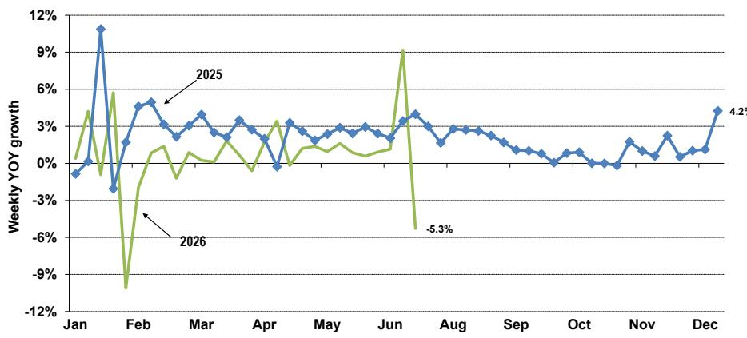  
Note: TRx= Total Prescription. See definition above.
Source: IQVIA

Exhibit 11: Total market absolute TRx and NRx  
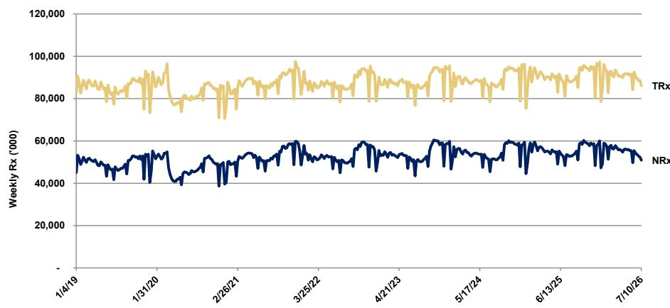  
Note: NRx= New Prescription. See definition above.
Source: IQVIA

Extended unit (EU) data trends were more positive than prescription (Rx) trends suggesting physicians were writing more 90-day prescriptions during that period (Exhibit 12 and Exhibit 13). EU figures (EUTRx / EUNRx) may represent a more accurate picture of demand because they take into account larger/longer-duration prescriptions while NRx / TRx figures count both a 30-day and a 90-day prescription the same.

Exhibit 12: Total market weekly NRX and EUNRx YOY growth since January 2020  
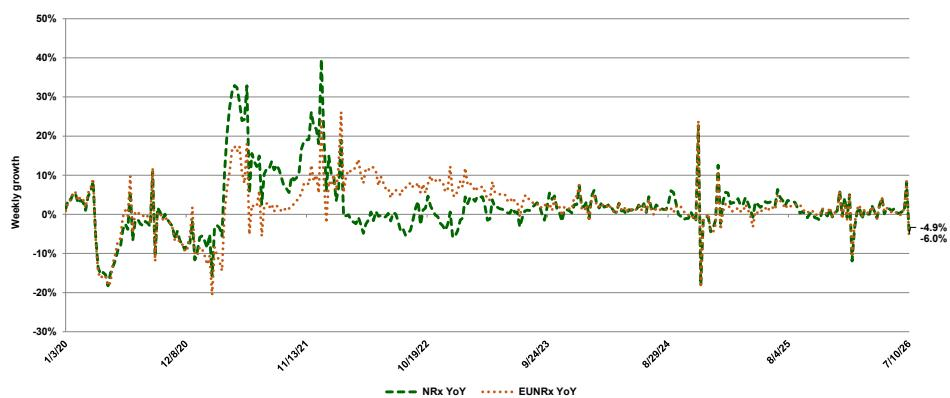  
Source: IQVIA

Exhibit 13: Total market weekly TRx and EUTRx YOY growth since January 2020  
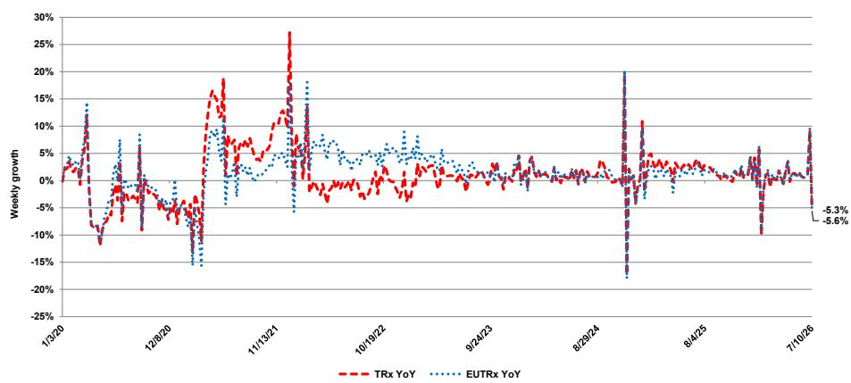  
Source: IQVIA

Exhibit14: U.S. market\* including brands and generics monthly gross sales growth  
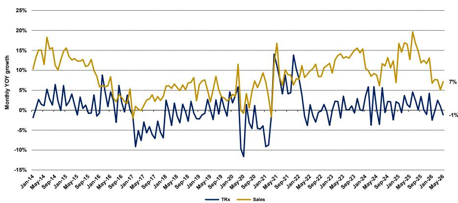  
\*IQVIA reports brands, branded generics, generics and others. Source: IQVIA

Exhibit15: Total market Branded\* pharmaceutical monthly YOY volume vs. sales dollar growth  
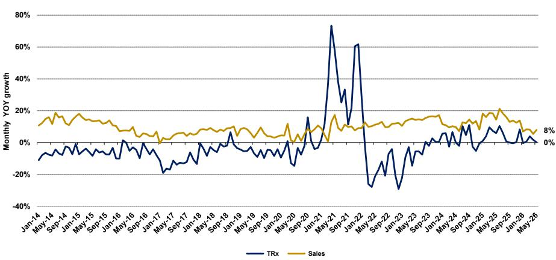  
\*Includes Brands and Branded Generics. Note IQVIA includes some branded drugs in branded generics (e.g. Lidoderm) Source: IQVIA

Exhibit 16: Total market Generic pharmaceutical monthly YOY volume vs. sales dollar growth  
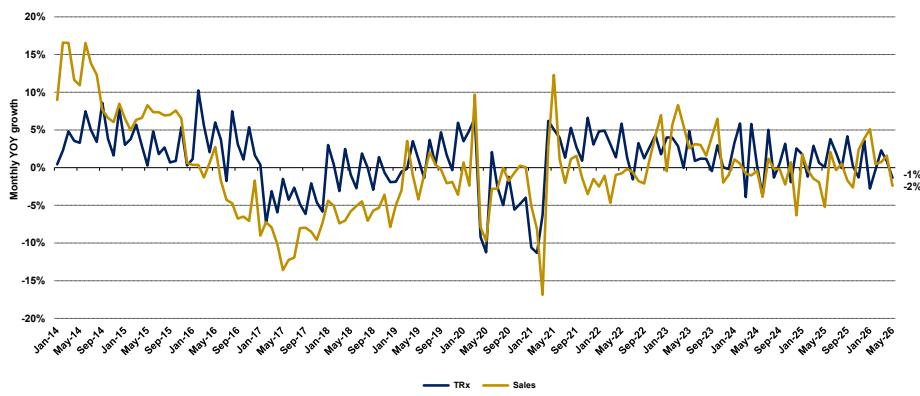  
Source: IQVIA

The IQVIA databases are different for sales $ and unit volumes, and the IQVIA sales dollars only reflect list prices of drugs and do not reflect rebates/discounts. We believe that branded net price realization is about half of what is implied by subtracting sales dollar growth minus volume growth.

## Key Products by Company

## U.S. companies

Exhibit17: Key products from U.S. Major Pharma

<table><tr><td rowspan="2" colspan="2"></td><td colspan="3">TRx Market Share*</td><td>Weekly YOY</td><td>4-Wk Rolling YOY</td><td>12-Wk Rolling YOY</td></tr><tr><td>Current Wk</td><td>Rolling 4-Wk</td><td>Rolling 12-Wk</td><td>TRx</td><td>TRx</td><td>TRx</td></tr><tr><td rowspan="12">ABBV
