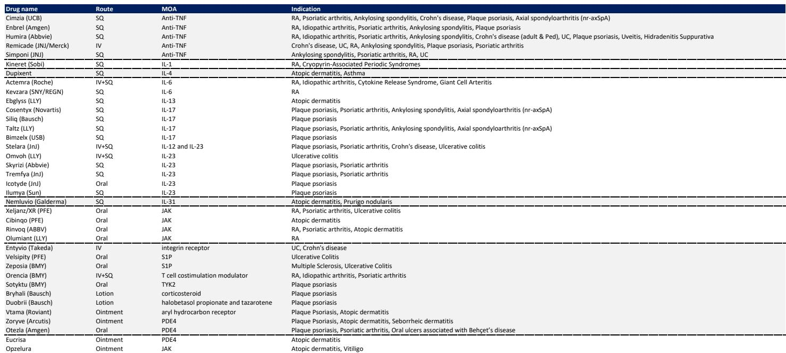
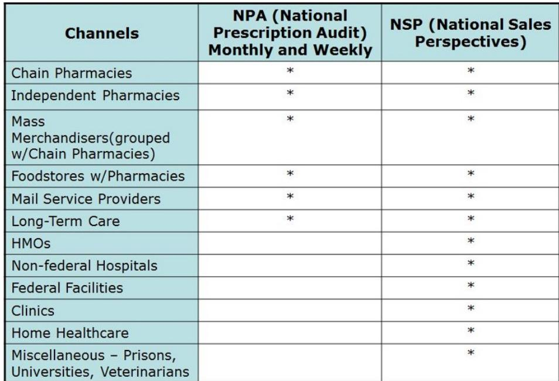
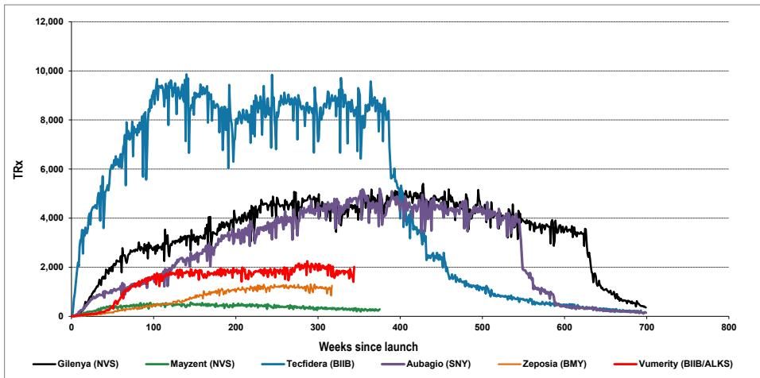

# Four New Drug Launches Are Redefining How Observers Should Evaluate US Pharma Revenue Trajectories

The US prescription drug market entered July 2026 with a notable shift. Total weekly prescriptions fell 5.3% year-over-year for the week ending July 10, a change from the 9.2% growth recorded just one week earlier and below the 1.2% average growth over the preceding twelve weeks. This variation reflects a deeper structural transition. While the aggregate market shows adjustment, four novel therapies launched within the past eighteen months—Cobenfy, Yeztugo, Journavx, and Icotyde—are generating prescription trajectories that require indication-specific analysis rather than broad market heuristics. For observers, the divergence between total market trends and select launch momentum is not a contradiction; it is the signal. The question is whether current prescription volumes can support consensus revenue expectations, and the answer varies by drug, by pricing assumption, and by channel mix.

The week-over-week data reveals a market that is seasonally soft but not structurally altered. The sequential decline of 2.8% in total prescriptions, compared to a 0.1% increase the prior week, reflects typical summer trough patterns. Extended unit prescriptions grew 5.6% year-over-year, which is below total prescription growth and suggests that the average prescription duration or dosage strength may be compressing. Yet within this aggregate picture, the launch dynamics for four drugs tell a more nuanced story. Cobenfy scripts reached approximately 3,300 weekly, a modest acceleration from 3,220. Yeztugo total prescriptions hit 1,750, with injectable formulations accounting for 1,030 of those. Journavx scripts climbed to 23,460 from 22,770. Icotyde, approved only in March 2026, jumped from 470 to 800 weekly scripts. Each of these trajectories must be evaluated against consensus estimates using drug-specific assumptions about pricing, gross-to-net dynamics, and channel composition.

The analytic challenge is that aggregate prescription data from IQVIA, while essential, captures only retail outpatient activity. Hospital scripts, sampling programs, and patient assistance channels are invisible in this data set. For drugs like Journavx, where Vertex has disclosed a 45% hospital and 55% retail mix, the omission is material. For Icotyde, where sampling friction may suppress early IQVIA-reported scripts, the data likely understates true patient starts. Those who treat these weekly numbers as complete rather than partial will systematically misjudge launch trajectories.

## Cobenfy Must Achieve 2 to 5 Times the Volume of Prior Schizophrenia Launches to Meet 2026 Consensus, Making Current Script Trends a Critical Early Signal

Bristol Myers Squibb's Cobenfy, approved in September 2024 for schizophrenia, represents a novel mechanism in a therapeutic category where recent oral launches have established clear volume benchmarks. The analysis compares Cobenfy's current trajectory to the schizophrenia-specific volumes from Rexulti, Caplyta, and Lybalvi launches. To reach the 2026 consensus estimate of $289 million, Cobenfy would need to generate approximately 197,000 total prescriptions annually, assuming a net price of roughly $1,450 per script in line with the analyst's model. This implies that weekly prescriptions must ramp to a level 2 to 5 times the peak schizophrenia volumes achieved by those prior launches.

The current weekly run rate of approximately 3,300 scripts, while growing sequentially, remains far below this threshold. At this pace, annualized volume would reach roughly 172,000 scripts, but that calculation assumes no further acceleration and a linear trajectory that the launch data does not yet support. The comparison to prior antipsychotic launches across all indications, not just schizophrenia, provides a broader context. Cobenfy's early trajectory appears to be tracking below the most successful recent launches, though it is still early in the product lifecycle. The critical insight is that consensus expectations embed an aggressive ramp assumption. If Cobenfy follows the adoption curve of a typical novel antipsychotic rather than a breakout blockbuster, revenue will fall short. The next four to six weeks of prescription data will be disproportionately informative because they will reveal whether the trajectory is inflecting toward or away from the consensus path.

## Yeztugo Requires Only Modest Incremental Script Growth to Meet Consensus, but Channel Mix Uncertainty Creates a Wide Revenue Range

Gilead's Yeztugo, approved in June 2025 for HIV pre-exposure prophylaxis, presents a fundamentally different risk profile. The drug has already secured 95% payor coverage, and most payers do not require copays, prior authorization, or step edits. This favorable access environment, combined with a strong PrEP market growing 14% year-over-year and Descovy maintaining over 45% share, creates a supportive launch context. The weekly injectable script count of approximately 1,030, up from 750 the prior week, suggests steady adoption.

The revenue analysis brackets the consensus estimate for the second quarter of 2026 at $223 million using two pricing assumptions. Applying the first quarter 2026 price-to-script ratio yields projected Yeztugo sales of $208 million. Using the fourth quarter 2025 ratio produces $251 million. Both are within range of the consensus figure, and the analysis concludes that only modest incremental script growth is required to achieve the target. However, the swing factor is channel mix. The price per script varies materially depending on whether prescriptions flow through commercial insurance, Medicaid, or 340B channels. Because the data provider does not disclose channel composition at this level of granularity, the actual revenue outcome could land anywhere within that $43 million range even if script volumes are exactly as projected.

The broader implication is that Yeztugo's launch is on a fundamentally sound footing relative to consensus, but the margin of error is not trivial. Observers should focus less on weekly script counts and more on any disclosure from the company regarding channel mix or gross-to-net dynamics. The drug's strong payor coverage and market tailwinds reduce downside risk, but the upside surprise potential is constrained unless channel mix shifts favorably.

## Journavx Must Overcome High Gross-to-Net Discounts, with Required Total Scripts Ranging from 1.2 Million to 2.1 Million Depending on Pricing Assumptions

Vertex's Journavx, approved for acute pain in January 2025, faces a revenue challenge that is less about volume and more about pricing capture. The weekly script count of approximately 23,460 represents steady growth, but the gross-to-net discount is the dominant variable. Based on quarterly sales and script data, the implied gross-to-net rate has been running between 65% and 75% in recent quarters. This means that for every dollar of list price, Vertex retains only 25 to 35 cents after rebates, discounts, and patient assistance.

To achieve the 2026 consensus estimate of $241 million, the analysis estimates that total annual scripts must reach between 1.2 million and 2.1 million, depending on the gross-to-net assumption and the average script duration. The company has noted that average script duration has declined from 14 days to 10-11 days, with expectations of an increase in 2026. Shorter duration reduces revenue per script, all else equal. The higher end of the script range, 2.1 million, assumes a 70% gross-to-net discount and a 12-day duration. The lower end, 1.2 million, assumes a 50% discount.

The current weekly run rate of roughly 23,460 scripts annualizes to approximately 1.22 million scripts, which is at the very low end of the required range and only if the gross-to-net rate improves to 50%. If the discount remains near 70%, the script volume would need to nearly double. The hospital script channel, which accounts for an estimated 45% of total volume, is not captured by IQVIA data. This omission is material. If hospital scripts are added, the effective total is higher, but the revenue contribution from those scripts may carry different pricing dynamics. The key takeaway is that Journavx's revenue trajectory is highly sensitive to both pricing retention and script duration. Observers should monitor both variables, not just the weekly IQVIA count.

## Icotyde's Early IQVIA Scripts Understate True Demand Due to Sampling, but Achieving Consensus Requires a Ramp Comparable to Otezla and Rinvoq

Johnson & Johnson's Icotyde, approved in March 2026 for moderate-to-severe plaque psoriasis, represents the most nascent launch in this cohort. Weekly IQVIA-reported scripts of approximately 800, up from 470 the prior week, appear modest. However, the company reported that within three weeks of launch, approximately 1,500 patients had received prescriptions from more than 1,000 unique prescribers. This discrepancy between company-reported patient starts and IQVIA scripts is typical for launches where sampling and patient assistance programs are prevalent. The dermatologist contacted by the analyst confirmed that early feedback is positive, with Icotyde viewed as a compelling oral IL-23 option that could expand the treated patient pool.

To achieve 2026 U.S. consensus revenue of $270 million, the analysis estimates that Icotyde would need to generate between 33,000 and 43,000 total prescriptions in 2026, assuming a list price of $8,285 per month and a gross-to-net discount of 0% to 25%. This trajectory would need to ramp broadly in line with prior launches such as Otezla and Rinvoq. The current weekly rate of 800 scripts, even if sustained, would produce only about 42,000 annual scripts, which is at the upper end of the required range. However, the early weeks of a launch are typically the slowest, so the trajectory must accelerate meaningfully.

The critical insight is that the IQVIA data for Icotyde is likely a lagging and incomplete indicator. Sampling programs, which are common in dermatology, may delay the conversion to paid prescriptions that appear in the retail channel. The company's comment about day-one readiness and the first patient treated within 24 hours suggests strong commercial execution. Observers should focus on the trajectory of new-to-brand prescriptions and any commentary from the company about sampling conversion rates rather than the absolute weekly script count. The risk is not that demand is weak, but that the timing of revenue recognition may be slower than the script data suggests.

## A Decision Framework for Evaluating Launch Revenue Trajectories Against Consensus

The four launches illustrate a repeatable analytic framework. For any novel therapy in its first twelve to eighteen months of commercialization, observers should evaluate three variables in sequence. First, determine the implied script volume required to meet consensus revenue by dividing the consensus estimate by an assumed net price per script. Second, compare that implied volume to the current weekly run rate, but adjust for known data gaps such as hospital scripts or sampling. Third, assess the sensitivity of the revenue estimate to changes in gross-to-net pricing, channel mix, and duration of therapy.

For Cobenfy, the framework reveals high execution risk. The required volume is 2 to 5 times prior schizophrenia launches, and the current trajectory is below that threshold. For Yeztugo, the framework suggests low execution risk. Modest script growth is sufficient, but the revenue range is wide due to channel mix uncertainty. For Journavx, the framework identifies gross-to-net as the dominant variable. The script volume is near the low end of the required range, but only if pricing retention improves materially. For Icotyde, the framework highlights data incompleteness. The true demand is likely higher than IQVIA suggests, but the trajectory must still match successful prior launches.

This framework is not a prediction. It is a diagnostic tool that forces explicit assumptions about pricing, volume, and mix. The divergence between the four launches underscores a broader principle: in a market where total prescription growth is flat to negative, individual product trajectories are determined by mechanism novelty, payor access, and commercial execution, not by aggregate market trends. Those who treat all launches as equally informative about a company's prospects are missing the critical variation that determines whether consensus estimates are achievable or aspirational.

*For informational purposes only. Portions may be generated, translated, summarized, or edited with AI assistance based on source materials and may contain omissions or errors. Please verify independently. This is not professional advice.*

For informational purposes only. Portions may be generated, translated, summarized, or edited with AI assistance based on source materials and may contain omissions or errors. Please verify independently. This is not professional advice.

