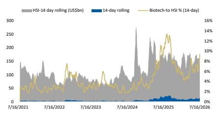
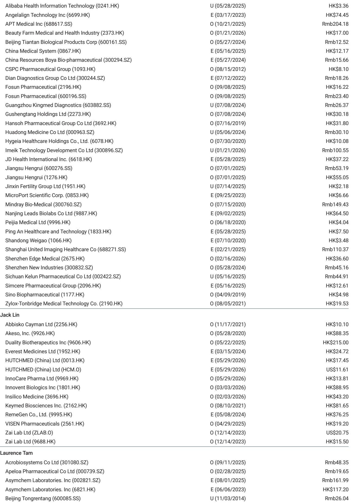

# MS：中国生物科技板块估值与流动性月度更新

7月中旬，中国生物科技板块经历了一轮先抑后扬的估值修复。MS最新月度数据显示，板块市销率（P/S）从5月底的约3.5倍，在6月下旬压缩至约3.0倍的低点，随后在7月中旬反弹至3.8倍。同期，板块流动性（占恒生指数成交额比重）从6%的低位快速攀升至9.7%，创下近期新高。

这份报告的核心信号是：估值修复并非由基本面单独驱动，而是资金轮动、政策预期和交易性事件共同作用的结果。理解这一轮修复的驱动力，比关注估值数字本身更有意义。

## 1. 估值压缩与反弹的节奏，暴露了资金轮动的痕迹

从5月底到6月下旬，中国生物科技板块的P/S从3.5倍压缩至3.0倍，企业价值/销售倍数（EV/S）也从约2.8倍降至2.4倍。报告认为，这一阶段的估值压缩主要反映了市场对地缘政治不确定性的关注，以及资金从该板块流出。

转折发生在6月底至7月中旬。估值快速反弹至3.8倍，EV/S回升至3.2倍。MS指出，这很可能源于期末资金再平衡，以及资金从科技板块向生物科技板块的轮动。换句话说，这一轮修复更多是“资金搬家”的结果，而非行业基本面出现了颠覆性变化。

> **KC评论：** 估值修复的节奏值得关注。从3.0倍到3.8倍，反弹幅度约27%，但时间窗口仅两周左右。这种快速修复往往伴随交易性资金的涌入，后续能否持续，取决于是否有更多基本面催化剂跟进。

## 2. 流动性从6%到9.7%，ASCO效应与政策暖风叠加

报告跟踪的板块流动性指标（占恒生指数成交额比重）在6月中旬一度升至7.5%，主要受美国临床肿瘤学会（ASCO）年会相关交易推动。但随后因地缘政治担忧和资金轮出，流动性在6月下旬回落至约6%。

真正的转折发生在6月底。流动性在7月中旬快速攀升至9.7%。报告认为，除了资金轮动，还有几个具体催化剂值得留意：基药目录（EDL）政策利好、BINSA相关不确定性缓解，以及迪哲医药、信达生物等公司近期达成的交易。这些事件叠加，为板块提供了额外的交易动能。

## 3. 政策与交易事件构成短期支撑，但持续性需观察

报告明确提到了三个具体事件作为估值修复的“建设性驱动因素”：基药目录政策可能带来的增量需求、BINSA相关不确定性的出清，以及迪哲医药和信达生物等公司近期达成的交易。这些事件共同构成了短期情绪支撑。

但需要指出的是，这些催化剂更多是事件驱动型，而非行业盈利预期的系统性上调。MS在报告中维持了对中国医疗保健板块“有吸引力”的行业观点，但这份月度数据本身并未给出盈利预测的调整。估值修复能否从交易性反弹演变为趋势性重估，取决于后续政策落地节奏和公司层面的临床数据、商业化进展。

> **KC评论：** 基药目录和BINSA是容易被忽略的变量。前者可能改变部分品种的放量节奏，后者则消除了一个长期悬而未决的监管不确定性。对于跟踪该板块的读者，这两个事件的后续进展比短期估值波动更值得关注。

For informational purposes only. Portions may be generated,translated,summarized,or edited with AI assistance based on source materials and may contain omissions or errors. Please verify independently. This is not investment,legal,tax,accounting,or other professional advice.

For informational purposes only. Portions may be generated,translated,summarized,or edited with AI assistance based on source materials and may contain omissions or errors. Please verify independently. This is not investment,legal,tax,accounting,or other professional advice.

