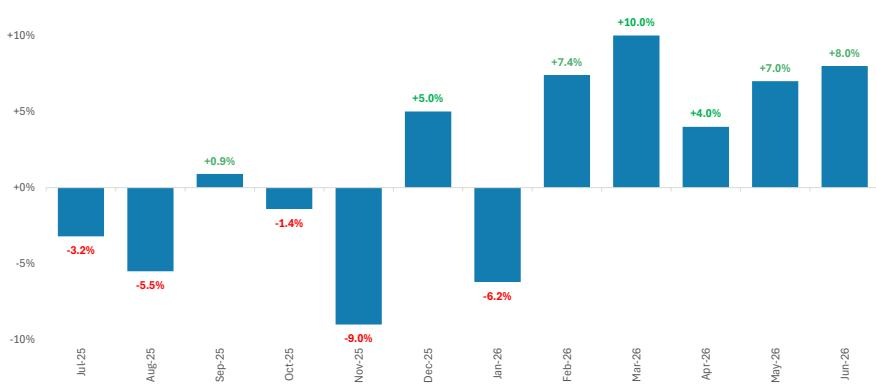
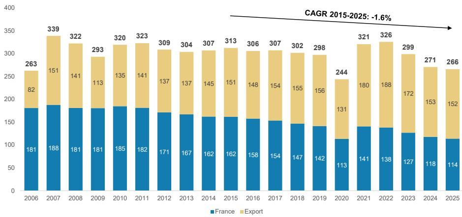
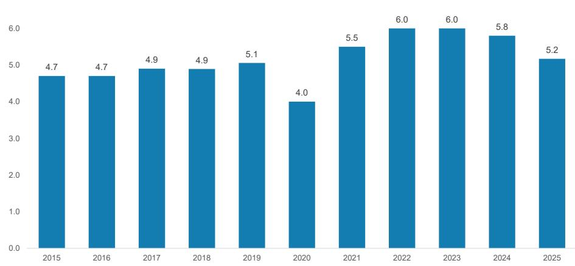
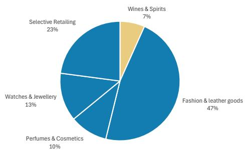
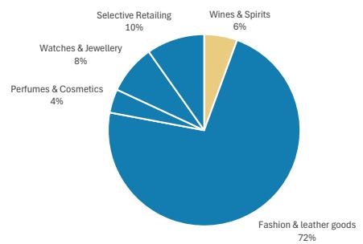
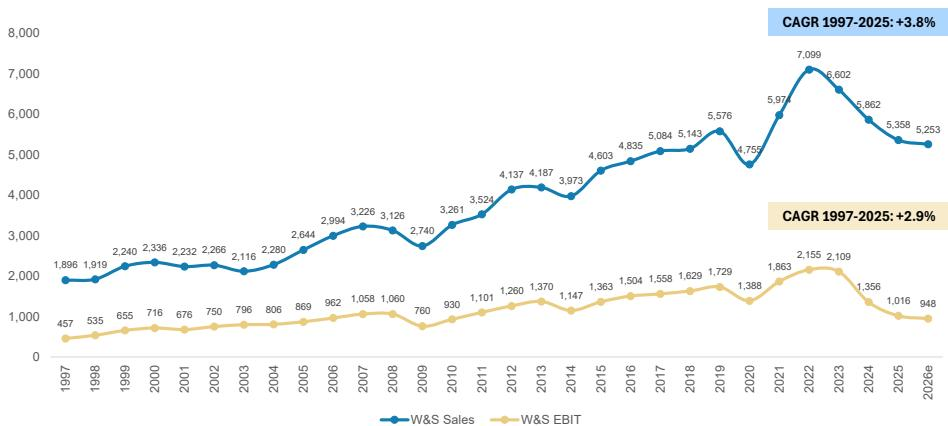
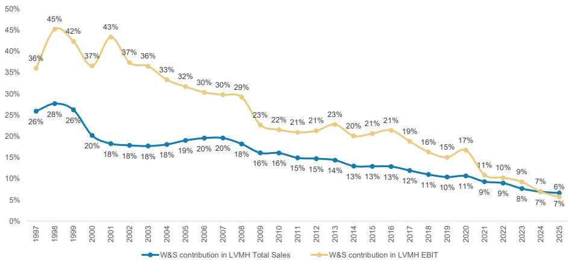
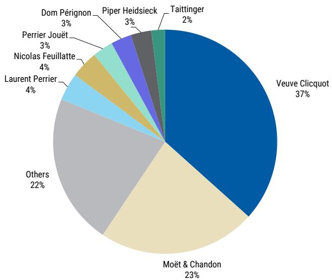
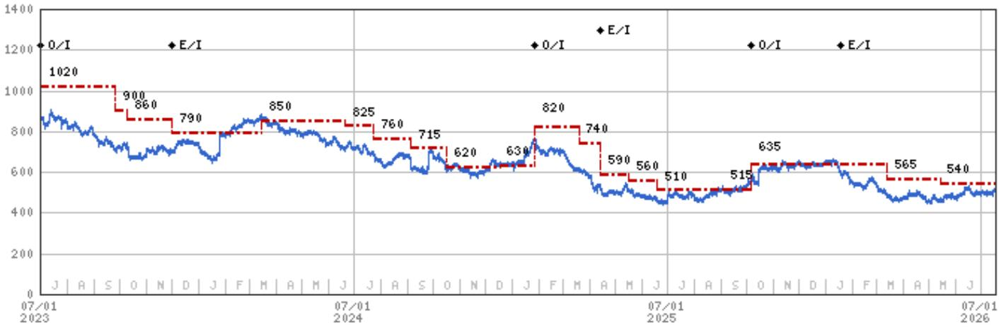

# LVMH | Europe

## 香槟出口在2026年第二季度加速

## 核心要点

香槟行业6月销售数据刚刚发布。

从销量（百万瓶）来看，6月总销售额同比增长+3.8%。

出口市场方面，6月销量同比增长+8%（年初至今增长+4%）。香槟出口市场由LVMH主导（据估算，其价值份额约为50%）。

目前市场普遍预期，在2026年第一季度同比增长+5%之后，2026年第二季度香槟与葡萄酒业务有机销售增长约为+1.4%。

这表明，当集团于7月27日发布报告时，2026年第二季度的销售数据存在小幅上行可能（尽管该影响在集团整体范围内显然较为有限，占比低于销售额的4%）。

有何新变化？香槟行业机构CIVC已发布该行业6月数据。

总结：今年迄今为止，香槟整体销量增长较为温和（2026年上半年仅增长+1%）。然而，近几个月出口持续加速，2026年第二季度销量同比增长+6.3%。鉴于LVMH超过80%的销售额来自价值层面的出口市场，并且在该品类中占据主导地位，这表明其香槟与葡萄酒业务2026年第二季度的销售数据相较于当前市场普遍预期存在一定上行可能。

6月香槟数据解读：根据CIVC数据，6月香槟销量同比增长+4%，而5月为-1.0%，4月持平。年初至今，行业总销量增长+1%。6月出口同比增长+8%，表现稳健，而国内出货量同比下降-2%（5月为-4%）。年初至今，出口销量增长+4%（其中2026年第一季度同比增长+3.7%，第二季度同比增长+6.3%）。年初至今，法国本土销量下降-3%，除受疫情影响的2020年外，这是多年来相对数值上最疲软的开局。

LVMH对出口市场的敞口显著更大：据估算，2025年LVMH在法国以外地区出货约5200万瓶，而在法国本土仅约800万瓶（占比约为14%/86%）。2025年LVMH总出货量为6000万瓶，行业总量为2.66亿瓶，LVMH在销量层面的市场份额约为23%。然而，根据上述估算，LVMH在出口市场的销量份额约为34%（因此价值份额约为50%），因为凯歌、唐培里侬或鲁纳特等高端品牌在全球范围内的销售有很大一部分来自法国以外地区。

例如，如附录9所示，LVMH在美国香槟市场占据主导地位。根据Circana近期发布的数据，得益于凯歌和酩悦在该市场的强劲份额，LVMH集团合计市场份额（按价值计）约为三分之二。凯歌的主导地位尤为突出，美国市场吸收了其总产量的约40%（而行业整体这一比例仅为10%）。

2025年全年香槟数据解读：根据CIVC数据，去年香槟出货量为2.66亿瓶，香槟酒庄合计营业额为51.7亿欧元。这较2024年出货的2.714亿瓶下降-2%（其中法国-4%，出口-1%），标志着连续第三年下降。

近年来香槟市场趋势：近年来，香槟消费面临一定压力，受多种周期性及结构性因素影响，如下图所示，包括：1）消费者口味与行为转变：主要市场的酒精消费量正在收缩，尤其是在年轻群体中，他们整体饮酒量减少，更注重健康；2）香槟需求与市场情绪和信心相关；过去几年，欧洲等市场的消费者信心波动对购买意愿产生了一定影响。我们注意到，过去几年法国本土的香槟消费尤为疲软，且这一趋势在2026年至今仍持续；3）竞争性替代品：普罗塞克等起泡酒表现稳健，市场份额有所增长，且通常价格更低，吸引了一部分香槟消费者。根据IWSR数据，过去五到六年，大多数领先香槟品牌大幅提价，将中等消费群体排除在外（这与更广泛的个人奢侈品市场情况类似）。部分抵消这些不利因素的是，行业整体呈现结构性高端化趋势，这对LVMH有利（因其拥有大多数领先的高端品牌）。

附录1：香槟出货量同比增长（按销量计）  
  
来源：CIVC, MS

附录2：香槟出口同比增长（按销量计）  
  
来源：CIVC, MS

## 附加图表

附录3：香槟出货量历史数据（瓶数）  
  
来源：Champagne.fr, MS

附录4：香槟营业额（十亿欧元）  
  
来源：Champagne.fr, MS

附录5：2025年LVMH各业务部门销售额构成  
  
来源：公司数据, MS

附录6：2025年LVMH各业务部门息税前利润构成  
  
来源：公司数据, MS

附录7：  
1997年以来香槟与葡萄酒业务对LVMH总销售额及息税前利润的贡献  
  
来源：公司数据, MS估算

附录8：1997年以来葡萄酒与烈酒（含香槟、干邑等）对LVMH总销售额及息税前利润的贡献  
  
来源：公司数据, MS

附录9：2025年美国香槟市场品牌份额（按价值计）  
  
来源：Circana, MS

## 估值方法与风险

## LVMH Moet Hennessy Louis Vuitton SA (LVMH.PA)

我们采用基于现金流折现的估值方法，认为该方法最能反映LVMH的利润潜力与现金流。我们假设加权平均资本成本为8.8%，长期增长率为2.8%。

## 上行风险

■ 中国奢侈品消费增长超出预期

■ 西方市场需求明年未出现收缩

## 下行风险

■ 中国消费者支出变化仍是LVMH及同业面临的最大风险

■ 垂直整合（主要在下游）导致运营去杠杆化

## 披露声明

本报告中的信息及观点由MS Europe S.E.（受德国联邦金融监管局监管）及/或MS & Co. International plc（由审慎监管局授权，受金融行为监管局及审慎监管局监管）编制或分发。MS & Co. International plc在英国分发其自身或其任何关联公司编制的研究报告，仅面向以下人士：(i) 属于《2000年金融服务与市场法（金融促进）2005年法令》（经修订，“该法令”）第19(5)条规定的专业读者；(ii) 属于该法令第49(2)(a)至(d)条规定的高净值实体；或 (iii) 可合法接收或被告知参与投资活动（定义见经修订的《2000年金融服务与市场法》第21条）的人士。在本披露声明中，MS包括RMB MS Proprietary Limited、MS Europe S.E.、MS & Co International plc及其关联公司。

有关本报告所涉及公司的重要披露、股价图表及股权评级历史，请访问MS披露网站 www.morganstanley.com/eqr/disclosures/webapp/generalresearch，或联系您的投资代表或MS，地址：1585 Broadway, (Attention: Research Management), New York, NY, 10036 USA。

有关本研究报告中所提及的任何推荐、评级或目标价所涉及的估值方法及风险，请联系客户支持团队：美国/加拿大 +1 800 303-2495；香港 +852 2848-5999；拉丁美洲 +1 718 754-5444（美国）；伦敦 +44 (0)20-7425-8169；新加坡 +65 6834-6860；悉尼 +61 (0)2-9770-1505；东京 +81 (0)3-6836-9000。或者，您也可以联系您的投资代表或MS，地址：1585 Broadway, (Attention: Research Management), New York, NY 10036 USA。

## 分析师认证

以下分析师特此证明，其对本报告所讨论公司及其证券的观点准确表达，且其未曾且将不会因表达特定推荐或观点而直接或间接获得补偿：Edouard Aubin; Natasha Bonnet; Grace Smalley, CFA。

## 全球研究冲突管理政策

MS已根据其冲突管理政策发布本报告，该政策可在 www.morganstanley.com/institutional/research/conflictpolicies 查阅。葡萄牙语版本政策可在 www.morganstanley.com.br 查阅。

## 关于标的公司的重要监管披露

截至2026年6月30日，MS实益拥有以下MS所覆盖公司普通股股本1%或以上：Adidas, Avolta AG, Birkenstock Holding plc, Burberry, Ferrari NV, Hermes International S.C.A., Hugo Boss AG, Kering, Moncler SpA, Pandora A/S, PUMA SE。

在过去12个月内，MS已因投资银行服务从以下公司获得补偿：Avolta AG, LVMH Moet Hennessy Louis Vuitton SA, Richemont SA。

在未来3个月内，MS预计将或有意寻求从以下公司获得投资银行服务补偿：Adidas, Avolta AG, Burberry, EssilorLuxottica SA, Ferrari NV, Hermes International S.C.A., Kering, Luxexperience BV, LVMH Moet Hennessy Louis Vuitton SA, Moncler SpA, Pandora A/S, Prada SpA, PUMA SE, Richemont SA, Salvatore Ferragamo Spa。在过去12个月内，MS已因投资银行服务以外的产品和服务从以下公司获得补偿：Adidas, Avolta AG, EssilorLuxottica SA, Ferrari NV, Kering, LVMH Moet Hennessy Louis Vuitton SA, Richemont SA, Salvatore Ferragamo Spa。

在过去12个月内，MS已向或正在向以下公司提供投资银行服务，或与其存在投资银行客户关系：Adidas, Avolta AG, Burberry, EssilorLuxottica SA, Ferrari NV, Hermes International S.C.A., Kering, Luxexperience BV, LVMH Moet Hennessy Louis Vuitton SA, Moncler SpA, Pandora A/S, Prada SpA, PUMA SE, Richemont SA, Salvatore Ferragamo Spa。

在过去12个月内，MS已向或正在向以下公司提供非投资银行、证券相关服务，和/或此前已签订服务协议或与以下公司存在客户关系：Adidas, Avolta AG, Burberry, EssilorLuxottica SA, Ferrari NV, Kering, LVMH Moet Hennessy Louis Vuitton SA, Richemont SA, Salvatore Ferragamo Spa。

MS & Co. LLC 是 Ermenegildo Zegna 证券的做市商。

MS & Co. International plc 是 Burberry 的企业经纪商。

主要负责编制MS的股权研究分析师或策略师的薪酬基于多种因素，包括研究质量、读者客户反馈、选股能力、竞争因素、公司收入及整体投资银行收入。股权研究分析师或策略师的薪酬不与MS进行的投资银行或资本市场交易，或特定交易台的盈利能力或收入挂钩。

MS及其关联公司从事与MS所涵盖公司/工具有关的业务，包括做市、提供流动性、基金管理、商业银行、信贷扩展、投资服务及投资银行。MS以主承销商身份向客户买卖MS所涵盖公司的证券/工具。MS可能持有本报告所讨论公司债务或工具的仓位。MS作为主承销商交易或可能交易作为债务研究报告标的的债务证券（或相关衍生品）。

上述某些披露亦为遵守非美国司法管辖区的适用法规。

## 股票评级

MS采用相对评级体系，使用“增持”、“等权重”、“未评级”或“减持”等术语（定义见下文）。MS不对其覆盖的股票分配“买入”、“持有”或“卖出”评级。“增持”、“等权重”、“未评级”和“减持”不等同于买入、持有和卖出。读者应仔细阅读MS中使用的所有评级定义。此外，由于MS包含分析师观点的更完整信息，读者应仔细阅读MS全文，而非仅从评级推断内容。在任何情况下，评级（或研究）不应被用作或依赖为研究交流。读者买卖股票的决定应取决于个人情况（如读者现有持仓）及其他考虑因素。

## 全球股票评级分布

（截至2026年6月30日）

下文所述的股票评级适用于MS的基础股权研究，不适用于公司生产的债务研究。

出于披露目的（根据FINRA要求），我们将“买入”、“持有”和“卖出”类别标题与我们的“增持”、“等权重”、“未评级”和“减持”评级并列。MS不对其覆盖的股票分配“买入”、“持有”或“卖出”评级。“增持”、“等权重”、“未评级”和“减持”不等同于买入、持有和卖出，而是代表建议的相对权重（见下文定义）。为满足监管要求，我们将最正面的股票评级“增持”对应买入建议；将“等权重”和“未评级”对应持有建议，将“减持”对应卖出建议。

| 股票评级类别 | 覆盖范围 | 投资银行客户 | 其他重大投资服务客户 |
|---|---|---|---|
| 增持/买入 | 1544 (42%) | 453 (49%) | 757 (44%) |
| 等权重/持有 | 1577 (43%) | 390 (42%) | 769 (44%) |
| 未评级/持有 | 3 (0%) | 1 (0%) | 1 (0%) |
| 减持/卖出 | 544 (15%) | 89 (10%) | 204 (12%) |
| 总计 | 3,668 | 933 | 1731 |

数据包括当前已分配评级的普通股和ADR。投资银行客户是指过去12个月内MS从中获得投资银行补偿的公司。由于四舍五入，“占总计百分比”列中的百分比之和可能不等于100%。

## 分析师股票评级

增持 (O)：预计该股票未来12-18个月经风险调整后的总回报将超过分析师行业（或行业团队）覆盖范围的平均总回报。

等权重 (E)：预计该股票未来12-18个月经风险调整后的总回报将与分析师行业（或行业团队）覆盖范围的平均总回报一致。

未评级 (NR)：目前分析师对该股票未来12-18个月经风险调整后的总回报相对于分析师行业（或行业团队）覆盖范围的平均总回报没有足够信心。

减持 (U)：预计该股票未来12-18个月经风险调整后的总回报将低于分析师行业（或行业团队）覆盖范围的平均总回报。

除非另有说明，MS中包含的目标价时间范围为12至18个月。

## 分析师行业观点

有吸引力 (A)：分析师预计其行业覆盖范围未来12-18个月的表现相对于相关广泛市场基准具有吸引力，如下所示。

一致 (I)：分析师预计其行业覆盖范围未来12-18个月的表现将与相关广泛市场基准一致，如下所示。

谨慎 (C)：分析师对其行业覆盖范围未来12-18个月的表现相对于相关广泛市场基准持谨慎态度，如下所示。

各地区基准如下：北美 - 标普500；拉丁美洲 - 相关MSCI国家指数或MSCI拉丁美洲指数；欧洲 - MSCI欧洲；日本 - TOPIX；亚洲 - 相关MSCI国家指数或MSCI次区域指数或MSCI AC亚太（除日本）指数。

## 股价、目标价及评级历史（见评级定义）

10/6/25 : 635; 3/13/26 : 565; 5/14/26 : 540

行业：品牌
LVMH Moet Hennessy Louis Vuitton SA (LVMH.PA) - 截至 2026年7月17日 GMT 以欧元计价

股票评级历史：7/1/21 : 0/I; 12/1/23 : E/I; 1/27/25 : 0/I; 4/14/25 : E/I; 10/6/25 : 0/I; 1/19/26 : E/I

来源：MS 日期格式：MM/DD/YY 目标价 = 未分配目标价 (NA)

股价（非现任分析师覆盖）— 股价（现任分析师覆盖）

股票和行业评级（缩写如下）显示为 ♦ 股票评级/行业观点

股票评级：增持 (O) 等权重 (E) 减持 (U) 未评级 (NR) 无可用评级 (NA)

行业观点：有吸引力 (A) 一致 (I) 谨慎 (C) 无评级 (NR)

自2014年1月13日起，MS亚太地区覆盖的股票将相对于分析师的行业（或行业团队）覆盖范围进行评级。

自2014年1月13日起，MS亚太地区的行业观点基准如下：相关MSCI国家指数或MSCI次区域指数或MSCI AC亚太（除日本）指数。

## 对MS Smith Barney LLC客户的重要披露

有关可能合理预期影响MS Smith Barney LLC选择第三方研究提供商或第三方研究报告标的公司的任何重大利益冲突的重要披露，可在MS Wealth Management披露网站 www.morganstanley.com/online/researchdisclosures 查阅。有关MS特定披露，请参阅 https://www.morganstanley.com/eqr/disclosures/webapp/generalresearch。

每份MS报告均经代表MS Smith Barney LLC审阅和批准。此审阅和批准由审阅MS研究报告的同一人进行。这可能产生利益冲突。

## 其他重要披露

MS政策是根据研究分析师和研究管理层的判断，在认为适当的时候，基于发行人、行业或市场可能对研究观点或意见产生重大影响的发展情况更新研究报告。此外，某些研究出版物旨在定期更新（每周/每月/每季度/每年），并且通常会按该频率更新，除非研究分析师和研究管理层根据当前情况确定不同的发布时间表更合适。

MS不担任市政顾问，本文所含观点或意见并非且不构成《多德-弗兰克华尔街改革与消费者保护法》第975条含义内的建议。

MS生产一种称为“战术性观点”的股权研究产品。关于特定股票的“战术性观点”中所含观点可能与同一股票的研究中表达的建议或观点相反。这可能是由于不同的时间范围、方法论、市场事件或其他因素所致。如需获取特定股票的所有研究，请联系您的销售代表或访问Matrix网站 http://www.morganstanley.com/matrix。

MS通过我们专有的研究门户网站Matrix向客户提供，并由MS以电子方式分发给客户。某些（但非全部）MS产品也通过第三方供应商提供给客户，或通过替代电子方式作为便利重新分发给客户。如需获取所有可用的MS，请联系您的销售代表或访问Matrix网站 http://www.morganstanley.com/matrix。

任何访问和/或使用MS均须遵守MS的使用条款 (http://www.morganstanley.com/terms.html)。通过访问和/或使用MS，即表示您已阅读并同意受我们的使用条款约束。此外，您同意MS根据我们的隐私政策和全球Cookie政策处理您的个人数据并使用Cookie，包括用于设置您的偏好和收集读者数据，以便我们为您提供更好、更个性化的服务和产品。要了解更多关于MS如何处理个人数据、我们如何使用Cookie以及如何拒绝Cookie的信息，请参阅我们的隐私政策和全球Cookie政策。请使用提供的链接查看MS India Company Private Limited的条款和条件及最重要条款和条件，以及以下链接查看审计报告。

如果您不同意我们的使用条款和/或不希望同意MS处理您的个人数据或使用Cookie，请勿访问我们的研究。

MS不提供量身定制的个人研究交流。MS的编制未考虑接收者的个人情况和目标。MS建议读者独立评估特定投资和策略，并鼓励读者寻求财务顾问的建议。投资或策略的适当性取决于读者的个人情况和目标。MS中讨论的证券、工具或策略可能不适合所有读者，某些读者可能没有资格购买或参与部分或全部此类投资。MS不构成买入或卖出要约，或招揽买入或卖出任何证券/工具或参与任何特定交易策略的要约。您的研究价值和收入可能因利率、外汇汇率、违约率、提前还款率、证券/工具价格、市场指数、公司的运营或财务状况或其他因素的变化而变动。期权或其他证券/工具交易权利的行使可能存在时间限制。过往表现并非未来表现的保证。未来表现估计基于可能无法实现的假设。如果提供且除非另有说明，封面上的收盘价是标的公司证券/工具主要交易所的价格。

主要负责编制MS的固定收益研究分析师、策略师或经济学家的薪酬基于多种因素，包括质量、准确性和研究价值、公司盈利能力或收入（包括固定收益交易和资本市场盈利能力或收入）、客户反馈和竞争因素。固定收益研究分析师、策略师或经济学家的薪酬不与MS进行的投资银行或资本市场交易，或特定交易台的盈利能力或收入挂钩。

MS中的“关于标的公司的重要监管披露”部分列出了MS持有该公司普通股股本1%或以上的所有提及公司。对于MS中提及的所有其他公司，MS可能持有少于1%的证券/工具或衍生品，并可能以与本报告讨论不同的方式进行交易。未参与MS编制的MS员工可能持有提及公司的证券/工具或衍生品，并可能以与本报告讨论不同的方式进行交易。衍生品可能由MS或关联人士发行。

除有关MS的信息外，MS基于公开信息。MS尽一切努力使用可靠、全面的信息，但我们不保证其准确或完整。我们没有义务在MS中的意见或信息发生变化时通知您，除非我们打算停止对标的公司的股权研究覆盖。MS中呈现的事实和观点未经MS其他业务领域（包括投资银行人员）的专业人士审阅，可能不反映他们所知的信息。

MS人员可能参与公司活动，如实地考察，且通常被禁止接受公司支付相关费用，除非经研究管理授权成员预先批准。

MS可能做出与本报告中的建议或观点不一致的投资决策。

致我们在台湾的读者或在台湾交易证券/工具的读者：在台湾交易的证券/工具信息由MS Taiwan Limited分发。此类信息仅供您参考。读者应独立评估投资风险，并对其投资决策全权负责。未经MS明确书面同意，MS不得向公共媒体分发，或被公共媒体引用或使用。在台湾证券交易所推荐规范第7-1条范围内的非客户读者访问和/或接收MS时，不得将MS提供给任何第三方（包括但不限于关联方、关联公司及任何其他第三方），或从事任何可能产生或看似产生利益冲突的与MS相关的活动。不在台湾交易的证券/工具信息仅供参考，不得解释为建议或招揽交易此类证券/工具。MSTL可能不为客户执行这些证券/工具的交易。

MS非根据中国法律成立，本报告相关研究在中国境外进行。MS不构成在中国出售或招揽购买任何证券的要约。中国读者应具备投资此类证券的相关资格，并应自行负责从相关政府机构获得所有必要的批准、许可、验证和/或注册。本报告或其任何部分均不旨在或构成中国法律定义的证券投资咨询或顾问服务。此类信息仅供您参考。

MS在巴西由MS C.T.V.M. S.A.分发，地址为Av. Brigadeiro Faria Lima, 3600, 6th floor, São Paulo - SP, Brazil；受Comissão de Valores Mobiliários监管；在墨西哥由MS México, Casa de Bolsa, S.A. de C.V分发，受Comision Nacional Bancaria y de Valores监管，地址为Paseo de los Tamarindos 90, Torre 1, Col. Bosques de las Lomas Floor 29, 05120 Mexico City；在日本由MS MUFG Securities Co., Ltd.分发，对于商品相关研究报告，由MS Capital Group Japan Co., Ltd分发；在香港由MS Asia Limited（对其内容负责）和MS Bank Asia Limited分发；在新加坡由MS Asia (Singapore) Pte. (Registration number 199206298Z) 和/或 MS Asia (Singapore) Securities Pte Ltd (Registration number 200008434H) 分发，受新加坡金融管理局监管（对其内容负责，如有任何事宜应联系），以及由MS Bank Asia Limited, Singapore Branch (Registration number T14FC0118) 分发；在澳大利亚向《澳大利亚公司法》定义的“批发客户”由MS Australia Limited A.B.N. 67 003 734 576分发，持有澳大利亚金融服务牌照No. 233742，对其内容负责；在澳大利亚向《澳大利亚公司法》定义的“批发客户”和“零售客户”由MS Wealth Management Australia Pty Ltd (A.B.N. 19 009 14-5 555) 分发，持有澳大利亚金融服务牌照No. 240813，对其内容负责；在韩国由MS & Co International plc, Seoul Branch分发；在印度由MS India Company Private Limited分发，公司识别号U22990MH1998PTC115305，受印度证券交易委员会监管，持有研究分析师（SEBI注册号INH000001105）、股票经纪商（SEBI股票经纪商注册号INZ000244438）、商人银行家（SEBI注册号INM000011203）及国家证券存管有限公司存管参与者（SEBI注册号IN-DP-NSDL-567-2021）牌照，注册办公室位于Altimus, Level 39 & 40, Pandurang Budhkar Marg, Worli, Mumbai 400018, India；电话+91-22-61181000；合规官详情：Mr. Tejarshi Hardas, 电话：+91-22-61181000 或电邮：tejarshi.hardas@morganstanley.com；申诉官详情：Mr. Tejarshi Hardas, 电话：+91-22-61181000 或电邮：msic-compliance@morganstanley.com。MS India Company Private Limited (MSICPL) 可能在提供研究服务时使用AI工具。本文所有推荐均由合格研究分析师做出；在加拿大由MS Canada Limited分发；在德国及欧洲经济区（如适用）由MS Europe S.E.分发，受德国联邦金融监管局授权和监管，参考号149169；在美国由MS & Co. LLC分发，对其内容负责。MS & Co. International plc由审慎监管局授权，受金融行为监管局及审慎监管局监管，在英国分发其自身或其任何关联公司编制的研究报告，仅面向以下人士：(i) 属于《2000年金融服务与市场法（金融促进）2005年法令》（经修订，“该法令”）第19(5)条规定的专业读者；(ii) 属于该法令第49(2)(a)至(d)条规定的高净值实体；或 (iii) 可合法接收或被告知参与投资活动（定义见经修订的《2000年金融服务与市场法》第21条）的人士。RMB MS Proprietary Limited是JSE Limited和A2X (Pty) Ltd的成员。RMB MS Proprietary Limited是由MS International Holdings Inc.和RMB Investment Advisory (Proprietary) Limited（由FirstRand Limited全资拥有）各持股50%的合资企业。MS中的信息由MS Saudi Arabia分发，受沙特阿拉伯王国资本市场管理局监管，仅面向专业读者。

MS中的信息由MS & Co. International plc (DIFC Branch) 传达，受迪拜金融服务管理局监管，或由MS & Co. International plc (ADGM Branch) 传达，受阿布扎比金融服务监管局监管，仅面向专业客户（定义见DFSA或FSRA）。本研究所涉及的金融产品或金融服务仅向符合专业客户监管标准的客户提供。按部门划分的MS研究评级或推荐分布百分比可向您的销售代表索取。

MS中的信息由MS & Co. International plc (QFC Branch) 传达，受卡塔尔金融中心监管局监管，仅面向商业客户和市场交易对手，不面向QFCRA定义的零售客户。

根据土耳其资本市场委员会的要求，此处提供的投资信息、评论和建议不属于投资咨询活动范围。投资咨询服务仅由授权公司根据个人的风险和收益偏好提供。此处的评论和建议具有一般性质。这些意见可能不适合您的财务状况、风险和收益偏好。因此，仅依赖此处信息做出投资决策可能无法产生符合您预期的结果。

MS中包含的商标和服务标志归其各自所有者所有。第三方数据提供商不对其提供的数据的准确性、完整性或及时性做出任何保证或陈述，并且不对与此类数据相关的任何损害承担责任。全球行业分类标准由MSCI和S&P开发，是其专有财产。

MS或其任何部分未经MS书面同意不得转载、出售或重新分发。

MS中引用的指标和追踪器不得用作或被视为欧盟2016/1011法规或任何其他类似框架下的基准。

某些固定收益研究报告中推荐或讨论的发行人和/或固定收益产品可能不会持续跟踪。因此，读者应将此类固定收益研究报告视为提供独立分析，不应期望对相关发行人和/或个别固定收益产品进行持续分析或额外报告。MS可能不时持有研究报告标的公司的重大财务和商业利益。

SEBI的注册和NISM的认证绝不保证中介机构的业绩，也不向读者提供任何回报保证。证券市场投资存在市场风险。投资前请仔细阅读所有相关文件。

行业覆盖：品牌

| 公司（股票代码） | 评级（截至） | 价格*（2026年7月16日） |
|---|---|---|
| Edouard Aubin | | |
| Adidas (ADSGn.DE) | O (04/15/2024) | €182.95 |
| Birkenstock Holding plc (BIRK.N) | E (11/06/2023) | US$44.31 |
| Ferrari NV (RACE.N) | O (06/15/2026) | US$382.58 |
| Ferrari NV (RACE.MI) | O (06/15/2026) | €334.05 |
| Hermes International S.C.A. (HRMS.PA) | E (10/06/2025) | €1,706.00 |
| Kering (PRTP.PA) | E (04/10/2026) | €255.40 |
| LVMH Moet Hennessy Louis Vuitton SA (LVMH.PA) | E (01/19/2026) | €503.10 |
| Richemont SA (CFR.S) | O (02/05/2025) | SFr 197.40 |
| Grace Smalley, CFA | | |
| Burberry (BRBY.L) | O (05/18/2026) | 1,121p |
| EssilorLuxottica SA (ESLX.PA) | O (07/05/2023) | €169.50 |
| Hugo Boss AG (BOSSn.DE) | E (07/09/2024) | €37.90 |
| Luxexperience BV (LUXE.N) | E (09/15/2023) | US$8.09 |
| Pandora A/S (PNDORA.CO) | E (01/16/2023) | DKr 800.60 |
| PUMA SE (PUMG.DE) | ++ | €29.37 |
| Natasha Bonnet | | |
| Avolta AG (AVOL.S) | E (04/24/2026) | SFr 48.68 |
| Brunello Cucinelli (BCU.MI) | O (01/27/2026) | €83.64 |
| Ermenegildo Zegna (ZGN.N) | E (02/12/2026) | US$14.43 |
| Moncler SpA (MONC.MI) | E (06/22/2026) | €52.08 |
| Prada SpA (1913.HK) | E (06/29/2026) | HK$41.16 |
| Salvatore Ferragamo Spa (SFER.MI) | U (02/12/2026) | €10.59 |

* 历史价格未进行拆股调整。
股票评级可能会发生变化。请参阅每家公司的最新研究。

## © 2026 MS
