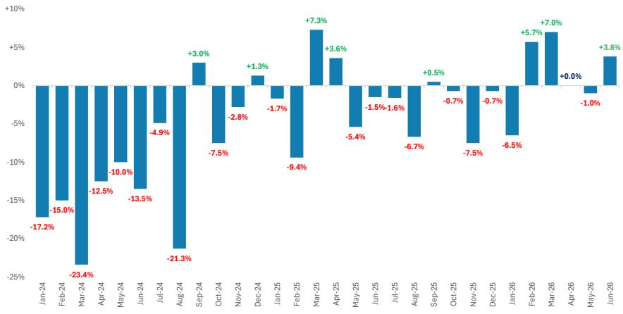

# 香槟出口加速，LVMH成为主要受益方

香槟行业并未全面复苏。2026年上半年，行业总销量仅增长1%，法国本土出货量延续多年下滑趋势，年初至今下降3%。然而，在这一平稳的图景中，一个明显的分化正在显现：第二季度出口量同比加速增长至6.3%，仅6月份就录得8%的增幅。这种分化之所以重要，不仅因为它是一个行业层面的数据点，更因为它预示着LVMH在7月27日发布第二季度业绩时，其香槟与葡萄酒板块可能面临特定的、可量化的上行空间。

LVMH并非典型的香槟生产商。虽然该集团约占全球香槟瓶装量的23%，但其对出口市场的敞口异常高。据估计，LVMH约86%的香槟瓶装量销往法国以外，而行业平均的出口占比要小得多。按价值计算，LVMH约占全球香槟出口市场的一半。当出口加速时，LVMH能从中获得不成比例的份额。目前市场普遍预期第二季度香槟与葡萄酒板块的有机销售增长仅为同比1.4%，而第一季度为5%。6月份的出口数据表明，这一预期可能过于保守。

这一短期信号背后的结构性故事同样重要。多年来，受人口结构变化、注重健康的年轻消费者以及消费者信心持续偏弱等因素影响，法国本土的香槟消费一直在收缩。除受疫情扰乱的2020年外，法国市场今年上半年的销量创下多年新低。这并非周期性波动，而是反映了香槟在其本土市场地位的结构性变化。与此同时，Prosecco等竞争性替代品在更低价格区间获得了市场份额，而行业在过去五到六年间的激进提价策略，则将中等消费群体排除在外，这与个人奢侈品领域出现的动态相似。

然而，香槟中的高端细分市场不仅具有韧性，而且正从这些趋势中受益。该行业正在结构性高端化，而LVMH拥有大多数领先的高质量品牌。这创造了一种战略上的不对称：LVMH的香槟业务既能受益于出口驱动的高端化，又能减少对本土市场结构性下滑的敞口。第二季度的数据为这一论点提供了具体的检验。

## 出口量连续三个月加速增长，打破停滞格局

6月份香槟出口量同比增长8%，而5月份下降4%，4月份持平。这并非单月异常。整个第二季度出口量增长6.3%，高于第一季度的3.7%。增长轨迹明显在加速。年初至今，行业总销量仅增长1%，这意味着出口市场承担了所有增长动力。本土出货量6月份下降2%，上半年累计下降3%。

这种对比鲜明且正在扩大。历史上作为香槟需求支柱的法国，如今已成为行业的拖累。相比之下，出口市场显示出近几个季度未曾见过的势头。这一模式表明，香槟消费的复苏并非广泛基础，而是集中在法国以外的市场。对于LVMH而言，其香槟销售额按价值计算超过80%来自出口，这种增长的集中性是一种优势，而非弱点。

其机制很直接。当一个季度出口量增长6.3%，而LVMH控制着约34%的出口量和约50%的出口价值时，该集团就能从增量收入中获得不成比例的大份额。而LVMH相对占比较小的本土市场则在持续收缩。净效果是，LVMH的香槟销售对出口改善趋势的杠杆作用高于行业平均水平。

## LVMH在美国香槟市场的主导地位创造了大多数竞争对手无法匹敌的结构性增长引擎

美国是香槟最重要的单一出口市场，而LVMH在此占据主导地位。根据Circana数据，LVMH在美国香槟市场的合计价值份额约为三分之二。这一主导地位主要由酩悦香槟和凯歌香槟驱动。凯歌香槟的市场地位尤为突出：美国吸收了其总产量的约40%，而行业整体仅为10%。

这不仅仅是品牌实力的体现，更是一种随时间累积的结构性优势。LVMH在美国市场的规模使其能够以小型竞争对手无法复制的方式投资于分销、营销和贸易关系。美国香槟市场也比法国市场更偏向高端，这与LVMH旗下包括唐培里侬和瑞纳特在内的高质量品牌组合相契合。当美国消费者对香槟的需求增强时，LVMH能捕获大部分价值创造。

第二季度出口加速很可能部分由美国需求驱动。虽然数据未按出口目的地细分，但美国是香槟最大的单一出口市场，而LVMH在此的主导份额意味着美国消费的任何增长都会不成比例地流向该集团。这种结构性敞口并未被市场普遍预期完全捕捉，后者往往基于行业整体趋势而非LVMH特定的地理和品牌组合来建模香槟销售。

## 高端化趋势使LVMH获得不成比例的收益，因为它拥有消费者升级所青睐的品牌

过去五到六年间，香槟行业一直在激进提价。这一策略将中等消费群体排除在外，导致了法国及整个行业销量的下滑。但它也强化了高质量品牌的高端定位。该行业实际上正在分化：大众市场香槟销量承压，而高端和奢侈香槟在高收入消费者中继续找到需求。

LVMH拥有从这种分化中受益的品牌。凯歌香槟、唐培里侬、瑞纳特以及酩悦香槟的高端产品线均定位于高端和超高端层级。这些品牌拥有定价能力、品牌资产和分销渠道，使其即使在行业整体销量持平或下滑时也能捕获价值。香槟消费的结构性高端化意味着，LVMH的香槟业务可以在不必然以相同速度增长销量的情况下实现价值增长。

这一动态在数据中可见。虽然2025年香槟行业总营业额从2024年的54亿欧元降至51.7亿欧元，但下降是由销量而非价格驱动的。高端品牌比大众市场品牌表现更稳。LVMH的香槟组合绝大多数偏向高端，这意味着该集团能免受最严重的销量压缩影响，同时充分参与高端化带来的价值增长。

## 决策框架：如何利用出口数据作为领先指标评估LVMH的香槟收入前景

对于跟踪LVMH香槟与葡萄酒板块的观察者而言，CIVC出口数据提供了一个可靠、及时且具体的领先指标。这种关系是因果性的，而不仅仅是相关性的。LVMH的香槟销售以出口为主，且该集团的出口市场份额大且稳定。因此，行业出口量的变化可以以合理的精度转化为LVMH香槟收入的预期变化。

该框架包含三个步骤。首先，跟踪每月发布的CIVC出口数据，其滞后时间相对较短。其次，应用LVMH约34%的出口量份额和50%的价值份额，推导出该集团隐含的销量和价值增长。第三，将隐含增长与市场对香槟与葡萄酒板块的普遍预期进行比较。当隐含增长超过预期时，收入存在上行空间；反之则存在下行风险。

将这一框架应用于2026年第二季度，得出了一个清晰的信号。该季度行业出口量同比增长6.3%。应用LVMH约50%的价值份额，意味着该集团的出口香槟收入增长率显著高于市场对该板块1.4%有机销售增长的普遍预期。在LVMH集团总销售额的背景下，上行幅度适中，因为香槟与葡萄酒板块仅占集团收入的不到4%。但该信号具有方向性和特异性。

该框架还揭示了一个市场可能忽略的风险。市场对香槟与葡萄酒板块的预期似乎锚定于疲弱的行业整体销量趋势，尤其是本土市场的下滑。但LVMH的敞口如此偏向出口，以至于本土市场的疲软对其收入表现基本无关紧要。市场可能仅仅因为参考了错误的总体数据而低估了香槟销售。

## 香槟消费面临的结构性压力是真实的，但它们集中在LVMH敞口有限的市场上

忽视香槟面临的结构性逆风将是一个错误。在关键市场，年轻人群体的酒精消费正在下降。健康与保健趋势正在降低人均酒精摄入量。Prosecco和其他起泡酒在更低价格区间获得了市场份额。欧洲的消费者信心一直偏弱。这些因素都是真实的，并已导致行业出货量连续三年下滑。

但这些逆风并非均匀分布。它们集中在法国本土市场和大众市场细分领域。多年来香槟消费尤为疲软的法国，在LVMH香槟销量中占比很小且不断下降。大众市场细分领域，价格敏感型消费者正被挤出，该领域由LVMH不拥有的品牌主导。LVMH的香槟组合绝大多数是高端产品，其地理敞口绝大多数是国际性的。

因此，LVMH香槟业务的结构性故事并非衰退，而是分化。该集团定位于市场中正在增长或保持价值的领域，同时远离正在萎缩的领域。第二季度的出口数据为这种分化正在实时上演提供了实证确认。本土市场持续走弱，出口市场正在加速。LVMH的香槟业务在结构上与后者保持一致。

这并不意味着LVMH的香槟板块不受宏观风险影响。例如，美国经济的急剧下滑将直接影响该集团最大的出口市场。但当前数据表明，就目前而言，出口驱动的增长故事依然完好且正在加速。市场可能需要上调其预期，不是因为行业正在全面复苏，而是因为LVMH在该行业中的特定定位比总体数据所显示的要更强。

*仅供参考。部分内容可能基于源材料通过AI辅助生成、翻译、总结或编辑，可能存在遗漏或错误。请独立核实。这不构成任何专业建议。*

仅供参考。部分内容可能基于源材料通过AI辅助生成、翻译、总结或编辑，可能存在遗漏或错误。请独立核实。这不构成任何专业建议。

