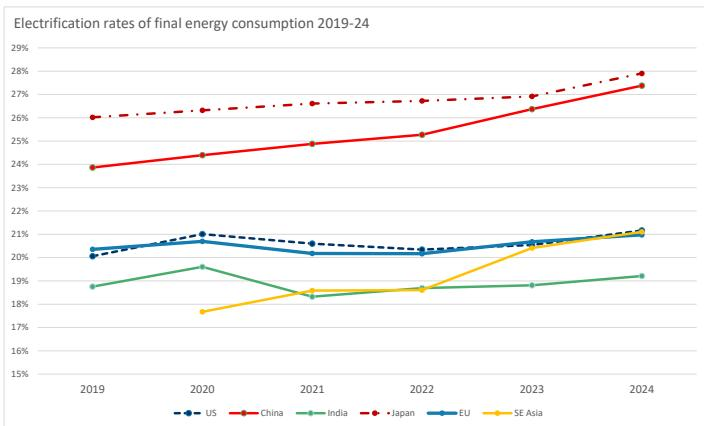
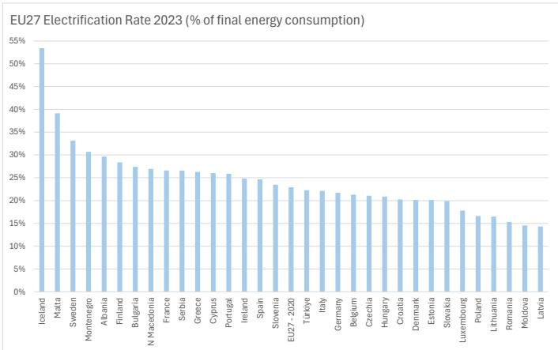
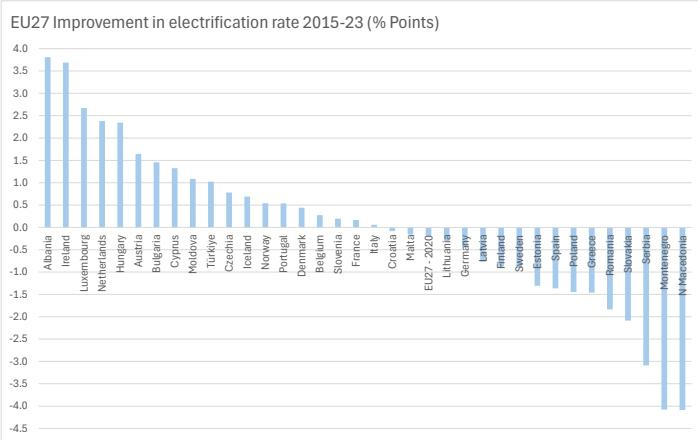
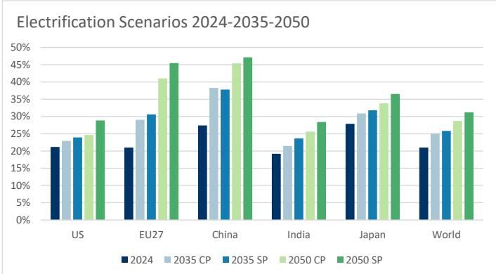
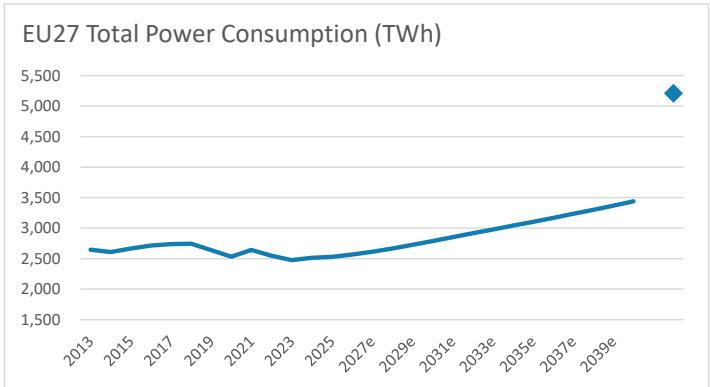
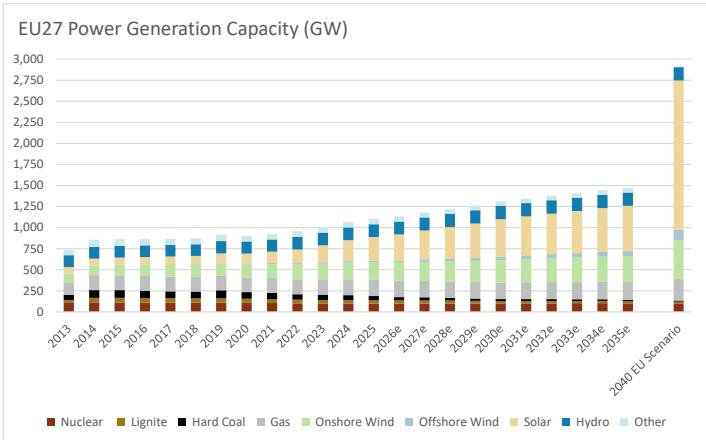
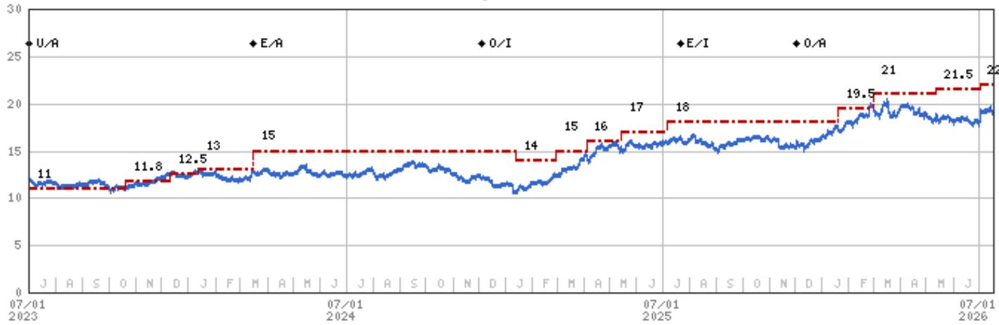
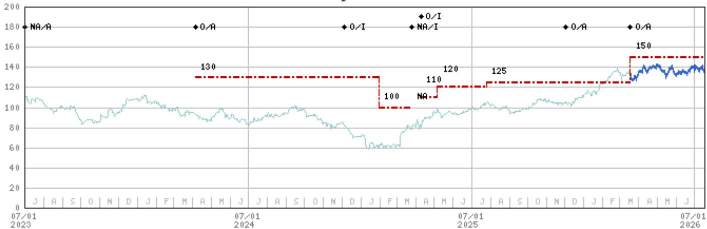
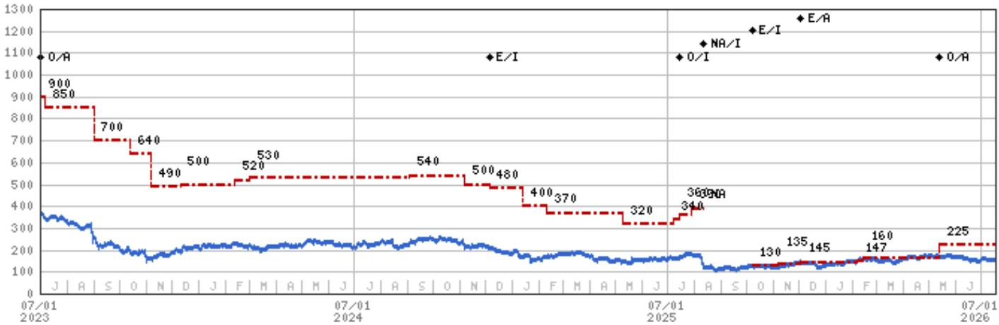
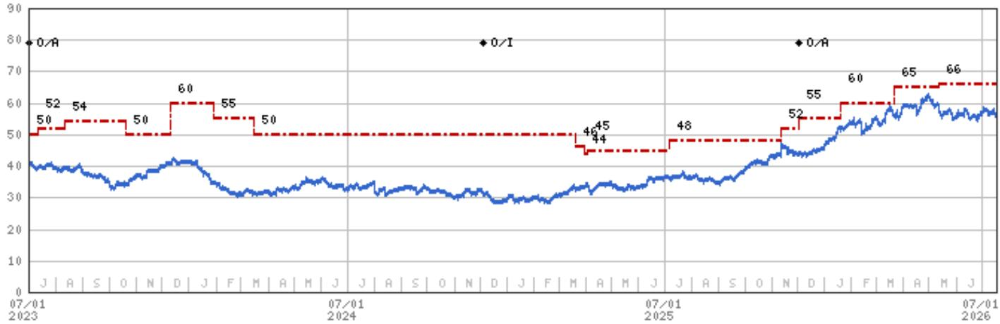

Utilities | Europe

# Electrifying Europe Reinforces 'New Growth Era'

## Key Takeaways

We expect a positive read-across for the Utility sector from future policy direction supporting electricity networks & clean power generation.

Draft EU electrification plan aims to increase the share of electricity in final energy consumption from the current 23% to 46% by 2040.

- Utilities is a key beneficiary via required investment in electricity networks and clean power generation to facilitate this increase.

We estimate the plan implies 2040 Electricity demand of ~5,000 TWh, ~50% higher than our current forecasts, at a 2025-40 CAGR of 4.9% (MSe 2.1%).

Even progress towards this target strengthens the 'New Growth Era' for Utilities, with our preferred EU exposure to this theme in Orsted, RWE, Elia, and E.ON.

Electrifying plan: The EU followed its 22nd April AccelerateEU Response to Energy Crisis with the indicated Electrification plan. The EU targets a doubling in the share of electricity in final energy consumption from the current 23% to 46% by 2040, with next steps in 4Q26. We consider this ambitious, given the slow pace of European electrification thus far, and the current highest regional electrification is ~25% in ASPAC. Furthermore, the IEA's 'Stated Policies Scenario' sees the EU27 reaching 46% by 2050 (and 41% under a 'Current Policies' Scenario) – see Exhibit 4. However, we note that EU/ Government targets are signposts for desired direction of travel, not necessarily literal targets. This was evident in 2022 REPowerEU Renewable targets of 1,236GW capacity vs MSe 783GW (see March 2022 note and May 2022 note.)

We see EU/Europe lagging Asia's progress in Electrification, with China & Japan already approaching 30%. Latest IEA data from 2024 shows China has increased its electrification ratio by 10% points since 2010, Japan by 3%, SE Asia 6%, overall ASPAC 7% vs EU ~1% (Exhibit 1) – also see Electrifying Energy Security, May 2026. Electrification rates vary across the EU, with notable outliers in Iceland, Sweden and France (Exhibit 2), but this is largely a result of legacy power mix (nuclear/geothermal), and progress has stalled over past 10 years (Exhibit 3). However, we find Electrification targets more achievable than wider Decarbonisation aims, given use of existing proven technologies (such as electric public transport, EVs, Electric heat pumps) and the pathway already seen in other regions

Potential material impact for electricity system: We estimate that the EU27 target implies 2040 total power demand of ~5,000TWh, representing a doubling over 2025 demand of 2,529 TWh and ~50% higher than MSe 2040 forecast of ~3,400. The implied 2025-40 CAGR of 4.9% compares to MSe 2.1% (1H26 2% YoY). We further estimate this level of power demand implies EU27 Generation capacity of ~3,000GW, up from 2026 1,132 GW (current MSe 2035 forecast for 1,470GW). Given the lead time of new nuclear, we envisage the majority of generation capacity will come from Renewables plus further flexgen (Batteries and CCGT) to balance the system. Such a material expansion in electricity generation will most likely require continued growth in electricity network capex investments to enable generation delivery to demand.

We recognize that such ambitions may be difficult to deliver in 15-year time-frame, and the market is unlikely to capitalize the literal interpretation. Nevertheless, as a signpost for desired direction of travel – and further potential policy support to make progress towards it – we consider it positive for European Utilities even if only half of the targeted increase were to be achieved.

Electrification supports and extends the 'New Growth Era' for European Utilities: Electric Utilities are critical for enabling greater electrification as the key avenue for allocating capital to the Electricity system. We see the pathway to 2030/early 2030s largely set in planned electricity network build-out, much of which is 'catch-up', and the evolving electricity generation mix that is unlikely to change before 2030. The Electrification plan provides support for, and greater market confidence in, the outlook for continued growth >2030. We acknowledge that EPS upgrades related to more capex are unlikely before late decade, given long-lead times in Utility hard assets. Nevertheless, we expect policy support extending the investment time-frame to be reflected in higher valuation multiples. Our preferred EU exposed stocks include RWE for Renewables clean power, Electricity Transmission & Gas plants to balance system, Orsted for new Offshore Wind Capacity and Elia and E.ON for Electricity network growth.

Reducing fossil imports: The electrification drive is now seen through an Energy security lens, rather than solely through Energy Transition dynamics – see Electrifying Energy Security, May 2026. Greater electrification of energy demand, if backed by largely clean power generation, should reduce fossil fuel imports. The EU plan references reducing the cost of fossil fuel imports, namely Gas & Oil, by €260bn by 2040. In power markets, reducing the role of Gas fired power in setting the price in the marginal variable cost curve 'merit order' is critical to lowering wholesale power prices and helping customer bills.

See 6 key charts in next section

## 6 Key Charts

Exhibit 1: EU/Europe electrification lags Asia and has barely increased in recent years  
  
Source: IEA, MS Estimates

Exhibit 2: Electrification rates vary from 14% to 53% across the EU ...  
  
Source: Eurostat, MS Estimates

Exhibit 3: ... yet there has been little improvement in the large economies over the last decade  
  
Source: Eurostat, MS estimates

Exhibit 4: The EU plan for 46% by 2040 is more ambitious than the IEA Stated Policies Scenario for 2050  
  
Source: IEA, MS

Exhibit 5: The EU's 46% target would imply EU power demand of 5,206 TWh, a 4.9% CAGR from 2026, vs MSe 3,400 TWh and 2.1% CAGR  
  
Source: ENTSOE, MS Estimates

Exhibit 6: Accommodating higher electricity demand requires a greater step-up in generation & networks than we currently forecast.  
  
Source: ENTSOE, MS estimates

## Valuation Methodology and Risks

## Elia (ELI.BR)

Our base case valuation is a SOTP of the two network businesses. For both, we take the value of the RAB in 2026 and DCF the future value of likely outperformance via incentives & opex in Belgium and in Germany. We use a CoE of 6.0% in Belgium and 5.3% in Germany. Our valuation delivers a 22% premium to RAB for ETB and a 46% premium to RAB for 50 Hertz.

## Risks to Upside

■ Lower bond yields

■ Improvement in German regulation to support high capex requirements

## Risks to Downside

■ Higher bond yields

■ Less supportive regulation in Belgium and Germany

■ Failure to deliver on expansive capex plan

## E.ON (EONGn.DE)

Our SOTP valuation is based on DCFs for the Network businesses, including JVs and non-regulated activities, out to 2060, and then includes the final RAB (discounted back). We apply a 4.7% WACC for Germany RAB based networks, 5.4% for non-RAB earnings, 4.8% for Sweden and 6-10% for CEE networks country dependent. We value Retail at 7.5x EV/2025 EBITDA for Germany, 6.5x for the UK, 3.5x for Other, and EIS at 10x EV/EBITDA.

## Risks to Upside

■ Improved German regulatory package (cost of debt, opex & redistribution costs)

■ Higher network capex and EPS CAGR

■ Non-core asset disposals at attractive valuations

■ Increasing DPS growth/payout ratio

## Risks to Downside

■ Higher bond yields triggering de-rating

■ Supply chain challenges to deploying capex

■ Changes to German energy policy reducing RES targets/network capex growth

■ Lower retail margins

■ Lower regulated returns

## Orsted A/S (ORSTED.CO)

We value Orsted on a SOTP, using a project-by-project DCF for Offshore wind and a DCF for Onshore business using a weighted average regional WACC of 6.2% for Offshore and 6.4% for Onshore.

In offshore we includes operational assets, projects under construction (Revolution, Sunrise, H3, Changhua 2B&4, Baltica 2), as well as 4 projects under development. Our price target implies 2027 EV/EBITDA of 12.5x and P/E of 31x with low gearing.

## Risks to Upside

■ Falling bond yields increase NPV

■ Attractive dividend distribution policy

■ Positive newsflow on US projects

■ Attractive terms on new offshore wind projects

■ Consolidation / M&A in renewables

## Risks to Downside

■ Further halt orders or cancellations on US projects (Sunrise & Revolution)

■ Further cost overruns, delays and/or impairments on projects

■ Rising yields eroding NPV

■ Lower power prices

■ Anti renewable energy policies

## RWE AG (RWEG.DE)

We value each business division separately through a DCF. We value Renewables targets to 2030 and assume value of 3GW new German CCGTs. We assume no terminal value and use business-specific WACCs. We apply a 6.7% WACC to Offshore & 6.6% for Onshore Renewables, 7.8% for the Flexgen division, and Trading on 6x EV/EBITDA. We value 15% E.ON stake at market, Amprion using DCF and 1/2 of 3GW data centre site pipeline.

## Risks to Upside

■ More data centre site deals

■ Higher PPA prices support renewable growth

■ Capacity wins in German CCGT auction

■ Lignite foundation to exit coal early

■ Higher power prices driven EPS upgrades

■ Lower bond yields

## Risks to Downside

■ Lower German & UK power prices

■ Price caps, lower carbon prices, intervention

■ Execution / cost overruns in Renewables

■ Higher yield curve

■ Negative evolution in German Energy policy

■ Poor trading

## Disclosure Section

The information and opinions in MS were prepared or are disseminated by MS Europe S.E., regulated by Bundesanstalt fuer Finanzdienstleistungsaufsicht (BaFin) and/or MS & Co. International plc, authorized by the Prudential Regulation Authority and regulated by the Financial Conduct Authority and the Prudential Regulation Authority. MS & Co. International plc disseminates in the UK research that it has prepared, and which has been prepared by any of its affiliates, only to persons who (i) are investment professionals falling within Article 19(5) of the Financial Services and Markets Act 2000 (Financial Promotion) Order 2005 (as amended, the "Order"); (ii) are persons who are high net worth entities falling within Article 49(2)(a) to (d) of the Order; or (iii) are persons to whom an invitation or inducement to engage in investment activity (within the meaning of section 21 of the Financial Services and Markets Act 2000, as amended) may otherwise lawfully be communicated or caused to be communicated. As used in this disclosure section, MS includes RMB MS Proprietary Limited, MS Europe S.E., MS & Co International plc and its affiliates.

For important disclosures, stock price charts and equity rating histories regarding companies that are the subject of this report, please see the MS Disclosure Website at www.morganstanley.com/eqr/disclosures/webapp/generalresearch, or contact your investment representative or MS at 1585 Broadway, (Attention: Research Management), New York, NY, 10036 USA.

For valuation methodology and risks associated with any recommendation, rating or price target referenced in this research report, please contact the Client Support Team as follows: US/Canada +1 800 303-2495; Hong Kong +852 2848-5999; Latin America +1 718 754-5444 (U.S.); London +44 (0)20-7425-8169; Singapore +65 6834-6860; Sydney +61 (0)2-9770-1505; Tokyo +81 (0)3-6836-9000. Alternatively you may contact your investment representative or MS at 1585 Broadway, (Attention: Research Management), New York, NY 10036 USA.

## Analyst Certification

The following analysts hereby certify that their views about the companies and their securities discussed in this report are accurately expressed and that they have not received and will not receive direct or indirect compensation in exchange for expressing specific recommendations or views in this report: Marina Fuentes Juan; Sarah E Lester, CFA; Robert Pulleyn; Arthur Sitbon, CFA.

## Global Research Conflict Management Policy

MS has been published in accordance with our conflict management policy, which is available at www.morganstanley.com/institutional/research/conflictpolicies. A Portuguese version of the policy can be found at www.morganstanley.com.br

## Important Regulatory Disclosures on Subject Companies

As of June 30, 2026, MS beneficially owned 1% or more of a class of common equity securities of the following companies covered in MS: Centrica, Drax Group Plc, EDP Energias de Portugal SA, Enagas SA, ENGIE, Naturgy, Pennon Group, Redeia, RWE AG, Severn Trent, Solaria Energia y Medio Ambiente SA, SSE, United Utilities Group PLC, Veolia. Within the last 12 months, MS managed or co-managed a public offering (or 144A offering) of securities of A2A SpA, E.ON, EDP Energias de Portugal SA, ENEL, ENGIE, Iberdrola SA, National Grid plc, Naturgy, Orsted A/S, RWE AG, SSE, Veolia.

Within the last 12 months, MS has received compensation for investment banking services from A2A SpA, E.ON, EDP Energias de Portugal SA, Enagas SA, ENEL, ENGIE, Iberdrola SA, National Grid plc, Naturgy, Orsted A/S, Pennon Group, RWE AG, Severn Trent, Snam SpA, SSE, Veolia.

In the next 3 months, MS expects to receive or intends to seek compensation for investment banking services from A2A SpA, Centrica, CEZ, Drax Group Plc, E.ON, EDP Energias de Portugal SA, EDP Renovaveis, Elia, Enagas SA, Endesa SA, ENEL, ENGIE, ERG SpA, Fortum Oyj, Hidroelectrica SA, Iberdrola SA, Italgas SpA, National Grid plc, Naturgy, NEL ASA, Orsted A/S, Pennon Group, RWE AG, Severn Trent, Snam SpA, SSE, Terna - Rete Elettrica Nazionale SpA, United Utilities Group PLC, Veolia, Verbund AG, Voltalia SA.

Within the last 12 months, MS has received compensation for products and services other than investment banking services from A2A SpA, Centrica, CEZ, Corporacion Acciona Energia Renovables, Drax Group Plc, E.ON, EDP Energias de Portugal SA, EDP Renovaveis, Elia, Endesa SA, ENEL, ENGIE, Fortum Oyj, Iberdrola SA, Italgas SpA, National Grid plc, Naturgy, Orsted A/S, Pennon Group, RWE AG, Severn Trent, Snam SpA, SSE, Veolia, Verbund AG.

Within the last 12 months, MS has provided or is providing investment banking services to, or has an investment banking client relationship with, the following company: A2A SpA, Centrica, CEZ, Drax Group Plc, E.ON, EDP Energias de Portugal SA, EDP Renovaveis, Elia, Enagas SA, Endesa SA, ENEL, ENGIE, ERG SpA, Fortum Oyj, Hidroelectrica SA, Iberdrola SA, Italgas SpA, National Grid plc, Naturgy, NEL ASA, Orsted A/S, Pennon Group, RWE AG, Severn Trent, Snam SpA, SSE, Terna - Rete Elettrica Nazionale SpA, United Utilities Group PLC, Veolia, Verbund AG, Voltalia SA.

Within the last 12 months, MS has either provided or is providing non-investment banking, securities-related services to and/or in the past has entered into an agreement to provide services or has a client relationship with the following company: A2A SpA, Centrica, CEZ, Corporacion Acciona Energia Renovables, Drax Group Plc, E.ON, EDP Energias de Portugal SA, EDP Renovaveis, Elia, Endesa SA, ENEL, ENGIE, Fortum Oyj, Iberdrola SA, Italgas SpA, National Grid plc, Naturgy, Orsted A/S, Pennon Group, RWE AG, Severn Trent, Snam SpA, SSE, Terna - Rete Elettrica Nazionale SpA, Veolia, Verbund AG, Voltalia SA.

MS & Co. International plc is a corporate broker to Pennon Group, Severn Trent, SSE.

The equity research analysts or strategists principally responsible for the preparation of MS have received compensation based upon various factors, including quality of research, investor client feedback, stock picking, competitive factors, firm revenues and overall investment banking revenues. Equity Research analysts' or strategists' compensation is not linked to investment banking or capital markets transactions performed by MS or the profitability or revenues of particular trading desks.

MS and its affiliates do business that relates to companies/instruments covered in MS, including market making, providing liquidity, fund management, commercial banking, extension of credit, investment services and investment banking. MS sells to and buys from customers the securities/instruments of companies covered in MS on a principal basis. MS may have a position in the debt of the Company or instruments discussed in this report. MS trades or may trade as principal in the debt securities (or in related derivatives) that are the subject of the debt research report.

Certain disclosures listed above are also for compliance with applicable regulations in non-US jurisdictions.

## STOCK RATINGS

MS uses a relative rating system using terms such as Overweight, Equal-weight, Not-Rated or Underweight (see definitions below). MS does not assign ratings of Buy, Hold or Sell to the stocks we cover. Overweight, Equal-weight, Not-Rated and Underweight are not the equivalent of buy, hold and sell. Investors should carefully read the definitions of all ratings used in MS. In addition, since MS contains more complete information concerning the analyst's views, investors should carefully read MS, in its entirety, and not infer the contents from the rating alone. In any case, ratings (or research) should not be used or relied upon as investment advice. An investor's decision to buy or sell a stock should depend on individual circumstances (such as the investor's existing holdings) and other considerations.

## Global Stock Ratings Distribution

## (as of June 30, 2026)

The Stock Ratings described below apply to MS's Fundamental Equity Research and do not apply to Debt Research produced by the Firm.

For disclosure purposes only (in accordance with FINRA requirements), we include the category headings of Buy, Hold, and Sell alongside our ratings of Overweight, Equal-weight, Not-Rated and Underweight. MS does not assign ratings of Buy, Hold or Sell to the stocks we cover. Overweight, Equal-weight, Not-Rated and Underweight are not the equivalent of buy, hold, and sell but represent recommended relative weightings (see definitions below). To satisfy regulatory requirements, we correspond Overweight, our most positive stock rating, with a buy recommendation; we correspond Equal-weight and Not-Rated to hold and Underweight to sell recommendations, respectively.

<table><tr><td></td><td colspan="2">Coverage Universe</td><td colspan="3">Investment Banking Clients (IBC)</td><td colspan="2">Other Material Investment ServicesClients (MISC)</td></tr><tr><td>Stock RatingCategory</td><td>Count</td><td>% of Total</td><td>Count</td><td>% of Total IBC</td><td>% of RatingCategory</td><td>Count</td><td>% of Total OtherMISC</td></tr><tr><td>Overweight/Buy</td><td>1544</td><td>42%</td><td>453</td><td>49%</td><td>29%</td><td>757</td><td>44%</td></tr><tr><td>Equal-weight/Hold</td><td>1577</td><td>43%</td><td>390</td><td>42%</td><td>25%</td><td>769</td><td>44%</td></tr><tr><td>Not-Rated/Hold</td><td>3</td><td>0%</td><td>1</td><td>0%</td><td>33%</td><td>1</td><td>0%</td></tr><tr><td>Underweight/Sell</td><td>544</td><td>15%</td><td>89</td><td>10%</td><td>16%</td><td>204</td><td>12%</td></tr><tr><td>Total</td><td>3,668</td><td></td><td>933</td><td></td><td></td><td>1731</td><td></td></tr></table>

Data include common stock and ADRs currently assigned ratings. Investment Banking Clients are companies from whom MS received investment banking compensation in the last 12 months. Due to rounding off of decimals, the percentages provided in the "% of total" column may not add up to exactly 100 percent.

## Analyst Stock Ratings

Overweight (O). The stock's total return is expected to exceed the average total return of the analyst's industry (or industry team's) coverage universe, on a risk-adjusted basis, over the next 12-18 months.

Equal-weight (E). The stock's total return is expected to be in line with the average total return of the analyst's industry (or industry team's) coverage universe, on a risk-adjusted basis, over the next 12-18 months.

Not-Rated (NR). Currently the analyst does not have adequate conviction about the stock's total return relative to the average total return of the analyst's industry (or industry team's) coverage universe, on a risk-adjusted basis, over the next 12-18 months.

Underweight (U). The stock's total return is expected to be below the average total return of the analyst's industry (or industry team's) coverage universe, on a risk-adjusted basis, over the next 12-18 months.

Unless otherwise specified, the time frame for price targets included in MS is 12 to 18 months.

## Analyst Industry Views

Attractive (A): The analyst expects the performance of his or her industry coverage universe over the next 12-18 months to be attractive vs. the relevant broad market benchmark, as indicated below.

In-Line (I): The analyst expects the performance of his or her industry coverage universe over the next 12-18 months to be in line with the relevant broad market benchmark, as indicated below. Cautious (C): The analyst views the performance of his or her industry coverage universe over the next 12-18 months with caution vs. the relevant broad market benchmark, as indicated below. Benchmarks for each region are as follows: North America - S&P 500; Latin America - relevant MSCI country index or MSCI Latin America Index; Europe - MSCI Europe; Japan - TOPIX; Asia - relevant MSCI country index or MSCI sub-regional index or MSCI AC Asia Pacific ex Japan Index.

## Stock Price, Price Target and Rating History (See Rating Definitions)

Stock Rating History: 7/1/21 : U/A; 8/5/22 : E/A; 1/6/23 : U/A; 3/15/24 : E/A; 12/5/24 : 0/I; 7/21/25 : E/I; 12/3/25 : 0/A

E.ON (EONGn.DE) - As of 07/17/26 GMT in EUR
Industry : Utilities  
  
Price Target History: 5/11/21 : 9.4; 8/3/21 : 10; 12/14/21 : 11; 5/16/22 : 10.5; 8/5/22 : 10; 11/9/22 : 9.5; 2/27/23 : 10;
3/20/23 : 10.5; 6/19/23 : 11; 10/20/23 : 11.8; 12/11/23 : 12.5; 1/12/24 : 13; 3/15/24 : 15; 1/13/25 : 14; 2/26/25 : 15; 4/4/25 : 16;
5/14/25 : 17; 7/7/25 : 18; 1/19/26 : 19.5; 3/2/26 : 21; 5/13/26 : 21.5; 7/2/26 : 22  
Source: MS Date Format : MM/DD/YY Price Target No Price Target Assigned (NA)
Stock Price (Not Covered by Current Analyst) Stock Price (Covered by Current Analyst)
Stock and Industry Ratings (abbreviations below) appear as ♦ Stock Rating/Industry View
Stock Ratings: Overweight (O) Equal-weight (E) Underweight (U) Not-Rated (NR) No Rating Available (NA)  
Industry View: Attractive (A) In-line (I) Cautious (C) No Rating (NR)  
Effective January 13, 2014, the stocks covered by MS Asia Pacific will be rated relative to the analyst's industry (or industry team's) coverage.  
Effective January 13, 2014, the industry view benchmarks for MS Asia Pacific are as follows: relevant MSCI country index or MSCI sub-regional index or MSCI AC Asia Pacific ex Japan Index.

Elia (ELI.BR) - As of 07/17/26 GMT in EUR
Industry : Utilities  
  
Stock Rating History: 7/1/21 : NA/A; 4/5/24 : 0/A; 12/5/24 : 0/I; 3/26/25 : NA/I; 4/9/25 : 0/I; 12/3/25 : 0/A; 3/18/26 : 0/A
Price Target History: 4/5/24 : 130; 1/30/25 : 100; 3/26/25 : NA; 4/9/25 : 110; 5/6/25 : 120; 7/25/25 : 125; 3/18/26 : 150  
Source: MS Date Format: MM/DD/YY Price Target No Price Target Assigned (NA)
Stock Price (Not Covered by Current Analyst) Stock Price (Covered by Current Analyst)
Stock and Industry Ratings (abbreviations below) appear as ♦ Stock Rating/Industry View
Stock Ratings: Overweight (0) Equal-weight (E) Underweight (U) Not-Rated (NR) No Rating Available (NA)  
Industry View: Attractive (A) In-line (I) Cautious (C) No Rating (NR)  
Effective January 13, 2014, the stocks covered by MS Asia Pacific will be rated relative to the analyst's industry (or industry team's) coverage.  
Effective January 13, 2014, the industry view benchmarks for MS Asia Pacific are as follows: relevant MSCI country index or MSCI sub-regional index or MSCI AC Asia Pacific ex Japan Index.

Source: MS Date Format : MM/DD/YY Price Target = No Price Target Assigned (NA)

Source: MS Date Format : MM/DD/YY Price Target No Price Target Assigned (NA)
Stock Price (Not Covered by Current Analyst) Stock Price (Covered by Current Analyst)
Stock and Industry Ratings (abbreviations below) appear as ♦ Stock Rating/Industry View
Stock Ratings: Overweight (O) Equal-weight (E) Underweight (U) Not-Rated (NR) No Rating Available (NA)

Orsted A/S (ORSTED.CO) - As of 07/17/26 GMT in DKK Industry : Utilities  
  
Stock Rating History: 7/1/21 : 0/A; 12/5/24 : E/I; 7/14/25 : 0/I; 8/11/25 : NA/I; 10/7/25 : E/I; 12/3/25 : E/A; 5/13/26 : 0/A  
Price Target History: 6/3/21 : 1200; 2/2/22 : 1000; 2/22/22 : 900; 5/3/22 : 1000; 11/4/22 : 850; 11/18/22 : 870; 1/23/23 : 850; 5/25/23 : 900; 7/6/23 : 850; 9/1/23 : 700; 10/13/23 : 640; 11/7/23 : 490; 12/11/23 : 500; 2/12/24 : 520; 3/1/24 : 530; 9/3/24 : 540; 11/6/24 : 500; 12/5/24 : 480; 1/13/25 : 400; 2/10/25 : 370; 5/9/25 : 320; 7/7/25 : 340; 7/14/25 : 360; 7/28/25 : 390; 8/11/25 : NA; 10/7/25 : 130; 11/6/25 : 135; 12/3/25 : 145; 2/6/26 : 147; 2/13/26 : 160; 5/13/26 : 225  
Stock Price (Not Covered by Current Analyst) — Stock Price (Covered by Current Analyst)  
Stock and Industry Ratings (abbreviations below) appear as ♦ Stock Rating/Industry View  
Industry View: Attractive (A) In-line (I) Cautious (C) No Rating (NR)  
Effective January 13, 2014, the stocks covered by MS Asia Pacific will be rated relative to the analyst's industry (or industry team's) coverage.  
Effective January 13, 2014, the industry view benchmarks for MS Asia Pacific are as follows: relevant MSCI country index or MSCI sub-regional index or MSCI AC Asia Pacific ex Japan Index.

RWE AG (RWEG.DE) - As of 07/17/26 GMT in EUR
Industry : Utilities  
  
Stock Rating History: 7/1/21 : 0/A; 12/5/24 : 0/I; 12/3/25 : 0/A

Price Target History: 11/12/20 : 44; 10/15/21 : 42; 11/30/21 : 44; 1/31/22 : 45; 5/3/22 : 50; 8/6/22 : 53; 11/14/22 : 52; 11/18/22 : 53; 3/6/23 : 50; 7/11/23 : 52; 8/11/23 : 54; 10/20/23 : 50; 12/11/23 : 60; 1/29/24 : 55; 3/15/24 : 50; 3/21/25 : 46; 3/31/25 : 44; 4/3/25 : 45; 7/7/25 : 48; 11/12/25 : 52; 12/3/25 : 55; 1/19/26 : 60; 3/22/26 : 65; 5/13/26 : 66

Industry View: Attractive (A) In-line (I) Cautious (C) No Rating (NR)

Effective January 13, 2014, the stocks covered by MS Asia Pacific will be rated relative to the analyst's industry (or industry team's) coverage.

Effective January 13, 2014, the industry view benchmarks for MS Asia Pacific are as follows: relevant MSCI country index or MSCI sub-regional index or MSCI AC Asia Pacific ex Japan Index.

## Important Disclosures for MS Smith Barney LLC Customers

Important disclosures regarding any material conflict of interest that can reasonably be expected to have influenced MS Smith Barney LLC's choice of a third-party research provider or the subject company of a third-party research report, are available on the MS Wealth Management disclosure website at www.morganstanley.com/online/researchdisclosures. For MS specific disclosures, you may refer to https://www.morganstanley.com/eqr/disclosures/webapp/generalresearch.

Each MS report is reviewed and approved on behalf of MS Smith Barney LLC. This review and approval is conducted by the same person who reviews the research report on behalf of MS. This could create a conflict of interest.

## Other Important Disclosures

MS policy is to update research reports as and when the Research Analyst and Research Management deem appropriate, based on developments with the issuer, the sector, or the market that may have a material impact on the research views or opinions stated therein. In addition, certain Research publications are intended to be updated on a regular periodic basis (weekly/monthly/quarterly/annual) and will ordinarily be updated with that frequency, unless the Research Analyst and Research Management determine that a different publication schedule is appropriate based on current conditions.

MS is not acting as a municipal advisor and the opinions or views contained herein are not intended to be, and do not constitute, advice within the meaning of Section 975 of the Dodd-Frank Wall Street Reform and Consumer Protection Act.

MS produces an equity research product called a "Tactical Idea." Views contained in a "Tactical Idea" on a particular stock may be contrary to the recommendations or views expressed in research on the same stock. This may be the result of differing time horizons, methodologies, market events, or other factors. For all research available on a particular stock, please contact your sales representative or go to Matrix at http://www.morganstanley.com/matrix.

MS is provided to our clients through our proprietary research portal on Matrix and also distributed electronically by MS to clients. Certain, but not all, MS products are also made available to clients through third-party vendors or redistributed to clients through alternate electronic means as a convenience. For access to all available MS, please contact your sales representative or go to Matrix at http://www.morganstanley.com/matrix.

Any access and/or use of MS is subject to MS's Terms of Use (http://www.morganstanley.com/terms.html). By accessing and/or using MS,
