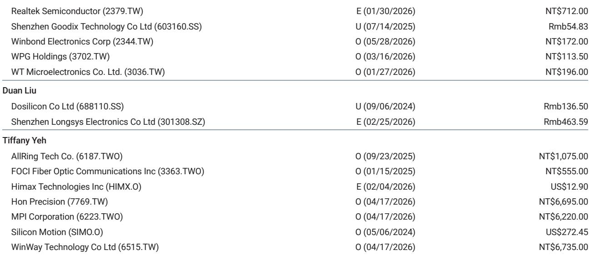
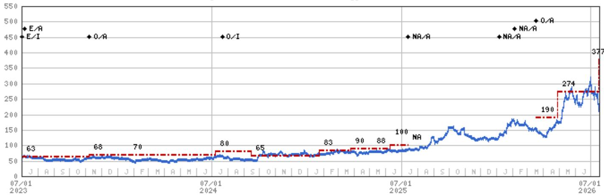
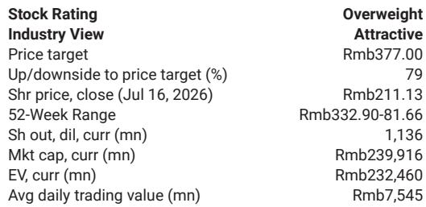

# AI需求正在重塑澜起科技的发展轨迹，但韩国反垄断调查增加了战略不确定性

澜起科技第二季度初步业绩显示，公司在面临挑战的情况下依然全面发力。营收达到19亿元人民币，环比增长28%，同比增长33%，超出分析师预期6%。净利润同比增长82%至12亿元人民币，比市场一致预期高出50%。这些数字不仅强劲——它们表明公司围绕AI驱动内存接口和互连芯片需求的核心逻辑正在比预期更快地实现。然而，同一份财报也带来了韩国检察官反垄断调查的消息，这一进展为原本看好的叙事增添了监管风险。对于观察者而言，问题是澜起的产品周期动能能否吸收这一法律不确定性，还是调查标志着结构性压力的开始。

当前时刻的张力十分明显。澜起在2026年上半年的运营表现得益于AI需求对其RCD和新互连芯片产品线的推动。公司报告称第三季度订单可见性强劲，表明需求激增并非单季度现象，而是持续周期的一部分。与此同时，2026年7月15日韩国办公室的现场搜查和证据收集，涉及“可能违反适用的反垄断法律法规”，引入了一个任何财务模型都难以轻易定价的变量。公司表示运营保持正常，且公司本身及任何董事或员工均未受到正式指控。但调查的持续时间和结果未知，这种不确定性将考验市场如何权衡产品周期强度与法律风险。

这一时刻的战略重要性在于三股力量的交汇：中国加速的AI基础设施建设、澜起在该建设中的独特定位，以及可能改变公司竞争地位的监管事件。本文认为，澜起的基本需求故事依然完整，调查虽然严肃，但尚未削弱产品周期逻辑。然而，观察者现在必须通过理解AI需求与澜起营收之间的具体机制、反垄断调查的性质和潜在范围，以及公司宣布的回购计划中蕴含的信号，来校准对这一公司的关注。

## AI需求周期正通过两个不同的产品方向推动澜起营收加速

澜起第二季度业绩不仅是一次超预期；它们代表了公司营收构成的结构性转变。公司明确将其上半年的强劲表现归因于两个产品类别的AI需求：RCD芯片和新互连芯片。RCD，即寄存器时钟驱动器，是数据中心服务器内存模块中的关键组件。随着AI推理和智能体工作负载的普及，它们需要更高的内存带宽和容量，这反过来推动了对先进内存接口芯片的需求。澜起的RCD业务是这一趋势的直接受益者。

第二个方向是澜起的PCIe互连业务。PCIe，即外围组件互连快速通道，是将GPU和存储设备等高速组件连接到服务器CPU的标准接口。在中国AI服务器市场中，国内半导体解决方案日益受到重视，澜起的PCIe芯片作为该国AI基础设施建设的独特代表。报告将澜起定位为“通过其PCIe业务受益于中国AI服务器市场的独特代表”，这一框架强调了公司在外国竞争对手面临准入限制的市场中的战略价值。

在人民币走强的背景下，6%的营收超预期变得更有意义。货币升值通常会压缩拥有大量美元计价销售收入的公司的报告营收，因此澜起仍然表现优异的事实表明，潜在销量增长甚至比表面数字所暗示的更为强劲。扣除一次性项目后的净利润同比增长27%，确认核心运营业务正在盈利扩张。然而，50%的净利润超预期部分是由投资利得和公允价值变动等一次性项目推动的。观察者在评估可持续盈利能力时应剔除这些项目，但潜在的运营动能依然强劲。

对决策者的启示很明确：澜起的营收轨迹现在与中国AI基础设施部署的速度挂钩，而非更广泛的半导体周期。这缩小了对该公司最重要的宏观风险范围。云计算资本支出增长、DRAM接口技术迁移，以及美国同行在中国市场逐步退出的速度，是决定澜起当前增长率是否可持续的三个变量。

## 韩国反垄断调查带来了不可忽视但短期内可能可控的风险

2026年7月15日，首尔中央地方检察厅公平交易调查部对澜起韩国办公室进行了现场搜查并收集了证据。调查涉及“可能违反适用的反垄断法律法规”。澜起表示正在全力配合，运营保持正常，且公司或其人员均未受到指控。公司无法预测调查的持续时间或结果。

这不是一个微不足道的事件。韩国的反垄断调查可能带来重大处罚，包括罚款和运营限制。检察官进行现场搜查的事实表明，他们已经收集了足够的初步证据来证明正式调查的合理性。观察者必须考虑一系列可能的结果：未发现违规、和解并处以罚款，或导致管理层分心并造成声誉损害的漫长法律程序。

然而，调查的时机很重要。澜起正处于一个强劲的产品周期中，订单可见性强，营收增长加速。调查不太可能扰乱近期出货或客户关系，因为澜起的客户主要在中国和美国，且公司在韩国的业务在其整体布局中占比较小。报告未具体说明韩国办公室的营收贡献，但澜起表示运营保持正常的事实表明，调查尚未影响商业活动。

战略意义在于，调查为澜起的估值引入了一个折扣因素，但并未否定需求逻辑。观察者应监控调查进展，寻找升级迹象，如正式指控或业务活动限制。目前，风险是可控的，但它增加了不确定性，需要更高的预期回报。

## 回购提案在关键时刻彰显管理层信心并协调激励机制

2026年7月16日，董事长兼首席执行官杨崇和博士提议了一项3亿至6亿元人民币的A股回购计划，有待董事会批准。这是管理层对公司前景以及认为公司价值被低估的直接信号。时机尤其值得注意，恰在韩国调查披露后一天。

在此节点进行回购具有多重战略目的。首先，它表明管理层认为基本面足够强劲，值得动用资本回购股份，而不是囤积现金或进行收购。其次，它在监管不确定性时期为股价提供了支撑，向市场传递内部人士愿意承担风险的信号。第三，它将管理层的激励与股东利益对齐，因为回购减少了股份数量，提高了剩余持有者的每股收益。

提议的3亿至6亿元人民币回购范围约占公司2400亿元人民币市值的0.1%至0.25%。虽然相对规模不大，但象征意义超过了金额本身。在一个监管新闻可能引发急剧下跌的市场中，回购公告起到了断路器的作用，迫使观察者重新考虑最坏情况。

对于分析师和组合管理者而言，回购提供了一个有用的校准点。如果管理层愿意在当前水平回购股份，意味着他们看到该公司的显著上行空间。回购与这一观点一致。

## 评估澜起风险回报状况的决策框架

对于试图评估澜起在需求强劲与监管风险竞争力量下是否提供有吸引力切入点的观察者，一个结构化的框架至关重要。以下决策逻辑优先考虑将在未来12-18个月内决定该公司轨迹的因素。

首先，评估需求信号。澜起的营收增长现在是中国AI基础设施支出的函数。关键领先指标是中国主要科技公司的云计算资本支出公告、DRAM接口技术迁移时间表，以及美国半导体同行在中国市场逐步退出的速度。如果这些指标保持积极，澜起的营收轨迹应继续加速。报告预测营收从2025年的53亿元人民币增长到2026年的75亿元、2027年的139亿元和2028年的195亿元，意味着未来两年约50%的复合年增长率。这是看涨情景。

其次，评估监管风险。韩国反垄断调查是下行风险的主要来源。观察者应跟踪三个里程碑：调查是否升级为正式指控，是否扩展到其他司法管辖区，以及是否导致任何运营限制。报告指出调查“可能需要一些时间才能完成”，这意味着压力可能持续数个季度。然而，公司或其人员未受到任何指控是一个积极信号。如果调查以未发现不当行为而结束，该公司可能大幅重新定价。

第三，考虑估值。根据报告基于一致预期的每股收益，以7月16日收盘价211.13元计算，澜起交易于2026年预计每股收益3.09元的66.8倍。这一倍数并不便宜，但它反映了嵌入该公司的较高增长预期。报告预测每股收益在2027年增长至6.40元，2028年增长至9.26元，这将使远期市盈率分别降至32.3倍和22.3倍。如果公司实现这些预测，当前估值将被证明是合理的。风险在于盈利不及预期，或倍数因监管或宏观担忧而收缩。

第四，解读回购。提议的回购是管理层认为当前水平具有价值的明确信号。观察者应将其视为积极指标，但它不应取代基本需求和监管分析。回购可以在短期内支撑该公司，但不能替代持续的盈利增长。

最后，整合货币逆风。报告指出人民币走强对营收产生了负面影响。如果人民币继续走强，澜起的报告营收和盈利可能面临压力。然而，对于销量增长强劲的公司而言，货币效应是次要问题。

## 澜起在中国AI基础设施建设中的长期定位仍是主导叙事

这份财报最重要的结论是，澜起的产品周期正在加速，而非减速。28%的环比营收增长、50%的净利润超预期以及进入第三季度的强劲订单可见性，都指向一家受益于AI基础设施组件需求结构性转变的公司。韩国反垄断调查是一个真实的风险，但尚未影响公司的运营或客户关系。回购提案强化了管理层的信心。

对于观察者而言，战略问题是他们是否愿意接受监管不确定性，以换取对中国AI服务器市场少数纯正受益者的关注。报告持增持观点。未来六到十二个月将是决定性的。如果澜起在调查进行过程中继续交出强劲的运营业绩，且调查没有实质性升级，该公司应向上重新定价。如果调查扩大或导致处罚，下行风险可能很大。

上述决策框架提供了一种结构化的方式来监控这些变量。需求信号是积极的。监管信号不确定但尚未令人担忧。估值要求较高，但增长轨迹证明了其合理性。回购信号令人安心。综合来看，这些因素表明，对于具有较高事件风险承受能力的观察者而言，澜起仍是一个值得关注的标的。

*仅供参考。部分内容可能基于源材料通过AI辅助生成、翻译、总结或编辑，可能存在遗漏或错误。请独立核实。这不构成专业建议。*

仅供参考。部分内容可能基于源材料通过AI辅助生成、翻译、总结或编辑，可能存在遗漏或错误。请独立核实。这不构成专业建议。

