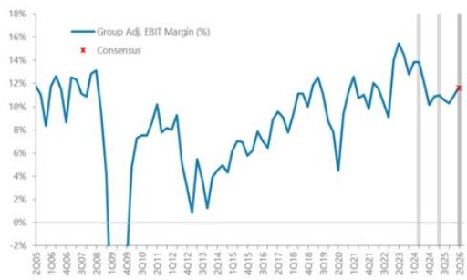

# Volvo 2Q26: 业绩符合预期，欧洲市场展望上调

## 对业绩的反应

观点不变

## 对研究框架的影响

来源：公司数据，MS — 符合预期
财务业绩与市场共识对比

## 核心要点

沃尔沃集团第二季度调整后EBIT为148亿瑞典克朗（较市场共识高2%，同比增长10%），利润率11.7%（同比提升70个基点），营收1263亿瑞典克朗（较市场共识高1%）。业绩超预期主要来自卡车业务（调整后EBIT较市场共识高7%，利润率11.2%）。

沃尔沃描述欧洲卡车需求仍以替换需求为主，货运活动良好，车辆更新需求存在，制造业PMI提供支撑。北美货运费率与运量有所增长，但尚未推动零售销售提升。沃尔沃预计订单增长将推动下半年生产、交付和零售销售。工程机械业务业绩符合预期，而Penta业务低于预期23%。沃尔沃已提交IEEPA关税退款申请，将在第三季度确认，完全抵消第三季度11亿瑞典克朗的关税成本。自由现金流58亿瑞典克朗，略低于市场共识的63亿瑞典克朗。

**欧洲卡车市场展望上调。** 卡车订单表现强劲，集团层面增长33%，北美增长122%，领先市场共识18%。管理层将中国市场需求预测上调12万辆至88万辆，欧洲上调5000辆至31.5万辆，北美维持26.5万辆不变。支持性的PMI数据正逐步改善货运量，可能继续支撑近期的订单增长势头。

## 关键数据

| 项目 | 数值 |
|------|------|
| 股票评级 | 中性 |
| 行业观点 | 符合预期 |
| 目标价 | 342.00瑞典克朗 |
| 收盘价（2026年7月16日） | 341.30瑞典克朗 |
| 52周区间 | 354.00-244.90瑞典克朗 |
| 市值 | 694,017百万瑞典克朗 |

## 图表数据

**图表1：沃尔沃2Q26业绩摘要**

| 百万瑞典克朗 | 2Q26实际 | MS预测 | 2Q25实际 | 与实际对比 | 与共识对比 | 同比 |
|-------------|---------|-------|---------|-----------|-----------|-----|
| 集团营收 | 126,273 | 127,348 | 122,894 | -1% | 1% | 3% |
| 调整后EBIT | 14,783 | 14,471 | 13,483 | 2% | 2% | 10% |
| 调整后EBIT利润率 | 11.7% | 11.4% | 11.0% | 34bps | 12bps | 74bps |
| 稀释每股收益 | 5.10 | 5.92 | 3.64 | -14% | 7% | 40% |
| 工业自由现金流 | 5,837 | 7,803 | 2,949 | 25% | -8% | 98% |

**图表4：集团调整后EBIT利润率**

## 估值方法与风险

**估值方法：** 采用市盈率法进行估值。沃尔沃是覆盖范围内质量最高的OEM，应享有相对于欧洲卡车同行的溢价。我们给予13.5倍市盈率，基于FY27e每股收益，略高于其长期四分位区间上沿（约10-13倍），预期沃尔沃将从需求情绪改善中受益。

**上行风险：**
- 即将实施的排放法规支撑卡车利润率
- 强劲现金流可能支持进一步股东回报
- 利率下降时工程机械利润率维持高位

**下行风险：**
- 经济增长变化
- 建筑市场表现
- 环保法规相关影响

---

*本报告由MS编制，仅供参考，仅为个人阅读分享。读者应独立评估并咨询专业顾问。*
