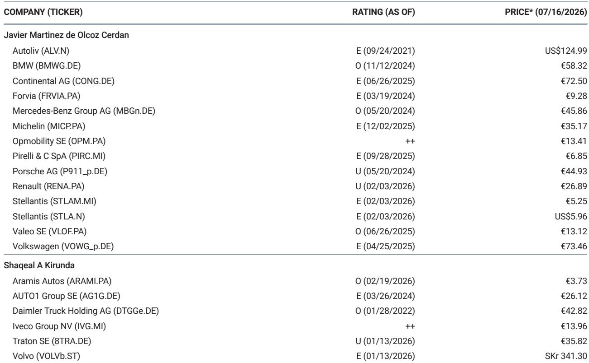
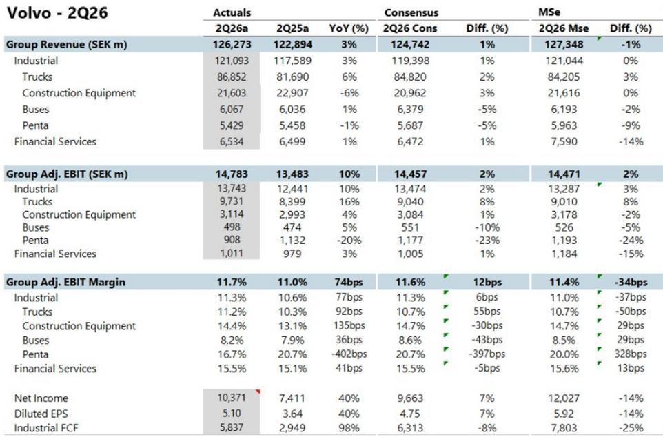
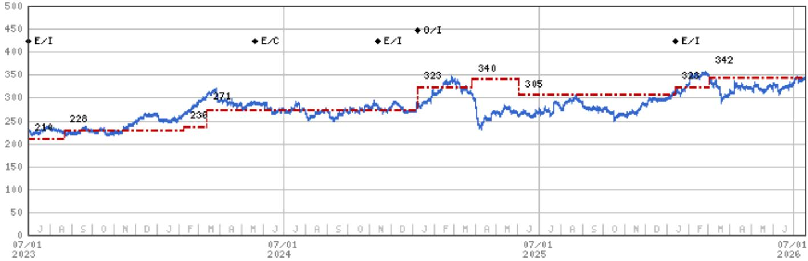

# Volvo’s 2Q26 Results Confirm the Truck Cycle Is Turning, But the Debate Has Shifted from Direction to Magnitude

Volvo delivered second-quarter 2026 adjusted EBIT of SEK 14.8 billion, beating consensus by 2% and rising 10% year-over-year, on revenue of SEK 126.3 billion that also edged past expectations. The group margin of 11.7% expanded 74 basis points from the prior year. These are solid numbers by any standard. But the real story lies beneath the headline beat—in the order book, the geographic divergence, and the subtle shift in how management is framing demand.

The most consequential data point from this quarter is not the earnings beat itself, but the order performance. Group truck orders surged 33% year-over-year, with North America exploding 122% higher. This is not a statistical fluke or easy comps; it reflects a genuine inflection in customer purchasing behavior. Management responded by raising the European market forecast by 5,000 units to 315,000 and the China forecast by 120,000 to 880,000, while holding North America steady at 265,000. The pattern is instructive: orders are running ahead of expectations, yet the official outlook remains cautious.

This tension between surging orders and measured guidance defines the current moment for Volvo and the broader truck sector. The cycle is clearly turning, but the magnitude of the upswing remains contested. Observers who have already priced in a recovery now face a more nuanced question: how much stronger can this cycle become, and which segments will capture the marginal gains?

## The North American Order Surge Signals a Supply-Driven Market That Has Not Yet Converted to Retail Demand

The 122% year-over-year increase in North American truck orders demands careful interpretation. Volvo describes the North American market as one where freight rates and volumes have increased but have not yet driven a retail sales increase. The company explicitly states that it expects the increased orders to translate into production, deliveries, and retail sales only in the second half of 2026. This lag is critical.

What appears to be happening is a pre-build phenomenon tied to upcoming emissions regulations, combined with fleet operators locking in capacity ahead of potential supply constraints. The order surge reflects anticipation of future demand rather than current end-market strength. This is not a negative signal—it is a timing signal. The orders are real, and they will convert to revenue, but the conversion timeline is back-end loaded. For those following the company, the implication is that second-half 2026 results will carry disproportionate weight in validating whether the order book was predictive or speculative.

The report notes that supportive Purchasing Managers' Indices are starting to gradually improve freight volumes. This is the foundational variable. If PMIs continue to strengthen, the current supply-driven order cycle can evolve into a demand-driven one. If PMIs stall, the order book may represent a one-time pull-forward rather than the beginning of a sustained upcycle. The debate, as the source material frames it, is whether truck markets can become meaningfully stronger with freight markets still mostly supply-driven rather than demand-driven.

## European Demand Remains Replacement-Driven, Providing a Stable Floor but Not a Catalyst for Acceleration

Volvo describes European truck demand as still being replacement-driven, supported by good freight activity, vehicle replacements, and supportive manufacturing PMIs. This characterization is important because it defines the European market as structurally sound but not cyclically accelerating. Replacement demand provides a floor; it does not generate upside surprise.

The European market forecast upgrade from the prior level to 315,000 units is modest—only a 5,000-unit increase. This caution stands in stark contrast to the 120,000-unit upgrade for China. The message is clear: Europe is stable and predictable, while China is volatile but potentially rewarding. For Volvo, Europe remains the earnings anchor; China is the swing factor.

The replacement-driven nature of European demand also has implications for margin quality. Replacement cycles tend to be less price-sensitive than expansion-driven cycles, as fleet operators must replace aging equipment regardless of the economic outlook. This supports pricing discipline and margin retention. Volvo's European truck operations are likely to maintain or improve margins even without a volume acceleration, simply because the demand profile is inelastic.

## China’s Massive Market Upgrade Creates Asymmetric Upside That Is Not Yet Reflected in Consensus Estimates

The 120,000-unit upgrade to the China market forecast, bringing it to 880,000 units, is the most aggressive revision in the report. China has been a source of uncertainty for global truck manufacturers, with volatile demand and intense local competition. Volvo's decision to raise the forecast so significantly suggests either visibility into government stimulus measures, infrastructure spending commitments, or a genuine recovery in domestic freight activity.

The source material does not provide granular detail on the drivers of the China upgrade, which itself is a signal. When management raises a forecast by this magnitude without extensive explanation, it typically means the data is recent and the conviction is high. Observers should treat this as a proprietary signal from a management team that has historically been conservative in its China outlook.

For Volvo, China represents both opportunity and risk. If the 880,000-unit forecast proves accurate, it will drive meaningful volume growth for Volvo's Chinese joint ventures and potentially for its global supply chain. If the forecast proves optimistic, the downside is contained because the base case was already lower. This asymmetry—upside potential with limited downside relative to prior expectations—makes China the most interesting variable in the Volvo story for the next 12 months.

## The Tariff Refund Mechanism Provides a One-Quarter Earnings Shield, But the Structural Cost Impact Remains Unresolved

Volvo has filed for an IEEPA tariff refund, which will be recognized in the third quarter of 2026 and is expected to fully offset the SEK 1.1 billion tariff cost for that period. This is a tactical positive—it eliminates a known headwind for one quarter—but it does not resolve the structural question of how tariffs will affect Volvo's cost base over the cycle.

The report notes that the refund will be recognized in Q3 and fully offset the Q3 tariff cost. This implies that without the refund, Q3 would have faced a SEK 1.1 billion headwind relative to expectations. The refund neutralizes that impact, but it is a one-time event. Future quarters may not benefit from similar offsets, and the tariff environment remains subject to political and regulatory uncertainty.

For those following the company, the key takeaway is that Volvo's management is actively managing tariff exposure through legal and procedural channels, but the underlying cost pressure has not disappeared. The refund provides a bridge, not a solution. Companies with diversified geographic production footprints are better positioned to absorb tariff shocks, and Volvo's global manufacturing base is a structural advantage in this regard. However, the tariff issue will remain a recurring topic in earnings calls and a source of potential variance versus consensus until a permanent resolution emerges.

## A Decision Framework for Observers: Three Variables That Will Determine Whether the Cycle Exceeds or Disappoints Expectations

The current environment demands a structured approach to position sizing and risk assessment. Based on the evidence from Volvo's 2Q26 results, three variables will determine whether the truck cycle delivers upside or disappointment relative to current valuations.

The first variable is the conversion rate of North American orders to retail sales in the second half of 2026. The 122% order surge is impressive, but it is a leading indicator, not a confirmation. Observers should track monthly retail sales data in North America as the primary validation metric. If retail sales accelerate in line with orders, the cycle has legs. If retail sales lag, the order book may represent inventory building rather than genuine end-market demand.

The second variable is the trajectory of European PMIs and freight volumes. Europe is the earnings foundation for Volvo, and replacement demand provides stability. But stability is not growth. For the cycle to exceed expectations, European demand must transition from replacement-driven to expansion-driven. This requires sustained improvement in manufacturing PMIs and freight rates. The current data is supportive but not conclusive.

The third variable is the realization of the China market forecast. The 880,000-unit forecast represents a significant step-up from prior expectations, and it is the most swing-sensitive assumption in the Volvo model. Observers should monitor Chinese industrial production data, infrastructure spending announcements, and freight volume statistics as leading indicators. If China delivers, it will be the single largest source of upside surprise for Volvo's earnings.

Valuation is the final consideration. Volvo trades at approximately 17x 2026 estimated earnings and 13x 2027 estimates, according to the source material's comparative table. This is above the upper end of its long-term interquartile range of roughly 10-13x, which suggests that the market has already priced in a recovery. The question is not whether the cycle will turn—it has. The question is whether the cycle will be strong enough to justify current multiples. That answer will be determined by the three variables above, and it will become clearer in the second half of 2026.

*For informational purposes only. Portions may be generated, translated, summarized, or edited with AI assistance based on source materials and may contain omissions or errors. Please verify independently. This is not professional advice.*

For informational purposes only. Portions may be generated, translated, summarized, or edited with AI assistance based on source materials and may contain omissions or errors. Please verify independently. This is not professional advice.

