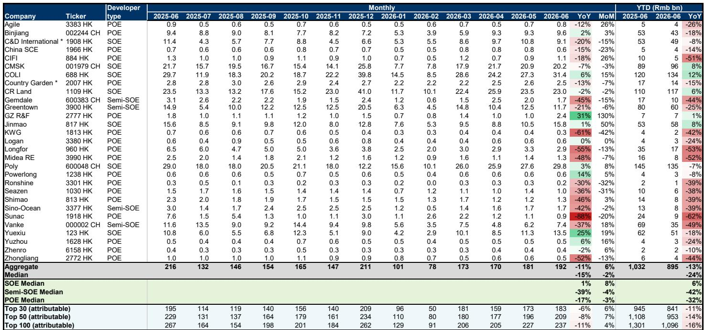
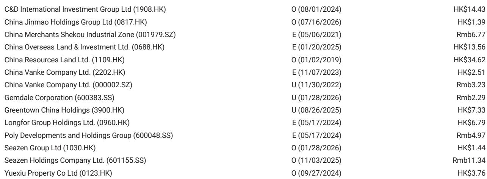
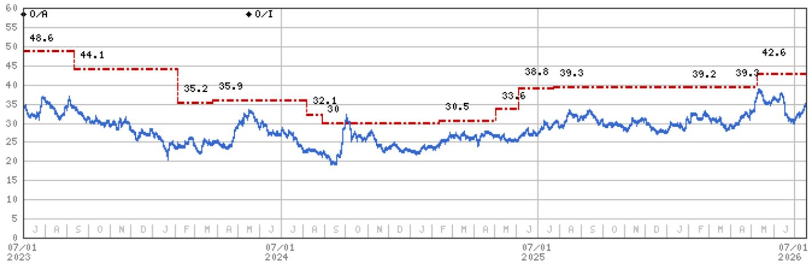

# MS：MS月度追踪，6月数据出现变化，三季度更弱

6月新房销售数据进一步走弱。MS最新月度追踪报告显示，CREIS 65城新房登记销售面积同比下滑7%，较5月的+1%明显出现变化。更值得关注的信号来自二手房市场：33城二手房登记销售增速从5月的+14%收窄至+6%，而实时高频数据显示，25城二手房成交增速已进一步节奏变化至+8%。报告判断，二手房销售的持续减速将在三季度加速房价节奏变化，尤其在库存持续攀升的二线及以下城市。

这份报告的核心判断并不复杂：市场正在经历从“量缩”到“价跌”的传导。5月新房价格环比跌幅已从-0.2%扩大至-0.3%，二手房价格环比跌幅也从-0.3%扩大至-0.4%。但真正让分析师关注的，是二手房挂牌量的结构性变化。

## 1. 挂牌量创新高的城市占比仍在扩大，供给不确定性未见顶

报告追踪的约50个样本城市中，6月总挂牌量环比上升0.2%，看似温和，但结构信号更值得拆解。环比上升的城市占比从5月的59%升至65%，而相较2025年末水平，45%的城市总挂牌量仍在增加，其中35%的城市达到历史新高。虽然5月这两个比例分别为51%和31%，但6月数据说明，挂牌量见顶的拐点尚未到来。

> **KC评论：** 挂牌量创新高的城市占比从31%升至35%，虽然幅度不大，但方向是向上的。这意味着供给端不确定性仍在积累，而非缓解。报告特别指出，新挂牌量仍在下降（环比-3%，同比-13%），说明当前挂牌量上升主要来自存量房源的积压，而非新增抛售。

## 2. 新房库存分化：一线城市在去化，低线城市在堆积

70城新房库存月数从5月的31.6个月微升至31.8个月。但城市层级间的分化非常明显：一线城市库存月数从22.1个月降至21.8个月，二线从30.2个月升至30.4个月，三线从42.1个月升至42.7个月。一线城市在温和去库存，而低线城市的库存不确定性在持续累积。

这种分化意味着，房价调整的不确定性并非均匀分布。一线城市由于需求韧性相对较强，价格节奏变化空间有限；而低线城市在库存高企和需求调整的双重影响下，可能面临更明显的价格调整。

## 3. 土地市场持续仍在调整，开发商新推盘能力受限

6月300城土地成交面积同比下降23%，成交金额下降15%。虽然降幅较5月的-31%和-13%略有收窄，但相对值仍处于低位。更值得关注的是，百强开发商新增可售资源同比下降14%，上半年累计同比降幅达37%。这意味着开发商在2026年下半年的新推盘能力将受到明显制约。

土地市场的持续仍在调整，从供给端进一步压缩了市场修复的空间。开发商不仅面临销售端的不确定性，在补库存环节也缺乏意愿和能力。

## 4. 三季度销售可能进一步走弱，选股逻辑转向“自下而上的Alpha”

报告明确提示，考虑到三季度可能更弱的销售、上半年仍在调整的业绩、有限的政策空间以及持续的现金流扰动，选股策略应聚焦于具备可信自下而上Alpha的优质公司。报告认为华润置地、建发国际和新城控股在当前估值下提供了更好的不确定性回报比。

这意味着，在总量数据持续走弱的背景下，市场关注点正在从“行业何时见底”转向“哪些公司能在节奏变化周期中跑出独立行情”。政策端短期内难以提供明显催化，公司自身的资产质量、现金流管理和项目布局成为区分关键。

---

这份报告的核心价值不在于给出了一个悲观的判断，而在于用数据拆解了“量缩”如何一步步传导至“价跌”的机制。二手房挂牌量的结构性上升、低线城市库存的持续堆积、土地市场的仍在调整，三者叠加，构成了三季度房价节奏变化不确定性的主要来源。对于关注这个市场的读者而言，与其等待总量拐点，不如先理解结构分化的具体位置。

For informational purposes only. Portions may be generated,translated,summarized,or edited with AI assistance based on source materials and may contain omissions or errors. Please verify independently. This is not investment,legal,tax,accounting,or other professional advice.

For informational purposes only. Portions may be generated,translated,summarized,or edited with AI assistance based on source materials and may contain omissions or errors. Please verify independently. This is not investment,legal,tax,accounting,or other professional advice.

