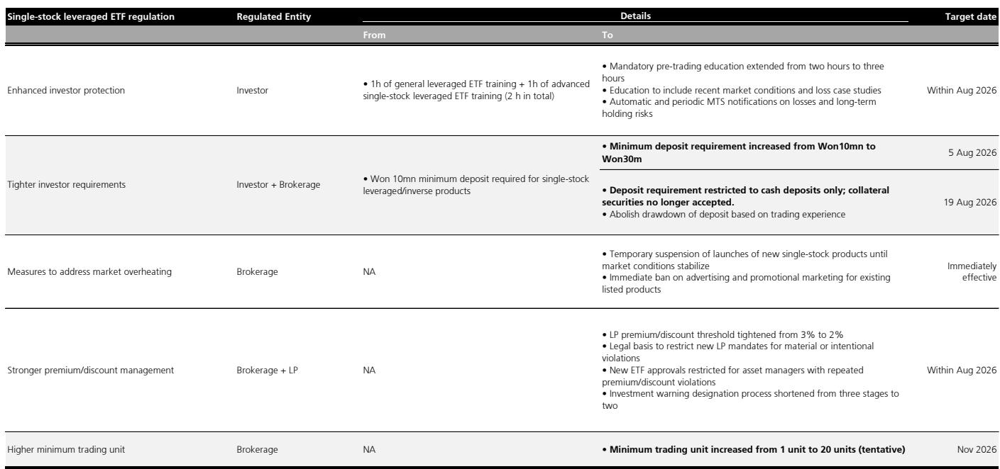
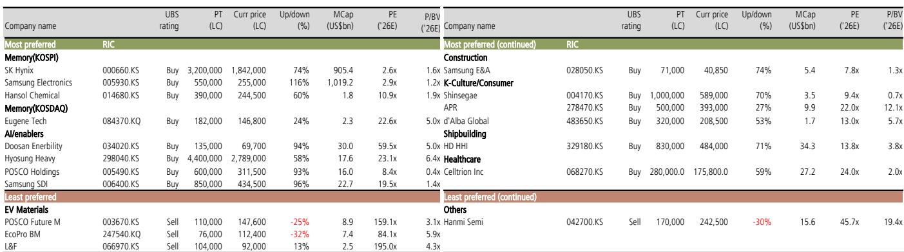
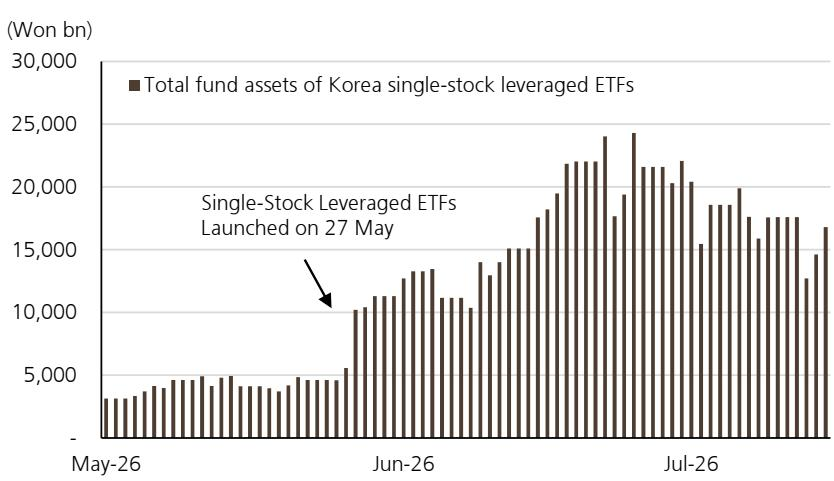

# 韩国单股杠杆ETF监管新规：市场自我调整与政策干预的叠加效应

韩国政府近期针对单股杠杆ETF出台了一系列新规，将交易最低现金保证金从实际300万韩元提高至3000万韩元，取消替代抵押品，暂停新产品发行，并禁止现有产品的营销推广。这些措施针对的是一个在7月至今已占KOSPI总成交额25%的市场板块，杠杆ETF的管理资产规模已从6月25日24万亿韩元的峰值降至报告日期的17万亿韩元。时间点并非巧合：市场价格变动已在推动这些产品下行，而监管干预将加速已经开始的去杠杆进程。

对于观察者而言，关键洞察在于新规不仅针对投机过热——它们从根本上改变了杠杆与韩国两大权重股之间的互动机制。三星电子和SK海力士合计占KOSPI市值的56%，单股杠杆ETF的成交额已达到SK海力士自身成交额的54%和三星电子的24%。在2倍杠杆放大每一笔资金流动的情况下，ETF赎回与标的股票下跌之间的反馈循环已成为系统性风险。政府的行动，加上杠杆产品在波动市场中固有的自然衰减，创造了一种结构性阻力，即使在初始冲击消退后仍将持续存在。

## 新规直击零售投机的较强源头，而非仅针对其表象

金融委员会公布的监管方案针对单股杠杆ETF成为不稳定因素的五个不同渠道。最具影响力的变化是最低保证金从实际300万韩元提高至3000万韩元现金，自8月5日起生效。这一10倍的增长并非渐进式——而是结构性的。报告计算，3000万韩元相当于第三收入五分位家庭总资产的7%和金融资产的27%。对于此前使用这些产品的韩国普通零售读者而言，这一要求实际上将他们排除在市场之外。

自8月19日起取消高达70%保证金可用替代抵押品的规定，堵住了允许读者质押其他证券而非缴纳现金的漏洞。结合投资期间禁止提取保证金的规定，新规确保只有具备真实流动性和风险承受能力的读者才能参与。暂停新产品发行和立即禁止营销推广，切断了此前推动产品扩张的供给端引擎。即使是最低交易单位从1股增加到20股这一看似微小的调整（经济上约190美元），也表明监管机构正在消除所有便利参与的途径。

强化读者教育要求——从两小时延长至三小时，包括近期市场状况和亏损案例研究——单独来看影响最小，但这些变化共同创造了一个监管环境，使得杠杆ETF交易的门槛和维护成本对于推动产品增长的零售群体而言已变得过高。报告关于教育和交易单位变化影响有限的判断是正确的，但这仅仅是因为保证金和抵押品的变化已经完成了主要工作。

## 市场力量在监管行动前已在去杠杆，管理资产规模下降说明一切

监管干预并非凭空发生。在韩国和海外上市的单股杠杆ETF管理资产规模已从6月25日的24万亿韩元降至报告日期的17万亿韩元——不到三周内下降近30%。所有类别的杠杆ETF总管理资产规模已从6月22日的48万亿韩元降至33万亿韩元，下降31%。这些并非温和的回撤；它们代表了一场已经在进行的强制去杠杆事件。

这一下降背后的机制是杠杆产品在波动市场中固有的负复利效应。自5月27日推出以来持有SK海力士杠杆ETF的读者将遭受32.3%的损失，而标的股票下跌7.2%。自6月25日股价峰值持有至今的读者将损失55.0%，而SK海力士本身下跌28.6%。对于三星电子杠杆ETF，可比数据是自推出以来损失30.4%对比标的下跌9.0%，自峰值以来损失43.8%对比标的下跌22.0%。杠杆产品在下跌方向上放大了约2倍的损失，但每日重置杠杆的路径依赖性意味着，在波动且下行趋势的市场中，衰减超过了简单的杠杆倍数。

零售读者对这些产品的净买入虽然仍然活跃，但正在下降。报告数据显示，随着读者体验到损失的程度，买入压力正在缓慢减弱。这创造了一个自我强化的循环：随着价格下跌，杠杆ETF持有者面临更大损失，触发赎回，迫使ETF卖出标的股票，进而推动价格走低。监管干预为这一内生过程增加了外生冲击，加速了平仓过程。

## 电池板块先例表明，杠杆ETF动态即使在初始调整后也可能将波动延长6-9个月

韩国市场此前经历过这种模式。2023年7月电池股的强劲上涨被杠杆电池ETF的推出所掩盖，这些ETF放大了初始上涨，但随后也放大了随后的下跌。报告指出，此后的负面股价变动逐渐消耗了这些ETF，但新ETF的发行使高波动持续了约6-9个月。电池板块案例具有指导意义，因为它表明杠杆ETF动态不会迅速解决——它们会创造一个波动性持续升高的时期，因为产品被推出、吸引资金、经历衰减，并最终清算。

当前情况在两个关键方面有所不同，使其更具挑战性。首先，电池股在2023年6月仅占KOSPI市值的16%，而三星电子和SK海力士在2026年6月合计占56%。集中度风险高出近3.5倍。其次，单股杠杆ETF的成交额相当于SK海力士自身成交额的54%和三星电子的24%。在2倍杠杆下，ETF相关资金流动对标的资产的影响比例大于电池板块事件中的任何情况。报告关于影响可能更大的判断是保守的——集中度和资金流动强度的结合创造了一种电池板块从未接近的脆弱性。

因此，暂停新产品发行的监管措施在战略上是及时的。通过在当前回调期间阻止新的杠杆ETF创建，监管机构消除了延长电池板块波动的机制。没有新产品吸引新的资金流入，现有的杠杆ETF将继续衰减和清算而不会被补充。这是当前事件与电池板块先例之间的关键区别：新杠杆的供给已被切断。

## 杠铃策略：应对波动持续但基本面支撑KOSPI 9200点的市场

报告对KOSPI的12个月目标为9200点，下行情景5500点，上行情景10500点。这一宽幅区间反映了杠杆ETF平仓带来的真实不确定性，但指数的基本面支撑来自2026年预计每股收益增长265%和2027年增长66%。估值并不苛刻：KOSPI的交易水平已折现了显著的盈利风险，报告分析显示，剔除三星电子和SK海力士后的KOSPI市盈率处于历史低位。

转向杠铃策略的决定——增加Shinsegae、Celltrion和Samsung E&A，同时从优选名单中移除HDEC、KAI、KSOE和Coupang——反映了一种组合构建方式，平衡了对核心存储主题的敞口与防御性和非相关头寸。Shinsegae以9.4倍2026年市盈率和0.7倍市净率提供对韩国消费支出的敞口，即使杠杆ETF平仓导致市场进一步走弱，这一估值也提供了下行保护。Celltrion以24倍2026年市盈率和2.0倍市净率提供与半导体周期无关的医疗保健敞口。Samsung E&A以7.8倍2026年市盈率和1.3倍市净率提供受益于不同宏观驱动因素的建筑和工程敞口。

移除的股票同样具有指导意义。HDEC、KAI、KSOE和Coupang被减持并非因为基本面恶化，而是因为杠杆ETF平仓造成的波动环境要求采取更具防御性的姿态。杠铃策略承认，由于ETF的机械去杠杆以及围绕AI需求和三星电子、SK海力士盈利前景的持续不确定性，近期波动将保持高位。

## 决策框架：如何布局韩国杠杆ETF问题的三阶段平仓过程

观察者应将当前情况视为一个三阶段过程，每个阶段对组合构建都有不同的含义。

第一阶段是直接的监管冲击，目前正在进行中。最低保证金提高和抵押品取消将机械地减少零售参与，而营销禁令和产品发行暂停将切断新的资金流入。在这一阶段，主要风险是现有杠杆ETF头寸的强制清算，这将给三星电子和SK海力士带来不成比例的卖出压力。报告数据显示，单股杠杆ETF成交额是SK海力士成交额的54%和三星电子成交额的24%，这意味着即使是适度的ETF赎回也能显著影响这些股票。观察者应预期KOSPI两大成分股波动加剧和潜在的价格错位。

第二阶段是衰减和整合期，将持续3-6个月。随着杠杆ETF管理资产规模从当前的17万亿韩元继续下降至新的均衡水平，负复利效应将继续侵蚀剩余头寸。报告与电池板块事件的比较表明，波动可能保持高位6-9个月，但暂停新产品发行应缩短这一期限，相对于2023年的先例。在这一阶段，杠杆ETF管理资产规模与KOSPI波动率之间的相关性将保持高位，如报告图15所示。观察者应监测管理资产规模轨迹，作为波动何时消退的领先指标。

第三阶段是基本面复苏，结合不苛刻的估值，一旦杠杆ETF平仓过程结束，将提供有吸引力的入场点。杠铃策略使观察者能够捕捉这一复苏，同时在第一和第二阶段减轻下行风险。

这一框架的关键风险在于杠杆ETF平仓比预期更深或更持久。报告承认，AI需求担忧以及三星电子和SK海力士的盈利前景可能使波动保持高位，这反过来将通过加速衰减帮助降低杠杆ETF的管理资产规模。这是当前市场的核心张力：对杠杆ETF持有者不利的事情对市场的长期健康有利，但过渡期将是痛苦的。

*仅供参考。部分内容可能基于源材料通过AI辅助生成、翻译、总结或编辑，可能存在遗漏或错误。请独立核实。本文不构成专业建议。*

仅供参考。部分内容可能基于源材料通过AI辅助生成、翻译、总结或编辑，可能存在遗漏或错误。请独立核实。本文不构成专业建议。

