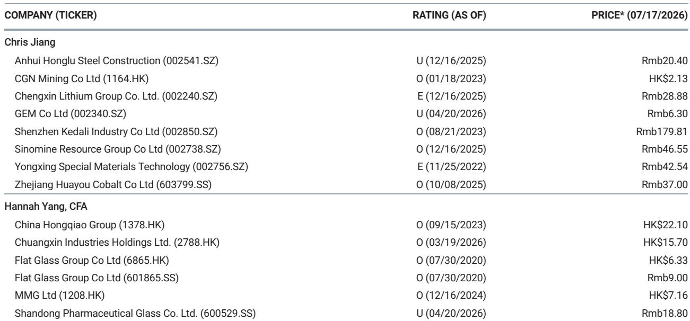

# 储能需求占比提升，锂电池行业结构观察

7月锂电池排产创下历史新高，储能贡献了超过四成的需求。这个数字值得关注。

MS最新一期中国材料周报披露，7月锂电池规划产量达到历史峰值。更关键的是结构：储能电池在总需求中的占比首次突破40%。过去几年，市场习惯把锂电池需求等同于电动车，但这份周报的数据提示，储能正在从“第二曲线”变成“主引擎之一”。

同期，电池级碳酸锂和氢氧化锂价格继续调整，周跌幅分别达到4.7%和5.1%。产量新高与价格新低同时出现，说明产能释放的速度仍然快于需求消化。但储能占比的跃升，为这个供需调整中的行业提供了一个新的观察锚点。

## 1. 储能占比突破四成，改变了锂电池需求的“季节性”

过去锂电池排产的高峰往往与电动车年末冲量同步，呈现明显的Q4峰值。但7月通常是传统淡季——电动车销量尚未进入冲刺期，年中促销也已结束。7月排产创纪录，且储能占比超过40%，意味着储能正在填平电动车需求的季节性低谷。

报告没有给出储能需求的具体拆分，但结合中国近期密集出台的电力市场改革文件——包括“基准价+浮动价”的长协合同机制——可以推断，政策推动下的电网侧储能和工商业储能正在加速落地。储能不再是“备选项”，而是锂电池产能消化的刚性支撑。

> **KC评论：** 储能占比突破40%这个数字，比排产总量本身更重要。它意味着锂电池需求的结构正在从“单一依赖电动车”转向“双轮驱动”。如果这一趋势延续，未来锂电池企业的竞争逻辑将从“谁能绑定更多车企”转向“谁能同时服务好电力系统和汽车客户”。

## 2. 价格继续调整，但库存信号分化值得关注

锂盐价格仍在调整。工业级和电池级氢氧化锂周跌幅分别为5.6%和5.1%，碳酸锂跌幅接近5%。这已经是连续多周的调整。

但报告中的其他品种提供了对照：铜库存周降34.9%，铝库存降1.1%，而铜铝价格基本持平。这说明基本金属的供需正在趋于平衡，甚至偏紧。锂盐的持续调整，更多反映的是自身产能周期的错位——过去两年大量资本开支形成的供给，仍在消化过程中。

价格调整本身不是新闻，但结合储能需求的结构性上升，可以得出一个判断：锂盐价格底部可能比市场预期的更近。储能对价格敏感度低于电动车——电力系统的采购决策更看重长期供应稳定性和全生命周期成本，而非短期报价波动。这意味着一旦储能需求持续放量，锂盐价格的调整斜率可能发生变化。

## 3. 印尼镍配额收紧，电池材料供应链再添变量

报告提到，印尼拒绝了全面增加国家镍产量配额的请求。这是电池材料供应链中一个容易被忽视的信号。

印尼是全球镍矿供应的核心变量，其产量政策直接影响三元电池正极材料的成本。配额收紧意味着镍的供给增量受限，可能推高中镍和高镍三元材料的价格。对于锂电池行业而言，这意味着两条技术路线——磷酸铁锂和三元——的成本差距可能进一步拉大。

储能电池目前以磷酸铁锂为主，对镍价不敏感。但如果三元材料因镍供给收紧而涨价，电动车企可能加速向磷酸铁锂切换，反过来进一步强化储能与电动车共享同一套供应链的格局。报告没有展开这一推论，但印尼的配额信号值得持续跟踪。

## 4. 一个可复用的观察框架：从“价格-库存-政策”三角判断拐点

这份周报的价值不在于单一数据点，而在于它提供了一个判断材料行业拐点的框架：价格反映短期供需，库存反映中期平衡，政策反映长期方向。

当前锂盐价格调整、库存未见明显去化，但储能政策（长协机制、电力市场改革）和下游排产（7月创纪录）已经出现积极信号。铜铝库存快速下降，价格企稳，说明基本金属可能率先进入修复阶段。钢铁和水泥价格窄幅波动，库存变化不大，反映建筑相关需求仍在磨底。

对于关注材料行业的读者，可以按这个框架定期检查：当价格、库存、政策三个维度中有两个同时转向时，行业拐点的可信度会显著提升。目前锂盐只有政策端和需求端在转向，价格和库存尚未配合，因此仍处于“观察期”而非“确认期”。

---

For informational purposes only. Portions may be generated,translated,summarized,or edited with AI assistance based on source materials and may contain omissions or errors. Please verify independently. This is not investment,legal,tax,accounting,or other professional advice.

For informational purposes only. Portions may be generated,translated,summarized,or edited with AI assistance based on source materials and may contain omissions or errors. Please verify independently. This is not investment,legal,tax,accounting,or other professional advice.

