# 研究覆盖启动

# Momenta

# 引领主流车企进入自动驾驶时代；给予积极评级

## 启动覆盖，给予积极评级；目标价HK$360

我们启动对Momenta的研究覆盖，该公司是中国最大的自动驾驶软件提供商（以OEM覆盖范围衡量），给予积极评级。我们认为其技术和规模使其成为国内外领先车企的自然合作伙伴，有助于加速它们进入自动驾驶时代。尽管存在竞争、盈利能力和监管方面的因素，但其轻资产商业模式以及强劲的收入增长，为公司提供了产生高利润率的运营杠杆，从而支撑较高的市销率。

## 全球高质量OEM的领先解决方案提供商

Momenta与24家国内外车企合作，凭借多元化的客户基础以及广泛的安装和量产应用经验，在市场中处于领先地位。我们交流过的车企对Momenta的技术能力和成本效益给予了积极反馈。在技术快速升级和成本降低的推动下，L2+高级驾驶辅助系统已加速渗透到各价格区间的车型中，并日益被视为竞争车型的必备功能。我们认为Momenta处于最有利的位置，能够受益于L2+ ADAS的发展趋势，并预计其年装机量将从2025年的5.1万台增长至2028年的250万台，同期在中国年汽车销量中的市场份额从不到2%提升至10%。在OEM覆盖范围扩大、车辆安装量增加以及Robotaxi和Robovan运营的支持下，我们预测Momenta在2025-2030年期间将实现约50%的收入复合年增长率，并在2028年实现盈亏平衡。

## 竞争、利润率与监管因素

Momenta在中国L2+市场拥有多个竞争对手，包括华为（为其合作OEM提供品牌支持）、地平线（为OEM提供硬件及软件解决方案），以及卓驭大疆和元戎启行。除竞争外，我们也看到利润率方面的因素，因为在下游竞争激烈的情况下，OEM可能对软件供应商施加定价压力。内存价格上涨也可能抑制近期高级别NOA的采用。我们认为，在地缘政治和数据安全担忧的背景下，监管也可能对其海外扩张构成风险，而受到严格监管的Robotaxi业务也面临类似情况。

## 估值：

根据UBS估算，该股票目前交易于FY27E市销率的10倍，而地平线为5倍，特斯拉为12倍。虽然80-90亿美元的市值与地平线、Mobileye和Wayve相近，但我们认为Momenta的快速收入增长和高毛利率杠杆是其亮点。我们的目标价HK$360.00基于FY28E市销率的8倍，隐含25%的上行空间。

## 股票

<table><tr><td>中国</td></tr><tr><td>软件</td></tr></table>

12个月评级 积极

12个月目标价 HK$360.00

价格（2026年7月16日） HK$288.00

RIC: 6880.HK BBG: 6880 HK

<table><tr><td colspan="2">交易数据与关键指标</td></tr><tr><td>52周范围</td><td>HK$296.40-81.75</td></tr><tr><td>市值</td><td>HK$68.7b/US$8.76b</td></tr><tr><td>流通股</td><td>239m (ORD)</td></tr><tr><td>自由流通量</td><td>100%</td></tr><tr><td>日均成交量（'000）</td><td>854</td></tr><tr><td>日均成交额（m）</td><td>HK$187.8</td></tr><tr><td>普通股权益（12/26E）</td><td>Rmb17.8b</td></tr><tr><td>市净率（12/26E）</td><td>3.3x</td></tr><tr><td>净债务/EBITDA（12/26E）</td><td>17.2x</td></tr></table>

每股收益（UBS，摊薄）（Rmb）

<table><tr><td></td><td>此前</td><td>当前</td><td>变动%</td><td>一致预期</td></tr><tr><td>12/26E</td><td>-</td><td>(4.27)</td><td>-</td><td>-</td></tr><tr><td>12/27E</td><td>-</td><td>(1.65)</td><td>-</td><td>-</td></tr><tr><td>12/28E</td><td>-</td><td>3.75</td><td>-</td><td>-</td></tr></table>

Paul Gong
分析师
paul.gong@ubs.com
+852-2971 7868

Xinyu Fang, CFA
分析师
xinyu.fang@ubs.com
+852-2971 8007

Edwin Hui
副分析师
edwin.hui@ubs.com
+852-29-71 8849

<table><tr><td>主要财务数据（Rmbm）</td><td>12/23</td><td>12/24</td><td>12/25</td><td>12/26E</td><td>12/27E</td><td>12/28E</td><td>12/29E</td><td>12/30E</td></tr><tr><td>收入</td><td>743</td><td>1,325</td><td>2,413</td><td>4,040</td><td>6,011</td><td>10,770</td><td>13,750</td><td>17,760</td></tr><tr><td>息税前利润（UBS）</td><td>(2,557)</td><td>(3,196)</td><td>(3,427)</td><td>(588)</td><td>(395)</td><td>986</td><td>1,937</td><td>3,685</td></tr><tr><td>净利润（UBS）</td><td>(2,570)</td><td>(3,206)</td><td>(3,458)</td><td>(584)</td><td>(393)</td><td>975</td><td>1,918</td><td>3,652</td></tr><tr><td>每股收益（UBS，摊薄）（Rmb）</td><td>(73.51)</td><td>(91.68)</td><td>(98.71)</td><td>(4.27)</td><td>(1.65)</td><td>3.75</td><td>7.34</td><td>13.93</td></tr><tr><td>每股股息（净额）（Rmb）</td><td>0.00</td><td>0.00</td><td>0.00</td><td>0.00</td><td>0.00</td><td>0.00</td><td>0.00</td><td>0.00</td></tr><tr><td>净（债务）/现金</td><td>(14,175)</td><td>(16,190)</td><td>(27,777)</td><td>7,990</td><td>7,946</td><td>9,261</td><td>11,700</td><td>15,967</td></tr></table>

<table><tr><td>盈利能力/估值</td><td>12/23</td><td>12/24</td><td>12/25</td><td>12/26E</td><td>12/27E</td><td>12/28E</td><td>12/29E</td><td>12/30E</td></tr><tr><td>息税前利润率（UBS）%</td><td>(344.2)</td><td>(241.3)</td><td>(142.0)</td><td>(14.5)</td><td>(6.6)</td><td>9.2</td><td>14.1</td><td>20.8</td></tr><tr><td>投入资本回报率（息税前利润）%</td><td>-</td><td>(296.5)</td><td>(72.0)</td><td>(6.5)</td><td>(4.4)</td><td>10.8</td><td>21.4</td><td>41.4</td></tr><tr><td>企业价值/EBITDA（UBS核心）x</td><td>-</td><td>-</td><td>-</td><td>NM</td><td>NM</td><td>43.2</td><td>22.5</td><td>11.4</td></tr><tr><td>市盈率（UBS，摊薄）x</td><td>-</td><td>-</td><td>-</td><td>(58.7)</td><td>NM</td><td>66.4</td><td>33.9</td><td>17.9</td></tr><tr><td>股权自由现金流（UBS）回报表现%</td><td>-</td><td>-</td><td>-</td><td>(0.2)</td><td>0.0</td><td>2.3</td><td>4.2</td><td>7.2</td></tr><tr><td>股息回报表现（净额）%</td><td>-</td><td>-</td><td>-</td><td>0.0</td><td>0.0</td><td>0.0</td><td>0.0</td><td>0.0</td></tr></table>

来源：公司账目，LSEG Eikon，UBS估算。标记为（UBS）的指标已应用分析师的调整。估值：基于该年平均股价，（E）：基于2026年7月16日HK$288.00的股价

本报告由UBS Asia Limited编制。分析师认证和所需披露，包括关于UBS发布的定量研究审查的信息，从第20页开始。

## UBS论点图 我们的思考指南及本报告内容分布

## 问题：Momenta能否实现2025-2030年约50%的收入复合年增长率？

可能。在智能化升级的行业趋势中，我们预计Momenta将扩大OEM覆盖范围和正在开发的项目，并利用其领先的技术和城市NOA解决方案的成本效益，逐年增加搭载Momenta解决方案的车辆数量。除了量产车的收入外，我们预计Robotaxi和Robovan业务将逐步贡献收入，成为公司中期收入的关键驱动力。

问题：Momenta能否从国内和海外市场获得同等份额的收入？不确定。虽然Momenta的ADAS解决方案已被中国车企的海外车型采用，但软件解决方案的海外扩张在很大程度上仍受制于监管因素，尤其是地缘政治和数据安全担忧。如果全球自动驾驶生态系统在中国和西方之间出现分化，Momenta的潜在市场总量可能会受到长期限制。

我们启动对Momenta的研究覆盖，该公司是中国最大的自动驾驶软件提供商，给予积极评级。我们认为其技术和规模使其成为国内外领先车企的自然合作伙伴，有助于加速它们进入自动驾驶时代。尽管存在竞争、盈利能力和监管方面的因素，但其轻资产商业模式以及强劲的收入增长，为公司提供了产生高利润率的运营杠杆，从而支撑较高的市销率。

1) Momenta累计获得超过170个定点项目，其中超过68个已达到量产状态。该公司已与24家全球OEM建立合作关系，为全球前十大车企中的9家提供服务，累计装机量超过68万台。2) Momenta的ADAS解决方案已被领先的中国OEM用于其在德国、英国、泰国和阿联酋等海外市场的车型，并且该公司正在与全球高质量OEM合作，在欧洲、东南亚和其他新兴市场试点L3项目。3) Momenta已在苏州和上海获得Robotaxi商业运营许可，在无锡获得试点运营许可和测试批准，以及在阿布扎比获得测试批准。

根据UBS估算，该公司目前交易于FY27E市销率的10倍，而地平线为5倍，特斯拉为12倍。虽然80-90亿美元的市值与地平线、Mobileye和Wayve相近，但我们认为Momenta的快速收入增长和高毛利率杠杆是其亮点。

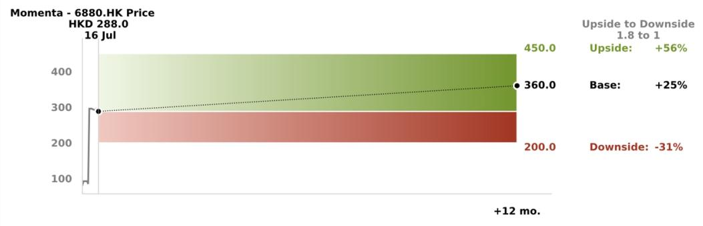

<table><tr><td>价值驱动因素（Rmb bn）</td><td>2026E收入</td><td>2027E收入</td><td>2028E收入</td><td>2028E净利润</td></tr><tr><td>HK$450.00 上行</td><td>5.0</td><td>7.5</td><td>13.0</td><td>1.5</td></tr><tr><td>HK$360.00 基准</td><td>4.0</td><td>6.0</td><td>10.8</td><td>1.0</td></tr><tr><td>HK$200.00 下行</td><td>2.0</td><td>4.0</td><td>8.0</td><td>0.3</td></tr></table>

来源：UBS估算

Momenta是中国领先的独立驾驶自动化解决方案提供商，为量产车提供L2城市NOA解决方案，并为Robotaxi服务提供解决方案。根据灼识咨询数据，截至2026年2月28日，Momenta在三个关键指标上在中国独立城市NOA解决方案提供商中排名第一：(i) 车辆过去12个月销量 (ii) 获得的定点项目数量 (iii) 采用其城市NOA解决方案的量产车型数量。

## 我们的论点图解

主要NOA解决方案提供商的OEM覆盖范围  
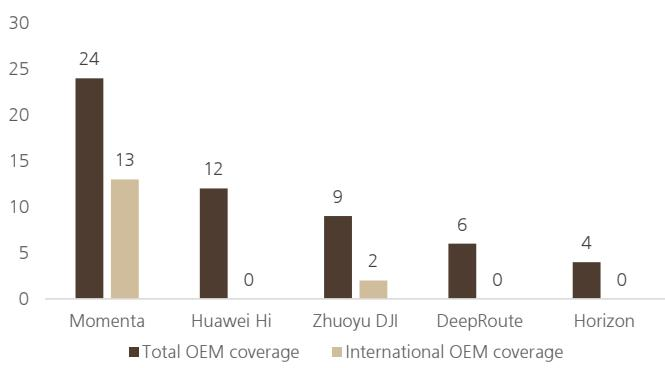

Momenta是中国最大的独立自动驾驶解决方案提供商，提供L2和L4解决方案。该公司在关键商业里程碑方面处于领先地位，包括城市NOA的定点项目和量产。

L2++及以上ADAS渗透率（%）  
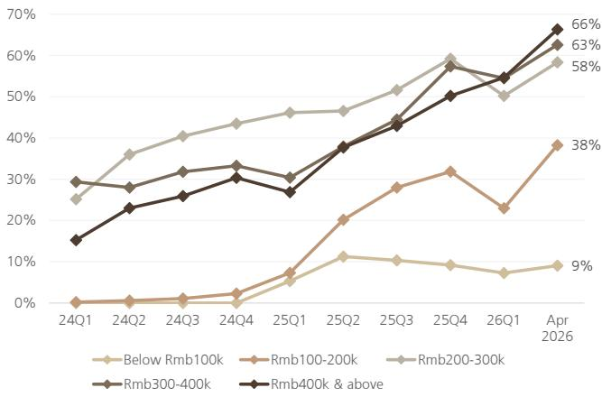

高级ADAS已日益成为消费者的标准要求。在不同价格区间内，城市ADAS功能的渗透率持续提升。

Momenta收入构成（Rmb m）  
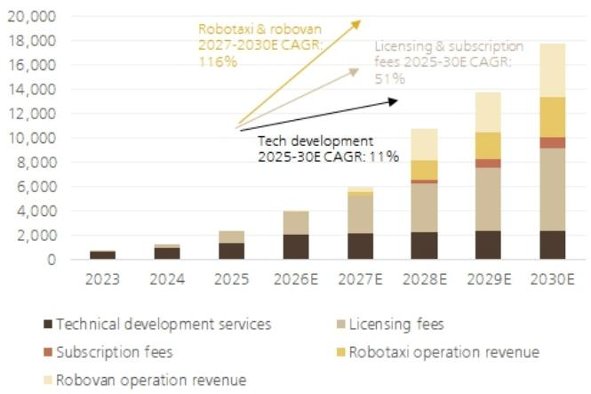

我们预测Momenta在2025-2030年期间将实现约50%的收入复合年增长率，支撑因素包括：1) 扩大OEM覆盖范围和逐年增加车辆安装量；2) Robotaxi和Robovan运营作为关键中期驱动力。

以上图表来源：公司数据，UBS，NE ADAS数据库。注：量产和定点项目数据截至2026年2月28日。L2++ ADAS及以上包括同时具备高速和城市NOA能力的解决方案

许可收入的年度装机量假设（台）  
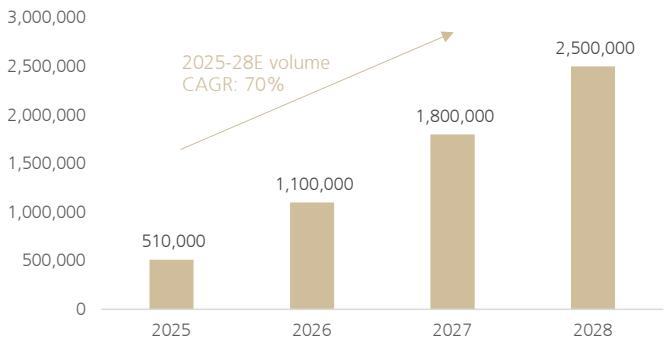

净利润与毛利率（Rmb b, %）  
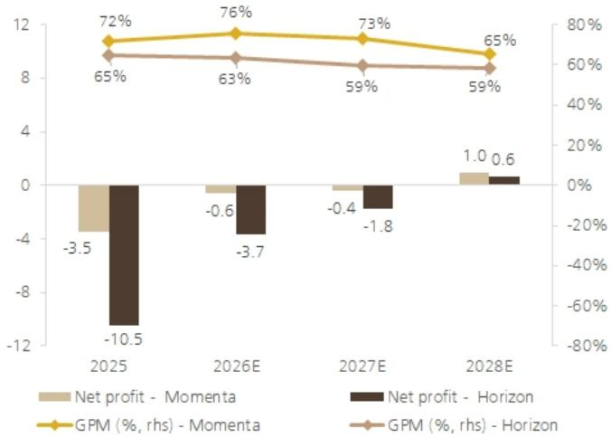

Momenta与Mobileye收入预测  
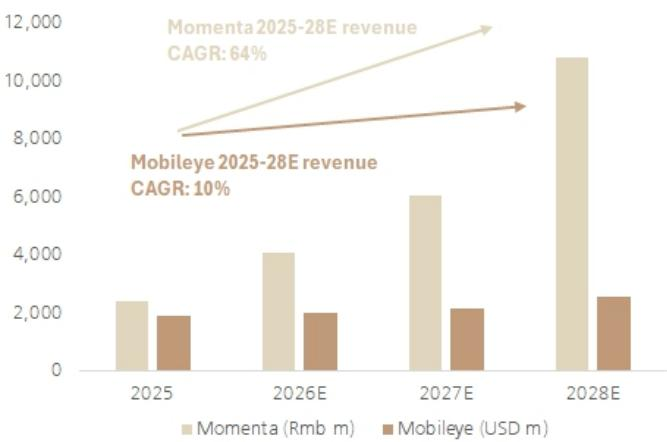  
以上图表来源：公司数据，UBS

我们认为Momenta处于最有利的位置，能够受益于L2+ ADAS渗透率提升的趋势，并预测其年装机量将从2025年的5.1万台增长至2028年的250万台，相当于中国年汽车销量的10%，而2025年这一比例不到2%。

我们认为，与80-90亿美元市值的同类公司相比，Momenta为读者提供了一个高质量的选择。Momenta的利润率更高，亏损程度低于地平线。

与Mobileye相比，我们认为Momenta的收入增长势头更强。Momenta目前处于亏损状态，但其快速的收入增长和高贡献利润率支撑了更高的估值。

L2及以上ADAS渗透率（%）

## Momenta的机遇

Momenta是中国最大的独立自动驾驶解决方案提供商，为量产车提供L2城市NOA解决方案，并为Robotaxi服务提供解决方案。在激烈的竞争中，随着行业智能化升级的加速，高级驾驶辅助系统（ADAS）日益成为必备功能。UBS估计，到2030年，仅高级ADAS的潜在市场总量就可能达到约1420亿美元，驱动因素包括渗透率提升、单车软件内容增加以及行业向端到端智能驾驶架构的转型。

聚焦中国市场，尽管整体国内汽车需求保持平稳，但L2++ ADAS车型在技术加速采用和成本结构改善的支持下，继续实现稳健的同比增长。在不同价格区间内，城市ADAS功能的渗透率持续提升。与此同时，外资OEM在L2 ADAS的采用和功能部署方面普遍落后于领先的国内自主品牌。Momenta可以成为国内和合资OEM加速智能化升级的自然合作伙伴，凭借其领先的技术和成本效益。

图1：尽管整体国内需求平稳，L2++ ADAS车型仍实现稳健的同比增长  
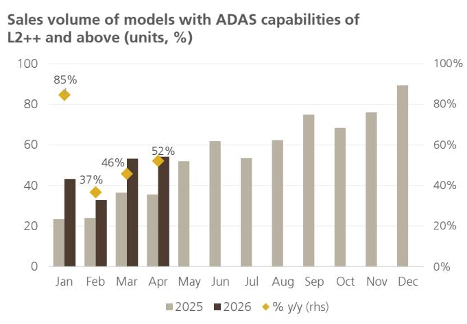  
来源：NE ADAS数据库。注：L2++ ADAS及以上包括同时具备高速和城市NOA能力的解决方案

图2：UBS全球L2和L4潜在市场总量估算  
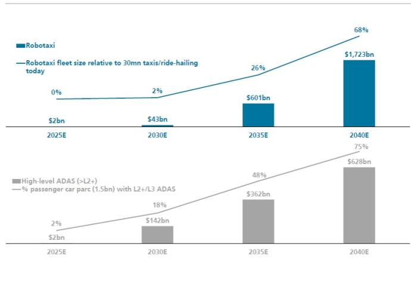  
来源：公司数据，UBS估算

图3：ADAS技术升级在各价格区间加速推进  
L2++及以上ADAS渗透率（%）  
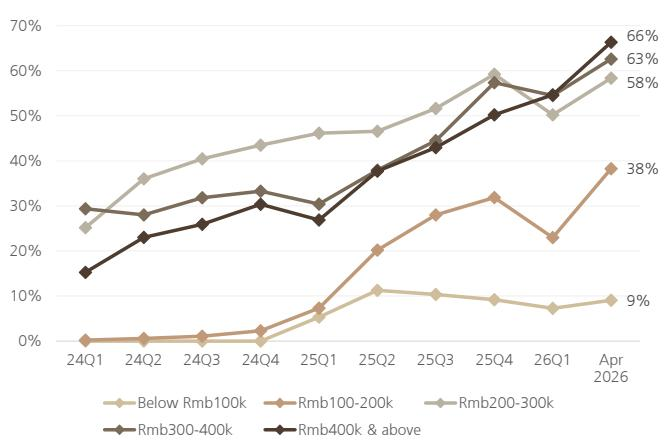  
来源：NE ADAS数据库。注：L2++ ADAS及以上包括同时具备高速和城市NOA能力的解决方案

图4：合资和外资品牌在L2 ADAS采用上落后于自主品牌  
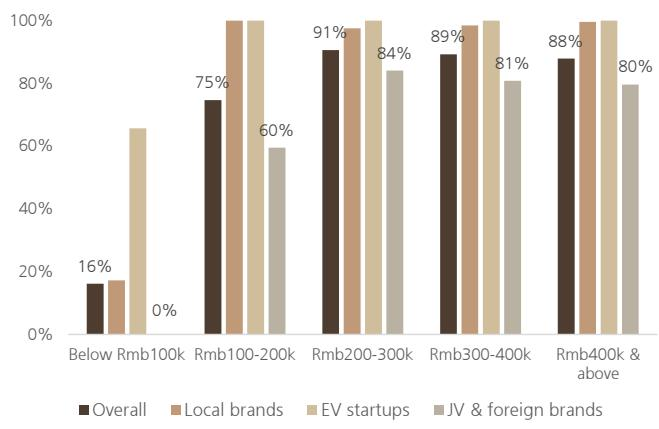  
来源：NE ADAS数据库

Momenta在全球独立城市NOA解决方案提供商的关键商业里程碑方面处于领先地位，包括累计获得超过170个定点项目，其中超过68个已达到量产状态。该公司已与24家全球OEM建立合作关系，包括梅赛德斯-奔驰、宝马集团中国、奥迪、丰田、本田和东风日产，为全球前十大车企中的9家提供服务，累计装机量超过68万台。按采用其城市NOA解决方案的车型数量计算，截至2026年2月28日的过去12个月，该公司录得64.5%的市场份额。

随着中国车企加速出口和海外市场布局，Momenta也已将业务拓展至国际市场。例如，智己汽车的多款海外车型已在英国、澳大利亚和新西兰上市，搭载Momenta解决方案。我们认为Momenta已建立了相当多元化的客户基础，并可能为现有车企提供协同效应，以成本效益和数据协同的方式在自动驾驶能力方面迎头赶上。

图5：Momenta在城市NOA的定点项目和量产等关键商业里程碑方面处于领先地位  
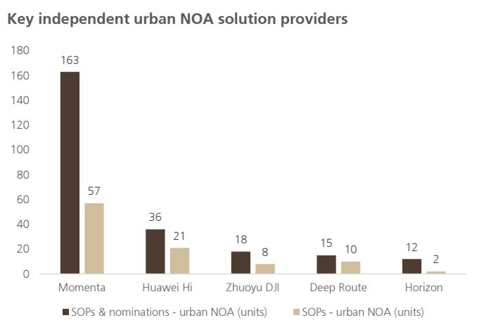  
来源：灼识咨询，公司数据，UBS。注：量产和定点项目数据截至2026年2月28日。  
图6：Momenta在独立解决方案提供商中按车辆销量计算占据65%市场份额  
独立城市NOA解决方案提供商市场份额（按车辆销量）

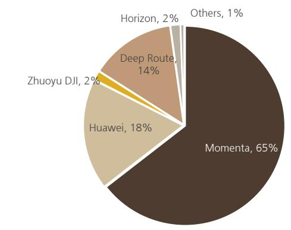  
来源：灼识咨询，公司数据，UBS。注：车辆销量数据为2025年3月至2026年2月。

图7：Momenta前五大客户

<table><tr><td></td><td>2023</td><td>%</td><td>2024</td><td>%</td><td>2025</td><td>%</td></tr><tr><td>第1位</td><td>通用汽车</td><td>36%</td><td>丰田</td><td>19%</td><td>比亚迪</td><td>22%</td></tr><tr><td>第2位</td><td>梅赛德斯</td><td>32%</td><td>梅赛德斯</td><td>18%</td><td>梅赛德斯</td><td>17%</td></tr><tr><td>第3位</td><td>比亚迪</td><td>10%</td><td>上汽</td><td>18%</td><td>丰田</td><td>9%</td></tr><tr><td>第4位</td><td>比亚迪-丰田</td><td>5%</td><td>通用汽车</td><td>13%</td><td>上汽</td><td>8%</td></tr><tr><td>第5位</td><td>路特斯</td><td>4%</td><td>德赛西威</td><td>10%</td><td>德赛西威</td><td>8%</td></tr></table>

来源：灼识咨询，公司数据，UBS

我们认为Momenta处于最有利的位置，能够受益于L2+ ADAS渗透率提升的趋势，并认为年装机量有较高可见度，可能从2025年的5.1万台增长至2028年的250万台，相当于中国年汽车销量的10%，而2025年这一比例不到2%。在2025年交付的51万台搭载Momenta解决方案的车辆中，我们估计比亚迪贡献了约25万台，上汽集团贡献了超过10万台，奇瑞、广汽、东风日产和广汽丰田各贡献了2-5万台。

我们预测2026年年装机量将弹性较高至110万台，基于Momenta的定点项目和储备项目。我们预计今年比亚迪和上汽将分别贡献40万台和30万台，而其他客户如奇瑞、长城、东风日产和广汽将增至5-10万台。

展望未来，管理层预计2027/28年搭载Momenta解决方案的年车辆交付量将达到240/580万台，原因是来自国内外领先品牌的定点项目扩大以及每款新车型的L2++渗透率加速提升。虽然我们对管理层更高的目标感到鼓舞，但我们做出相对更为审慎的预测，即2027-28年装机量为180-250万台。

图8：当前储备项目的预计装机贡献  
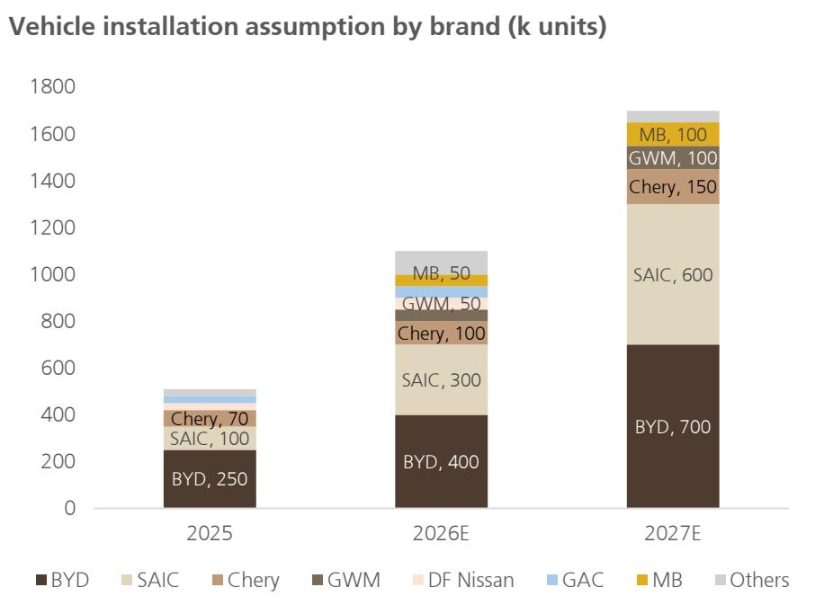  
来源：公司数据，UBS估算

Momenta也在积极探索L3车辆的订阅模式，与领先OEM合作开发先进的L3自动驾驶技术。量产前开发和OEM验收目前目标为2026年，量产计划于2027年初，具体取决于监管进展和相关OEM项目的实施时间表。虽然我们认为L3的可见性仍然较低，但管理层对此商业化机会表现出较高信心。

中期来看，Momenta正在扩展其L4 Robotaxi运营业务，并计划随着技术和商业化的成熟扩展到Robovan和Robotruck。Momenta已在苏州和上海获得Robotaxi商业运营许可，在无锡获得试点运营许可和测试批准，以及在阿布扎比获得测试批准。该公司采用无地图架构，利用量产车的真实驾驶数据和强化学习R6模型，计划与上汽合作在上海推出全球首支量产Robotaxi车队。虽然Robotaxi和Robovan业务目前尚未贡献公司收入或利润，但我们认为这代表了技术升级和在更长期限内将Momenta自动驾驶技术商业化的有前景举措。

图9：Momenta在运营和车辆成本较低的领域正追赶领先的Robotaxi同行

<table><tr><td></td><td>覆盖国家数量</td><td>运营成本 Rmb/km</td><td>车辆成本 Rmb/km</td></tr><tr><td>文远知行</td><td>11</td><td>2.00</td><td>0.44</td></tr><tr><td>小马智行</td><td>8</td><td>1.26</td><td>0.38</td></tr><tr><td>百度</td><td>3</td><td>1.68</td><td>0.36</td></tr><tr><td>Momenta</td><td>2</td><td>1.21</td><td>0.25</td></tr></table>

来源：灼识咨询，公司数据，UBS

鉴于相对固定的开发成本和研发成本结构，以及服务不同车企的软件协同效应，该公司在2025年录得72%的高毛利率。展望未来，我们预计Momenta将扩大OEM覆盖范围和正在开发的项目，并利用其领先的技术和城市NOA解决方案的成本效益，逐年增加搭载Momenta解决方案的车辆数量。随着采用Momenta城市NOA解决方案的车型数量增长，我们预测许可收入将占据更高收入份额，从而推动利润率进一步提升。

图10：我们预计许可和订阅业务将以更高利润率推动收入增长  
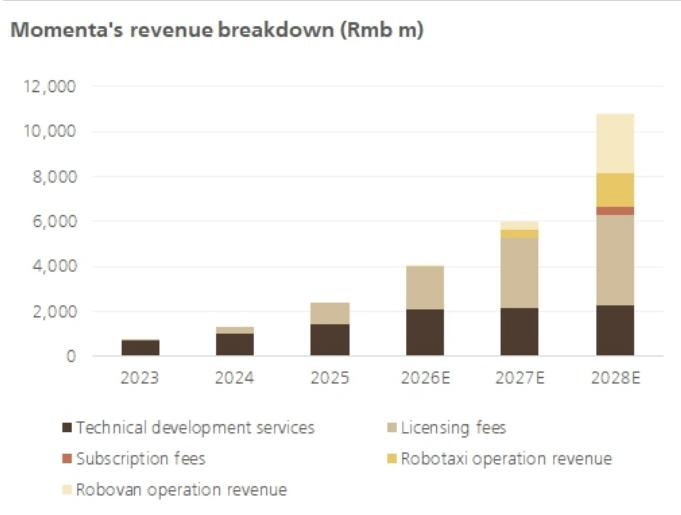  
来源：公司数据，UBS估算

图11：Momenta的轻资产商业模式带来高运营杠杆  
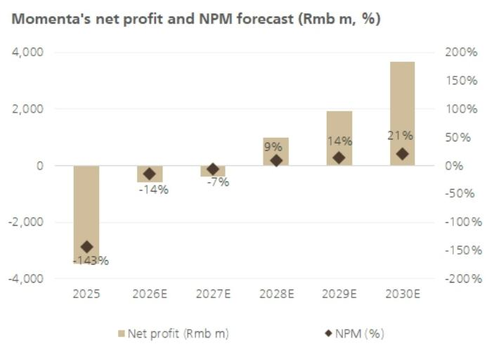  
来源：公司数据，UBS估算

## Momenta面临的因素

Momenta在一个日益拥挤的城市NOA市场中运营，面临来自独立ADAS/自动驾驶解决方案提供商的激烈竞争。在中国，华为、元戎启行、轻舟智航和地平线机器人等竞争对手都在通过与多家车企合作追求可扩展的城市NOA部署，而Mobileye和Wayve等海外竞争对手正在推进以软件为中心的自动驾驶平台，具有全球雄心。

除了第三方技术供应商，Momenta还面临来自其自身OEM客户的竞争风险，其中许多客户正在大力投资内部自动驾驶堆栈、软件平台和AI能力，以更好地控制差异化、数据和成本。随着OEM越来越多地将关键ADAS和自动驾驶技术内部化，我们认为Momenta需要继续展示卓越的性能、更快的迭代速度和成本竞争力，以捍卫其作为领先独立供应商的地位。

图12：全球城市NOA提供商竞争格局

<table><tr><td></td><td>AEB误触发率</td><td>变道成功率</td><td>环岛通过率</td><td>掉头成功率</td></tr><tr><td>Momenta</td><td>&lt;1次/百万公里</td><td>&gt;95%</td><td>&gt;99%</td><td>&gt;95%</td></tr><tr><td>华为</td><td>&lt;3次/百万公里</td><td>&gt;90%</td><td>&gt;90%</td><td>&gt;90%</td></tr><tr><td>地平线</td><td>&lt;3次/百万公里</td><td>&gt;90%</td><td>&gt;90%</td><td>&gt;90%</td></tr><tr><td>元戎启行</td><td>&lt;3次/百万公里</td><td>&gt;90%</td><td>&gt;90%</td><td>&gt;90%</td></tr><tr><td>卓驭大疆</td><td>&lt;3次/百万公里</td><td>&gt;90%</td><td>&gt;90%</td><td>&gt;90%</td></tr></table>

来源：灼识咨询，公司数据。注：截至2025年12月31日

图13：全球自动驾驶竞争格局  
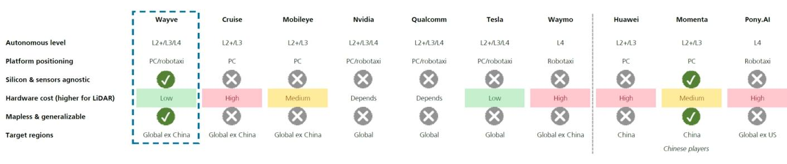  
来源：UBS

此外，Momenta的客户和股东基础包括比许多国内同行更多的全球OEM和外资关联车企，这可能使其更容易受到合资品牌在中国结构性变化的影响。随着中国品牌通过更强的电动产品和技术更快采用持续获得份额，全球OEM的持续销量压力可能影响搭载Momenta解决方案的车辆项目。我们认为该公司已积极寻求与领先国内品牌的合作并深化合作，我们已从这些品牌获得关于其技术能力和成本效益的积极反馈。

图14：Momenta在同行中拥有更广泛的OEM覆盖范围，与国际OEM的合作更多  
主要NOA解决方案提供商的OEM覆盖范围  
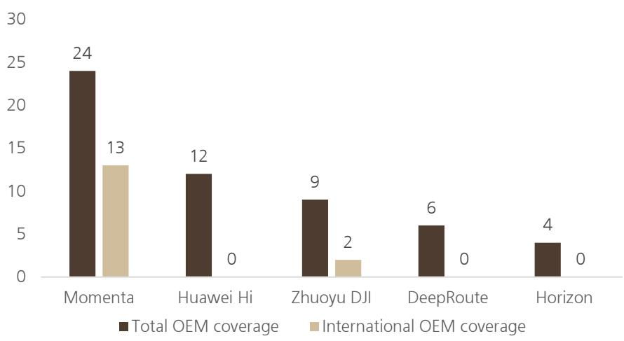  
来源：灼识咨询，公司数据，UBS。

另一个因素可能来自内存芯片成本上升，因为更高级别的ADAS需要比基础级别更多的内存芯片内容。自去年以来，截至2026年第二季度，内存芯片价格已上涨超过三倍，UBS预计价格将持续上涨至2027年底。在我们2026年电动车和AD巡访期间，地平线管理层估计，新车ADAS渗透率从2025年第四季度的70%增加到2026年第一季度的75%，但在具备ADAS功能的车型中，高级别NOA的采用率实际上从2025年第四季度的50%下降到2026年第一季度的约40%，管理层认为至少部分原因是内存芯片成本压力。

图15：自去年以来内存价格快速上涨，我们预计成本上升将持续  
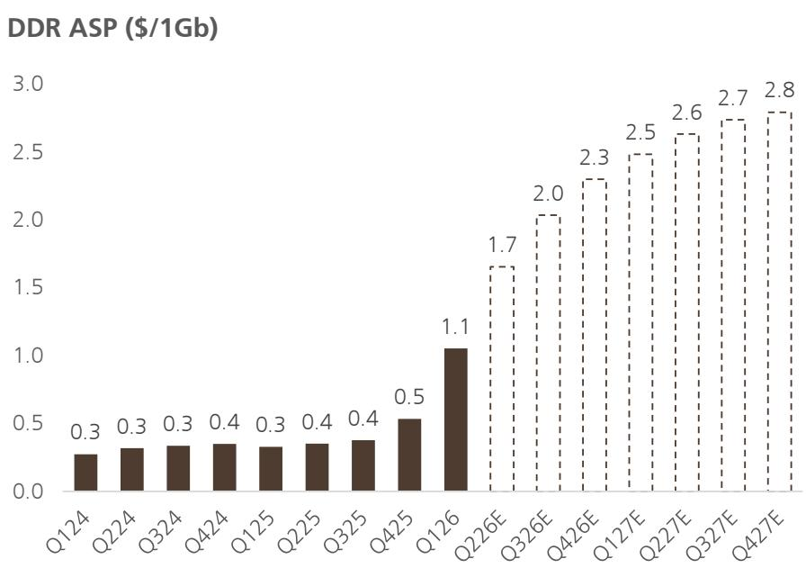  
来源：Dell'Oro，Gartner，UBS估算

此外，Momenta对中国和国际市场不断变化的监管要求高度敏感。在中国，监管机构正在加强对智能驾驶技术的审查，对功能安全、事故责任和数据安全提出更严格的要求，可能增加合规成本并限制商业化灵活性。

在海外，Momenta面临与数据主权、本地数据存储和处理要求、软件认证以及网络安全法规相关的额外挑战。地缘政治紧张局势和某些司法管辖区对中国技术的限制收紧可能进一步限制市场准入、延迟部署或需要大量本地化工作，为公司的全球扩张战略带来不确定性。

图16：各国按自动驾驶级别划分的现有自动驾驶法规  
  
来源：UNECE，欧盟委员会，英国交通部，NHTSA，中国工业和信息化部，UBS

## 当前价格反映了什么？

## 一个高质量的自动驾驶标的

根据UBS估算，该公司目前交易于FY27E市销率的10倍，而地平线为5倍，特斯拉为10倍。虽然80-90亿美元的市值与地平线、Mobileye、Wayve相近，但我们认为Momenta的快速收入增长和高毛利率杠杆是其亮点。

与地平线、Mobileye和Wayve等同类公司（均交易于80-90亿美元，与Momenta几乎相同）相比，我们认为Momenta为读者提供了一个高质量的选择。Momenta和地平线处于类似的ADAS行业，毛利率相近，但作为软件提供商，Momenta的收入规模较小，成本结构远轻于硬件供应商地平线。我们认为，这应允许更高的潜在运营杠杆。

与Mobileye相比，诚然Mobileye更为成熟且已实现盈利，但Momenta的收入增长更快。UBS预测，2025-28年Mobileye的收入复合年增长率为10%，而Momenta为64%。Momenta目前处于亏损状态，但其展现出强劲的收入增长势头和高贡献利润率，这应支撑更高的估值。

与在英国运营高度相似业务的Wayve相比，我们认为Momenta凭借更长的运营历史、更大的装机基础和更强的客户关系而具有优势。其他Robotaxi同行如小马智行和文远知行，历史估值范围各为20-90亿美元，尽管小马智行和文远知行目前在Robotaxi领域拥有更多的运营记录和车队，而Momenta认为其L2+数据和专业知识将有助于其Robotaxi发展。

图17：Momenta的利润率高于地平线，亏损程度低于地平线  
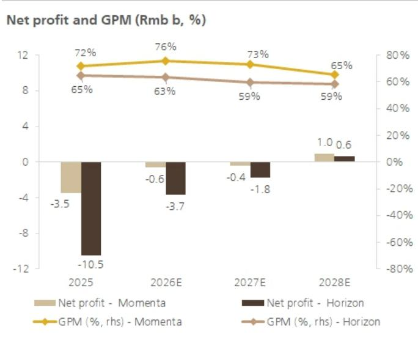  
来源：公司数据，UBS估算

图18：与Mobileye相比，Momenta的收入增长势头更强  
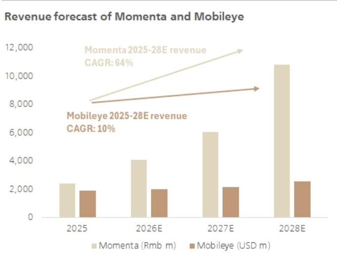  
来源：公司数据，UBS估算

## Momenta估值

鉴于其快速的收入增长和高贡献利润率，我们发现很难用传统的短期市盈率、市净率、市销率、EV/EBITDA倍数来对Momenta进行估值。尽管存在竞争、利润率和监管方面的风险，但其轻资产商业模式在高速收入增长的基础上产生了高贡献利润率和运营杠杆，因此我们认为中期内高市销率是合理的。我们以2028E市销率的8倍对Momenta进行估值，参考其同类公司小马智行、文远知行、特斯拉、Mobileye和地平线的2027E市销率简单平均值，并据此设定目标价为HK$360.00，较当前股价隐含25%的上行空间。

图19：估值比较

<table><tr><td rowspan="2"></td><td rowspan="2">路透代码</td><td rowspan="2">评级</td><td rowspan="2">当前价格（本币）</td><td rowspan="2">目标价（本币）</td><td rowspan="2">隐含上行</td><td rowspan="2">市值（百万美元）</td><td colspan="3">市销率（x）</td><td colspan="3">市盈率（x）</td><td colspan="3">EV/销售额（x）</td></tr><tr><td>2026E</td><td>2027E</td><td>2028E</td><td>2026E</td><td>2027E</td><td>2028E</td><td>2026E</td><td>2027E</td><td>2028E</td></tr><tr><td colspan="16">自动驾驶</td></tr><tr><td>小马智行</td><td>PONY.O</td><td>买入</td><td>7.15</td><td>20.00</td><td>180%</td><td>3,100</td><td>20.3</td><td>11.0</td><td>6.0</td><td>-10.4</td><td>-10.5</td><td>-12.6</td><td>16.3</td><td>8.8</td><td>5.0</td></tr><tr><td>文远知行</td><td>WRD.O</td><td>买入</td><td>6.18</td><td>12.00</td><td>94%</td><td>2,115</td><td>14.9</td><td>8.9</td><td>5.7</td><td>-8.5</td><td>-8.7</td><td>-10.7</td><td>9.9</td><td>7.5</td><td>5.6</td></tr><tr><td>特斯拉</td><td>USTSLA</td><td>中性（CBE）</td><td>394.46</td><td>442.00</td><td>12%</td><td>1,395,599</td><td>13.4
