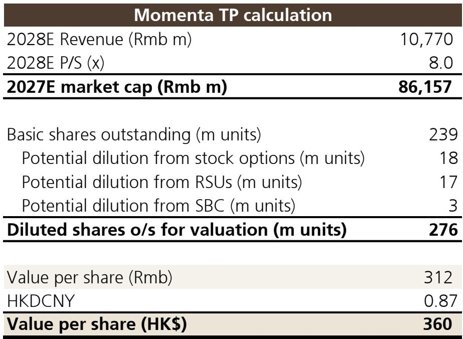
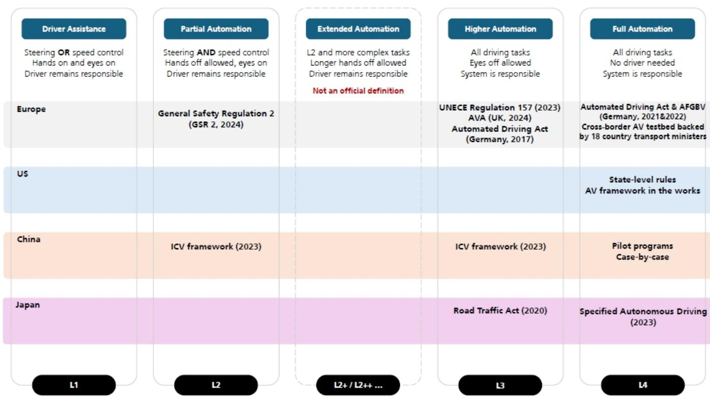
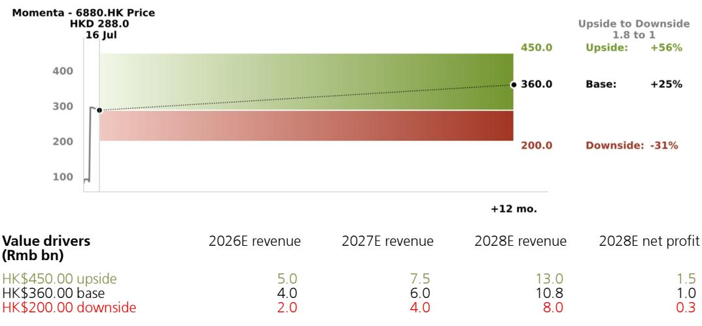

# Momenta的轻资产模式将重塑自动驾驶供应链，而非仅仅服务其中

中国最大的独立自动驾驶软件供应商已积累了24家全球OEM合作伙伴、170项累计提名和68个量产项目，但其约80-90亿美元的市值意味着市场仍将其定价为一个有前景的供应商，而非一个可能重构汽车行业采购智能方式的平台。这种框架低估了正在发生的结构性转变。Momenta不仅受益于L2+ ADAS的普及趋势，它正在构建一个操作系统，通过这个系统，主流汽车制造商——尤其是那些在自动驾驶方面落后于中国本土领先企业的厂商——将能够缩小能力差距，而无需从零开始自建技术栈。该公司从2025年每年5.1万辆车载安装量到2028年预计250万辆的轨迹，代表着在中国年汽车销量中市场份额从不到2%增长到10%。但更重要的故事发生在海外，外国OEM面临一个选择：要么从经过验证的独立供应商处获得技术许可，要么将自动驾驶叙事完全让给垂直整合的中国领军企业。

时机至关重要。过去两年，L2++ ADAS在中国各价位车型中的渗透率加速提升，高级驾驶辅助功能已成为竞争必需品而非奢侈品差异化因素。一份全球投行报告估计，到2030年，高级ADAS的可寻址市场总额可能达到约1420亿美元，驱动因素包括渗透率上升、单车软件内容增加以及行业向端到端智能驾驶架构的转型。预计Momenta在2025年至2030年间的收入将以约50%的复合年增长率增长，公司预计将在2028年实现盈亏平衡。关于估值的争论——该股10倍远期市销率相对于同行5至12倍的交易区间是否合理——并未抓住要点。真正的问题是Momenta能否将其当前的商业领先地位转化为数据积累、算法改进和OEM锁定之间的自我强化循环，使其平台越来越难以被取代。

## Momenta已锁定最需要外部自动驾驶能力的OEM，创造了纯硬件供应商无法匹敌的数据优势

该公司的客户集中度既是优势，也体现了战略清晰度。2025年，比亚迪贡献了约25万辆搭载Momenta解决方案的车辆，上汽集团贡献超过10万辆，奇瑞、广汽、东风日产和广汽丰田各贡献2万至5万辆。这种分布反映了一种深思熟虑的模式：Momenta与那些从外部软件专业知识中获益最多的汽车制造商合作。比亚迪尽管有垂直整合的雄心，仍选择在城市NOA领域合作而非完全自建。丰田和梅赛德斯-奔驰近年来各占Momenta收入的约17-19%，它们是全球巨头，认识到需要加速自动驾驶路线图，但没有时间和资金在内部开发专有L2++系统。

使这一客户群具有战略价值的是其产生的数据。每辆搭载Momenta解决方案在公共道路上行驶的车辆都会产生真实驾驶数据，用于训练公司的端到端神经网络。更多车辆意味着更多数据，进而意味着更好的算法，从而为更多OEM提供更具吸引力的解决方案。这是经典的数据网络效应，但其运作方式与消费互联网平台不同。在自动驾驶领域，每增加一辆车的数据边际价值很高，因为边缘案例——异常交通模式、天气条件、道路基础设施变化——是系统可靠性的主要障碍。Momenta累计超过68万辆的安装量使其拥有一个数据语料库，没有量产部署规模的纯软件竞争对手无法快速复制。地平线在提供软件的同时也提供硬件，其商业模式不同，硬件组件限制了数据收集架构的灵活性。华为虽然技术实力强大，但受限于其与合作伙伴OEM的品牌关联，当这些OEM希望在自动驾驶领域保持自身品牌身份时，这会产生竞争张力。

2026年预计110万辆的年安装量——其中比亚迪和上汽预计分别贡献40万辆和30万辆——表明数据飞轮正在加速。每次安装量弹性较高都会以非线性方式提升算法性能，因为系统会遇到更广泛的驾驶场景分布。对于评估是自建还是从Momenta获得许可的OEM来说，这创造了一个令人信服的权衡：开发有竞争力的L2++系统的内部成本以数十亿美元和多年时间计，而最终系统将不可避免地落后于Momenta，因为它只在真实世界数据的一小部分上进行训练。

## 轻资产商业模式创造运营杠杆，使Momenta的利润率结构在根本上优于垂直整合的竞争对手

Momenta不制造硬件。它不拥有车辆装配线。它不以云服务商的规模运营数据中心。其成本结构以研发为主，2025年研发占运营支出的大部分，导致EBIT利润率为负142%。这一负利润率并非疲弱的迹象。它是构建软件平台所需的前期投入，一旦开发完成，该平台可以以每辆车极低的增量成本部署到多个OEM项目中。公司收入预计将从2025年的24亿元人民币增长到2028年的108亿元人民币，而EBIT从负34亿元人民币转为正10亿元人民币。隐含的运营杠杆是显著的：收入增长4.5倍，而EBIT利润率从负142%转为正9.2%。

这一利润率轨迹之所以能够实现，是因为Momenta为额外车辆安装提供服务的边际成本很低。软件许可模式意味着，一旦核心城市NOA技术栈开发并验证完成，将其部署到新的OEM平台上需要集成工作，但无需重写自动驾驶逻辑。与垂直整合的竞争对手如Mobileye相比，后者将专有硬件（EyeQ芯片）与软件结合。Mobileye的毛利率很高，但其芯片设计和制造的资本支出为运营利润率设定了下限，轻资产软件公司可以低于这个下限。同时销售芯片和软件的地平线面临类似约束。特斯拉的方法资本密集度更高，不仅需要硬件开发，还需要车辆制造规模来证明投资的合理性。

投行报告指出，Momenta的交易价格为FY27E市销率的10倍，而地平线为5倍，特斯拉为12倍，并观察到Momenta的快速收入增长和高毛利率杠杆是亮点。毛利率杠杆是关键变量。随着收入规模扩大，固定研发成本被摊薄到更大的基数上，而软件交付的可变成本保持适度。这与微软Windows和谷歌Android在达到临界规模后变得极其盈利的经济逻辑相同。Momenta尚未盈利，但盈利路径清晰可见，且不依赖于提价或从每辆车中提取更多收入。它依赖于销量增长，而这已通过提名和生产项目得到锁定。

## 海外扩张取决于监管架构，但Momenta当前的地理布局为地缘政治碎片化提供了对冲

Momenta长期可寻址市场面临的最重大风险是全球自动驾驶生态系统可能分化为中国阵营和西方阵营的技术栈。投行报告明确承认了这一不确定性：如果全球生态系统分裂，Momenta的可寻址市场总额可能受到限制。这不是假设性风险。欧洲、美国和中国的数据安全法规对车辆数据的处理和存储地点越来越严格。自动驾驶系统需要车辆与云服务器之间的持续数据传输，用于地图更新、算法改进和空中软件补丁。如果监管机构要求特定地区销售车辆的所有数据必须在物理上位于该地区的服务器上处理，像Momenta这样的中国公司需要在每个市场建立本地基础设施和合规框架。

然而，Momenta当前的国际布局比简单解读风险所暗示的要更先进。该公司的ADAS解决方案已被中国汽车制造商在德国、英国、泰国和阿拉伯联合酋长国销售的海外车型所采用。Momenta正与全球高质量OEM合作，在欧洲、东南亚和其他新兴市场试点L3项目。它已在苏州和苏州获得Robotaxi商业运营许可，在无锡获得试点运营许可，在阿布扎比获得测试许可。这种地理多样性意味着，即使美国和欧盟对中国自动驾驶软件施加限制，Momenta仍可进入亚洲和中东增长最快的汽车市场。

更微妙的战略考量是，西方OEM可能更倾向于独立的中国软件供应商，而非像比亚迪这样的垂直整合中国汽车制造商或像华为这样的科技集团。像梅赛德斯-奔驰或宝马这样的全球汽车制造商可以许可Momenta的技术，同时保持自身品牌身份并控制车辆集成。从像华为这样的竞争对手那里获得许可——后者也通过合作伙伴关系以自有品牌销售车辆——会产生令人不适的战略依赖。因此，Momenta的独立性是商业资产，而不仅仅是技术资产。该公司服务于全球前十大汽车制造商中九家的能力表明，这种独立性已受到市场重视。

## 评估Momenta研究案例的决策框架：决定当前轨迹是否可持续的三个变量

评估Momenta的研究者需要一个超越标准合理价格增长辩论的框架，并解决自动驾驶软件市场的特定动态。三个变量将决定公司当前轨迹是否可持续。

第一个变量是L2++ ADAS在各价位车型中的渗透率。投行报告显示，城市ADAS功能在不同价位区间的渗透率持续上升，但普及速度并不均匀。在高端市场，渗透率已经很高，意味着未来增长取决于中端和入门级车型。Momenta的技术必须继续降低成本，才能适用于定价低于20万元人民币的车型。该公司当前的性价比被OEM视为优势，但成本降低必须跟上中国竞争激烈的汽车市场中车价下行压力。如果ADAS功能变得商品化且定价权减弱，Momenta的单车收入可能下降，从而压缩驱动利润率扩张论点的运营杠杆。

第二个变量是来自华为和地平线的竞争反应。华为将其品牌借给合作伙伴OEM的方式创造了与Momenta白标模式不同的价值主张。对部分购车者而言，华为品牌是卖点。对OEM而言，这是在获取技术和让渡品牌资产之间的权衡。地平线的硬件加软件模式可能吸引希望从单一供应商获得计算和算法的OEM。Momenta的优势在于其独立性和仅专注于软件，但这一优势只有在OEM将独立性置于集成便利性之上时才有价值。投行报告指出，按过去12个月销量、提名和量产车型数量计算，Momenta在中国独立城市NOA解决方案提供商中排名第一。关键词是"独立"。如果OEM越来越偏好集成的硬件-软件解决方案，Momenta的市场份额可能趋于平稳。

第三个变量是海外市场自动驾驶软件的监管轨迹。这是最二元的变量。如果中国以外的主要市场对独立软件供应商保持开放，无论其国籍如何，Momenta的可寻址市场将大幅扩张。如果地缘政治紧张导致技术封锁，公司的增长将局限于中国和少数友好市场。该公司目前在多个司法管辖区获得本地测试许可和试点许可的策略是明智的对冲，但无法消除监管冲击的风险。研究者应关注欧洲和美国的特定法规，以及中西方更广泛的外交关系，因为自动驾驶软件已成为与半导体和人工智能同类的战略技术。

## 运营杠杆论点可信，因为Momenta的收入增长已锁定而非理想化

Momenta与许多高增长科技公司之间最重要的区别在于，其收入轨迹主要是已锁定的而非理想化的。公司170项累计提名代表了与OEM就特定车型供应软件达成的正式协议。已达到SOP的68个项目已在产生收入。正在开发中的项目管道为未来两到三年的安装量提供了可见性。这不是一个关于赢得投机性未来业务的故事。而是关于执行已签署的合同。

投行预测2026年年度安装量为110万辆，高于2025年的51万辆，这是基于现有提名的爬坡。仅比亚迪的贡献预计就从25万辆增加到40万辆。上汽的贡献预计从10万辆翻三倍到30万辆。这些不是关于赢得新客户的投机性假设。它们是针对已围绕Momenta软件栈设计的车型的生产量预测。风险不在于OEM会取消项目，而在于这些特定车型的车辆销售相对于预期的情况。这是销量风险，而非客户获取风险。

同样的逻辑适用于Robotaxi和Robovan运营的中期收入驱动因素。Momenta已在苏州和苏州获得商业运营许可，在阿布扎比获得测试许可。Robotaxi服务受到严格监管并面临重大运营挑战，但它们代表了一个独立于车辆销售周期的潜在收入流。如果Robotaxi部署加速，Momenta的收入可能超过当前预测。如果延迟，核心ADAS许可业务仍为增长提供基础。

Momenta的研究案例最终基于一个洞察：自动驾驶软件市场正从实验和专有开发阶段转向标准化和平台采用阶段。那些投入数十亿美元自建自动驾驶技术栈的汽车制造商发现，技术过于复杂，数据需求过于庞大，任何单一公司都无法独自掌握。Momenta提供了一个多个OEM可以共享的平台，开发成本分摊到数百万辆车上。轻资产模式、已锁定的收入管道和数据网络效应创造了一种复合优势，每个季度都变得更难挑战。风险是真实存在的——竞争、监管、定价压力——但它们是对结果规模的风险，而非对方向的风险。

*仅供参考。部分内容可能基于源材料通过AI辅助生成、翻译、总结或编辑，可能存在遗漏或错误。请独立核实。这不构成研究、法律、税务、会计或其他专业建议。*

仅供参考。部分内容可能基于源材料通过AI辅助生成、翻译、总结或编辑，可能存在遗漏或错误。请独立核实。这不构成研究、法律、税务、会计或其他专业建议。

