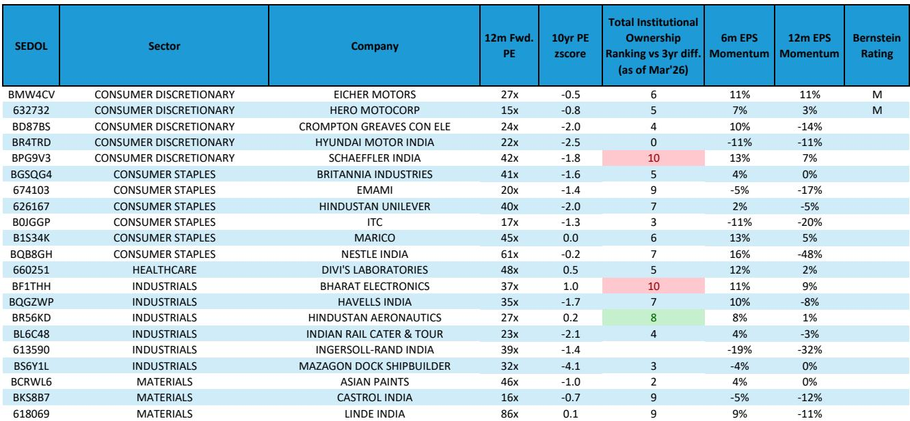
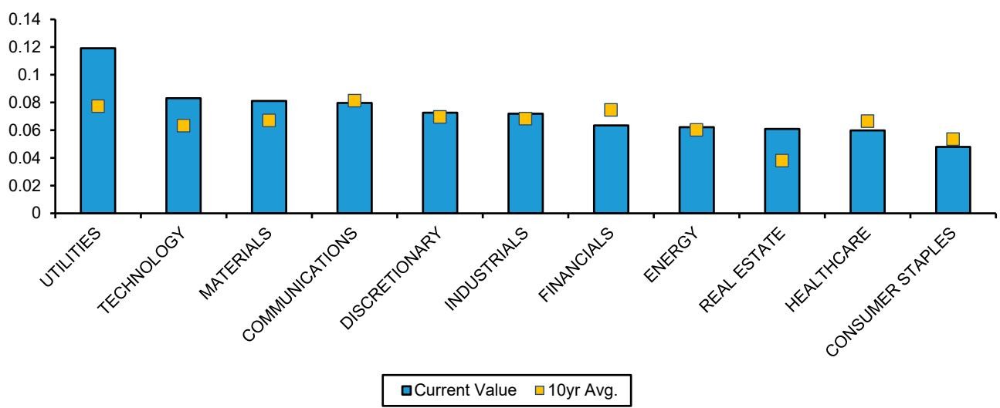
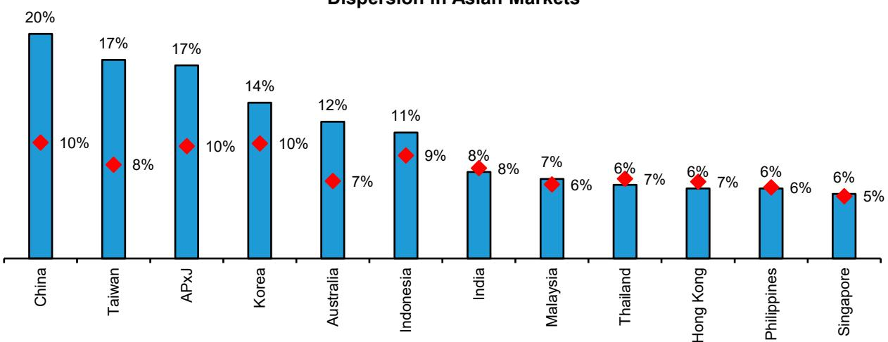

# Bernstein：亚洲量化策略，印度市场机会变宽

印度市场正在经历一个微妙的转折。过去三年，MSCI印度指数从23.2倍远期市盈率的估值高点一路回落，到2026年6月已降至18.6倍，低于十年均值。这轮调整幅度不小——指数在2026年上半年以美元计下跌了10%，而同期韩国市场上涨112%，台湾市场上涨64%。

但Bernstein在最新发布的亚洲量化策略报告中提出，印度市场的吸引力正在改善。核心逻辑不是简单的“跌多了就该买”，而是三个条件正在同时收敛：估值已经重置、大盘股盈利支持开始浮现、外资流出趋势出现逆转。

报告维持对印度市场的中性立场，但认为机会组合正在变宽。

## 1. 资金和科技板块估值已回到疫情低位，这是过去三年未见的入场窗口

印度市场整体估值已降至18.6倍远期市盈率，低于十年均值0.7个标准差。更值得注意的是板块层面的分化。资金和科技板块的估值已跌至疫情时期的水平，分别低于均值1.9和1.5个标准差。必需消费、资金、科技、能源四个板块的市净率也回到了疫情低位。

相比之下，医疗、工业和公用事业仍高于十年均值，但未超过1个标准差。这意味着，印度市场的便宜不是均匀的，而是集中在几个关键板块。

> **KC评论：** 报告中的估值图表显示，印度相对新兴市场的市净率已降至疫情低位，相对中国的远期市盈率也处于历史底部。对于全球配置者而言，印度相对估值不再是一个障碍。

## 2. 盈利下调周期尚未见底，但大盘股和材料、消费板块已出现早期复苏信号

盈利持续不及预期是过去一年印度市场的主要影响。报告数据显示，平均而言印度公司仍处于净下调阶段，下调幅度大于上调。但大盘股正在出现改善迹象——这是整个市场中最具代表性的部分。

从板块看，材料是相对少见出现盈利复苏的行业，消费（不含汽车）也呈现上行趋势。其他板块仍处于下调周期。这种分化意味着，读者不能简单观点偏积极指数，而需要精选公司和板块。

报告还指出，长期盈利增长预期已从2026年1月的12.9%降至6月的10.6%，低于历史均值。从历史规律看，低增长预期往往预示着未来12个月的正向回报。

## 3. 外资流出创纪录后开始回流，拥挤度极低的板块提供交易机会

2026年上半年，外国机构读者从印度撤出了创纪录的290亿美元，远高于上年同期的80亿美元。报告认为，这主要是因为全球读者将印度作为区域AI/科技交易的融资来源。但随着AI/科技板块在6月后出现波动，外资流出开始节奏变化，7月至今已净流入18亿美元。

全球新兴市场主动型产品对印度的低配比例也从2月的-2.7%收窄至5月的-2.1%。

拥挤度数据提供了另一个视角。能源、必需消费、科技、房地产四个板块的读者拥挤度处于20年来的最低水平，而公用事业和资金板块则相对拥挤。报告认为，低拥挤度叠加高离散度（Utilities、房地产、科技、材料板块的公司回报离散度高于均值），为主动选股创造了条件。

## 4. 动量策略估值处于十年低位，大市值风格相对中小盘更有吸引力

报告在因子层面给出了一个清晰的框架：动量和大市值是当前最便宜的因子，均处于十年均值以下1个标准差。而高质量和高自由现金流回报表现因子仍相对昂贵，高于均值1个标准差。

自2026年4月以来，动量策略已上涨15%，报告认为这一趋势可能继续强化。同时，高质量防御性持仓仍需保留，以应对地缘政治和盈利不确定性。关键在于，选股应聚焦于过去6个月盈利动量趋势改善的公司。

大市值相对中小盘的优势不仅体现在估值上，也体现在盈利修正趋势上。大盘股是相对少见出现净上调迹象的市值区间，而中小盘仍处于净下调。

---

这份报告的核心判断不是“印度已经触底”，而是“机会组合正在变宽”。估值重置、盈利早期复苏、外资回流、因子估值分化，四个条件同时出现，为不同风格的读者提供了多个切入点。但报告也明确提醒，盈利下调周期尚未见底，复苏仍是选择性的而非全面的。对于配置者而言，关键在于识别哪些板块和因子真正具备估值与盈利的双重支撑。

For informational purposes only. Portions may be generated,translated,summarized,or edited with AI assistance based on source materials and may contain omissions or errors. Please verify independently. This is not investment,legal,tax,accounting,or other professional advice.

For informational purposes only. Portions may be generated,translated,summarized,or edited with AI assistance based on source materials and may contain omissions or errors. Please verify independently. This is not investment,legal,tax,accounting,or other professional advice.

