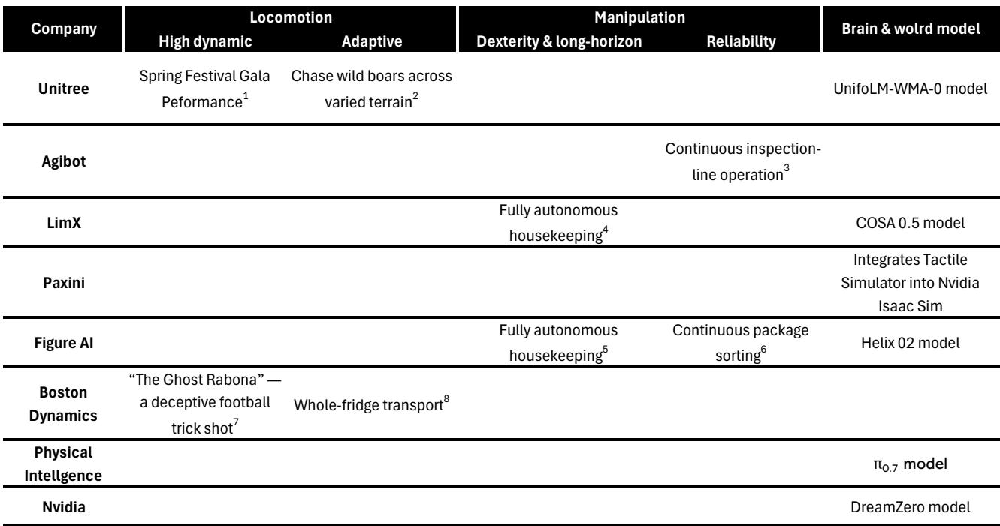
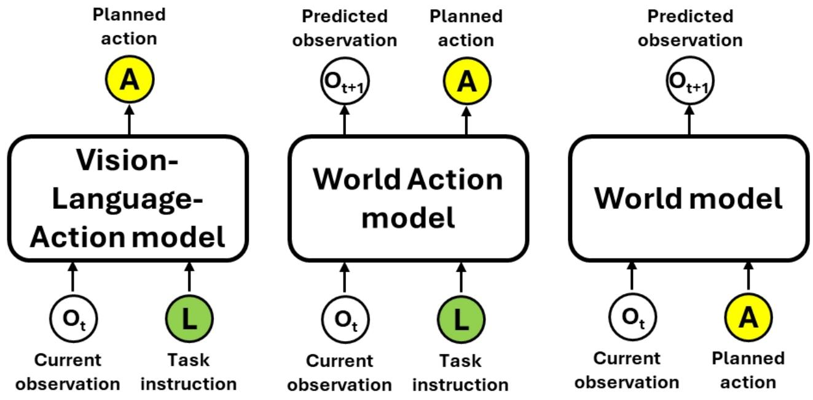
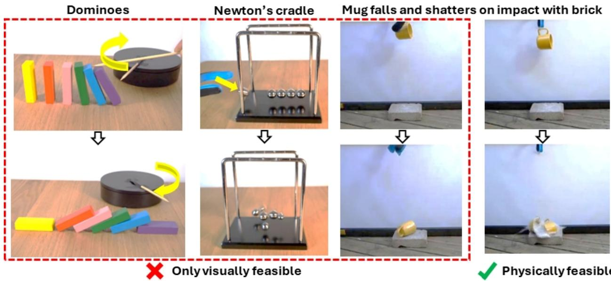

# Bernstein：全球自动化-人形机器人-2026年技术前沿

人形机器人行业正站在一个技术拐点上。Bernstein最新研报的核心判断是：行业正在从“看到就做”的VLA模型，转向“先想象再行动”的世界动作模型（WAM）。这一转变不只是算法升级，它可能重新定义整个产业的竞争逻辑——谁拥有最好的模型架构和数据整合能力，谁就可能取代“谁拥有最多机器人数据”成为新的护城河。

报告以五个维度（运动、操作、自主性、大脑模型、数据模态）勾勒了当前技术前沿。两年前，在平地上稳定行走还是值得展示的成就；如今，Unitree的机器人能在波兰森林追逐野猪，Boston Dynamics的Atlas能做出欺骗性足球射门。操作任务也从简单的抓取放置，演进到连续数小时的自主分拣和全屋清洁。但报告明确指出，这些进展仍处于早期阶段——长序列自主规划、技能迁移和任务泛化，才是下一阶段真正的战场。

## 1. WAM的核心差异在于“预测物理可行结果”而非直接输出动作

VLA（视觉-语言-动作模型）的工作逻辑是：看到指令，直接输出下一个动作。WAM则多了一个步骤——先预测环境在物理规律下的演化结果，再基于这个预测生成动作序列。Bernstein用了一个直观类比：VLA像条件反射，WAM像人类在行动前先在脑中模拟后果。

报告将世界模型分为三类：“渲染型”（如Sora、Kling）生成视觉上合理的画面；“模拟型”（如Cosmos）嵌入物理规律预测状态；“规划型”（如DreamZero、1XWM、UnifoLM-WMA-0）则直接用于推理和动作规划。目前行业主流正从VLA向融合世界模型的WAM迁移，Physical Intelligence的π0.7模型是典型案例——引入世界模型后，不仅在复杂任务上表现提升，还实现了跨机器人的技能迁移。

> **KC评论：** 报告展示了一个关键测试——π0.7在“冰箱到微波炉”任务上训练，却在反向的“微波炉到冰箱”任务上测试。嵌入世界模型的版本成功打破了训练数据的方向偏见。这意味着WAM可能解决机器人行业最头疼的问题之一：模型在实验室表现优异，换一个场景就失效。

## 2. 数据竞争的逻辑正在改变：从“谁有最多机器人数据”转向“谁有最好的数据整合能力”

WAM的兴起正在改变数据在竞争中的角色。传统VLA依赖大量通过遥操作采集的机器人动作数据——成本高、效率低、且与硬件平台绑定。WAM则更强调数据的多样性，尤其是环境数据和非视觉模态数据（如触觉、材料属性）。这类数据更容易从公开来源获取，且不依赖特定硬件平台。

Bernstein认为，这意味着竞争壁垒正在从“数据所有权”部分转移到“模型架构和数据整合能力”。独立大脑/基础WAM开发者（如Physical Intelligence、Nvidia）可能因此受益。报告做了一个类比：机器人大脑的演化路径可能类似电动汽车的电池和动力总成——头部OEM选择自研，其余厂商从最好的第三方供应商采购。

这一判断也暗示了哪些玩家可能填补关键缺口。触觉传感公司PaXini被报告特别提及，因为它将触觉模拟器整合进Nvidia Isaac Sim，为世界模型提供了目前极度稀缺的物理交互数据。

## 3. 五个技术维度的进展并不均衡，操作和自主性仍是最大瓶颈

Bernstein的五维度框架提供了一个评估行业进展的结构化工具。在运动维度，高动态控制和自适应环境交互已有显著突破——Unitree的春晚表演和野外追逐展示了从“能走”到“能跑”的跨越。但在操作维度，尽管Figure AI实现了200小时连续自主分拣，Agibot在真实工厂完成了连续巡检，高灵巧度和长序列操作的工业级可靠性仍处于早期。

自主性维度的分化更为明显。远程控制已被基本放弃，预定义任务序列和短时自主任务是目前主流。但报告认为，长时自主规划、技能迁移和任务泛化才是“刚刚出现”的方向。大脑模型从LLM/VLM到VLA再到WAM的演进，本质上是在解决同一个问题：如何让机器人不再只是执行预设指令，而是理解环境、预测后果、做出决策。

数据模态的多样化是支撑这一演进的基础。报告观察到，行业正从依赖遥操作数据转向优先使用以自我为中心的人类视频数据，并辅以非视觉数据。这种转变降低了数据采集成本，也减少了对特定硬件平台的依赖。

## 4. 一个可复用的观察框架：用“规划能力”而非“演示视频”判断进展

对于关注这一赛道的读者，报告提供了一个比观看演示视频更有效的评估方法：关注机器人是否具备“先想象再行动”的能力。具体来说，可以观察三个信号：

第一，模型是否能在训练数据之外的任务上泛化——比如π0.7在反向任务上的表现。第二，是否具备跨硬件平台的技能迁移能力，而非只能在一个特定机器人上工作。第三，是否开始整合非视觉数据，尤其是触觉和材料属性数据，因为这是世界模型训练中最稀缺、也最可能形成差异化优势的环节。

报告没有回避挑战：WAM的推理速度目前慢于VLA，非视觉数据的匮乏也是现实瓶颈。但方向已经明确——行业正在从“让机器人学会做动作”转向“让机器人学会思考后果”。这个转变的进度，可能比大多数人预期的要快。

For informational purposes only. Portions may be generated, translated, summarized, or edited with AI assistance based on source materials and may contain omissions or errors. Please verify independently. This is not investment, legal, tax, accounting, or other professional advice.

For informational purposes only. Portions may be generated, translated, summarized, or edited with AI assistance based on source materials and may contain omissions or errors. Please verify independently. This is not investment, legal, tax, accounting, or other professional advice.

