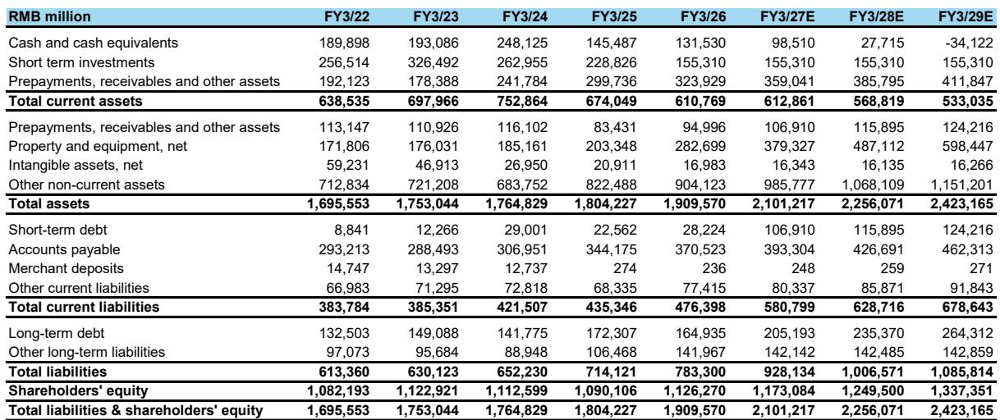
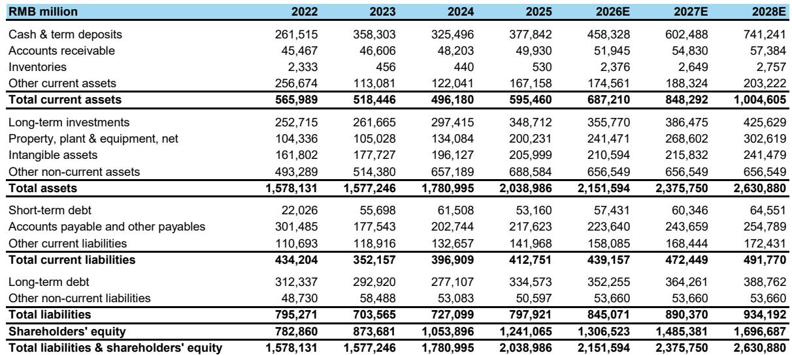
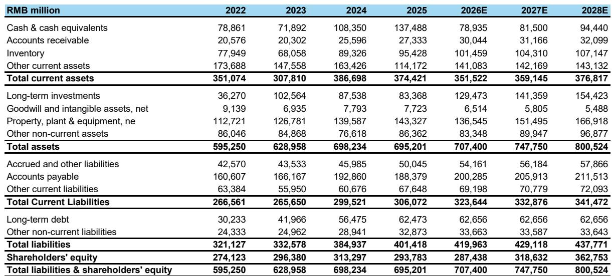

# 中国互联网行业估值变化：多数人忽略的结构性观察

中国互联网板块在2026年上半年经历了明显调整，即便近期有所回升，覆盖范围内的公司平均报价仍较年初有所下降。然而，在表面现象之下，存在一个结构性变化：多数公司的估值已重新压缩至2022-2023年的低谷水平，而驱动这一压缩的基本面叙事已被证明存在明显偏差。目前，对于实现两位数盈利增长的公司，其远期市场定价倍数处于8-14倍区间，这一折让隐含了一种与数据日益不符的极端情景。

这种张力十分显著。某头部公司尽管运营利润持续增长、拥有强大的社交生态以及新近被认可的AI叙事，其2026年预期调整后市场定价倍数仍为13.3倍。另外两家公司基于2026年预估的倍数分别为8.4倍和12.2倍，后者扣除现金及投资后约为4倍。这些倍数要么意味着盈利能力的永久性受损，要么意味着尚未发生的宏观层面的极端事件。市场已经消化了负面消息。问题在于，正面消息是否具备超预期的潜力。

近几周的三项进展开始改变这一局面。某公司新模型发布改善了市场对其AI能力的看法。另一家公司一季度财报表现好于预期，尤其在云业务收入加速和即时零售亏损收窄方面。此外，针对中国相关公司及半导体板块的极端持仓开始出现调整。这些并非孤立事件，而是表明该板块的风险回报特征已从2026年年中水平得到根本性改善。

关于中国互联网的悲观论点历来有两大支柱：宏观增长放缓与AI成本超支。这两种论点都被推向了看似不可持续的极端。消费表现平淡，但相关统计部门愿意报告低于目标的增长数据，可能预示着宏观政策立场将有所调整。对AI推理成本的担忧，混淆了token消耗与成本增长的关系，忽略了在成本变得显著之前，代理交易量必须先行规模化。市场将不确定性等同于下行风险。这种混淆正是机会所在。

## AI资本开支讨论过度悲观，忽略了推理成本仅在收入增长时才会规模化

对某些公司最具破坏性的悲观叙事集中在AI推理成本上。该论点认为，随着这些平台推出AI代理功能，它们将被迫承担巨大的计算成本而缺乏相应收入，从而对运营利润率造成永久性拖累。这一论点已成为许多参与北美路演会议的市场参与者的共识，并直接导致了估值压缩。

这一论点在结构上存在缺陷。聊天式交互每次消耗数百个token。而代理交易——即AI实际代表用户执行操作——则需要数万个token。这意味着，只有当代理交易量和交易总额起飞时，token消耗才会呈抛物线式增长。悲观者所担心的成本爆发，恰恰依赖于他们声称永远不会发生的收入爆发。这两者不可能同时成立。

数据支持这一框架。某公司资本开支占过去十二个月收入的10.9%，略低于另一家公司的12.3%。但以毛利润和运营现金流衡量，前者吸收资本开支增长的能力要大得多。两家公司均表示未来几个季度资本开支将环比增长，但这并非不计后果的支出。某云业务在六月当季收入加速至45%左右，低双位数的利润率意味着35-40%的增量现金利润率。该公司已表示计算服务价格上调将持续至年底。关于投资回报率的讨论仍将继续，但近期趋势是建设性的。

更微妙的风险在于，从最顶尖的1%重度用户大量使用推理服务，到广泛普及之间的过渡。这一过渡值得关注。但认为平台会在没有变现路径的情况下无限承担推理成本的观点，忽略了中国平台相对于西方同行的结构性优势。在西方市场，市场参与者基本已放弃对消费者AI变现的希望。在中国，数万亿规模的微信小程序交易总额代表着一个显而易见的变现机会，由AI驱动的交易可通过商户费用产生收入。机制已经存在。问题在于时机，而非可行性。

## 某公司AI可信度已从负担转为催化剂，后续产品发布是下一个关键节点

某公司已成为中国互联网AI讨论中最关键的战场。在2025年及2026年初的大部分时间里，市场将其视为AI领域的落后者——一家拥有海量数据资产但缺乏模型构建可信度的公司。其新模型的发布已从根本上改变了这一认知。虽然全面评估需要更多数据，但此次发布提升了市场参与者对其自主构建有竞争力模型能力的信心，降低了对第三方供应商依赖或持续追赶的风险。

其微信代理产品的推出是下一个关键数据点。早期用户反馈良好。该功能旨在与主要安卓智能手机制造商签署的代理间协议相整合，从而形成竞争对手难以复制的分发优势。推广将是渐进的，但其战略逻辑清晰：微信的13亿月活跃用户代表了全球最大的潜在消费者AI部署场景，而该代理产品正是实现这一部署的载体。

下一次预训练模型的时间点将是决定其AI叙事的关键事件。如果新模型展现出较前代有意义的性能提升，将永久性地解决关于其模型构建能力的争论。如果令人失望，市场将重回怀疑。但不对称性是有利的：该公司11-12倍远期市场定价倍数已经计入了显著的失望情绪。新模型成功将引发当前估值尚未反映的结构性重估。

除AI之外，该公司的传统催化剂依然存在。某款新游戏持续表现强劲。运营利润修正需要触底，短期市场参与者才能宣布警报解除，但新游戏势头、AI叙事改善以及极端估值的组合表明，随着这些因素发挥作用，其报价不太可能停留在11-12倍远期市场定价倍数。

## 某公司云业务加速与即时零售亏损收窄，创造了持续至行业大会之后的催化剂路径

某公司一季度财报包含两个被低估的信号。首先，其云业务收入加速至45%左右，计算服务价格上调将持续至年底。这不是一个季度现象。持续的资本开支、价格上调以及将某业务板块重新分类至云部门，将在可预见的未来提振报告的云业务增长。该业务调整看似表面功夫，但它有助于收入增长，并支持云业务作为公司主要增长引擎的叙事。

其次，即时零售亏损的下降速度快于市场预期。市场原本预期该公司会比指引更快地削减支出，但实际亏损减少的速度甚至超过了这些预期。这很重要，因为即时零售此前一直是合并利润率的重大拖累，更快的亏损减少改善了其核心电商业务的盈利轨迹，且无需牺牲收入。

催化剂路径延伸至2026年剩余时间。即将举行的云行业大会将为该公司阐述其AI和云战略提供平台。其持有重要股份的某公司IPO，代表着一个潜在的价值实现事件。而对另一家AI公司的持股则提供了AI应用层的额外选择权。对于一家以2026年预期市场定价倍数29.5倍交易的公司而言，这些催化剂很重要。但更相关的框架是2027年预期，届时倍数降至17.8倍，以及2028年预期为14.6倍。如果云业务增长持续且电商利润率稳定，该公司在远期基础上并不昂贵。

一个局限性值得提及：该公司认为其某款AI应用的用户参与度“优先级较低”的表态，表明其资本配置策略更为聚焦，但也意味着消费者AI变现仍次于企业云增长。这是一个明智的战略选择，但意味着其消费者AI叙事在短期内将不如另一家公司成熟。

## 其他几家公司提供了市场误解的独特风险回报特征

某游戏公司面临短期战术性挑战：新游戏上线可能会因事件交易而引发一些回调。但远期布局具有吸引力。下半年较低的收入基数提供了有利的比较基础。加速回购表明管理层信心。可能的南向资金纳入将带来增量需求。而后续游戏新闻流则为游戏叙事的下一阶段提供了催化剂。

围绕AI的游戏颠覆性讨论在此具有相关性。某AI产品引用游戏公司案例来证明其AI产品有用性，提供了一个有用数据点：AI解决了生产效率问题，但并未解决IP可信度或多人在线网络效应问题。该游戏公司在两个领域的优势提供了AI原生竞争者难以复制的护城河。以2026年预期调整后市场定价倍数14.2倍计算，该公司的护城河并未获得任何溢价。

另一家公司以2026年预期调整后市场定价倍数8.4倍交易，这一倍数要么意味着永久性的利润率压缩，要么意味着没有增长。该公司正实现两位数的利润增长。即使按中国互联网标准，这一折让也极为极端。市场的担忧似乎来自竞争对手，但该公司在高价值品类、供应链基础设施和物流质量方面的定位提供了当前估值所忽略的差异化。

某招聘平台是最极端的案例。以2026年预期调整后市场定价倍数12.2倍，或约扣除现金及投资后4倍计算，市场正在定价该招聘平台的结构性受损。然而，AI驱动的更好匹配应有助于其提升每职位收入和企业客户平均收入。中国的招聘市场具有周期性，但并非结构性衰退。这一估值隐含了一种与公司竞争地位和增长轨迹不一致的永久性悲观。

## 未来六个月的决策框架：持续重估的三个条件

中国互联网板块已从低谷水平反弹，但问题在于这是战术性反弹还是持续重估的开始。三个条件将确认后者。

首先，运营利润修正必须触底。市场在2026年上半年一直在下调预期。稳定或向上修正周期将消除主要的根本性逆风。二季度财报季将是第一个考验，考虑到预期下调的幅度，该季度的风险应有所降低。

其次，AI叙事必须从成本恐惧转向收入可能性。某公司的代理产品推出和另一家公司的云行业大会是最明显的催化剂。但更广泛的转变要求市场参与者内化一个逻辑：推理成本只有在交易量规模化时才会变得重要。当前的讨论将成本视为部署的函数，而非采用的函数。这一框架是颠倒的。

第三，宏观认知必须改善。相关统计部门愿意报告低于目标的增长数据，是宏观政策可能转向更积极立场的潜在先行指标。消费仍然平淡，但2025年较高的基数扭曲了二季度比较。问题在于宏观政策立场是否从约束转向支持。如果是，中国互联网公司的估值折让将迅速收窄。

对于接受这一框架的市场参与者而言，关键问题不在于该板块能否重估，而在于哪些公司对这三个条件提供了最不对称的敞口。某公司以低谷倍数提供了最直接的AI叙事杠杆。另外两家公司提供了相对于盈利增长的极端估值折让，对AI叙事改善的依赖度较低。某游戏公司则提供了由游戏特定驱动因素定义的明确催化剂路径。共同点是，这四家公司的交易倍数都假设了最坏的结果。数据并不支持这一假设。

*仅供参考。部分内容可能基于源材料通过AI辅助生成、翻译、总结或编辑，可能存在遗漏或错误。请独立核实。本文不构成任何专业建议。*

仅供参考。部分内容可能基于源材料通过AI辅助生成、翻译、总结或编辑，可能存在遗漏或错误。请独立核实。本文不构成任何专业建议。

