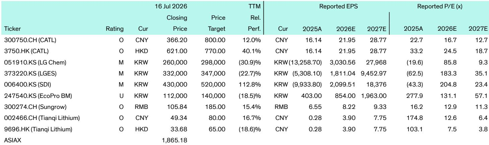
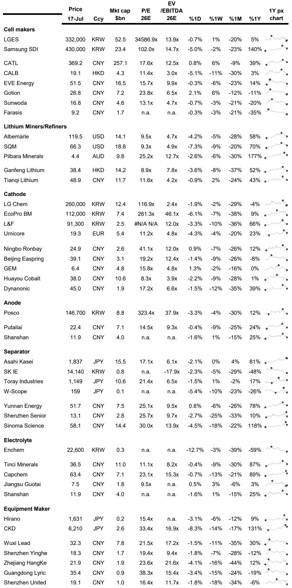

# 电池供应链正在重塑全球制造业，战略赢家已逐渐清晰

全球电池产业已不再仅仅关乎为车辆提供动力。它正在成为现代历史上两个资本最密集的转型——交通电气化和电网脱碳——的基础设施支柱。在2026年7月的一周内，该行业记录了一系列决策，揭示了更深层次的结构性转变。三星SDI正在将美国一家电动汽车电池工厂的部分产线改造为专门生产用于特斯拉储能系统的磷酸铁锂电芯。LG新能源正在扩大南京工厂的圆柱形电池产量，以满足特斯拉Model Y日益增长的需求。远景AESC在中国启动了其称为全球首个100+GWh储能制造基地的项目，首批790 Ah电芯已出口至德国。韩国记录显示，环保汽车在上半年首次占所有新车注册量的一半以上。

这些并非孤立的新闻。它们是市场已跨越关键门槛的信号。电池行业正从单一应用场景——电动汽车——过渡到双重需求引擎，其中用于电网、数据中心和工业应用的储能系统正以重塑工厂规划、供应合同和企业战略的速度增长。这对商业领袖的战略启示是直接的：那些如今正为同时服务电动汽车和固定式储能需求而布局，同时确保非中国供应链的公司，将在未来十年获得不成比例的价值。而那些将电池视为大宗商品投入的公司，则可能被排除在最具吸引力的增长领域之外。

## 电动汽车与储能需求的融合正迫使对工厂产能分配进行根本性反思

近期数据中最具启示性的发展并非单一合同或工厂开业。而是三星SDI决定将其与Stellantis合资的印第安纳州StarPlus Energy工厂的一部分——最初设计用于电动汽车电池生产——改造为特斯拉储能系统电池的专用生产线。这是工厂层面套利的一个具体例子，正成为电池制造经济学的核心。该工厂将生产200 Ah和300 Ah的LFP电芯，其中较大规格专门用于特斯拉的固定式储能产品，行业消息人士估计该供应协议价值可能在3万亿至5万亿韩元之间。

其意义超越了合同价值。三星SDI正在有效地将产能从电动汽车重新分配给储能系统，而此时许多观察者仍将固定式储能视为次要市场。逻辑很简单：公用事业规模的储能增长速度快于某些地区（尤其是北美）的电动汽车需求，并且大型LFP电芯在储能应用中的利润率结构正变得与汽车级电池具有竞争力。对特斯拉而言，这一安排为其Megapack和Powerwall产品确保了专用、本地化的LFP电芯供应，而无需与其现有电池供应商争夺产能。对三星SDI而言，这为其进入美国储能供应链提供了一个战略切入点，该供应链正受到《通胀削减法案》国内含量要求的重塑。工厂改造是一个更大趋势的缩影：电池制造商不再为单一终端市场进行优化。他们正在构建灵活的生产平台，可以根据需求信号、区域政策激励和客户集中度风险，在电动汽车和储能系统之间切换。

## 北美和欧洲的区域供应链本地化速度比大多数市场参与者预期的要快

现代汽车与SK On在佐治亚州的合资企业于2026年7月开始量产，这是一个案例研究，展示了当政策与企业战略一致时，本地化供应链可以多快实现。该工厂获得了约50亿美元的投资，年产能为35 GWh，足以为约30万辆电动汽车供应电池。它已开始向现代汽车位于萨凡纳附近的Metaplant America工厂交付电芯，该工厂组装Ioniq 5、Ioniq 9、起亚EV6和起亚EV9。该工厂预计将创造约3500个就业岗位，并巩固佐治亚州作为电动汽车和电池制造中心的地位。

值得注意的是执行速度。该合资企业从宣布、建设到投产的时间框架，即使在中国也被认为是激进的。原因是《通胀削减法案》的电池采购要求并非理论上的。它们正在对依赖不合规供应链的汽车制造商造成真正的竞争惩罚，而且惩罚力度大到足以证明数十亿美元的投资是合理的。现代-SK On工厂是对这种激励结构的直接回应。这不仅仅是在美国制造电池。它关乎在美国制造电池，然后组装成同样在美国制造的车辆，并使用符合消费者税收抵免所需国内含量门槛的电芯。

同样的逻辑正在欧洲上演，尽管政策机制不同。西班牙已明确将自己定位为中国汽车和电池投资的登陆点，一份政府报告强调了三个与中国相关的主要工业项目，包括价值41亿欧元的宁德时代-Stellantis电池工厂。西班牙的策略是务实的：吸引中国技术和制造业就业岗位，同时逐步发展本地供应商能力。局限性在于关键技术将保持许可而非完全转让给西班牙所有。这为欧洲政策制定者创造了一个战略权衡。他们可以通过允许中国公司在欧洲建厂来加速电池供应链，但面临在核心电芯化学和制造工艺上仍依赖外国知识产权的风险。另一种选择——从头建立完全本土化的欧洲电池产业——将花费更长时间和更多成本，但能保留技术主权。数据表明，欧洲至少在目前选择了速度而非控制。

## 储能市场正成为一个拥有自身技术轨迹和竞争动态的独特价值链

远景AESC位于中国湖北宜昌的超级工厂，该公司称其为全球首个100+GWh储能制造基地，代表了一个因数字过于庞大而容易被忽视的里程碑。该设施覆盖从电池电芯到系统集成的整个价值链。其首款产品是790 Ah方形卷绕电池电芯，按容量计算目前是全球最大的，提供440 Wh/L的能量密度、超过12,000次充放电循环以及96%的往返效率。首批产品已出口至德国，该工厂超过50%的产能已被海外订单锁定。

关键洞察在于储能电芯在设计和性能要求上与电动汽车电芯正在分化。电动汽车电芯针对能量密度和快速充电进行了优化。储能电芯则针对循环寿命、安全性和10至20年运营寿命内的总拥有成本进行了优化。790 Ah电芯并非改良的电动汽车电芯。它是一种专为最大化循环次数和最小化衰减率而设计的储能电芯。这种区别很重要，因为它意味着这两个市场将日益需要独立的生产线、独立的研发项目和独立的供应链。试图用单一电芯设计服务于两个市场的公司将在两者中都表现不佳。其战略启示是，储能市场并非电动汽车电池生产的利基市场或售后市场。它是一个拥有自身技术轨迹的独特行业细分领域，而那些如今正投资于专用储能电芯制造产能的公司，将在未来十年拥有结构性的成本和性能优势。

LG新能源为谷歌位于阿肯色州的Steel River能源中心供应电池系统的协议强化了这一点。该项目是谷歌全球最大的光储项目，前两期将包括1.6 GW太阳能发电和1.9 GWh电池储能，最终到2029年将扩展至2.5 GW太阳能容量和2.9 GWh储能。LGES将提供其北美制造的JF2 LFP电池系统。其明确目的是支持人工智能数据中心日益增长的电力需求。这是AI基础设施扩张与储能市场之间的直接联系。数据中心需要可靠、可调度的电力，而电池储能是在不新建天然气调峰电厂的情况下增加该容量的最快方式。Steel River项目并非孤立的实验。它是超大规模云提供商如何为其下一代数据中心供电的模板，并将至少在下一个十年内为大型LFP储能系统创造持续需求。

## 在双重市场世界中评估电池供应链敞口的决策框架

对于评估其电池供应链敞口的商业领袖而言，传统的评估电动汽车普及率和电池成本曲线的框架已不再足够。市场已经分化，决策标准必须反映这一现实。以下框架将近期数据转化为战略规划中的可操作问题。

首先，评估贵公司的电池需求主要是用于电动汽车应用、固定式储能应用，还是两者兼有。如果答案是两者兼有，则需要为每种应用制定独立的采购策略。电芯不同，供应商不同，供应链要求也不同。试图为两种应用采购单一电芯化学体系将导致在一个或两个市场中表现不佳。如果答案主要是单一应用，仍需监控另一个市场，因为主要电池制造商的产能分配决策将影响供应可用性和定价。三星SDI决定将其印第安纳州工厂的部分产能从电动汽车转向储能系统生产，就是一个直接例子，说明一个市场的增长如何减少可用于另一个市场的产能。

其次，评估贵公司对区域供应链本地化要求的敞口。如果在北美或欧洲销售产品，需要了解这些市场中电池的国内含量规则。美国的《通胀削减法案》和欧洲新兴的电池法规并非临时政策。它们是市场的结构性特征，将持续存在并可能随时间推移变得更加严格。佐治亚州的现代-SK On工厂和西班牙的宁德时代-Stellantis工厂是对这些政策的回应。延迟投资于本地化供应链的公司将面临日益增长的成本劣势，因为税收抵免和法规合规对消费者购买决策变得越来越重要。

第三，将储能市场的技术轨迹与电动汽车市场分开分析。远景AESC的790 Ah电芯和三星SDI为特斯拉ESS提供的300 Ah LFP电芯表明，储能市场正在制定自己的性能标准。关键指标是循环寿命、往返效率以及15至20年运营寿命内的总拥有成本，而非能量密度或快速充电速度。正在开发或采购储能系统的公司应优先考虑这些指标，并根据其专用储能电芯生产线（而非其改造电动汽车电芯的能力）来评估供应商。

第四，关注AI基础设施作为储能需求驱动因素的新兴角色。LGES-谷歌Steel River项目是一个具体例子，但并非孤例。许多地区的数据中心电力需求正以每年15%至20%的速度增长，而电池储能是增加可调度容量以支持该增长的最快方式。数据中心、云计算和AI基础设施领域的公司应将电池储能视为其资本规划的关键组成部分，而非事后考虑。大型、长循环寿命LFP电芯的可用性将制约在电网受限地区扩展数据中心容量的速度。

第五，也是最后一点，认识到电池供应链正成为一种战略资产，而非采购类别。三星SDI、LGES、远景AESC等公司如今所做的决策关乎工厂产能分配、技术差异化和客户集中度。它们并非关于大宗商品定价。将电池采购视为现货市场交易的公司，在产能紧张时将发现自己排在队伍末尾。而那些与专用生产线建立长期、多年供应协议的公司，将在成本、可靠性和技术获取方面拥有结构性优势。

## 电动汽车与储能电芯之间的技术分化正创造一个新的竞争格局，将重新定义行业领导地位

特斯拉Model 3在瑞典的长期研究提供的性能数据，提供了一个与技术分化论点直接相关的揭示性数据点。在行驶约10万公里后，宁德时代供应的LFP电池组保留了93.3%的原始容量，优于LG新能源的91.5%以及松下的89.8%和88.2%。该研究强化了LFP化学体系在卓越耐用性和热稳定性方面的声誉，尽管其通常提供的能量密度低于镍基化学体系。

这正是正成为固定式储能应用主导选择的相同LFP化学体系。原因是储能应用优先考虑循环寿命和安全性而非能量密度。一个能提供12,000次循环且衰减极小的储能电芯（如远景AESC的790 Ah电芯）在电网应用中比一个能量密度更高但循环寿命更短的电芯更有价值。技术分化不仅关乎电芯化学体系。它关乎整个制造过程，从电极涂布到电芯组装再到系统集成。那些已投资于储能应用专用LFP生产线的公司，正在开发一套与高镍电动汽车电芯所需不同的工艺能力。随着时间的推移，这些工艺能力将成为难以复制的竞争优势来源。

三星SDI通过UL Solutions AI数据中心防火测试的UPS电池是技术差异化的另一个例子。该电池使用锂锰氧化物化学体系和带有热传播预防技术的方形设计。在测试中，一个被故意点燃的电池模块完全燃烧，但未将火势蔓延至相邻机架，无气体排放、爆炸或破裂，也未触发天花板洒水系统。这种级别的安全性能对于电动汽车电池并非必需，因为其电池组设计为在受控环境中更换或维修。但对于数据中心UPS电池而言，它正变得至关重要，因为一个机架起火可能级联摧毁价值数百万美元的计算设备。数据中心储能的技术要求正与电网储能的技术要求趋同，创造出一个安全性和可靠性比每千瓦时成本更重要的高端细分市场。

其战略启示是，电池行业正在分裂为不同的技术细分领域，每个领域都有其自身的竞争动态。未来十年将领先的公司是那些认识到这种分裂并为每个细分领域投资于专用研发、制造和供应链能力的公司。而那些试图用单一技术平台服务于所有细分领域的公司，将在每个领域都被超越。

*仅供参考。部分内容可能基于源材料通过AI辅助生成、翻译、总结或编辑，可能存在遗漏或错误。请独立核实。本文不构成专业建议。*

仅供参考。部分内容可能基于源材料通过AI辅助生成、翻译、总结或编辑，可能存在遗漏或错误。请独立核实。本文不构成专业建议。

